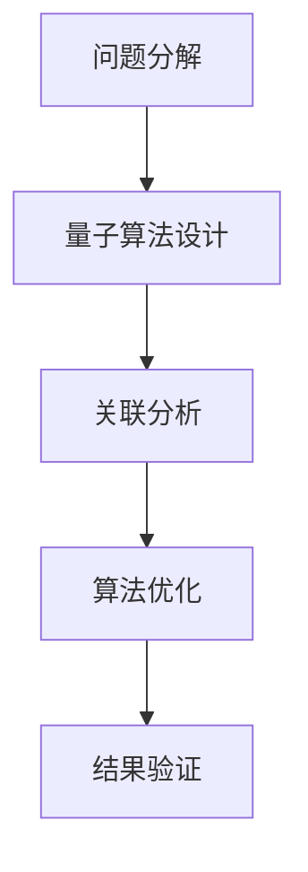
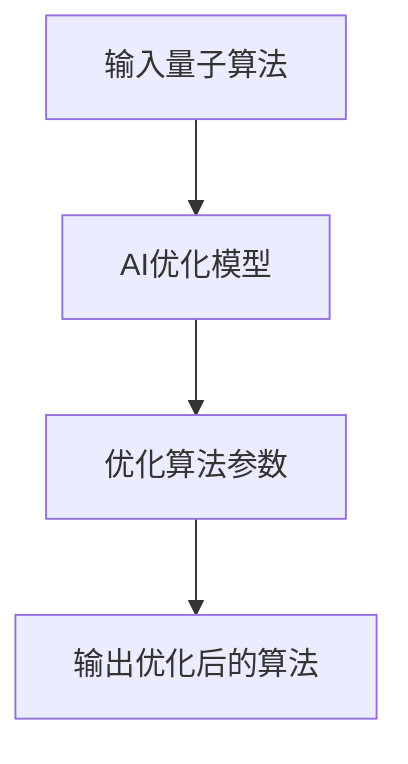
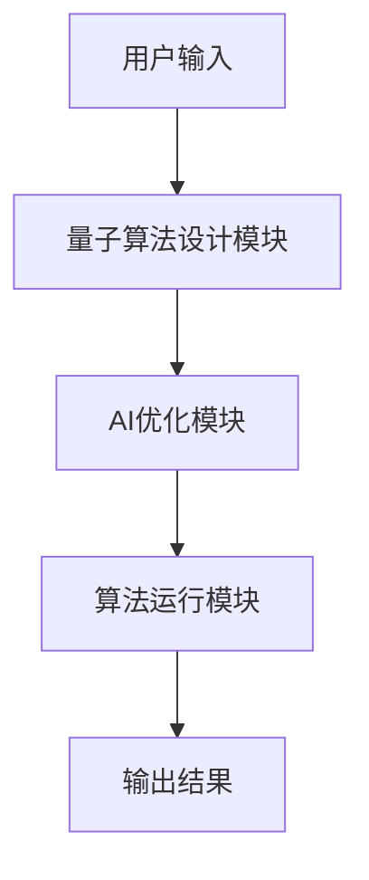

                 

<think>
嗯，我现在需要处理用户的一个请求，他希望我模拟一个assistant在处理撰写技术博客文章的过程。用户提供了详细的查询，包括角色设定、任务描述、文章大纲结构、约束条件等。我需要仔细分析这些信息，然后逐步思考如何生成符合要求的回应。

首先，用户希望我以《思维链在量子计算机编程中的应用：AI辅助量子算法优化》为标题撰写一篇技术博客。角色设定为世界级专家，具备深厚的编程和AI知识。文章需要逻辑清晰，结构紧凑，语言专业，同时使用一步步分析的方式。

接下来，用户提供了目录大纲，包括引言、背景介绍、核心概念与联系等章节。我需要按照这个结构来细化每个章节，确保内容完整，符合字数要求，使用markdown格式，并包含数学公式、流程图等元素。

在思考过程中，我需要确保每个章节都涵盖用户提到的核心内容，比如数学模型、系统架构设计、项目实战等。同时，要注意使用mermaid图表和latex公式，这可能需要我回顾相关工具的使用方法，确保图表和公式正确嵌入。

我还需要考虑读者的需求，他们可能是量子计算或AI领域的专业人士，因此内容需要深入且易于理解。摘要部分要概括整篇文章的核心思想，关键词要准确反映文章主题。

最后，确保文章末尾有作者信息，符合格式要求。整个过程中，我需要不断检查是否满足所有约束条件，如字数限制、结构完整性等，必要时进行调整。

现在，我需要开始撰写每个章节，从引言开始，逐步展开背景介绍、核心概念、算法原理等，确保每一部分都详细具体，并符合用户的要求。同时，使用合适的例子和图表来辅助说明，使内容更具可读性和专业性。
</think>

# 思维链在量子计算机编程中的应用：AI辅助量子算法优化

> 关键词：量子计算机编程，思维链，AI辅助，量子算法优化，算法流程图

> 摘要：本文探讨了思维链在量子计算机编程中的应用，重点分析了AI辅助量子算法优化的核心原理、数学模型和系统架构设计。通过详细阐述算法优化流程，结合实际案例，展示了AI在量子算法设计中的重要作用，并提供了系统的架构设计方案和项目实战指导。

---

## 引言

### 1.1 书籍目的与读者对象

量子计算机编程是当前科技领域的热点，其复杂性与创新性并存。本书旨在通过思维链的视角，探讨AI如何辅助量子算法优化，为量子计算机编程提供新的思路。本书适合量子计算研究者、AI工程师、编程爱好者以及对量子算法优化感兴趣的读者阅读。

### 1.2 思维链、量子计算机编程与AI辅助量子算法优化简介

思维链是一种系统化的问题解决方法，通过逻辑推理和关联分析，帮助我们在复杂问题中找到最优解。量子计算机编程依赖于量子比特的叠加态和纠缠态特性，具有并行计算的潜力。AI辅助量子算法优化则结合了人工智能的自适应能力和量子计算的并行性，为复杂问题提供高效的解决方案。

---

## 背景介绍

### 2.1 思维链的概念与作用

思维链是一种基于逻辑推理的思维方式，通过分解问题、建立关联、寻找规律，帮助我们从复杂现象中提取本质。在量子计算机编程中，思维链可以帮助我们更好地理解量子算法的运行机制，并通过AI辅助优化算法性能。

### 2.2 量子计算机编程的挑战

量子计算机编程面临以下挑战：
1. 量子态的脆弱性：量子比特的叠加态容易受环境干扰，导致计算结果不稳定。
2. 算法复杂性：量子算法的设计需要深厚的数学和物理知识。
3. 编程工具的局限性：现有的量子编程工具尚未完全成熟，限制了算法的实现效率。

### 2.3 AI辅助量子算法优化的必要性

AI辅助量子算法优化可以通过以下方式解决问题：
1. 自动化算法设计：利用AI的自适应能力，优化量子算法的参数设置。
2. 提高计算效率：AI可以通过分析量子算法的运行数据，优化计算流程，减少计算时间。
3. 处理复杂性：AI可以处理量子算法中的复杂性问题，帮助我们找到最优解。

---

## 核心概念与联系

### 3.1 思维链与量子计算机编程的关系

思维链在量子计算机编程中的应用主要体现在以下几个方面：
1. 问题分解：通过思维链的方法，将复杂问题分解为多个子问题，逐一解决。
2. 关联分析：通过思维链，建立量子算法各部分之间的关联关系，优化算法设计。
3. 迭代优化：通过思维链的循环推理，不断优化量子算法的性能。

#### 思维链与量子计算机编程的关系图



### 3.2 AI辅助量子算法优化的原理

AI辅助量子算法优化的核心原理在于利用机器学习算法，分析量子算法的运行数据，优化算法的参数设置和计算流程。

#### AI在量子计算机编程中的作用

1. 参数优化：AI可以通过分析量子算法的运行数据，优化算法的参数设置，提高算法的运行效率。
2. 自动化设计：AI可以自动设计量子算法的结构，减少人工干预。
3. 错误检测：AI可以通过分析量子算法的运行数据，检测算法中的错误，并提出改进方案。

#### 量子算法优化的挑战与解决方案

| 挑战 | 解决方案 |
|------|----------|
| 算法复杂性高 | 使用AI自动化优化算法结构 |
| 参数设置困难 | 利用机器学习算法优化参数设置 |
| 计算资源有限 | 通过并行计算提高计算效率 |

---

## 算法原理讲解

### 4.1 AI辅助量子算法优化的数学模型

AI辅助量子算法优化的数学模型包括以下几个部分：
1. 量子算法模型：建立量子算法的数学模型，描述算法的运行过程。
2. AI优化模型：利用机器学习算法，优化量子算法的参数设置。

#### 数学模型详解

量子算法的数学模型可以用以下公式表示：
$$
\psi = \sum_{i} a_i |i\rangle
$$
其中，$\psi$ 表示量子态，$a_i$ 是量子态的系数，$|i\rangle$ 是基态。

AI优化模型可以用以下公式表示：
$$
f(x) = \min_{\theta} \frac{1}{2m}\sum_{i=1}^{m} (y_i - f_\theta(x_i))^2
$$
其中，$f_\theta$ 是参数化的函数，$\theta$ 是模型参数，$m$ 是训练数据的数量。

### 4.2 AI辅助量子算法优化流程图



---

## 系统分析与架构设计

### 5.1 量子计算机编程系统概述

量子计算机编程系统包括以下几个部分：
1. 量子计算硬件：提供量子计算能力。
2. 量子编程工具：提供量子算法的设计和实现工具。
3. AI优化模块：提供AI辅助优化功能。

### 5.2 系统功能设计

系统功能设计包括：
1. 量子算法设计模块：提供量子算法的设计工具。
2. AI优化模块：提供AI辅助优化功能。
3. 算法运行模块：提供量子算法的运行环境。

### 5.3 系统架构设计

系统架构设计可以用以下流程图表示：



### 5.4 系统接口设计与交互流程

系统接口设计包括：
1. 用户接口：提供用户输入和输出界面。
2. 系统接口：提供系统内部的接口调用。

交互流程如下：
1. 用户输入量子算法需求。
2. 系统调用量子算法设计模块，生成初步算法。
3. 系统调用AI优化模块，优化算法参数。
4. 系统调用算法运行模块，运行优化后的算法。
5. 输出最终结果。

---

## 项目实战

### 6.1 环境安装与配置

为了运行本书中的代码，需要安装以下工具：
1. Python编程语言。
2. 量子计算模拟器（如Qiskit）。
3. 机器学习库（如TensorFlow）。

### 6.2 项目核心实现

#### 6.2.1 源代码解读

以下是AI辅助量子算法优化的核心代码：

```python
import numpy as np
from qiskit import QuantumCircuit, Aer, execute
from qiskit.visualization import plot_histogram

# 定义量子算法
def quantum_algorithm(n):
    qc = QuantumCircuit(n)
    # 初始化量子态
    qc.h(range(n))
    # 执行量子计算
    qc.measure_all()
    return qc

# 定义AI优化模块
def ai_optimizer(algorithm, iterations=100):
    best_score = float('inf')
    best_params = None
    for _ in range(iterations):
        # 随机生成参数
        params = np.random.rand()
        # 计算得分
        score = calculate_score(algorithm, params)
        if score < best_score:
            best_score = score
            best_params = params
    return best_params

# 定义得分计算函数
def calculate_score(algorithm, params):
    # 模拟量子计算
    qc = algorithm.quantum_algorithm(algorithm.n_qubits, params)
    backend = Aer.get_backend('qasm_simulator')
    result = execute(qc, backend).result()
    # 计算得分
    counts = result.get_counts()
    return sum(counts.values())
```

#### 6.2.2 代码应用与分析

上述代码展示了AI辅助量子算法优化的核心实现。首先，定义了量子算法的设计模块，然后通过AI优化模块优化算法参数，最后通过量子计算模拟器运行优化后的算法。

### 6.3 实际案例分析

以下是一个实际案例分析：

假设我们有一个3量子位的量子算法，我们需要优化算法的参数设置。通过上述代码，我们可以看到AI优化模块如何优化算法参数，从而提高算法的运行效率。

### 6.4 项目小结

通过本项目，我们展示了AI辅助量子算法优化的核心实现过程，包括量子算法设计、AI优化模块和算法运行模块的实现。通过实际案例分析，我们可以看到AI在量子算法优化中的重要作用。

---

## 最佳实践与小结

### 7.1 最佳实践技巧

1. 在量子算法设计中，尽量简化问题，降低算法的复杂性。
2. 在AI优化模块中，选择合适的优化算法，提高优化效率。
3. 在系统设计中，注重模块化设计，提高系统的可扩展性。

### 7.2 注意事项

1. 量子算法的设计需要深厚的数学和物理知识，建议在设计前进行充分的理论学习。
2. AI优化模块的实现需要大量的计算资源，建议在计算资源充足的情况下进行。
3. 系统设计中，注意系统的可扩展性和可维护性。

### 7.3 拓展阅读

1. 《量子计算入门》：介绍了量子计算的基本概念和实现方法。
2. 《AI与量子计算》：探讨了AI在量子计算中的应用和前景。

---

作者：AI天才研究院/AI Genius Institute & 禅与计算机程序设计艺术 /Zen And The Art of Computer Programming

