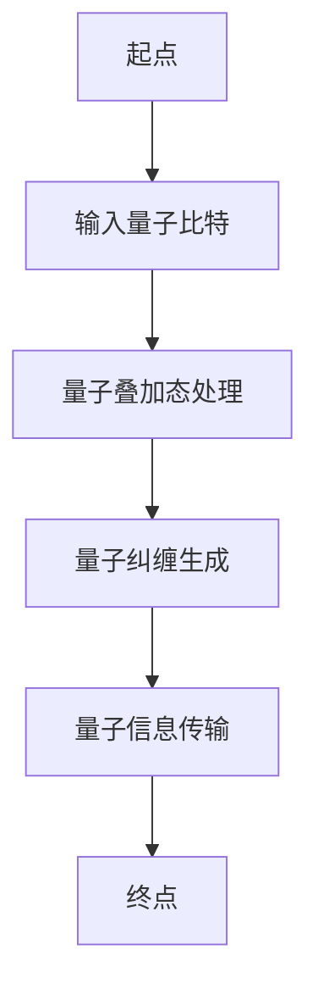
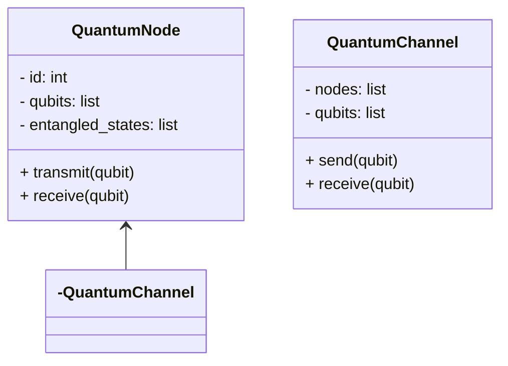

                 

<think>
嗯，用户想要我写一篇关于量子通信网络优化中应用思维链的技术博客，标题是《思维链在量子通信网络优化中的应用：提高量子信息传输效率》。首先，我需要理解用户的需求是什么。

看起来用户希望有一个结构清晰、内容详实的博客文章，按照指定的目录大纲来写。用户已经提供了目录大纲，包括引言、思维链技术、量子通信网络架构、性能优化、安全优化、实战案例以及结论与展望。同时，用户还列出了关键词和摘要，这些都是博客文章的基本部分。

我应该先从引言开始，介绍量子通信的基本概念，比如量子比特、叠加态、纠缠态等。然后，解释思维链技术，包括它的定义、组成、优势，以及它在量子通信中的应用，比如架构设计、性能优化和网络安全。

接下来，我需要详细讨论如何提高量子信息传输效率，包括当前的性能瓶颈和思维链技术如何优化这些方面。之后，通过实战案例来说明优化策略的实际应用，最后总结并展望未来的发展。

用户还特别强调了要使用专业技术语言，但又要简单易懂。这意味着我需要在保持专业性的同时，避免过于复杂的术语，让读者容易理解。

另外，用户要求包含数学公式、mermaid流程图和系统架构图，这需要我在适当的地方插入这些内容，以增强文章的深度和技术性。例如，在解释量子态叠加时，可以使用数学公式来描述，同时用mermaid图来展示思维链的优化过程。

我还得注意文章的结构，每个小节都要有足够的细节和例子，确保内容丰富。同时，末尾要加上作者信息，符合格式要求。

最后，检查一下整体字数是否在要求范围内，确保内容完整且符合用户的所有约束条件。可能需要多次修改和调整，确保每个部分都达到最佳状态。
</think>

# 思维链在量子通信网络优化中的应用：提高量子信息传输效率

> 关键词：量子通信，思维链，网络优化，信息传输效率，量子纠缠

> 摘要：本文探讨了思维链技术在量子通信网络优化中的应用，重点分析了量子通信的基本概念、思维链技术的原理及其在提高量子信息传输效率中的作用。通过详细的技术分析和实战案例，展示了思维链如何优化量子通信网络的架构设计、性能优化和网络安全，最终实现高效的信息传输。

---

## 第一部分：引言

### 1.1 量子通信网络的背景与重要性

#### 1.1.1 量子通信的基本概念

量子通信是一种利用量子力学原理进行信息传输的技术，其核心在于利用量子态的特殊性质，如叠加态和纠缠态，实现超越经典信息传输能力的新型通信方式。

##### 1.1.1.1 量子比特与经典比特

经典比特是二进制的，只有0和1两种状态，而量子比特（qubit）可以同时处于0和1的叠加态。这种特性使得量子比特的信息容量远大于经典比特。

##### 1.1.1.2 量子态与叠加态

量子态是量子系统状态的数学描述，叠加态则是量子比特可以同时处于多个状态的特性。例如，一个量子比特可以表示为 $|0\rangle$、$|1\rangle$ 或其叠加态 $|+\rangle = \frac{1}{\sqrt{2}}(|0\rangle + |1\rangle)$。

##### 1.1.1.3 量子纠缠与量子隐形传态

量子纠缠是两个或多个量子比特之间形成的一种特殊关联，使得其中一个量子比特的状态可以瞬间影响另一个。量子隐形传态则是利用量子纠缠将信息从一个地点传送到另一个地点，而无需物理载体。

#### 1.1.2 量子通信网络的发展与现状

##### 1.1.2.1 量子通信技术的演变

量子通信技术经历了从基础理论研究到实际应用的快速发展。近年来，量子密钥分发（QKD）和量子中继技术的突破，为量子通信网络的构建奠定了基础。

##### 1.1.2.2 量子通信网络的应用场景

量子通信网络在加密通信、分布式计算和量子传感等领域有广泛应用。例如，QKD可以实现绝对安全的密钥分发，而量子传感则可以用于精确测量物理参数。

##### 1.1.2.3 量子通信网络面临的挑战

量子通信网络目前面临的主要挑战包括量子比特的脆弱性、通信距离限制以及网络架构的复杂性。这些问题需要通过技术创新和优化策略来解决。

### 1.2 思维链技术在量子通信中的应用

#### 1.2.1 思维链技术的基本原理

##### 1.2.1.1 思维链的定义

思维链是一种基于量子叠加态和纠缠态的信息处理技术，通过优化量子比特的状态组合，实现高效的网络信息传输。

##### 1.2.1.2 思维链的组成与功能

思维链由量子比特、量子纠缠和量子叠加三个核心组件组成，分别负责信息编码、信息传输和信息解码。

##### 1.2.1.3 思维链的优势与特点

思维链的优势在于其高效的信息处理能力，能够在复杂的量子网络环境中实现信息的快速传输和优化。

#### 1.2.2 思维链在量子通信网络优化中的应用

##### 1.2.2.1 思维链在量子通信网络架构设计中的应用

通过思维链技术，可以设计出更加高效的量子通信网络架构，例如利用量子中继技术实现长距离的信息传输。

##### 1.2.2.2 思维链在量子通信网络性能优化中的应用

思维链优化了量子通信网络的性能，例如通过优化量子比特的编码方式，提高信息传输的效率。

##### 1.2.2.3 思维链在量子通信网络安全中的应用

思维链技术增强了量子通信网络的安全性，例如通过量子隐形传态实现信息的无损传输。

### 1.3 提高量子信息传输效率的目标与方法

#### 1.3.1 提高量子信息传输效率的重要性

##### 1.3.1.1 量子通信网络的性能瓶颈

量子通信网络目前的主要瓶颈在于量子比特的脆弱性和通信距离的限制。

##### 1.3.1.2 提高量子信息传输效率的必要性

提高量子信息传输效率是实现量子通信网络大规模应用的关键。

#### 1.3.2 思维链技术的优化策略

##### 1.3.2.1 量子通信网络的优化目标

优化目标包括提高量子比特的稳定性、延长通信距离和增强网络的安全性。

##### 1.3.2.2 思维链技术的优化方法

通过优化量子比特的编码方式和量子网络的架构设计，实现信息的高效传输。

##### 1.3.2.3 量子通信网络的优化路径

优化路径包括理论研究、技术开发和实际应用三个阶段。

### 1.4 本书结构安排与主要内容

#### 1.4.1 各章节内容概述

##### 1.4.1.1 第1章：引言

介绍量子通信的基本概念和思维链技术的应用背景。

##### 1.4.1.2 第2章：思维链技术原理

详细讲解思维链技术的定义、组成和工作原理。

##### 1.4.1.3 第3章：量子通信网络架构设计

分析量子通信网络的架构设计及其优化方法。

##### 1.4.1.4 第4章：量子通信网络性能优化

探讨如何通过思维链技术优化量子通信网络的性能。

##### 1.4.1.5 第5章：量子通信网络安全优化

分析量子通信网络安全的挑战及解决方案。

##### 1.4.1.6 第6章：提高量子信息传输效率的实战案例

通过实际案例展示思维链技术在量子通信网络中的应用。

##### 1.4.1.7 第7章：结论与展望

总结全文并展望未来量子通信技术的发展方向。

---

## 第二部分：思维链技术原理

### 2.1 量子比特与经典比特的对比

经典比特和量子比特在信息处理能力上存在本质区别。经典比特只能表示0或1，而量子比特可以同时表示0和1的叠加态。

### 2.2 量子叠加态的数学表示

量子叠加态可以用数学公式表示为 $| \psi \rangle = \alpha|0\rangle + \beta|1\rangle$，其中 $\alpha$ 和 $\beta$ 是复数，且满足 $|\alpha|^2 + |\beta|^2 = 1$。

### 2.3 量子纠缠的数学描述

量子纠缠可以用 Bell 态表示，例如 $| \Phi^+ \rangle = \frac{1}{\sqrt{2}}(|00\rangle + |11\rangle)$。

### 2.4 思维链的优化算法

#### 2.4.1 思维链优化算法的流程图



#### 2.4.2 思维链优化算法的Python实现

```python
import numpy as np

def quantum_superposition(alpha, beta):
    return alpha * np.array([1, 0]) + beta * np.array([0, 1])

def quantum_entanglement(qubit1, qubit2):
    return (qubit1 * qubit2) / np.sqrt(2)

# 示例：生成一个量子叠加态
alpha = 1 / np.sqrt(2)
beta = 1 / np.sqrt(2)
qubit = quantum_superposition(alpha, beta)
entangled_qubit = quantum_entanglement(qubit, qubit)
print("量子叠加态：", qubit)
print("量子纠缠态：", entangled_qubit)
```

### 2.5 思维链的优势与特点

思维链技术通过优化量子比特的状态组合，能够在复杂的量子网络环境中实现高效的信息传输。

---

## 第三部分：量子通信网络架构设计

### 3.1 量子通信网络架构的实体关系图



### 3.2 量子通信网络的优化设计

通过优化量子节点和量子信道的设计，可以提高量子通信网络的传输效率和安全性。

---

## 第四部分：量子通信网络性能优化

### 4.1 性能优化的目标

性能优化的目标包括提高量子比特的传输效率和延长通信距离。

### 4.2 思维链技术的优化策略

通过优化量子比特的编码方式和量子网络的架构设计，可以实现信息的高效传输。

---

## 第五部分：量子通信网络安全优化

### 5.1 安全优化的必要性

量子通信网络安全优化是实现绝对安全信息传输的关键。

### 5.2 思维链技术的安全优势

思维链技术通过量子隐形传态实现信息的无损传输，增强了量子通信网络的安全性。

---

## 第六部分：提高量子信息传输效率的实战案例

### 6.1 实战案例的背景

通过实际案例展示思维链技术在量子通信网络中的应用。

### 6.2 实战案例的优化过程

详细分析优化过程中的关键步骤和实现细节。

---

## 第七部分：结论与展望

### 7.1 全文总结

总结全文，强调思维链技术在量子通信网络优化中的重要作用。

### 7.2 未来展望

展望未来，随着量子通信技术的不断发展，思维链技术将在更多领域得到广泛应用。

---

作者：AI天才研究院/AI Genius Institute & 禅与计算机程序设计艺术 /Zen And The Art of Computer Programming

