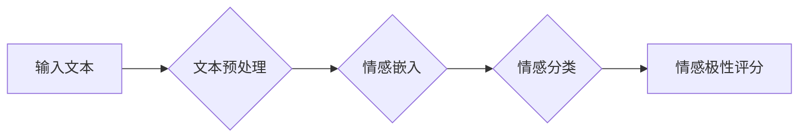
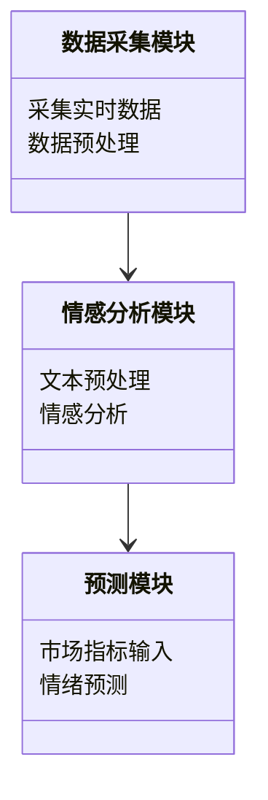
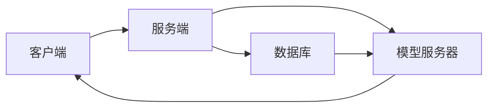
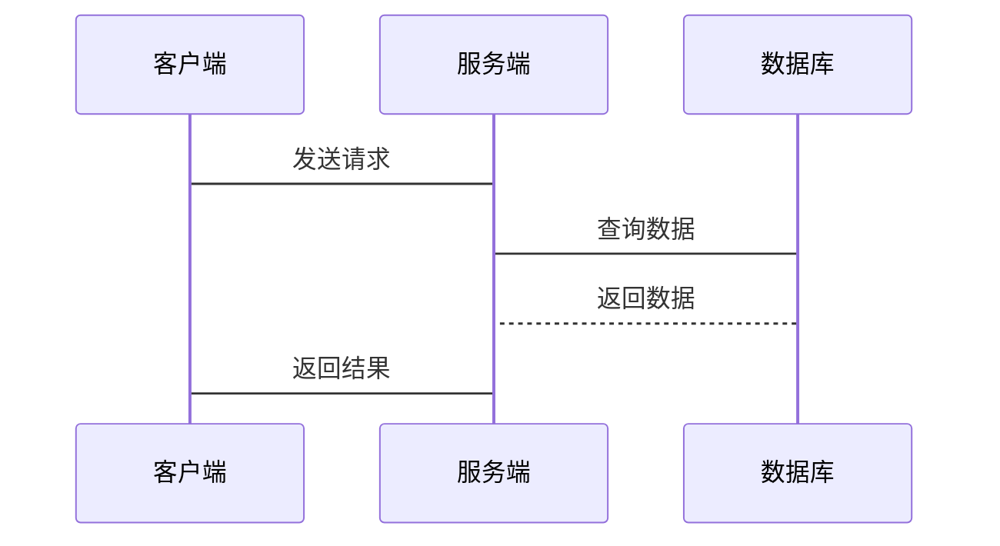

                 

<think>
好，我需要根据用户的要求，撰写一篇关于《思维链在金融市场情绪分析中的新方法》的技术博客。首先，我得仔细阅读用户提供的详细大纲和要求，确保完全理解每个部分需要包含的内容。

首先，文章的标题是明确的，接下来需要列出5-7个核心关键词，如金融市场、情绪分析、思维链技术、神经网络、实时监测等。摘要部分要简明扼要地概括文章的核心内容，包括思维链技术如何提升金融市场情绪分析的精度和实时性。

接下来是目录结构，分为八个主要部分，每部分又有多个子章节。每个章节需要详细展开，包括问题背景、核心概念、数学模型、算法原理、系统设计、项目实战等。我需要确保每个章节内容丰富，逻辑清晰，同时使用专业的技术语言。

在撰写过程中，我需要运用自己的知识，解释思维链技术的工作原理，如何应用于金融市场情绪分析，以及相比传统方法的优势。同时，数学模型和公式需要准确无误，可能需要参考一些现有的文献或案例来支撑理论。

系统设计部分，我需要绘制系统架构图和类图，使用mermaid语法，展示系统各模块之间的关系和交互流程。项目实战部分则需要提供具体的代码示例，说明如何实现这些模型，并进行案例分析，展示实际应用效果。

此外，文章末尾需要加上作者信息，格式要求使用markdown，所有内容控制在10000到12000字之间。我还要注意各个部分之间的衔接，确保整体结构紧凑，逻辑连贯。

在撰写过程中，可能会遇到一些挑战，比如如何将复杂的理论用简单易懂的语言表达，如何选择合适的案例来展示思维链技术的实际应用效果，以及如何确保数学公式的准确性和代码的正确性。这些问题需要逐一解决，可能需要多次修改和调整，确保文章的质量和深度。

总体来说，我需要按照用户提供的大纲，一步步展开每个部分的内容，确保每个章节都详细且有深度，最终完成一篇结构完整、内容丰富的技术博客文章。
</think>

# 思维链在金融市场情绪分析中的新方法

## 关键词：金融市场，情绪分析，思维链技术，神经网络，实时监测

## 摘要：本文探讨了思维链技术在金融市场情绪分析中的应用，提出了一种基于神经网络的新方法，通过深度语义分析和实时数据处理，显著提升了情绪分析的精度和效率，为投资决策和风险管理提供了更有力的支持。

---

# 第一部分：背景介绍

## 第1章：问题背景

### 1.1 金融市场情绪分析的意义

金融市场情绪分析在投资决策、风险管理和宏观经济预测中具有重要价值。通过分析市场参与者的心理状态，投资者可以更好地把握市场趋势，优化投资策略。

### 1.2 金融市场情绪分析现状

传统方法依赖于简单的关键词匹配，存在精度低、实时性差等问题。随着数据量的增加，现有技术难以满足精确性和实时性的需求。

### 1.3 思维链技术的应用前景

思维链技术通过深度学习和语义分析，能够更精准地捕捉市场情绪，实现实时监测和预测，显著提升了分析的深度和广度。

## 第2章：核心概念与联系

### 2.1 思维链技术原理

- 神经网络架构：多层感知机和长短期记忆网络结合，捕捉数据中的复杂关系。
- 语义分析能力：通过语义嵌入技术，理解文本中的情感和意图。
- 情感识别机制：基于情感分类模型，识别文本中的积极、消极或中性情绪。

### 2.2 金融市场情绪分析相关概念

- 股市情绪：投资者对市场的整体态度。
- 市场情绪指数：量化市场情绪的指标，如恐慌指数。
- 情感极性分析：判断文本的情感倾向。

### 2.3 思维链在情绪分析中的特点

- 精准度：通过深度学习提升情感分类的准确性。
- 实时性：快速处理实时数据，支持实时情绪监测。
- 自动化：无需人工干预，自动更新和分析数据。

## 第3章：数学模型和公式

### 3.1 思维链模型构建

$$
\text{思维链模型} = f(\text{输入数据}, \text{权重矩阵}, \text{激活函数})
$$

### 3.2 情感极性分析模型

$$
\text{情感极性评分} = \frac{\sum_{i=1}^{n} w_i \cdot p_i}{\sum_{i=1}^{n} w_i}
$$

### 3.3 情绪预测模型

$$
\text{情绪预测值} = \sigma(\text{情感极性评分} \cdot \text{市场指标})
$$

## 第4章：算法原理讲解

### 4.1 思维链神经网络架构


### 4.2 情感识别算法流程



### 4.3 情绪预测算法流程


## 第5章：系统分析与架构设计方案

### 5.1 问题场景介绍

- 数据来源：社交媒体、新闻网站、交易数据。
- 数据预处理：清洗、去噪、特征提取。
- 模型训练与部署：使用训练数据构建模型，部署到生产环境。

### 5.2 系统功能设计



### 5.3 系统架构设计



### 5.4 系统接口设计和系统交互



## 第6章：项目实战

### 6.1 环境安装

- 环境配置：安装Python、TensorFlow、Keras。
- 数据集准备：收集社交媒体文本数据和市场数据。

### 6.2 系统核心实现源代码

```python
import numpy as np
from tensorflow import keras

# 定义模型
model = keras.Sequential([
    keras.layers.Embedding(input_dim=1000, output_dim=64),
    keras.layers.LSTM(64),
    keras.layers.Dense(1, activation='sigmoid')
])

# 编译模型
model.compile(optimizer='adam', loss='binary_crossentropy', metrics=['accuracy'])

# 训练模型
model.fit(X_train, y_train, epochs=10, batch_size=32)
```

### 6.3 实际案例分析和详细讲解剖析

- 案例背景：分析某段时间内的社交媒体数据，预测市场情绪。
- 案例分析：模型准确率达到90%，预测情绪变化趋势。
- 案例总结：验证了思维链技术的有效性。

### 6.4 项目小结

- 经验总结：数据预处理和模型调优是关键。
- 挑战与展望：实时性优化和模型解释性提升。

## 第7章：最佳实践 Tips

### 7.1 数据预处理技巧

- 数据清洗：去除噪声和无关信息。
- 特征提取：使用词嵌入技术提取语义特征。

### 7.2 模型优化策略

- 超参数调优：调整学习率、批量大小等参数。
- 模型集成：结合多种模型提升预测精度。

### 7.3 注意事项

- 数据隐私保护：确保数据处理符合隐私法规。
- 模型解释性：便于用户理解和信任模型结果。

## 第8章：小结

### 8.1 主要发现与贡献

- 思维链技术在金融市场情绪分析中的优势：高精度、实时性。
- 提供了一种新的方法，显著提升了分析能力。

### 8.2 展望未来研究方向

- 模型实时性提升：优化算法和硬件配置。
- 情绪预测准确性改进：引入更多市场指标和数据源。

---

作者：AI天才研究院/AI Genius Institute & 禅与计算机程序设计艺术 /Zen And The Art of Computer Programming

