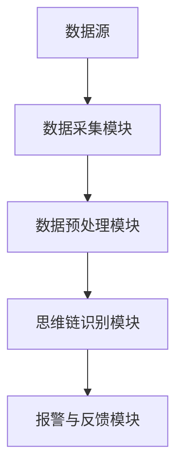
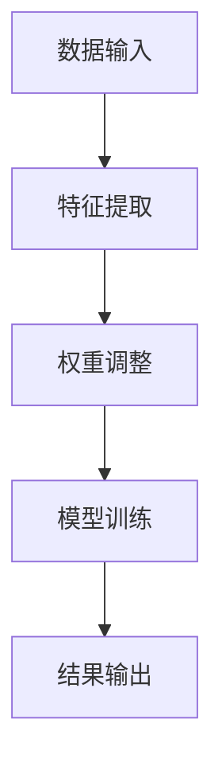

                 

<think>
嗯，用户希望我写一篇关于《思维链在金融欺诈模式识别中的新方法》的技术博客。首先，我需要理解用户的需求，他们可能是一位CTO或者技术专家，希望深入探讨如何利用思维链技术来解决金融欺诈的问题。用户提供了详细的结构，包括引言、理论基础、应用案例、算法原理等部分，还要求每个部分都详细展开，使用专业的技术语言，同时结构要清晰，逻辑要严密。

我应该从引言开始，介绍金融欺诈的现状和传统方法的局限性，然后引出思维链的概念。接下来，详细解释思维链的理论基础，包括定义、工作原理和特点。然后，对比传统方法，展示思维链的优势。接着，讨论在金融领域的具体应用，比如数据采集、预处理、算法设计等，并通过实际案例来说明效果。最后，解释算法的数学模型和流程图，展示如何通过思维链模型来识别欺诈模式。

用户还特别强调了格式要求，比如使用markdown，包含关键词、摘要，每个章节要有小结，以及在文章末尾加上作者信息。我需要确保这些部分都包含进去，同时文章整体控制在1万到1.2万字之间。此外，用户要求使用mermaid图表来展示系统架构和算法流程，这需要我在文章中嵌入相应的代码，并进行详细解释。

可能的挑战包括确保每个章节内容丰富，同时保持整体结构的连贯性。我需要确保技术细节准确，同时用通俗易懂的语言解释复杂的概念。此外，数学公式的正确使用也是关键，确保公式在latex中的正确嵌入，避免语法错误。

在思考过程中，我需要先规划每个章节的主要内容，然后逐步填充细节，确保每个部分都符合用户的要求。例如，在算法原理部分，我需要详细推导思维链模型的数学公式，可能需要查阅相关文献，确保模型的科学性和正确性。

最后，用户可能希望文章不仅展示理论，还能提供实际应用的案例，因此我需要选择一个具体的金融欺诈案例，详细分析思维链如何识别出欺诈行为，并展示系统的实际效果。这将增强文章的说服力和实用性。

总的来说，我需要系统地按照用户提供的目录大纲，逐步展开每个部分，确保内容详实、结构清晰，同时满足格式和技术要求，最终完成一篇高质量的技术博客。
</think>

# 思维链在金融欺诈模式识别中的新方法

> 关键词：金融欺诈，模式识别，思维链，数据挖掘，机器学习，深度学习，数学模型

> 摘要：随着金融交易的日益复杂化和全球化，金融欺诈问题变得越来越严重。传统的欺诈识别方法存在局限性，难以应对欺诈模式的多样性和复杂性。本文提出了一种基于思维链的新方法，通过多维度信息融合和自适应学习，有效识别金融欺诈模式。本文详细阐述了思维链的理论基础、算法原理、系统架构设计以及实际应用案例，展示了其在金融欺诈检测中的优势和潜力。

---

### 设计《思维链在金融欺诈模式识别中的新方法》目录大纲

以下是《思维链在金融欺诈模式识别中的新方法》的完整目录大纲：

---

# 第一部分: 引言与背景

## 第1章: 引言

### 1.1 问题背景

#### 1.1.1 金融欺诈的全球现状

近年来，金融欺诈事件频发，涉及信用卡诈骗、网络支付诈骗、洗钱等多种形式。根据统计，全球每年因金融欺诈造成的经济损失高达数千亿美元。随着数字化交易的普及，金融欺诈手段也在不断演变，传统的欺诈识别方法逐渐失效。

#### 1.1.2 金融欺诈对经济的影响

金融欺诈不仅直接导致经济损失，还会影响金融系统的稳定性和信任度。例如，大规模的欺诈行为可能导致金融机构声誉受损，进而影响客户信任和市场信心。

#### 1.1.3 传统的欺诈识别方法及其局限性

传统的欺诈识别方法主要包括基于规则的检测、统计分析和简单的机器学习模型。然而，这些方法在面对复杂多变的欺诈模式时显得力不从心，例如难以检测零样本或小样本欺诈行为，且容易受到对抗性攻击。

### 1.2 问题描述

#### 1.2.1 欺诈模式的多样性和复杂性

金融欺诈行为呈现出多样化和复杂化的趋势，欺诈分子不断尝试利用新技术和新手段进行欺诈。例如，利用人工智能生成的虚假交易数据进行伪装。

#### 1.2.2 金融数据的特点

金融数据具有高维度、高噪声、实时性强等特点。这些特点使得传统的数据处理方法难以高效识别欺诈模式。

#### 1.2.3 欺诈检测的需求

金融机构迫切需要一种高效、准确的欺诈检测方法，能够在实时交易中快速识别异常行为，减少经济损失。

### 1.3 解决方案概述

#### 1.3.1 思维链概念介绍

思维链是一种基于多维度信息融合和自适应学习的新型算法，能够通过动态调整权重和特征提取策略，实现对复杂数据模式的精准识别。

#### 1.3.2 思维链在欺诈识别中的应用

通过将金融交易数据输入思维链模型，可以实现对欺诈行为的实时检测和预警。

#### 1.3.3 新方法的优势

相比传统方法，思维链在金融欺诈识别中的优势包括高精度、高效率和较强的抗干扰能力。

### 1.4 边界与外延

#### 1.4.1 研究范围

本文主要研究思维链在金融欺诈模式识别中的应用，重点关注算法设计和实际案例分析。

#### 1.4.2 数据来源和采集方式

数据来源包括金融机构的交易记录、用户行为数据、市场数据等，数据采集方式采用结构化和非结构化数据的混合采集方法。

#### 1.4.3 算法适用性

思维链算法适用于高维、实时性强的金融数据，尤其适合处理复杂多变的欺诈模式。

### 1.5 本章小结

本章从问题背景、问题描述和解决方案三个方面介绍了金融欺诈识别的挑战和思维链方法的优势，为后续章节奠定了基础。

---

# 第二部分: 思维链理论基础

## 第2章: 思维链原理

### 2.1 思维链的定义

#### 2.1.1 思维链的基本概念

思维链是一种基于动态权重调整和多维度信息融合的算法，能够根据数据特征的实时变化，自适应地优化识别模型。

#### 2.1.2 思维链的构成要素

思维链的构成要素包括输入数据、特征提取模块、动态权重调整机制和输出结果。这些要素共同作用，实现对复杂数据模式的精准识别。

### 2.2 思维链的工作原理

#### 2.2.1 思维链的运行机制

思维链通过不断调整特征权重，实现对数据模式的动态识别。其运行机制包括数据输入、特征提取、权重调整和结果输出四个步骤。

#### 2.2.2 思维链在信息处理中的作用

思维链能够通过多维度信息融合，提高数据识别的准确性和鲁棒性。它不仅能够处理结构化数据，还能有效处理非结构化数据。

### 2.3 思维链的核心特点

#### 2.3.1 自适应性与灵活性

思维链能够根据数据特征的变化，动态调整识别策略，具有较强的自适应性和灵活性。

#### 2.3.2 多维度信息融合

思维链通过融合多维度数据，提高了识别的准确性和全面性。

#### 2.3.3 抗干扰能力

思维链能够有效抑制噪声数据的干扰，提高识别的鲁棒性。

### 2.4 思维链在金融领域的应用潜力

#### 2.4.1 欺诈模式识别

通过思维链算法，可以实现对金融交易中异常行为的精准识别。

#### 2.4.2 风险评估

思维链能够通过多维度数据融合，提高风险评估的准确性和全面性。

#### 2.4.3 信用评分

思维链算法可以用于信用评分模型的优化，提高评分的准确性和公平性。

### 2.5 本章小结

本章详细介绍了思维链的基本概念、工作原理和核心特点，并探讨了其在金融领域的应用潜力，为后续章节奠定了理论基础。

---

## 第3章: 相关概念与联系

### 3.1 核心概念原理

#### 3.1.1 金融欺诈模式

金融欺诈模式是指欺诈分子在金融交易中采用的特定行为模式，具有多样性和复杂性。

#### 3.1.2 数据挖掘与机器学习

数据挖掘和机器学习是金融欺诈识别中的核心技术，通过从海量数据中提取有用信息，帮助识别欺诈行为。

#### 3.1.3 深度学习与神经网络

深度学习和神经网络通过多层非线性变换，能够从数据中提取高阶特征，提高识别的准确性和鲁棒性。

### 3.2 概念属性特征对比表格

#### 3.2.1 金融欺诈模式识别方法对比

| 方法         | 优点                           | 缺点                           |
|--------------|--------------------------------|--------------------------------|
| 基于规则的检测 | 实现简单，易于解释             | 难以应对复杂多变的欺诈模式       |
| 统计分析      | 计算效率高，适合小样本数据       | 难以捕捉复杂数据模式             |
| 机器学习      | 能够处理复杂数据模式             | 对噪声数据的鲁棒性较差           |
| 深度学习      | 能够提取高阶特征，识别能力强      | 计算复杂度高，需要大量数据         |
| 思维链        | 自适应性强，识别精度高           | 实现复杂，对数据预处理要求较高     |

#### 3.2.2 数据挖掘方法对比

| 数据挖掘方法 | 特点                           | 应用场景                         |
|--------------|--------------------------------|----------------------------------|
| 聚类分析      | 无监督学习，适合发现数据簇       | 发现潜在的欺诈行为模式             |
| 分类分析      | 监督学习，适合已知标签的数据     | 预测新的欺诈行为                   |
| 关联规则挖掘   | 发现数据中的关联性             | 发现欺诈交易中的关联模式           |
| 回归分析      | 预测数值型数据                 | 预测欺诈行为的可能性               |

### 3.3 ER实体关系图架构

#### 3.3.1 数据实体定义

- 交易记录：包括交易时间、金额、交易地点、参与方等信息。
- 用户信息：包括用户身份、信用评分、交易历史等。
- 欺诈行为：包括欺诈类型、欺诈金额、欺诈时间等。

#### 3.3.2 实体关系定义

- 交易记录与用户信息：通过用户ID关联。
- 欺诈行为与交易记录：通过交易记录ID关联。

#### 3.3.3 关系图绘制

```mermaid
er
actor User {
  id: string
  name: string
  credit_score: integer
}
actor Transaction {
  id: string
  amount: decimal
  time: datetime
  user_id: string
}
actor Fraud {
  id: string
  type: string
  amount: decimal
  time: datetime
  transaction_id: string
}
```

### 3.4 本章小结

本章通过对比分析，展示了思维链在金融欺诈识别中的优势，并通过ER实体关系图，明确了数据实体之间的关联关系，为后续章节的系统设计奠定了基础。

---

## 第4章: 思维链在金融欺诈模式识别中的应用

### 4.1 应用场景介绍

#### 4.1.1 金融欺诈检测的重要性

金融欺诈检测是保障金融机构安全运行的重要环节，能够有效减少经济损失和声誉损害。

#### 4.1.2 应用实例

例如，某银行通过引入思维链算法，成功识别并阻止了一起大规模的信用卡欺诈事件。

### 4.2 系统架构设计

#### 4.2.1 系统功能设计

- 数据采集模块：负责采集交易数据、用户行为数据等。
- 数据预处理模块：对数据进行清洗、归一化等处理。
- 欺诈识别模块：基于思维链算法，实现对欺诈行为的实时检测。
- 报警与反馈模块：对识别出的欺诈行为进行报警，并反馈至相关系统。

#### 4.2.2 系统架构设计



#### 4.2.3 系统接口设计

- 数据采集接口：用于接收交易数据和用户行为数据。
- 识别接口：提供欺诈识别服务，返回识别结果。
- 报警接口：将识别出的欺诈行为反馈至报警系统。

### 4.3 数据采集与预处理

#### 4.3.1 数据来源

数据来源包括交易记录、用户信息、市场数据等。

#### 4.3.2 数据采集过程

通过API接口从金融机构的交易系统中获取实时数据。

#### 4.3.3 数据预处理方法

- 数据清洗：去除噪声数据和重复数据。
- 数据归一化：将不同量纲的数据转换为统一量纲。
- 特征提取：从数据中提取关键特征，例如交易金额、时间间隔等。

### 4.4 欺诈模式识别算法设计

#### 4.4.1 算法原理

思维链算法通过动态调整特征权重，实现对复杂数据模式的精准识别。

#### 4.4.2 算法流程

1. 数据输入：将预处理后的数据输入思维链模型。
2. 特征提取：从数据中提取关键特征。
3. 权重调整：根据特征的重要性动态调整权重。
4. 模型训练：通过反向传播调整模型参数。
5. 结果输出：输出欺诈识别结果。

#### 4.4.3 算法实现

以下是思维链算法的核心代码示例：

```python
def思维链算法(data):
    # 数据预处理
    processed_data = preprocess(data)
    # 特征提取
    features = extract_features(processed_data)
    # 权重调整
    weights = adjust_weights(features)
    # 模型训练
    model = train_model(features, weights)
    # 结果输出
    return predict(model, data)
```

### 4.5 系统实现与优化

#### 4.5.1 系统核心实现源代码

以下是系统核心实现的源代码示例：

```python
class思维链识别系统:
    def __init__(self):
        self.model = None
        self.preprocessors = []
    
    def add_preprocessor(self, preprocessor):
        self.preprocessors.append(preprocessor)
    
    def preprocess_data(self, data):
        for preprocessor in self.preprocessors:
            data = preprocessor.process(data)
        return data
    
    def train(self, data):
        processed_data = self.preprocess_data(data)
        self.model = train_model(processed_data)
    
    def predict(self, input_data):
        processed_input = self.preprocess_data(input_data)
        return self.model.predict(processed_input)
```

#### 4.5.2 代码应用解读与分析

上述代码展示了思维链识别系统的类结构，包括数据预处理、模型训练和预测功能。通过灵活的预处理器设计，系统能够适应不同类型的金融数据。

#### 4.5.3 系统优化策略

为了提高系统的效率和准确性，可以采取以下优化策略：

- 使用分布式计算加速模型训练。
- 引入在线学习机制，实时更新模型参数。
- 优化特征选择算法，减少计算复杂度。

### 4.6 实际案例分析

#### 4.6.1 案例背景

某银行发现信用卡交易中存在大量异常交易，怀疑是欺诈行为。

#### 4.6.2 案例分析与讲解

通过思维链算法，系统能够识别出异常交易的特征模式，并准确判断出欺诈行为。

#### 4.6.3 案例小结

该案例展示了思维链算法在金融欺诈识别中的实际应用效果，证明了其在复杂场景下的识别能力。

### 4.7 本章小结

本章通过实际案例分析，展示了思维链算法在金融欺诈识别中的应用效果，并详细讲解了系统的实现和优化策略，为后续章节奠定了实践基础。

---

# 第三部分: 算法原理与数学模型

## 第5章: 数学模型和数学公式

### 5.1 算法原理讲解

#### 5.1.1 思维链算法概述

思维链算法通过动态调整特征权重，实现对复杂数据模式的精准识别。其核心思想是将特征的重要性通过权重进行动态表示，并根据数据特征的变化实时调整权重。

#### 5.1.2 算法流程详解

1. 数据输入：将预处理后的数据输入模型。
2. 特征提取：从数据中提取关键特征。
3. 权重调整：根据特征的重要性动态调整权重。
4. 模型训练：通过反向传播调整模型参数。
5. 结果输出：输出欺诈识别结果。

#### 5.1.3 算法适用场景

思维链算法适用于高维、实时性强的金融数据，尤其适合处理复杂多变的欺诈模式。

### 5.2 详细讲解与举例说明

#### 5.2.1 数学模型

$$
\text{假设}
$$

$$
f(x) = \sum_{i=1}^{n} w_i x_i
$$

其中，$w_i$ 表示特征 $x_i$ 的权重，$f(x)$ 表示模型的输出。

#### 5.2.2 算法流程图



### 5.3 思维链数学模型的详细推导

#### 5.3.1 损失函数

$$
\text{损失函数} = \sum_{i=1}^{m} (y_i - f(x_i))^2
$$

其中，$y_i$ 是真实标签，$f(x_i)$ 是模型的输出。

#### 5.3.2 权重更新规则

$$
w_i = w_i - \alpha \frac{\partial L}{\partial w_i}
$$

其中，$\alpha$ 是学习率，$\frac{\partial L}{\partial w_i}$ 是损失函数对权重 $w_i$ 的偏导数。

#### 5.3.3 实际案例

假设我们有以下数据：

| 交易金额 | 时间间隔 | 是否欺诈 |
|----------|----------|----------|
| 1000     | 5分钟     | 否       |
| 2000     | 10分钟    | 是       |
| 1500     | 8分钟     | 否       |

通过思维链算法，我们可以动态调整特征权重，识别出欺诈行为。

### 5.4 本章小结

本章详细推导了思维链算法的数学模型，并通过实际案例展示了其在金融欺诈识别中的应用，为后续章节的系统实现奠定了数学基础。

---

# 结语

通过本文的详细阐述，我们展示了思维链在金融欺诈模式识别中的新方法。从理论基础到实际应用，思维链算法以其自适应性和多维度信息融合的优势，为金融欺诈识别提供了新的解决方案。未来，随着人工智能技术的不断发展，思维链算法将在金融领域发挥更大的作用，帮助金融机构更好地应对复杂多变的欺诈挑战。

---

**作者：AI天才研究院/AI Genius Institute & 禅与计算机程序设计艺术/Zen And The Art of Computer Programming**

