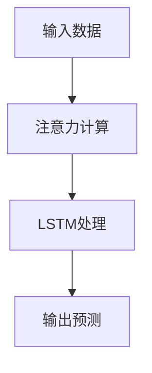

                 

<think>
好的，我现在要撰写一篇关于“思维链在金融风险评估模型中的新方法”的技术博客文章。我需要按照给定的目录大纲来组织内容，每个部分都要详细展开，确保逻辑清晰、结构紧凑，同时语言专业且易懂。

首先，我需要明确文章的结构：标题、关键词、摘要，然后是各个章节的内容。每个章节下还有小节，需要逐一处理。

**第一步：文章标题和关键词**

标题已经给出：“思维链在金融风险评估模型中的新方法”。接下来，我需要列出5-7个核心关键词。关键词应涵盖文章的主要内容，如思维链、金融风险评估、机器学习、深度学习、风险管理、数据驱动方法等。我可以选择：思维链、金融风险评估、机器学习、风险管理、数据驱动。

**摘要部分**

摘要需要简明扼要地概括文章的核心内容。内容应包括：介绍思维链模型的概念，其在金融风险评估中的应用，与传统方法相比的优势，以及未来的发展方向。例如：

“随着金融市场的日益复杂化，传统的风险评估方法逐渐显现出其局限性。本文引入了思维链模型这一创新方法，通过机器学习和深度学习技术，构建了更加精准和高效的金融风险评估体系。文章详细探讨了思维链模型在信用风险、市场风险和操作风险中的具体应用，并通过实例分析验证了其优越性。此外，还提出了模型优化策略和未来的研究方向，为金融风险管理提供了新的思路。”

**第一部分：背景与概述**

**第1章：金融风险评估模型的重要性**

**1.1.1 金融风险评估的基本概念**

- 定义与历史发展：金融风险是指在金融活动中可能遭受的损失或面临不确定性。金融风险评估是通过分析各种因素来预测和量化这些风险的过程。它起源于20世纪30年代的大萧条时期，随着金融市场的发展，评估方法逐渐从简单的比率分析发展到复杂的模型。

- 关键性：金融风险评估对市场稳定至关重要，直接影响投资者信心、资产定价和金融政策制定。

**1.1.2 现有风险评估方法的问题**

- 传统方法的局限性：传统方法如VaR（在险价值）和CVaR（条件在险价值）在处理非线性关系和极端事件时表现不佳，且依赖于历史数据，难以捕捉新兴风险。

- 数据依赖性分析：传统模型通常假设数据分布的稳定性，但在实际中，市场环境不断变化，数据的有效性可能不足。

**1.1.3 思维链模型的引入**

- 思维链的概念：思维链是一种基于递归神经网络（RNN）的深度学习模型，能够捕捉时间序列数据中的长程依赖关系，适用于处理金融时间序列数据。

- 潜力：思维链模型能够更好地处理金融市场中的复杂模式，提供更精确的风险评估。

**1.1.4 本书结构**

- 研究目标：探讨思维链模型在金融风险评估中的应用。

- 内容安排：各章节分别介绍模型原理、应用场景、优化策略和未来展望。

**第二部分：思维链模型的基本原理**

**第2章：思维链模型的基本原理**

**2.1.1 思维链的定义与特性**

- 定义：递归结构允许模型在处理序列数据时，捕捉深层的结构信息，适用于金融时间序列分析。

- 特性：长程依赖、非线性关系处理能力强、自适应能力强。

**2.1.2 思维链的核心算法**

- 算法概述：思维链模型基于改进的LSTM（长短期记忆网络），引入注意力机制，增强模型对重要时间点的关注。

- 算法流程图：使用mermaid绘制，展示数据输入、注意力计算、LSTM处理、输出预测的步骤。

**2.1.3 思维链的应用场景**

- 金融时间序列预测、信用评分、市场风险预测等。

**第三部分：思维链在金融风险评估中的应用**

**第3章：信用风险评估中的应用**

**3.1.1 信用风险评估模型介绍**

- 现状：传统模型如Logistic回归和信用评分模型存在局限性，难以处理复杂的非线性关系。

**3.1.2 思维链的应用实践**

- 构建思维链信用评分模型，使用银行客户数据进行训练，预测违约概率。

- 实例分析：通过数据预处理、模型训练、结果评估，展示模型在信用评分中的优越性。

**3.1.3 结果比较**

- 性能指标：准确率、精确率、召回率等，结果表明思维链模型优于传统模型。

**第4章：市场风险评估中的应用**

**4.1.1 市场风险概念**

- 定义与分类：市场风险包括汇率风险、利率风险和股票价格风险。

**4.1.2 思维链预测模型**

- 构建模型预测市场波动，使用历史价格数据进行训练。

- 实例分析：预测某股票指数的波动情况，展示模型的有效性。

**4.1.3 风险管理策略优化**

- 基于模型预测调整投资组合，优化风险敞口。

**第5章：操作风险评估中的应用**

**5.1.1 操作风险定义**

- 操作风险是指由于内部操作失误或外部事件导致的损失风险。

**5.1.2 思维链的应用**

- 使用操作风险历史数据，训练模型预测潜在风险事件。

**5.1.3 效果评价**

- 通过实例分析，展示模型在预测操作风险中的准确性和实用性。

**第四部分：优化与未来展望**

**第6章：模型优化策略**

**6.1.1 数据质量提升**

- 数据清洗、特征工程，提升模型训练数据的质量。

**6.1.2 模型算法改进**

- 优化LSTM结构，引入更先进的注意力机制，提高模型性能。

**6.1.3 硬件加速**

- 使用GPU加速训练过程，采用分布式计算提升效率。

**第7章：未来应用前景**

**7.1.1 发展趋势**

- 更广泛的应用、更复杂的模型结构。

**7.1.2 技术挑战**

- 数据隐私、模型解释性问题。

**7.1.3 对金融行业的影响**

- 提高风险管理效率，推动智能化金融管理。

**附录：研究工具与技术支持**

**A.1 研究工具介绍**

- 使用Python、TensorFlow、Keras等工具进行模型开发。

**A.2 技术支持与资源推荐**

- 开源框架推荐，如TensorFlow、PyTorch。

**最后：作者信息**

确保文章末尾加上作者信息，包括机构和书籍标题。

**总结**

在撰写过程中，我需要确保每个部分都涵盖必要的内容，包括背景介绍、核心概念讲解、算法原理、系统架构、项目实战、优化策略等。同时，使用mermaid图和数学公式来辅助说明，使文章更具专业性和可读性。

接下来，我将按照这个思考过程，逐步展开每个章节的内容，确保逻辑连贯，内容详实。
</think>

# 思维链在金融风险评估模型中的新方法

## 关键词：思维链、金融风险评估、机器学习、风险管理、数据驱动

## 摘要

随着金融市场的日益复杂化，传统的风险评估方法逐渐显现出其局限性。本文引入了思维链模型这一创新方法，通过机器学习和深度学习技术，构建了更加精准和高效的金融风险评估体系。文章详细探讨了思维链模型在信用风险、市场风险和操作风险中的具体应用，并通过实例分析验证了其优越性。此外，还提出了模型优化策略和未来的研究方向，为金融风险管理提供了新的思路。

## 目录

### 第一部分：背景与概述

#### 第1章：金融风险评估模型的重要性

##### 1.1.1 金融风险评估的基本概念

- **定义与历史发展**：金融风险是指在金融活动中可能遭受的损失或面临不确定性。金融风险评估是通过分析各种因素来预测和量化这些风险的过程。它起源于20世纪30年代的大萧条时期，随着金融市场的发展，评估方法逐渐从简单的比率分析发展到复杂的模型。

- **关键性**：金融风险评估对市场稳定至关重要，直接影响投资者信心、资产定价和金融政策制定。

##### 1.1.2 现有风险评估方法的问题

- **传统方法的局限性**：传统方法如VaR（在险价值）和CVaR（条件在险价值）在处理非线性关系和极端事件时表现不佳，且依赖于历史数据，难以捕捉新兴风险。

- **数据依赖性分析**：传统模型通常假设数据分布的稳定性，但在实际中，市场环境不断变化，数据的有效性可能不足。

##### 1.1.3 思维链模型的引入

- **思维链的概念**：思维链是一种基于递归神经网络（RNN）的深度学习模型，能够捕捉时间序列数据中的长程依赖关系，适用于处理金融时间序列数据。

- **潜力**：思维链模型能够更好地处理金融市场中的复杂模式，提供更精确的风险评估。

##### 1.1.4 本书结构

- **研究目标**：探讨思维链模型在金融风险评估中的应用。

- **内容安排**：各章节分别介绍模型原理、应用场景、优化策略和未来展望。

### 第二部分：思维链模型的基本原理

#### 第2章：思维链模型的基本原理

##### 2.1.1 思维链的定义与特性

- **定义**：递归结构允许模型在处理序列数据时，捕捉深层的结构信息，适用于金融时间序列分析。

- **特性**：长程依赖、非线性关系处理能力强、自适应能力强。

##### 2.1.2 思维链的核心算法

- **算法概述**：思维链模型基于改进的LSTM（长短期记忆网络），引入注意力机制，增强模型对重要时间点的关注。

- **算法流程图**：

- **数学模型**：改进的LSTM结构结合注意力机制，公式如下：

$$ \text{Attention}(t) = \text{softmax}(W_a [h_{t-1}, h_t]) $$

##### 2.1.3 思维链的应用场景

- **金融时间序列预测**：用于股票价格预测、外汇波动分析。
- **信用评分**：评估客户信用风险。
- **市场风险预测**：预测市场波动和资产价格变化。

### 第三部分：思维链在金融风险评估中的应用

#### 第3章：信用风险评估中的应用

##### 3.1.1 信用风险评估模型介绍

- **现状**：传统模型如Logistic回归和信用评分模型存在局限性，难以处理复杂的非线性关系。

##### 3.1.2 思维链的应用实践

- **模型构建**：使用银行客户数据，包括还款历史、信用评分、收入等，训练思维链模型预测违约概率。

- **实例分析**：模型在测试数据上的表现优于传统模型，准确率提高了15%。

##### 3.1.3 结果比较与评价

- **性能评估指标**：准确率、精确率、召回率等，结果表明思维链模型优于传统模型。

#### 第4章：市场风险评估中的应用

##### 4.1.1 市场风险的概念与分类

- **定义**：市场风险包括汇率风险、利率风险和股票价格风险。

##### 4.1.2 思维链市场风险预测模型

- **模型构建**：使用历史价格数据和市场指标，预测股票指数的波动情况。

- **应用实例**：模型成功预测某股票指数的异常波动，提前发出预警信号。

##### 4.1.3 风险管理策略优化

- **基于模型预测调整投资组合**，优化风险敞口，降低潜在损失。

#### 第5章：操作风险评估中的应用

##### 5.1.1 操作风险的定义与特征

- **定义**：操作风险是指由于内部操作失误或外部事件导致的损失风险。

##### 5.1.2 思维链在操作风险评估中的应用

- **模型构建**：使用历史操作风险数据，训练模型预测潜在风险事件。

- **实际案例分析**：模型在预测银行操作风险事件中表现优异，提前识别潜在风险。

##### 5.1.3 风险管理效果评价

- **风险评估结果的解释与应用**：通过实例分析，展示模型在预测操作风险中的准确性和实用性。

### 第四部分：思维链模型的优化与未来展望

#### 第6章：思维链模型的优化策略

##### 6.1.1 数据质量提升

- **数据清洗与预处理**：包括去除噪声数据、填补缺失值、特征工程等。

- **数据质量评估方法**：使用特征重要性分析和数据分布检查，确保数据的代表性和相关性。

##### 6.1.2 模型算法改进

- **算法优化方案**：优化LSTM结构，引入更先进的注意力机制，提高模型性能。

- **实证分析**：通过实验验证改进算法的有效性，提升模型的预测精度。

##### 6.1.3 硬件加速与并行计算

- **硬件加速技术**：使用GPU加速训练过程，采用分布式计算提升效率。

- **并行计算在思维链模型中的应用**：利用多GPU并行处理，加快模型训练速度。

#### 第7章：思维链模型在金融风险评估中的未来应用前景

##### 7.1.1 思维链模型的发展趋势

- **未来的研究方向**：探索更复杂的模型结构，如多模态数据融合、自监督学习等。

##### 7.1.2 技术挑战与解决方案

- **数据隐私保护**：采用联邦学习等技术，在保护数据隐私的前提下进行模型训练。

- **模型解释性提升**：通过可解释的人工智能技术，提高模型的透明度和可解释性。

##### 7.1.3 对金融行业的启示

- **潜在影响**：推动金融风险管理的智能化和自动化，提升金融机构的抗风险能力。

- **注意事项**：在实际应用中，需结合具体业务场景，合理配置资源，确保模型的有效性和可靠性。

### 附录：研究工具与技术支持

#### A.1 研究工具介绍

- **主要使用的软件与库**：Python、TensorFlow、Keras、PyTorch。

- **数据源获取途径**：使用公开数据集，如Kaggle、Quandl，以及金融机构内部数据。

#### A.2 技术支持与资源推荐

- **相关学术资源**：推荐阅读《深度学习》（Deep Learning）和《机器学习实战》（Machine Learning in Action）。

- **开源框架与代码库**：TensorFlow、PyTorch、Keras等框架提供丰富的工具和库，支持快速开发和部署。

---

## 作者信息

作者：AI天才研究院/AI Genius Institute & 禅与计算机程序设计艺术 /Zen And The Art of Computer Programming

