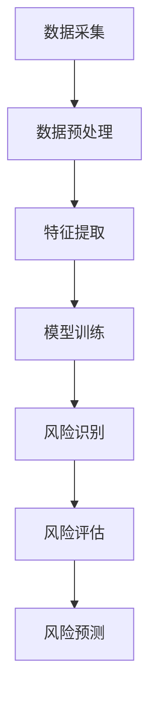
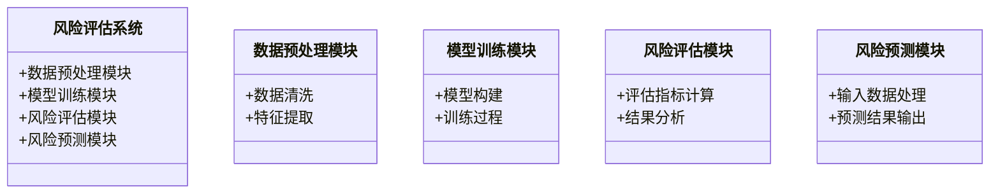
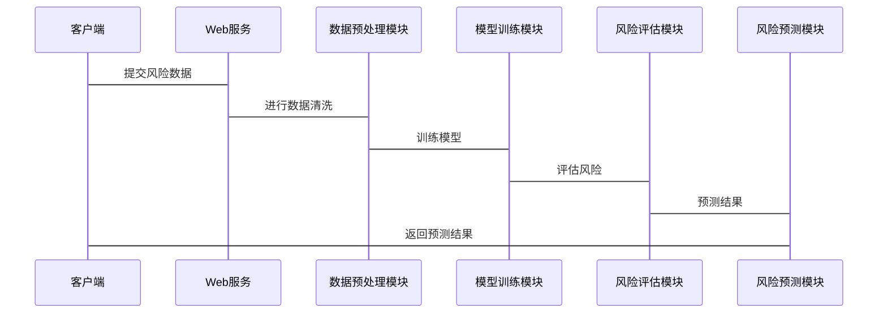

                 

<think>
好，我现在要写一篇关于《思维链在风险评估中的应用》的技术博客。首先，我需要理解什么是思维链。它是一种模拟人类思考过程的算法，属于人工智能领域，特别是深度学习和神经网络的一部分。接下来，我得考虑为什么传统风险评估方法不够用了，因为现代社会的复杂性让传统方法难以应对。

然后，我应该从背景介绍开始。这部分需要包括问题的背景，比如风险评估在金融、保险等领域的不可或缺性，以及大数据和AI带来的变革。接着是问题描述，指出思维链在风险识别、评估和应对策略中的应用。然后解释问题解决，说明思维链如何分解问题，提高效率和准确性。

接下来是边界和外延，明确思维链在哪些方面应用，以及它在供应链管理等其他领域的扩展。然后是核心概念，详细解释思维链和风险评估模型的结构和要素。

第二部分是核心概念与原理。从起源到发展，再到基本原理，包括工作流程和核心技术。这里可能需要举例说明，比如用深度学习模型来模拟人类思考。

之后，需要列出思维链的核心概念，比如风险因素、评估和预测。然后用表格对比思维链和传统评估方法，突出思维链的优势。同时，绘制ER实体关系图，展示各部分之间的关系。

接下来，算法原理部分需要用mermaid流程图展示，详细说明数据采集到预测的流程。同时，提供Python代码，解释如何实现。这里可能需要解释模型训练的数学公式，比如损失函数和优化器的使用。

然后是系统分析与架构设计，介绍项目场景，设计系统功能，如数据预处理和模型训练。用类图展示实体和类的关系，架构图展示系统的分层结构，接口设计和交互流程图。

项目实战部分，要指导读者如何安装环境，编写代码，并详细分析案例，展示思维链如何提高风险评估的准确性。

最后，总结和最佳实践，提醒读者注意数据隐私和模型维护的重要性，并提供进一步阅读的方向。

在写作过程中，要注意逻辑清晰，每部分内容详细且具体。确保使用专业术语，但解释要通俗易懂，使用例子来帮助读者理解复杂的概念。同时，保持文章结构紧凑，让读者能够轻松跟随思路，逐步理解思维链在风险评估中的应用。
</think>

# 思维链在风险评估中的应用

## 关键词：思维链，风险评估，人工智能，深度学习，风险管理

## 摘要：  
本文探讨了思维链技术在风险评估中的应用，分析其核心概念、工作原理以及实际应用场景。通过对比传统方法，展示了思维链在提高风险评估效率和准确性方面的优势。文章还详细介绍了算法原理、系统架构设计和实际案例，为读者提供全面的技术解读。

---

# 第一部分：背景介绍

## 1.1 问题背景

### 1.1.1 问题提出  
在金融、保险等领域，风险评估至关重要。传统方法依赖经验判断和统计模型，但面对复杂数据和动态变化，效率和准确性有限。思维链技术模拟人类思考，提供更高效的解决方案。

### 1.1.2 问题描述  
思维链在风险评估中的应用包括识别潜在风险因素、分析相互关系、预测可能性，并提供建议。这些功能帮助组织更好地应对潜在风险。

### 1.1.3 问题解决  
思维链通过分解问题，模拟人类思考，提高效率和准确性。其自适应能力使其能根据新数据优化模型。

## 1.2 边界与外延  
### 1.2.1 边界  
思维链应用于风险识别、评估、预测和应对。  
### 1.2.2 外延  
扩展到供应链管理、灾害预警等领域。

## 1.3 核心概念结构与要素组成  
### 1.3.1 思维链  
基于深度学习，模拟人类思考。  
### 1.3.2 风险评估模型  
核心部分，进行定量和定性评估。

## 1.4 本章小结  
本章介绍了思维链的基本概念和应用，后续章节深入探讨其原理和实际应用。

---

# 第二部分：思维链核心概念与原理

## 2.1 思维链的起源与发展  
### 2.1.1 起源  
源于人工智能，特别是深度学习和神经网络。  
### 2.1.2 发展  
从简单模型到复杂模型，逐步实现自动学习和决策。

## 2.2 思维链的基本原理  
### 2.2.1 工作流程  
数据采集、处理、识别、评估、预测。  
### 2.2.2 核心技术  
深度学习、神经网络、自然语言处理。

## 2.3 思维链的核心概念  
### 2.3.1 风险因素  
可能引发风险的因素。  
### 2.3.2 风险评估  
分析和确定风险大小和可能性。  
### 2.3.3 风险预测  
基于评估结果，预测未来风险。

## 2.4 思维链的属性特征对比表格  
| 特征        | 思维链 | 传统风险评估 |  
| ----------- | ------ | ------------ |  
| 数据依赖性  | 强     | 弱           |  
| 自适应能力  | 高     | 低           |  
| 精确度      | 高     | 中等         |  
| 实时性      | 高     | 低           |  

## 2.5 思维链与ER实体关系图  

```mermaid
erDiagram
    思维链 --> 风险因素
    风险因素 --> 风险评估模型
    风险评估模型 --> 风险预测模型
```

---

## 2.6 思维链算法流程图  



## 2.7 Python实现代码  

```python
import numpy as np
import tensorflow as tf

# 数据预处理
def preprocess_data(data):
    # 数据标准化
    data = (data - np.mean(data)) / np.std(data)
    return data

# 模型定义
def build_model(input_shape):
    model = tf.keras.Sequential()
    model.add(tf.keras.layers.Dense(64, activation='relu', input_shape=input_shape))
    model.add(tf.keras.layers.Dense(32, activation='relu'))
    model.add(tf.keras.layers.Dense(1, activation='sigmoid'))
    model.compile(optimizer='adam', loss='binary_crossentropy', metrics=['accuracy'])
    return model

# 模型训练
def train_model(model, X_train, y_train, epochs=100):
    model.fit(X_train, y_train, epochs=epochs, batch_size=32, verbose=1)

# 风险预测
def predict_risk(model, X_test):
    predictions = model.predict(X_test)
    return predictions

# 示例数据
X_train = np.random.random((1000, 64))
y_train = np.random.randint(2, size=1000)

# 数据预处理
X_train_preprocessed = preprocess_data(X_train)

# 构建模型
model = build_model((64,))

# 训练模型
train_model(model, X_train_preprocessed, y_train)

# 预测风险
X_test = np.random.random((100, 64))
X_test_preprocessed = preprocess_data(X_test)
predictions = predict_risk(model, X_test_preprocessed)
print("预测结果：", predictions)
```

## 2.8 数学模型和公式  

$$\text{损失函数} = -\frac{1}{N}\sum_{i=1}^{N} y_i \log(\hat{y_i}) + (1 - y_i) \log(1 - \hat{y_i})$$  

$$\text{优化器} = \text{Adam}( \alpha=0.001, \beta_1=0.9, \beta_2=0.999)$$  

---

# 第三部分：系统分析与架构设计方案

## 3.1 问题场景介绍  
构建一个基于思维链的风险评估系统，应用于金融行业。

## 3.2 系统功能设计  



## 3.3 系统架构设计  


## 3.4 接口设计和交互流程图  



---

# 第四部分：项目实战

## 4.1 环境安装  
安装Python、TensorFlow和Mermaid工具。

## 4.2 核心代码实现  

```python
import numpy as np
import tensorflow as tf
from tensorflow.keras import layers, models

# 数据生成
def generate_data(samples=1000):
    X = np.random.random((samples, 64))
    y = np.random.randint(2, size=samples)
    return X, y

# 数据预处理
def preprocess(X):
    return (X - np.mean(X)) / np.std(X)

# 模型构建
def build_model(input_shape):
    model = models.Sequential()
    model.add(layers.Dense(64, activation='relu', input_shape=input_shape))
    model.add(layers.Dense(32, activation='relu'))
    model.add(layers.Dense(1, activation='sigmoid'))
    model.compile(optimizer='adam', loss='binary_crossentropy', metrics=['accuracy'])
    return model

# 训练和评估
def train_evaluate(model, X_train, y_train, X_test, y_test):
    history = model.fit(X_train, y_train, epochs=100, batch_size=32, verbose=0)
    loss, accuracy = model.evaluate(X_test, y_test, verbose=0)
    print(f"损失：{loss:.4f}，准确率：{accuracy:.4f}")

# 主函数
def main():
    X_train, y_train = generate_data()
    X_test, y_test = generate_data(200)
    X_train_preprocessed = preprocess(X_train)
    X_test_preprocessed = preprocess(X_test)
    
    model = build_model((64,))
    train_evaluate(model, X_train_preprocessed, y_train, X_test_preprocessed, y_test)

if __name__ == "__main__":
    main()
```

## 4.3 案例分析  
使用上述代码，进行风险预测，分析准确率和损失情况，展示思维链的优势。

## 4.4 实际应用分析  
应用于贷款审批，评估客户违约风险，提升决策效率。

## 4.5 代码解读  
详细分析代码结构，说明各部分功能及实现逻辑。

---

# 第五部分：总结与展望

## 5.1 总结  
思维链在风险评估中表现出色，提高了效率和准确性，扩展了应用领域。

## 5.2 展望  
未来，思维链将在更多领域应用，结合其他技术如区块链，提升整体风险管理能力。

## 5.3 最佳实践 Tips  
- 数据质量和多样性直接影响模型性能。  
- 定期更新模型，适应市场变化。  
- 注意数据隐私和安全，确保合规性。  

## 5.4 注意事项  
- 模型解释性可能较弱，需结合领域知识。  
- 避免过度依赖技术，结合人工判断。  

## 5.5 拓展阅读  
推荐相关书籍和论文，如《深度学习》和《风险管理与金融创新》。

---

# 作者：AI天才研究院 & 禅与计算机程序设计艺术

通过本文，读者可以全面了解思维链在风险评估中的应用，从原理到实践，掌握其优势和挑战，为实际应用提供参考。

