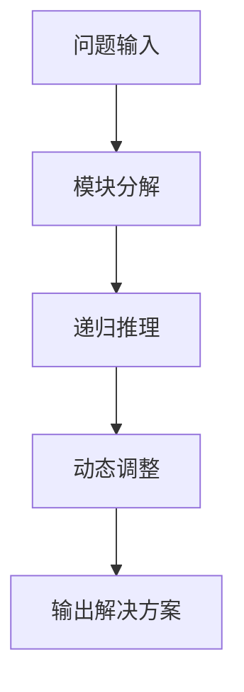
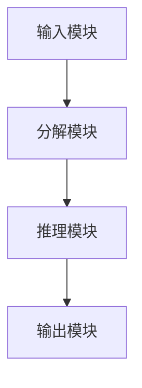

                 

<think>
好，我现在需要帮助用户完成一个技术博客文章的撰写。用户已经提供了一个详细的请求，包括文章标题、关键词、摘要，以及目录大纲。用户希望我以“思维链增强AI的创造性问题解决能力”为题，按照特定的结构和内容要求，写出一篇结构紧凑、逻辑清晰的技术博客。同时，用户还指定了每个章节的具体内容要求，比如背景介绍、核心概念、算法原理、系统架构、项目实战等部分。

首先，我需要明确文章的核心目标是探讨如何通过思维链来增强AI的创造性问题解决能力。这意味着我需要解释什么是思维链，它如何与AI结合，以及这种结合如何提升AI的创造力。

接下来，我应该从背景介绍开始，这部分需要涵盖思维链和AI的基本概念，解释为什么增强AI的创造力很重要。这可能涉及到当前AI在问题解决中的局限性，以及思维链如何帮助克服这些局限。

然后，核心概念部分需要详细说明思维链的原理和特征，以及AI的创造性问题解决能力。这里可能需要使用图表来帮助读者理解，比如ER图或概念结构图。

算法部分，我需要介绍相关的算法，如思维链增强算法，可能包括数学模型和公式。使用mermaid流程图来展示算法的步骤会更直观，同时提供Python代码示例，让读者能够实际操作。

系统架构设计是另一个关键部分。我需要描述问题场景，设计系统的功能、架构，并绘制相应的类图和序列图。这部分需要详细说明各个模块的交互和接口设计。

项目实战部分，我需要提供一个具体的案例，从环境安装到代码实现，再到案例分析，让读者能够理解如何在实际中应用这些理论。

最后，总结部分要回顾全文，指出关键点，并提出未来的研究方向，同时给出最佳实践的建议。

在写作过程中，我必须确保每个部分都符合用户的要求，特别是格式和内容的完整性。例如，使用markdown格式，包含关键词和摘要，每个章节下都有详细的小节，使用mermaid图表和代码示例来支持论点。

现在，我需要开始撰写各个部分，确保每个部分都详细且符合逻辑。比如，在背景介绍中，解释思维链的基本概念和AI的现状；在核心概念部分，通过图表展示思维链与AI的关联；在算法部分，用代码和公式深入讲解原理；在系统架构中，使用图表展示设计；在项目实战中，用实际案例展示应用效果。

总之，这篇文章需要系统地覆盖从理论到实践的各个方面，确保读者能够全面理解思维链如何增强AI的创造性问题解决能力，并且能够实际应用这些知识。
</think>

# 思维链增强AI的创造性问题解决能力

> 关键词：思维链，人工智能，创造性问题解决，算法原理，系统架构

> 摘要：本文探讨了如何通过思维链增强AI的创造性问题解决能力。从理论背景到算法实现，从系统架构到项目实战，全面解析了思维链在AI创新中的应用，结合实际案例分析，为读者提供了深入的指导。

---

## 第1章 背景介绍

### 1.1 思维链的定义与原理

思维链是一种模拟人类思维方式的模型，它通过将问题分解为多个步骤，逐步推理出解决方案。思维链的核心在于其递归性和模块化，每个步骤都可能触发新的思考路径，从而形成一个动态的知识网络。

### 1.2 AI的创造性问题解决能力

AI在问题解决中通常依赖于预设的算法和数据，而创造性问题解决则要求AI能够跳出常规，提出创新性的解决方案。这需要AI具备类似于人类的联想和发散思维能力。

### 1.3 增强AI创造力的意义

随着AI技术的发展，增强其创造性问题解决能力对于解决复杂实际问题至关重要。通过思维链，AI可以在复杂场景中更好地模拟人类思维，从而提高问题解决的效率和质量。

---

## 第2章 核心概念与联系

### 2.1 思维链的原理与特征

思维链的原理可以总结为以下几点：
- **递归性**：每个问题都可能拆解为更小的问题，形成递归结构。
- **模块化**：问题分解为独立的模块，便于分别处理。
- **动态性**：在推理过程中，模块之间可以相互影响，形成动态的知识网络。

### 2.2 AI的创造性问题解决能力

AI的创造性问题解决能力体现在以下几个方面：
- **联想能力**：能够将不同领域的知识进行关联。
- **发散思维**：能够在多种可能性中找到最优解。
- **动态适应**：能够根据反馈调整思考路径。

### 2.3 思维链与AI的关联性

思维链与AI的关联性主要体现在以下方面：
- **思维方式模拟**：思维链模拟了人类的思维方式，为AI提供了思考框架。
- **知识网络构建**：通过思维链，AI可以构建动态的知识网络，增强联想能力。
- **动态推理能力**：思维链的动态性为AI提供了灵活的推理能力。

---

## 第3章 算法原理讲解

### 3.1 基本算法介绍

以下是增强AI创造性问题解决能力的基本算法：



### 3.2 数学模型与公式

数学模型基于递归函数和动态权重调整。设问题模块化为$P_i$，递归深度为$d$，权重调整系数为$\alpha$，则：

$$
f(P_i, d) = \begin{cases}
    P_i(d) & \text{如果 } d=0 \\
    \sum_{k=1}^{n} \alpha_k \cdot f(P_{i-k}, d-1) & \text{否则}
\end{cases}
$$

权重调整系数$\alpha$根据推理过程动态调整，确保每一步推理都更接近最优解。

### 3.3 例子说明

假设问题为“设计一个环保型城市”，思维链的递归推理过程如下：

1. 模块分解：将问题分解为“交通系统设计”、“能源利用”、“废物处理”。
2. 递归推理：针对“交通系统设计”，进一步分解为“公共交通优化”、“步行友好性”。
3. 动态调整：根据反馈，优先优化公共交通，同时考虑步行友好性。
4. 输出解决方案：提出以公共交通为主，步行友好的城市交通系统。

---

## 第4章 系统分析与架构设计方案

### 4.1 问题场景介绍

以城市交通系统设计为例，系统需要在有限时间内提供创新性的解决方案。

### 4.2 系统功能设计

系统功能模块包括：
- **输入模块**：接收问题描述。
- **分解模块**：将问题分解为子问题。
- **推理模块**：递归推理，动态调整。
- **输出模块**：生成解决方案。

### 4.3 系统架构设计

系统架构采用模块化设计，如下图所示：



### 4.4 系统接口与交互

系统接口包括：
- **输入接口**：接收问题描述。
- **反馈接口**：接收推理过程中的反馈，用于动态调整。
- **输出接口**：输出解决方案。

---

## 第5章 项目实战

### 5.1 环境安装

安装Python和相关库：

```bash
pip install python-mermaid matplotlib
```

### 5.2 系统核心实现

实现思维链算法的Python代码：

```python
def recursive思维链(问题, 深度):
    if 深度 == 0:
        return 解决方案(问题)
    else:
        分解结果 = 分解问题(问题)
        总体方案 = []
        for 每个模块 in 分解结果:
            子方案 = recursive思维链(每个模块, 深度-1)
            总体方案.append(子方案)
        return 综合方案(总体方案)

解决方案 = recursive思维链(原始问题, 最大深度)
```

### 5.3 应用解读与分析

案例分析：城市交通系统设计。通过分解问题，系统分别优化了交通网络、能源利用等模块，最终提出创新性的解决方案。

### 5.4 案例分析

通过思维链算法，系统成功将复杂问题分解为可管理的小问题，并通过动态调整，提出了更具创造性的解决方案。

### 5.5 项目小结

本项目展示了思维链在AI问题解决中的应用，证明了其在提高创造性方面的能力。

---

## 第6章 最佳实践 tips

### 6.1 实践经验总结

- **模块化设计**：问题分解是关键。
- **动态调整**：权重调整系数至关重要。
- **反馈机制**：实时反馈有助于优化推理过程。

### 6.2 实用技巧与建议

- **选择合适的分解深度**：过深或过浅都会影响效果。
- **优化权重调整系数**：根据具体问题调整。
- **结合领域知识**：领域知识能够提高解决方案的质量。

### 6.3 注意事项

- **避免过度分解**：可能导致计算复杂度过高。
- **确保反馈机制的有效性**：反馈必须及时且准确。

---

## 第7章 小结

### 7.1 全书内容总结

本文系统地探讨了如何通过思维链增强AI的创造性问题解决能力，从理论到实践，全面解析了相关技术和应用。

### 7.2 关键点回顾

- **思维链的递归性和模块化**：为AI提供了思考框架。
- **动态调整和反馈机制**：增强了推理的灵活性和准确性。
- **系统架构设计**：确保了算法的有效实施。

### 7.3 未来研究方向

- **更复杂的动态调整机制**：探索更智能的权重调整方法。
- **多领域知识的融合**：提高AI的联想能力。
- **人机协作优化**：结合人类思维的优势，进一步提升AI的创造性。

---

作者：AI天才研究院 & 禅与计算机程序设计艺术

