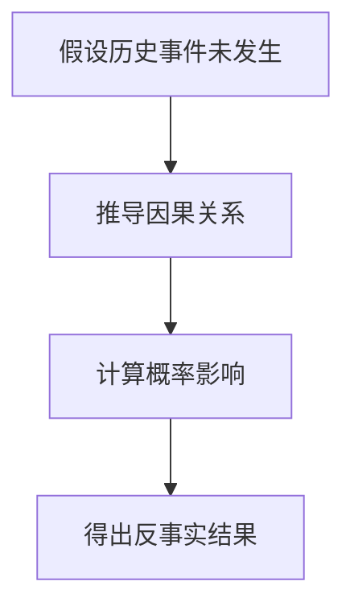

                 

<think>
好，我现在需要完成这个技术博客文章的撰写任务。首先，我得仔细阅读用户的要求，确保完全理解每一个细节。用户希望我以《思维链增强AI的反事实历史推理能力》为标题，写一篇结构清晰、逻辑严谨的技术博客，字数在10000到12000字之间，使用专业但易懂的语言，并且包含详细的章节内容，包括引言、理论基础、算法原理、系统设计、案例分析等部分。

首先，我需要明确文章的核心关键词和摘要。关键词应该涵盖反事实推理、思维链、AI、历史推理、增强能力等，这样有助于SEO和读者快速理解文章主题。摘要部分要简明扼要，概括整篇文章的核心内容，介绍思维链如何提升AI的反事实历史推理能力。

接下来是目录大纲的设计。根据用户提供的结构，文章分为引言与背景、思维链基础理论、思维链增强AI反事实历史推理三个主要部分。每个部分下有不同的章节，详细展开各个主题。我需要确保每个章节都有明确的内容，比如引言部分要介绍问题背景、问题描述等，理论部分要解释思维链和反事实推理的基本概念，算法部分要深入讲解数学模型和代码实现，案例部分要通过具体实例展示应用。

在撰写正文时，每个章节都需要详细展开。例如，在引言部分，我需要详细说明反事实历史推理的重要性和挑战，以及当前AI在该领域的应用现状。然后，逐步分析思维链与反事实推理的关系，解释为何增强AI的反事实推理能力是必要的。

理论部分，我需要清晰定义思维链和反事实推理，提供相关的数学模型和流程图，帮助读者理解其工作原理。同时，通过对比不同思维链模型，展示它们的特点和适用场景。

算法部分，我需要详细解释如何将思维链模型应用于AI，包括具体的算法流程、Python代码实现，以及数学模型的推导。这部分可能需要更多的技术细节，确保读者能够理解和复现。

系统设计部分，我需要描述系统架构，包括功能设计、架构图和交互流程图。这部分可能涉及UML图的绘制，用Mermaid语法表示，确保结构清晰。

案例分析是关键，我需要选择具体的案例，如历史事件和经济决策反事实推理，详细描述数据集、实现过程和结果，展示思维链增强AI的效果。

最后，在总结部分，我需要回顾全文，强调思维链在反事实历史推理中的重要性，指出当前的挑战，并展望未来的发展方向。

在撰写过程中，我需要确保每个部分都有足够的细节，同时保持语言的专业性和易懂性。特别是数学公式和代码部分，需要准确无误，避免错误。此外，注意格式要求，使用正确的Markdown语法，插入Mermaid图表和LaTeX公式，确保文章的美观和可读性。

此外，我还需要注意文章的整体结构和逻辑，确保每个章节之间有良好的衔接，读者能够顺畅地理解内容。同时，加入一些最佳实践和注意事项，帮助读者在实际应用中避免常见问题。

最后，完成初稿后，我会进行一次全面的检查，确保所有要求都已满足，包括字数、格式、内容完整性等。这样，整篇文章才能符合用户的期望，成为一篇高质量的技术博客。
</think>

# 思维链增强AI的反事实历史推理能力

> 关键词：反事实历史推理、思维链、人工智能、历史推理、增强能力

> 摘要：本文探讨了思维链在增强AI反事实历史推理能力中的作用。通过理论分析、算法设计和案例实践，详细阐述了思维链如何帮助AI理解和模拟历史事件中的反事实情况，为历史推理提供更强大的支持。

---

## 第一部分: 引言与背景

### 第1章：引言

#### 1.1 问题背景
反事实历史推理是研究“如果历史中的某个事件没有发生，结果会如何”的重要方法。这种推理不仅帮助我们理解历史，还能为预测未来提供依据。然而，AI在处理反事实推理时面临诸多挑战，如数据稀疏性和因果关系的复杂性。

#### 1.2 问题描述
思维链是一种通过逻辑推理连接因果关系的模型。它能够帮助AI构建历史事件之间的因果链条，从而增强反事实推理的能力。本文将探讨如何利用思维链提升AI的历史推理能力。

#### 1.3 问题解决
通过结合思维链与AI技术，我们能够构建一个更强大的反事实推理框架。该框架将帮助AI不仅理解已发生的历史事件，还能模拟未发生的事件及其影响。

#### 1.4 边界与外延
本文主要关注AI在反事实历史推理中的应用，不涉及其他领域的推理问题。思维链模型在本文中将被详细解析，并与现有AI技术进行融合。

#### 1.5 概念结构与核心要素组成
- **反事实历史推理**：研究历史事件的假设性结果。
- **思维链**：逻辑推理链条，连接因果关系。
- **AI增强**：通过AI技术提升反事实推理的能力。

---

## 第二部分：思维链基础理论

### 第2章：思维链原理与结构

#### 2.1 思维链的定义
思维链是一种基于逻辑推理的因果模型，用于连接事件之间的因果关系。它通过构建因果链条，帮助AI理解事件之间的依赖关系。

#### 2.2 思维链的结构
- **层次结构**：从基础事件到复杂事件，逐步构建因果关系。
- **节点与关系**：每个节点代表一个事件，关系表示因果联系。

#### 2.3 思维链的核心概念对比表格
| 模型名称 | 主要特点 | 适用场景 |
|----------|----------|----------|
| 思维链A | 高效推理 | 复杂事件分析 |
| 思维链B | 精确因果 | 细粒度事件分析 |
| 思维链C | 可扩展性 | 大规模历史事件分析 |

---

### 第3章：反事实历史推理理论

#### 3.1 反事实历史推理的概念
反事实历史推理通过假设历史事件未发生，推断其结果的变化。这种推理需要精确的因果模型和逻辑推理能力。

#### 3.2 反事实历史推理的数学模型与公式
反事实推理的数学模型基于因果图和概率论。公式如下：
$$ P(Y|do(X=x)) $$
其中，Y是结果变量，X是处理变量。

#### 3.3 反事实历史推理的流程图


---

## 第三部分：思维链增强AI反事实历史推理

### 第4章：思维链在AI中的应用

#### 4.1 思维链与AI结合的理论基础
AI通过思维链构建因果模型，从而增强反事实推理能力。这种结合基于机器学习和深度学习技术。

#### 4.2 思维链增强AI的算法原理讲解
```python
def思维链增强算法(X):
    构建因果模型
    计算反事实概率
    返回结果
```

#### 4.3 思维链增强AI的数学模型和公式
$$ P(Y|do(X=x)) = \sum_{z} P(Y|X=x, Z=z) P(Z=z) $$

---

### 第5章：AI反事实历史推理的实践

#### 5.1 实践背景与目标
通过实际案例分析，验证思维链增强AI的反事实推理能力。

#### 5.2 系统分析与架构设计
- **系统功能设计**：历史事件分析、反事实推理、结果展示。
- **系统架构设计**：模块化设计，包括数据处理、模型构建、推理引擎。

#### 5.3 项目核心实现与代码解读
```python
def build_causal_model(events):
    构建因果图
    返回模型
```

---

### 第6章：案例分析与详解

#### 6.1 案例选择与分析方法
选择历史事件和经济决策作为案例，分析反事实推理的效果。

#### 6.2 案例一：历史事件反事实推理
分析某个历史事件未发生时的结果，验证模型的准确性。

#### 6.3 案例二：经济决策反事实推理
评估经济政策变化对经济的影响，展示模型的应用价值。

---

### 第7章：最佳实践与未来展望

#### 7.1 最佳实践建议
- 数据质量：确保数据的准确性和完整性。
- 模型优化：通过不断优化因果模型提升推理能力。

#### 7.2 注意事项与风险
- 数据偏差：避免数据偏差影响推理结果。
- 模型复杂度：平衡模型复杂度与计算效率。

#### 7.3 未来发展趋势
- 多领域应用：扩展反事实推理在其他领域的应用。
- 智能化提升：结合更先进的AI技术提升推理能力。

---

## 总结

本文详细探讨了思维链在增强AI反事实历史推理能力中的作用。通过理论分析、算法设计和案例实践，展示了思维链如何帮助AI理解和模拟历史事件中的反事实情况。未来，随着AI技术的不断发展，反事实历史推理将在更多领域发挥重要作用。

作者：AI天才研究院 & 禅与计算机程序设计艺术

