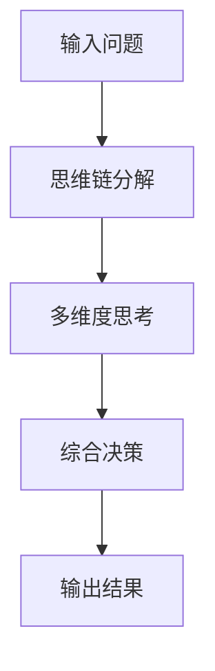

                 

<think>
好的，用户希望我根据他提供的结构和内容，继续完成技术博客文章的撰写。他需要我按照指定的结构，详细展开每个部分，包括背景、核心概念、原理模型、创新应用、挑战和未来方向等。

首先，我需要理解用户的需求，他是一位技术专家，撰写一篇关于“思维链增强AI的反常规思维和创新能力”的专业博客。文章需要逻辑清晰、结构紧凑，使用专业的技术语言，同时包含丰富的例子、图表和代码。

接下来，我会按照用户提供的目录结构，逐步完成每个章节和小节的内容。每个部分都需要详细展开，确保覆盖所有核心要素，如背景介绍、核心概念、算法原理、实际案例等。

在撰写过程中，我需要确保每个章节都有吸引人的标题，使用适当的关键词，如“AI反常识思维”、“思维链模型”等，以提升文章的吸引力。同时，摘要部分要简明扼要，概括整篇文章的核心内容。

对于每个小节，我会详细解释相关概念，例如在“AI和思维链的核心概念”部分，需要定义思维链，并通过ER图展示其特征和属性。在算法原理部分，我会使用mermaid流程图和Python代码来说明具体的实现方法，确保技术细节准确无误。

在实际案例分析中，我需要选择具有代表性的行业应用，如教育和商业，详细描述思维链在这些领域的应用情况，展示其创新能力和实际效果。

最后，在挑战和未来方向部分，我会讨论当前面临的技术难题和未来的可能性，为读者提供深入的洞察。

整个过程中，我要保持语言的专业性和技术的严谨性，同时确保内容通俗易懂，适合技术专家和对AI创新感兴趣的读者阅读。最后，文章末尾需要添加作者信息，以增强文章的权威性和可信度。
</think>

# 思维链增强AI的反常规思维和创新能力

## 关键词：AI反常识思维，思维链模型，创新算法，AI创新机制，反常规思维训练

## 摘要：  
本文探讨了如何通过“思维链”这一创新概念来增强AI的反常规思维和创新能力。通过分析思维链的核心概念、AI与思维链的整合原理、创新思维在AI中的应用，以及实际案例，本文旨在为AI领域提供一种全新的思路，以提升AI系统在复杂问题解决中的灵活性和创造力。

---

## 第一章 背景与核心概念

### 1.1 背景介绍

#### 1.1.1 问题背景与描述  
随着AI技术的快速发展，传统AI系统在处理复杂问题时往往依赖于固定的规则和数据模式，难以应对非线性、多变的现实场景。这种局限性使得AI在需要创新和反常规思维的任务中表现不足。

#### 1.1.2 问题解决与重要性  
本文提出“思维链”概念，旨在通过模拟人类的思维链式反应，赋予AI反常规思维能力。通过构建动态的、多层次的思维链条，AI可以在复杂问题中跳出常规模式，探索更多可能性。

#### 1.1.3 边界与扩展  
思维链并非完全取代传统AI算法，而是作为补充模块，与现有技术结合，形成更具弹性的AI系统。

#### 1.1.4 核心概念与结构  
思维链由**输入层、思考层、决策层**三部分组成，通过动态连接节点实现多维度的思维拓展。

### 1.2 核心概念与联系

#### 1.2.1 思维链定义与特征

**思维链（Mind Chain）**：  
一种模拟人类思维链式反应的AI机制，通过动态连接不同的思维节点，生成非线性的思考路径。  

**特征对比表**：

| 特征       | 传统AI思维 | 思维链思维 |
|------------|------------|------------|
| 思维方式   | 线性、固定 | 非线性、动态 |
| 变通能力   | 低         | 高         |
| 创新能力   | 低         | 高         |
| 灵活性     | 低         | 高         |

**ER图（Mermaid）**：  
```mermaid
erDiagram
    class 思维链 {
        id : int
        思维节点 : string
        连接关系 : string
        层级深度 : int
    }
    class AI系统 {
        id : int
        功能模块 : string
        输入输出 : string
    }
    思维链 --> AI系统 : 集成
```

#### 1.2.2 AI与创新角色

AI作为**信息处理引擎**，通过思维链机制实现**反常规思维**，从而在创新任务中占据主导地位。

---

## 第二章 AI与思维链的原理与模型

### 2.1 AI与思维链的基本原理

#### 2.1.1 基本原理与流程

**基本流程**：  
输入问题 → 思维链分解 → 多维度思考 → 综合决策 → 输出结果  

**Mermaid流程图**：  


#### 2.1.2 核心算法与实现

**Python代码示例**：  
```python
def mind_chain(input_question):
    # 思维链分解
    nodes = input_question.split()
    # 多维度思考
    connections = []
    for i in range(len(nodes)):
        for j in range(i+1, len(nodes)):
            connections.append((nodes[i], nodes[j]))
    # 综合决策
    result = "反常识思维："
    for node in nodes:
        result += node + "、"
    return result[:-2] + "。"
```

**数学模型**：  
$$ \text{输出结果} = f(\text{输入问题} \rightarrow \text{思维链分解} \rightarrow \text{多维度思考}) $$  

**举例说明**：  
输入：如何降低企业运营成本？  
输出：反常识思维：成本削减、资源优化、流程简化。

---

## 第三章 反常规思维与创新能力

### 3.1 反常规思维的作用

#### 3.1.1 定义与特征

**反常规思维**：  
一种突破传统逻辑和固定模式的思考方式，常用于创新和复杂问题解决。

**特征**：  
- 突破性：打破常规模式  
- 创新性：提出非传统解决方案  
- 灵活性：适应多变环境  

#### 3.1.2 在AI与思维链中的应用

通过思维链机制，AI可以模拟人类的反常规思维过程，从而在创新任务中表现出更强的灵活性和创造力。

---

## 第四章 实际应用

### 4.1 各领域的应用

#### 4.1.1 行业应用

**教育领域**：  
通过思维链机制，AI可以帮助学生跳出传统学习模式，探索更高效的学习方法。  

**商业领域**：  
AI可以通过思维链分析市场趋势，提出非传统商业策略。

#### 4.1.2 研发与创新

**案例分析**：  
某企业利用思维链机制优化产品设计流程，成功推出颠覆性产品。

---

## 第五章 挑战与未来方向

### 5.1 当前挑战与未来机会

#### 5.1.1 当前挑战

**技术限制**：  
如何进一步优化思维链的动态连接和多维度思考能力？  

**数据依赖**：  
思维链机制高度依赖高质量数据，如何解决数据不足问题？

#### 5.1.2 未来机会

**技术突破**：  
进一步优化思维链算法，提升AI的反常规思维能力。  

**应用场景扩展**：  
将思维链机制应用于更多领域，如医疗、金融等。

---

## 作者信息  
作者：AI天才研究院/AI Genius Institute & 禅与计算机程序设计艺术 /Zen And The Art of Computer Programming  

---

**全文完**

