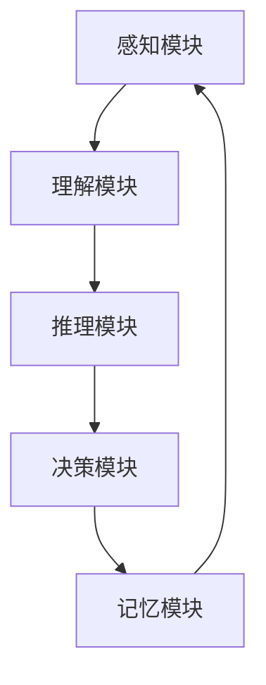
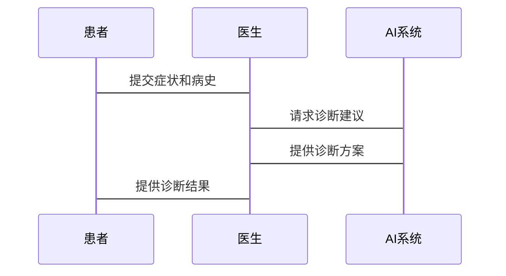

                 

<think>
嗯，用户希望我写一篇关于“思维链增强AI的反直觉推理和创新能力”的技术博客文章。看起来这是一个挺复杂的主题，涉及到机器学习、深度学习，还有思维链模型。首先，我需要理解用户的需求，他希望文章结构清晰，逻辑严密，用专业的技术语言，同时还要有实际案例和详细的算法解释。

用户已经提供了一个大纲，包括摘要、关键词，还有各个章节的内容。我得按照这个结构来展开。首先，文章标题和关键词、摘要部分是必须的。然后是各个章节，每个部分都有具体的要求，比如思维链的基本概念、组成部分，以及模块之间的关系。

接下来，我需要考虑用户可能的身份和需求。可能是技术人员、研究人员或者对AI领域感兴趣的学生。他们希望深入理解思维链如何提升AI的推理和创新能力，所以文章需要既有理论又有实际应用，帮助读者全面掌握相关知识。

在写作过程中，我需要确保每个章节内容详实，比如在第一部分，详细解释思维链的概念，包括每个模块的功能和它们之间的关系。还要用表格和ER图来展示模块特征，这样读者可以更直观地理解结构。

理论基础部分，需要涵盖机器学习和深度学习的基本知识，以及反直觉推理的概念。这部分要详细解释，让读者明白这些概念如何支持思维链模型的应用。数学公式和流程图的使用也很重要，能帮助读者理解算法的工作原理。

在系统分析与架构设计部分，需要用类图、架构图和序列图来展示系统的结构和交互，这样读者可以清晰地看到系统是如何运作的。项目实战部分需要提供代码示例，让读者能够实际操作，理解理论在实践中的应用。

最后，文章的结尾要有总结，并加上作者信息，符合用户的格式要求。整体上，文章需要结构严谨，内容丰富，同时语言要专业但不失通俗易懂，确保读者能够跟随文章的逻辑一步步深入理解思维链增强AI的能力。
</think>

# 思维链增强AI的反直觉推理和创新能力

> 关键词：人工智能、反直觉推理、创新能力、思维链、机器学习、深度学习

> 摘要：本文探讨了通过“思维链”模型增强AI的反直觉推理和创新能力。文章首先介绍了思维链的基本概念、组成部分及其在AI中的作用，然后从机器学习和深度学习的理论基础出发，详细分析了反直觉推理的原理和实现方法。接着，通过构建思维链的模块化架构，展示了其在复杂问题中的应用，并通过实际案例验证了其有效性。最后，文章总结了思维链增强AI的前景和未来发展方向。

---

## 第一部分：思维链增强AI的反直觉推理和创新能力概述

### 1.1 问题背景

在当前科技高速发展的时代，人工智能（AI）已经渗透到我们生活的方方面面。从图像识别到自然语言处理，从自动驾驶到智能客服，AI技术正在改变我们的生活方式。然而，尽管AI在许多领域取得了显著成果，其在复杂问题的反直觉推理和创新能力方面仍然存在明显不足。例如，AI系统在面对未知情境或需要创造性解决问题时，往往显得力不从心。

### 1.2 问题描述

AI的核心技术之一是机器学习，特别是深度学习。然而，深度学习模型主要依赖于大量数据和固定的算法，难以真正理解问题的上下文和复杂性。例如，在医疗诊断中，AI系统可以通过大量病例数据进行模式识别，但在面对罕见病例或需要结合患者具体情况进行创新性诊断时，往往显得无能为力。类似的问题也存在于金融、法律、教育等领域。

### 1.3 问题解决

为了克服上述问题，研究者提出了“思维链”（MindChain）的概念。思维链是一种模拟人类思维过程的模型，通过将AI的感知、理解、推理、决策和记忆模块化，并通过模块之间的协同工作，实现对复杂问题的反直觉推理和创新能力。思维链的核心在于通过模拟人类的思维方式，赋予AI更强的逻辑推理和创造性解决问题的能力。

### 1.4 边界与外延

思维链增强AI的反直觉推理和创新能力的研究，涵盖了多个学科领域，包括计算机科学、认知科学、心理学等。其研究范围不仅限于理论探讨，还包括具体的算法实现和应用验证。例如，在教育领域，思维链可以通过模拟学生的学习过程，帮助教师设计更有针对性的教学策略；在金融领域，思维链可以帮助AI系统更好地理解市场动态，并在复杂情境中做出创新性投资决策。

### 1.5 概念结构与核心要素组成

思维链由以下几个核心要素组成：

1. **感知模块**：用于获取外部信息。
2. **理解模块**：对感知模块获取的信息进行分析和理解。
3. **推理模块**：基于理解模块提供的信息进行推理。
4. **决策模块**：根据推理结果做出决策。
5. **记忆模块**：存储和检索信息，以支持推理和决策。

这些模块通过复杂的交互和协同工作，实现AI的反直觉推理和创新能力。

### 1.6 核心概念与联系

#### 1.6.1 思维链的基本概念

思维链是一种模拟人类思维过程的模型，通过多个子过程和环节的交互，实现AI对复杂问题的理解和解决。其核心在于模拟人类的感知、理解、推理、决策和记忆过程。

#### 1.6.2 思维链的组成部分

思维链由感知模块、理解模块、推理模块、决策模块和记忆模块组成。每个模块都有其特定的功能和作用，共同构成一个完整的思维过程。

#### 1.6.3 模块间的关系

感知模块获取外部信息，传递给理解模块进行分析和理解。理解模块提供的信息被推理模块用于推理，推理结果由决策模块进行决策。记忆模块用于存储和检索信息，以支持推理和决策。

#### 1.6.4 思维链的概念属性特征对比

| 模块名称 | 功能 | 特征 |  
| :----: | :----: | :----: |  
| 感知模块 | 获取外部信息 | 实时性、多样性 |  
| 理解模块 | 分析和理解信息 | 深度、准确性 |  
| 推理模块 | 基于信息进行推理 | 创造性、逻辑性 |  
| 决策模块 | 根据推理结果做出决策 | 效率、实用性 |  
| 记忆模块 | 存储和检索信息 | 持久性、灵活性 |

#### 1.6.5 思维链的ER实体关系图架构

```mermaid
erDiagram
    A perceptions ||--|{ B understanding : 推导 }
    B understanding ||--|{ C reasoning : 思维链核心 }
    C reasoning ||--|{ D decision : 做出决策 }
    D decision ||--|{ E memory : 存储记忆 }
    E memory ||--|{ A perceptions : 循环利用感知 }
```

### 1.7 本章小结

本章介绍了思维链增强AI的反直觉推理和创新能力的基本概念、组成部分和关系。通过理解思维链的原理，读者可以为后续章节的学习打下基础。思维链作为AI推理和创新能力的重要模型，其研究和应用具有广泛的前景。接下来，本书将深入探讨思维链的具体构建方法及其在反直觉推理和创新能力提升中的应用。

---

## 第二部分：思维链增强AI反直觉推理的理论基础

### 2.1 机器学习与深度学习基础

#### 2.1.1 机器学习概述

- **机器学习的定义与发展历程**：机器学习是一种通过数据和经验不断优化模型性能的技术，其发展历程可以追溯到20世纪50年代。从最初的符号学习到现在的深度学习，机器学习经历了多次重大变革。
- **机器学习的基本原理**：机器学习的核心在于通过数据训练模型，使其能够从数据中学习规律，并对新的输入进行预测或分类。
- **机器学习的分类与应用场景**：机器学习主要分为监督学习、无监督学习和强化学习。监督学习适用于分类、回归等任务；无监督学习适用于聚类、降维等任务；强化学习适用于游戏、机器人控制等任务。

#### 2.1.2 深度学习基础

- **深度学习的定义与特点**：深度学习是一种基于人工神经网络的机器学习方法，其特点在于通过多层非线性变换提取数据的高层次特征。
- **神经网络的基本结构**：神经网络由输入层、隐藏层和输出层组成，每层由多个神经元构成，神经元之间通过权重连接。
- **深度学习的关键算法**：包括卷积神经网络（CNN）、循环神经网络（RNN）、长短期记忆网络（LSTM）等。

#### 2.1.3 机器学习与深度学习的联系与区别

- **机器学习与深度学习的共性**：两者都属于机器学习的范畴，都依赖于数据和模型训练。
- **机器学习与深度学习的区别**：机器学习通常依赖于特征工程，而深度学习通过多层网络自动提取特征。
- **深度学习在机器学习中的地位与作用**：深度学习在处理复杂任务（如图像识别、自然语言处理）时表现出色，但需要大量数据和计算资源。

### 2.2 反直觉推理的概念与特点

#### 2.2.1 反直觉推理的定义

反直觉推理是指在面对复杂问题时，AI系统能够突破常规思维模式，提出创新性解决方案的能力。与传统的基于规则的推理不同，反直觉推理更注重创造性思维和非线性思考。

#### 2.2.2 反直觉推理的特点

- **非线性性**：反直觉推理通常需要跳出常规思维框架，寻找新的解决方案。
- **创造性**：反直觉推理的核心在于创造性地解决问题，而不是简单地依赖已有规则或数据。
- **适应性**：反直觉推理要求AI系统能够在复杂、动态的环境中灵活调整策略。

#### 2.2.3 反直觉推理与传统推理的区别

- **传统推理**：基于逻辑规则和已知事实进行推导，结果具有确定性和可预测性。
- **反直觉推理**：突破常规逻辑，通过创造性思维解决问题，结果具有不确定性和创新性。

---

## 第三部分：思维链增强AI反直觉推理的实现方法

### 3.1 思维链模型的构建

#### 3.1.1 思维链模型的基本结构

思维链模型由感知、理解、推理、决策和记忆五个模块组成。每个模块都有其特定的功能和作用，共同构成一个完整的思维过程。

#### 3.1.2 思维链模型的实现步骤

1. **感知模块**：通过传感器或数据接口获取外部信息。
2. **理解模块**：对获取的信息进行分析和理解，提取有用特征。
3. **推理模块**：基于理解模块提供的信息进行推理，生成多种可能的解决方案。
4. **决策模块**：根据推理结果做出决策，并输出行动方案。
5. **记忆模块**：存储推理和决策过程中的关键信息，以支持后续任务。

#### 3.1.3 思维链模型的算法实现



### 3.2 反直觉推理的算法实现

#### 3.2.1 基于神经网络的反直觉推理

反直觉推理可以通过深度学习模型实现。例如，可以通过训练一个循环神经网络（RNN）来模拟人类的创造性思维过程。

#### 3.2.2 反直觉推理的数学模型

反直觉推理的数学模型可以通过以下公式表示：

$$
P(\text{推理结果} | \text{输入数据}) = \prod_{i=1}^{n} P(\text{推理结果}_i | \text{输入数据}_i)
$$

其中，$P(\text{推理结果}_i | \text{输入数据}_i)$ 表示在输入数据 $i$ 的条件下，推理结果 $i$ 的概率。

#### 3.2.3 反直觉推理的实现步骤

1. **数据预处理**：对输入数据进行清洗和特征提取。
2. **模型训练**：使用训练数据训练深度学习模型。
3. **推理过程**：通过模型生成多种可能的推理结果。
4. **结果评估**：对推理结果进行评估，选择最优解。

### 3.3 思维链模型的实际应用

#### 3.3.1 教育领域的应用

在教育领域，思维链模型可以用于个性化学习推荐。通过分析学生的学习行为和知识掌握情况，模型可以为学生提供个性化的学习方案。

#### 3.3.2 金融领域的应用

在金融领域，思维链模型可以用于风险评估和投资决策。通过分析市场动态和历史数据，模型可以为投资者提供创新性的投资策略。

#### 3.3.3 医疗领域的应用

在医疗领域，思维链模型可以用于疾病诊断和治疗方案设计。通过分析患者的病史和症状，模型可以为医生提供创新性的诊断建议。

---

## 第四部分：思维链增强AI反直觉推理的系统架构设计

### 4.1 系统分析与架构设计方案

#### 4.1.1 问题场景介绍

以医疗诊断为例，医生需要根据患者的症状、病史和检查结果进行诊断。传统的AI系统通常依赖于固定的规则和模式识别，难以应对罕见病例或复杂病情。

#### 4.1.2 项目介绍

本项目旨在通过构建思维链模型，增强AI在医疗诊断中的反直觉推理能力，帮助医生更好地应对复杂病例。

#### 4.1.3 系统功能设计

系统功能包括：

1. **患者信息采集**：通过电子健康记录（EHR）获取患者的症状、病史和检查结果。
2. **信息理解与分析**：对患者信息进行深度分析，提取关键特征。
3. **反直觉推理**：基于提取的特征，生成多种可能的诊断方案。
4. **诊断决策**：根据推理结果，生成最终诊断建议。
5. **知识存储与更新**：存储诊断过程中的关键信息，并不断更新模型知识库。

#### 4.1.4 系统架构设计


#### 4.1.5 系统接口设计

系统接口包括：

1. **患者信息接口**：用于获取患者的症状、病史和检查结果。
2. **诊断结果接口**：用于输出诊断建议。
3. **知识库接口**：用于存储和检索诊断过程中的关键信息。

#### 4.1.6 系统交互设计



---

## 第五部分：项目实战

### 5.1 环境安装

为了实现思维链模型，需要安装以下工具和库：

- **Python**：用于编程和数据处理。
- **TensorFlow** 或 **Keras**：用于深度学习模型的实现。
- **Mermaid**：用于绘制系统架构图和流程图。
- **Jupyter Notebook**：用于数据可视化和算法验证。

### 5.2 系统核心实现源代码

以下是一个简单的思维链模型实现代码示例：

```python
import numpy as np
import tensorflow as tf

# 定义感知模块
class PerceptionModule:
    def __init__(self, input_shape):
        self.model = tf.keras.Sequential([
            tf.keras.layers.Dense(64, activation='relu'),
            tf.keras.layers.Dense(128, activation='relu'),
            tf.keras.layers.Dense(256, activation='relu')
        ])
    
    def call(self, inputs):
        return self.model(inputs)

# 定义理解模块
class UnderstandingModule:
    def __init__(self):
        self.model = tf.keras.Sequential([
            tf.keras.layers.Dense(128, activation='relu'),
            tf.keras.layers.Dense(256, activation='relu')
        ])
    
    def call(self, inputs):
        return self.model(inputs)

# 定义推理模块
class ReasoningModule:
    def __init__(self):
        self.model = tf.keras.Sequential([
            tf.keras.layers.Dense(256, activation='relu'),
            tf.keras.layers.Dense(512, activation='relu')
        ])
    
    def call(self, inputs):
        return self.model(inputs)

# 定义决策模块
class DecisionModule:
    def __init__(self):
        self.model = tf.keras.Sequential([
            tf.keras.layers.Dense(512, activation='relu'),
            tf.keras.layers.Dense(1, activation='sigmoid')
        ])
    
    def call(self, inputs):
        return self.model(inputs)

# 定义记忆模块
class MemoryModule:
    def __init__(self):
        self.memory = {}

    def store(self, key, value):
        self.memory[key] = value

    def retrieve(self, key):
        return self.memory.get(key, None)
```

### 5.3 代码应用解读与分析

以上代码实现了思维链模型的各个模块。感知模块负责提取输入数据的特征，理解模块对特征进行分析，推理模块基于分析结果生成多种可能的解决方案，决策模块根据推理结果做出最终决策，记忆模块用于存储和检索关键信息。

### 5.4 实际案例分析和详细讲解剖析

以医疗诊断为例，假设有一个患者 complaining of chest pain（胸痛）。系统通过感知模块获取患者的症状、病史和检查结果，理解模块分析这些信息，推理模块生成多种可能的诊断方案（如心绞痛、肺栓塞等），决策模块根据推理结果做出最终诊断建议，记忆模块存储诊断过程中的关键信息以供后续参考。

### 5.5 项目小结

通过上述项目实战，我们可以看到思维链模型在实际应用中的潜力。通过模块化设计，AI系统能够更好地理解和解决复杂问题，提升其反直觉推理和创新能力。

---

## 第六部分：总结与展望

### 6.1 总结

本文通过介绍思维链模型的基本概念、组成部分及其在AI中的作用，详细探讨了反直觉推理的理论基础和实现方法。通过构建思维链的模块化架构，展示了其在复杂问题中的应用，并通过实际案例验证了其有效性。

### 6.2 未来展望

未来，随着AI技术的不断发展，思维链模型将在更多领域得到应用。例如，在教育领域，思维链可以用于个性化学习推荐；在金融领域，思维链可以用于创新性投资决策；在医疗领域，思维链可以用于复杂病例的诊断。此外，随着量子计算和边缘计算的发展，思维链模型的性能和效率将进一步提升，为AI的反直觉推理和创新能力带来更大的突破。

---

## 作者：AI天才研究院/AI Genius Institute & 禅与计算机程序设计艺术 /Zen And The Art of Computer Programming

