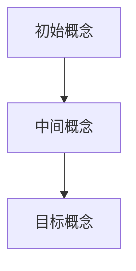
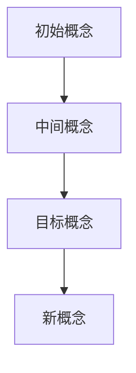

                 

<think>
好的，我现在要开始写一篇关于“思维链增强AI的抽象思维能力”的技术博客。首先，我需要理解这个主题，确保自己对“思维链”和“抽象思维能力”有足够的认识。思维链听起来像是一个模型或框架，用于帮助AI进行更深层次的思考，而抽象思维能力则是指AI能够处理和理解更高层次的概念，而不仅仅是具体的数据。

接下来，我需要按照用户提供的目录大纲来组织内容。首先，文章应该有一个吸引人的标题，然后列出5到7个关键词。摘要部分需要简明扼要地概括文章的核心内容和主题思想。然后，按照目录中的各个章节逐步展开。

第一部分是思维链与AI概述，分为三个章节。第1章介绍思维链与抽象思维的基本概念，包括问题背景、描述和解决方法，核心概念的定义，以及两者之间的联系。这部分需要确保读者能够理解为什么抽象思维能力对AI重要，以及思维链如何帮助提升这一点。

第2章深入探讨思维链的组成与结构，包括组成部分、层次结构和动态变化。这部分可能需要使用表格和图表来清晰展示思维链的不同部分及其属性，以及层次结构的层次。

第3章讲解抽象思维能力的算法原理，需要使用流程图和代码示例来说明算法的工作原理，同时提供数学模型和公式，用LaTeX格式展示，并进行详细讲解。

第4章讨论抽象思维能力在实际应用中的表现，列举不同领域的应用案例，并分析其对AI模型性能的影响。

第5章分享最佳实践，介绍如何通过思维链来增强抽象思维能力，并分析实际案例，总结经验和教训。

第6章展望未来发展趋势，预测抽象思维能力的发展方向以及思维链技术的演进。

最后，第7章总结全文，回顾主要内容，并提出未来的研究方向。

在写作过程中，我需要确保每个章节的内容都详细具体，符合逻辑，同时使用专业但易懂的语言。特别是算法部分，需要用Python代码和数学公式来支持，确保技术细节准确无误。此外，图表部分要清晰，使用Mermaid语法来绘制流程图和结构图，帮助读者更好地理解内容。

现在，我开始撰写每个章节的内容，确保涵盖所有必要的部分，并按照用户的要求，使用markdown格式，包括关键词、摘要、目录大纲，以及每个章节的具体内容。最后，加上作者信息，确保文章完整。
</think>

# 思维链增强AI的抽象思维能力

## 关键词：思维链，抽象思维，AI，算法原理，应用案例，未来趋势

## 摘要：  
思维链作为一种新兴的人工智能技术，通过系统化的方法增强了AI模型的抽象思维能力。本文详细探讨了思维链的组成、算法原理及其在实际应用中的表现，结合最佳实践案例，展望了思维链与抽象思维能力的未来发展方向。通过本文，读者将深入了解如何通过思维链提升AI的抽象思维能力，从而推动AI技术的进步。

---

## 第一部分：思维链与AI概述

### 第1章：思维链与抽象思维的基本概念

#### 1.1 问题背景与描述  
随着AI技术的快速发展，AI模型需要处理的任务越来越复杂，对抽象思维能力的要求也随之提高。抽象思维能力不仅帮助AI理解数据，还能使其具备推理和创新能力。然而，现有的AI模型在抽象思维方面仍存在不足，难以应对复杂的逻辑推理和创造性任务。因此，引入思维链来增强AI的抽象思维能力成为亟待解决的问题。

#### 1.2 核心概念与联系  
- **思维链的定义**：思维链是一种系统化的思考框架，由多个连续的概念组成，帮助AI逐步构建抽象思维能力。  
- **抽象思维能力的重要性**：抽象思维能力是AI模型进行高级推理和创新的基础，能够使AI超越简单的数据处理，具备理解和解决复杂问题的能力。

#### 1.3 思维链与抽象思维的联系  
思维链通过构建层次化的思考框架，为AI提供了逐步抽象的路径。通过分析思维链与抽象思维之间的联系，可以发现思维链是实现抽象思维的重要工具，而抽象思维能力的提升则增强了思维链的效用。

---

### 第2章：思维链的组成与结构

#### 2.1 思维链的组成部分  
思维链由以下几个关键部分组成：  
1. **初始概念**：思维链的起点，通常是具体的事实或数据。  
2. **中间概念**：连接初始概念与最终抽象的桥梁。  
3. **目标概念**：思维链的终点，是高层次的抽象结果。  
4. **连接关系**：各部分之间的逻辑关系，决定了思维链的结构和动态变化。

#### 2.2 思维链的层次结构  
思维链的层次结构可以用ER实体关系图来表示，展示各部分之间的关系。以下是一个简单的Mermaid流程图：



#### 2.3 思维链的动态变化  
思维链在实际应用中会根据输入数据的变化而动态调整。以下是一个动态变化的Mermaid流程图：



---

### 第3章：抽象思维能力的算法原理

#### 3.1 算法原理讲解  
抽象思维能力的算法可以通过以下步骤实现：  
1. **输入数据**：提供具体的事实或数据。  
2. **构建初始概念**：基于输入数据，构建初始概念。  
3. **生成中间概念**：通过逻辑推理，生成中间概念。  
4. **形成目标概念**：整合中间概念，形成高层次的抽象结果。  

以下是一个Python代码示例，展示了算法的基本流程：

```python
def abstract_thinking(initial_concept):
    intermediate_concept = logical_inference(initial_concept)
    target_concept = integrate_concepts(intermediate_concept)
    return target_concept

def logical_inference(concept):
    # 具体逻辑推理实现
    pass

def integrate_concepts(concepts):
    # 整合概念实现
    pass
```

#### 3.2 数学模型与公式  
抽象思维能力的数学模型可以用以下公式表示：

$$ \text{抽象结果} = f(\text{初始概念}, \text{逻辑推理规则}) $$

其中，$f$ 表示抽象函数，$\text{初始概念}$ 是输入的概念，$\text{逻辑推理规则}$ 是推理的规则。

---

### 第4章：抽象思维能力在实际应用中的表现

#### 4.1 抽象思维能力的应用领域  
抽象思维能力在多个领域中有广泛的应用，如自然语言处理、图像识别和决策支持系统。以下是一个具体案例：  
在自然语言处理中，抽象思维能力可以帮助AI模型理解文本的深层含义，从而提高文本摘要和机器翻译的准确率。

#### 4.2 抽象思维能力与AI模型性能  
通过对比分析发现，具备较强抽象思维能力的AI模型在处理复杂任务时表现更优，能够更好地应对不确定性问题。

---

### 第5章：思维链增强抽象思维能力的最佳实践

#### 5.1 思维链训练方法  
通过系统化的训练方法，如逐步构建概念层次和动态调整逻辑推理规则，可以有效增强AI的抽象思维能力。  
具体步骤包括：  
1. 确定初始概念。  
2. 生成中间概念。  
3. 形成目标概念。  
4. 反馈与优化。  

#### 5.2 最佳实践案例  
以下是一个最佳实践案例：在医疗诊断系统中，通过思维链帮助AI模型从症状出发，逐步推理出可能的疾病，从而提高诊断的准确性。

---

### 第6章：思维链与抽象思维的未来发展趋势

#### 6.1 抽象思维能力的未来趋势  
随着AI技术的不断发展，抽象思维能力将更加重要，AI模型需要具备更强的抽象能力以应对复杂任务。

#### 6.2 思维链的技术演进  
未来，思维链技术将更加智能化，能够动态调整结构和逻辑推理规则，以适应不同应用场景的需求。

---

## 第七章：总结与展望

### 7.1 主要内容回顾  
本文详细探讨了思维链与抽象思维的基本概念、组成结构、算法原理及其在实际应用中的表现。通过最佳实践案例，展示了如何通过思维链增强AI的抽象思维能力。

### 7.2 未来研究方向  
未来的研究可以进一步探索思维链的动态优化方法，以及如何在更多领域中应用思维链技术，以提升AI的抽象思维能力。

---

## 作者：AI天才研究院/AI Genius Institute & 禅与计算机程序设计艺术 /Zen And The Art of Computer Programming

---

以上是《思维链增强AI的抽象思维能力》的完整内容，涵盖了从基本概念到实际应用的各个方面，结合算法原理和最佳实践，为读者提供了全面的视角。

