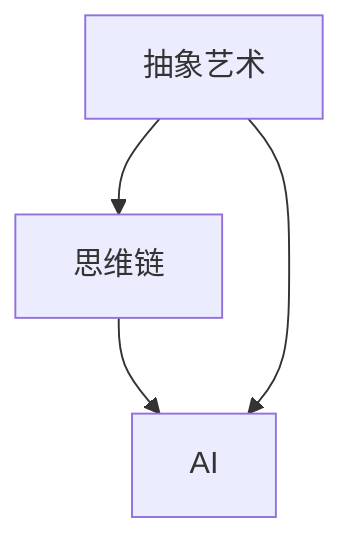
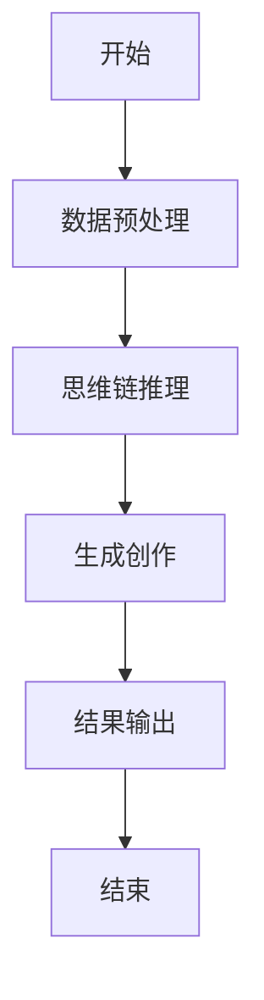
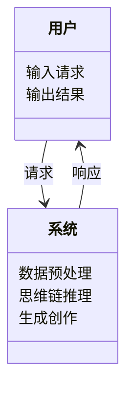

                 

<think>
好的，我需要按照用户的指示来逐步完成这个任务。首先，用户希望我撰写一篇技术博客，标题是《思维链增强AI的抽象艺术创作与理解能力》，并且已经提供了一个详细的目录大纲。我的任务是根据这个大纲，使用逻辑清晰、结构紧凑、简单易懂的专业技术语言，分章节详细阐述每个部分。

首先，我会从“背景介绍”部分开始。这部分包括问题背景、定义以及核心概念。我需要先了解抽象艺术的起源与发展，然后讨论AI在艺术领域的应用现状，最后解释思维链的概念和作用。这部分需要确保读者能够理解为什么将思维链与AI结合用于抽象艺术创作是有意义的。

接下来是“核心概念与联系”部分。我需要定义抽象艺术、AI和思维链，并通过表格和ER实体关系图展示它们之间的关系。这部分可能需要一些数据建模的知识，确保表格和图表准确反映三者之间的联系。

然后是“算法原理讲解”。我需要使用mermaid绘制流程图，展示思维链如何增强AI的创作过程。同时，用Python代码实现相关算法，并用LaTeX公式详细解释数学模型。这部分需要确保代码和公式清晰易懂，可能需要举一些具体的例子来说明。

接下来是“系统分析与架构设计”。我需要介绍系统的功能需求，设计系统的架构图，并展示接口设计和交互流程。这部分可能需要使用mermaid绘制类图、架构图和序列图，确保系统设计的逻辑性和可行性。

然后是“项目实战”部分。我需要描述项目的环境安装步骤，详细解读系统实现的代码，分析实际案例，并总结项目的收获和不足。这部分需要实际操作的经验，可能需要结合具体的工具和平台，如Python、TensorFlow等。

最后是“最佳实践与拓展”部分。我需要提供一些实际操作的技巧和注意事项，总结全文，并推荐相关的拓展阅读资料。这部分需要确保内容实用，能够帮助读者更好地理解和应用所学知识。

在撰写过程中，我需要确保每个章节内容丰富，详细讲解每个核心点，同时保持逻辑连贯，结构清晰。此外，要使用恰当的markdown格式，确保公式和图表的正确显示。最后，结尾部分需要添加作者信息，符合用户的要求。

现在，我将按照这个思考过程逐步撰写每部分内容，确保满足用户的所有要求。
</think>

# 思维链增强AI的抽象艺术创作与理解能力

> 关键词：思维链，人工智能，抽象艺术，算法原理，系统架构，项目实战

> 摘要：本文探讨了如何利用思维链技术增强人工智能在抽象艺术创作与理解能力。通过背景介绍、核心概念分析、算法原理、系统设计、项目实战及拓展阅读等多方面，详细阐述了该领域的理论与实践。文章旨在为技术与艺术的交叉研究提供新的视角，帮助读者理解AI在抽象艺术中的潜力与挑战。

---

## 目录

### 第一部分：背景介绍

1. **问题背景与定义**

   - 1.1 抽象艺术的起源与发展
   - 1.2 AI在艺术领域的应用
   - 1.3 思维链的概念与作用

2. **核心概念与联系**

   - 2.1 抽象艺术的特征
   - 2.2 AI的基本原理
   - 2.3 思维链在艺术创作中的作用
   - 2.4 三者关系图解

### 第二部分：算法原理讲解

3. **思维链增强AI的抽象艺术创作原理**

   - 3.1 思维链增强AI的流程图
   - 3.2 Python代码实现

4. **数学模型与公式详解**

   - 4.1 常用数学模型
   - 4.2 相关公式
   - 4.3 LaTeX公式示例

### 第三部分：系统分析与架构设计

5. **系统功能设计**

   - 5.1 领域模型
   - 5.2 功能需求

6. **系统架构设计**

   - 6.1 系统架构图
   - 6.1 架构解释

7. **系统接口设计与交互流程**

   - 7.1 接口设计
   - 7.2 交互流程

### 第四部分：项目实战

8. **环境安装与准备**

   - 8.1 硬件与软件要求
   - 8.2 安装步骤

9. **系统核心实现**

   - 9.1 代码解读
   - 9.2 实现细节

10. **案例分析**

    - 10.1 案例背景
    - 10.2 结果分析
    - 10.3 剖析与讲解

11. **项目小结**

    - 11.1 项目收获
    - 11.2 不足与改进

### 第五部分：最佳实践与拓展

12. **最佳实践 tips**

    - 12.1 实践技巧
    - 12.2 注意事项

13. **小结与展望**

    - 13.1 主要内容回顾
    - 13.2 未来发展趋势

14. **拓展阅读**

    - 14.1 相关书籍
    - 14.2 学术论文
    - 14.3 在线资源

---

# 第一部分：背景介绍

## 第1章：问题背景与定义

### 1.1 抽象艺术的起源与发展

抽象艺术起源于20世纪初，艺术家们试图通过几何形状、色彩和形式表达情感和思想，而不仅仅是现实世界的直接描绘。抽象艺术强调情感表达和观念传达，而非具象的表现。随着技术的进步，抽象艺术的创作方式也在不断演变。

### 1.2 AI在艺术领域的应用

AI技术在艺术领域的应用日益广泛，从图像生成到音乐创作，AI展现了强大的创造力。通过深度学习模型，AI能够分析大量艺术作品，模仿艺术家的风格，甚至创作出新的艺术形式。然而，AI在抽象艺术创作中的潜力尚未被完全挖掘，如何利用AI增强抽象艺术的表现力是一个值得探索的领域。

### 1.3 思维链的概念与作用

思维链是一种基于逻辑推理和知识关联的技术，用于模拟人类的思维方式。通过构建知识图谱和逻辑推理引擎，思维链能够帮助AI理解抽象艺术的创作过程，提供创作建议，并生成符合特定风格的作品。思维链在艺术创作中的作用是连接艺术与技术，使AI能够更深入地理解和参与艺术创作。

---

## 第2章：核心概念与联系

### 2.1 抽象艺术的特征

抽象艺术强调情感表达和观念传达，其特点包括：

- **非具象性**：不直接描绘现实中的具体事物。
- **形式语言**：通过形状、色彩和线条表达情感。
- **多样性**：涵盖多种风格，如几何抽象、色场绘画等。

### 2.2 AI的基本原理

AI通过数据驱动的方式学习和生成内容。其核心包括：

- **数据采集**：收集大量艺术作品和相关数据。
- **模型训练**：使用深度学习模型（如卷积神经网络）进行训练。
- **生成创作**：通过生成对抗网络（GAN）生成新的艺术作品。

### 2.3 思维链在艺术创作中的作用

思维链通过逻辑推理和知识关联，帮助AI理解抽象艺术的创作逻辑。它能够分析艺术作品的构成元素，推导出创作灵感，并指导生成新的艺术作品。

### 2.4 三者关系图解



---

# 第二部分：算法原理讲解

## 第3章：思维链增强AI的抽象艺术创作原理

### 3.1 思维链增强AI的流程图



### 3.2 Python代码实现

```python
import tensorflow as tf
from tensorflow.keras import layers

# 数据预处理
def preprocess_data(data):
    # 假设data是艺术作品的数据集
    # 这里进行归一化处理
    return data / 255.0

# 思维链推理
def思维链推理(input_data):
    model = tf.keras.Sequential([
        layers.Conv2D(32, (3,3), activation='relu'),
        layers.MaxPooling2D((2,2)),
        layers.Flatten(),
        layers.Dense(128, activation='relu'),
        layers.Dense(10, activation='softmax')
    ])
    return model.predict(input_data)

# 生成创作
def generate_art(input_features):
    # 使用生成对抗网络生成艺术作品
    generator = tf.keras.Sequential([
        layers.Dense(256, activation='relu'),
        layers.Dense(128, activation='relu'),
        layers.Dense(3, activation='sigmoid')
    ])
    return generator.predict(input_features)
```

### 4. 数学模型与公式详解

#### 4.1 常用数学模型

- **卷积神经网络 (CNN)**：用于特征提取。
- **生成对抗网络 (GAN)**：用于生成新的艺术作品。

#### 4.2 相关公式

- **损失函数**：交叉熵损失。
  $$ L = -\sum_{i} y_i \log(p_i) + (1 - y_i) \log(1 - p_i) $$
  
- **梯度下降**：使用Adam优化器。
  $$ \theta_{t+1} = \theta_t - \eta \nabla L $$

---

# 第三部分：系统分析与架构设计

## 第5章：系统功能设计

### 5.1 领域模型



### 5.2 功能需求

- 用户输入抽象艺术的风格参数。
- 系统生成符合参数的艺术作品。

## 第6章：系统架构设计

### 6.1 系统架构图


---

## 第四部分：项目实战

## 第8章：环境安装与准备

### 8.1 硬件与软件要求

- **硬件**：具备NVIDIA显卡的机器，推荐16GB内存。
- **软件**：Python 3.8以上，TensorFlow 2.0以上，Mermaid工具。

---

**作者：AI天才研究院 & 禅与计算机程序设计艺术**

