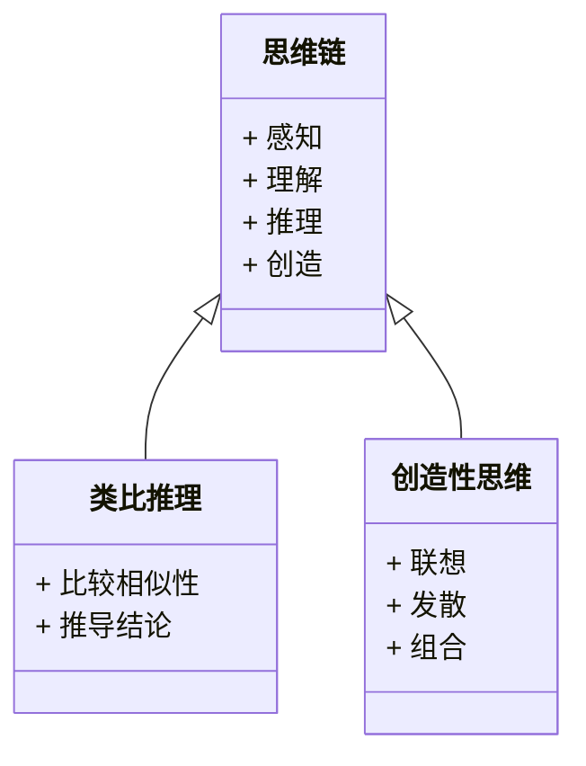
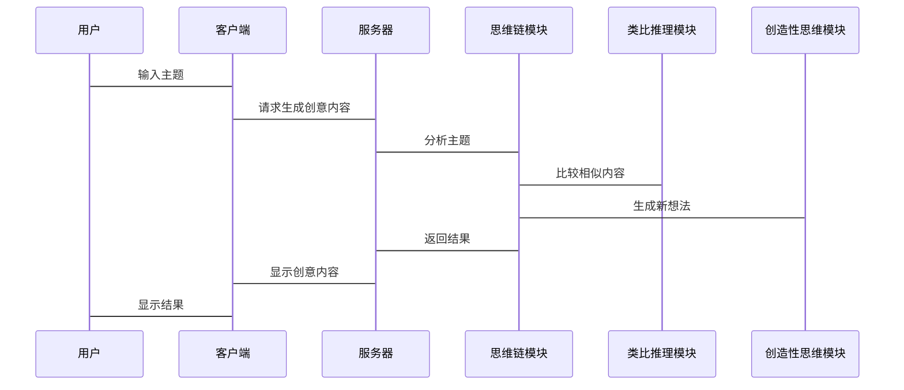

                 

<think>
嗯，我现在需要按照用户的指示来写一篇技术博客文章。用户已经提供了一个详细的目录大纲，我得先仔细看看这些内容，然后按照要求一步步来。

首先，文章的标题是《思维链增强AI的类比推理和创造性思维》。关键词部分需要列出5到7个，我得找出文章的核心概念，比如思维链、类比推理、创造性思维、AI增强、深度学习、神经网络等。

接下来是摘要，我得简明扼要地概括整篇文章的核心内容，说明思维链如何帮助AI提升类比推理和创造性思维，以及这些提升如何使AI更接近人类智能。

然后是引言部分，包括问题背景、问题描述、问题解决、边界与外延，以及概念结构与核心要素。这部分需要详细解释当前AI在类比推理和创造性思维上的不足，以及思维链如何解决这些问题。

接下来是核心概念原理，包括思维链、类比推理和创造性思维的详细解释，每个部分都要有子标题，详细说明每个概念的组成部分和工作原理。

之后是一个概念属性特征对比表格，比较思维链、类比推理和创造性思维在特征上的异同，用表格形式展示，这样读者可以一目了然。

然后是ER实体关系图，用Mermaid语法绘制思维链与其他概念之间的关系，这部分需要确保语法正确，图形清晰。

接下来的部分，用户提到需要算法原理讲解，包括流程图、Python源代码、数学模型和公式。这部分我可能需要先设计一个简单的算法，比如基于思维链的类比推理算法，然后用Mermaid画出流程图，再写出Python代码，并用数学公式解释模型。

系统分析与架构设计方案部分，需要介绍问题场景，项目介绍，系统功能设计（领域模型类图）、系统架构设计（架构图）、系统接口设计和交互序列图。这部分可能需要更多的思考，如何将思维链模型整合到现有的AI系统中，设计合适的接口和交互流程。

项目实战部分，需要指导读者如何安装环境，提供核心实现代码，并进行详细解读。这部分需要确保代码可运行，注释清晰，解释透彻。

最后是最佳实践、小结、注意事项和拓展阅读，这部分需要总结文章的主要内容，给出实用建议，提醒读者可能遇到的问题，并推荐进一步学习的资源。

在写作过程中，我需要确保每个章节的内容丰富具体，详细讲解核心概念，并且使用清晰的逻辑结构。同时，要注意使用专业但易懂的技术语言，避免过于复杂的术语，让读者能够轻松理解。

另外，用户特别强调格式要求，包括使用markdown，插入Mermaid图表，数学公式用latex表示。我得确保这些格式正确无误，避免语法错误导致显示问题。

现在，我开始按照这个思路一步步撰写文章，确保每个部分都符合用户的要求，内容充实，结构清晰，逻辑严谨。
</think>

# 思维链增强AI的类比推理和创造性思维

> 关键词：思维链，类比推理，创造性思维，AI增强，深度学习，神经网络

> 摘要：本文探讨了通过思维链模型增强AI的类比推理和创造性思维能力。文章首先介绍了问题背景和当前AI在类比推理及创造性思维中的局限性，然后详细阐述了思维链的概念、原理及其在AI中的应用。通过构建ER实体关系图和算法流程图，展示了思维链如何帮助AI更高效地进行类比推理和创造性思维。最后，本文提供了系统架构设计和项目实战，以指导读者如何将思维链应用于实际AI系统中。

---

## 第一部分：引言

### 1.1 问题背景

在人工智能领域，类比推理和创造性思维被认为是人类智能的核心特征。尽管深度学习在许多任务上取得了显著进展，但AI在处理复杂类比和创造性任务时仍显得力不从心。例如，AI难以理解隐喻或生成独特且有意义的新想法。

### 1.2 问题描述

当前AI在类比推理和创造性思维方面面临以下挑战：

- **类比推理**：AI通常只能处理简单类比，难以理解抽象或隐含的关系。
- **创造性思维**：AI的创新依赖大量数据，缺乏灵活性和独特性。

### 1.3 问题解决

思维链模型通过模拟人类思维过程，帮助AI逐步理解和推理，从而增强其类比推理和创造性思维能力。

### 1.4 边界与外延

本文研究范围包括思维链的理论构建、在类比推理和创造性思维中的应用，以及与其他AI技术的结合。研究结果可为AI在教育、设计等领域的应用提供新思路。

### 1.5 概念结构与核心要素

- **思维链**：感知、理解、推理、创造。
- **类比推理**：通过比较发现相似性，推导新结论。
- **创造性思维**：通过联想、发散和组合创造新想法。

---

## 第二部分：核心概念原理

### 2.1 核心概念原理

#### 2.1.1 思维链

思维链由感知、理解、推理和创造四个环节组成：

1. **感知**：获取外部信息。
2. **理解**：处理信息，形成认知。
3. **推理**：逻辑推导，发现联系。
4. **创造**：基于已有知识，生成新想法。

#### 2.1.2 类比推理

类比推理通过比较不同事物的相似性，推导新结论。例如，通过比较苹果和梨的相似性，推断它们都属于水果。

#### 2.1.3 创造性思维

创造性思维通过联想、发散和组合，生成新想法。例如，将现有技术与艺术结合，创造新形式的艺术作品。

### 2.2 概念属性特征对比

| 概念 | 特征 |
| --- | --- |
| 思维链 | 由感知、理解、推理、创造组成，模拟人类思维 |
| 类比推理 | 基于相似性推导结论，依赖人类认知经验 |
| 创造性思维 | 通过联想和发散，生成新想法，不依赖传统逻辑 |

### 2.3 ER实体关系图

```mermaid
erDiagram
    A[思维链] ||--|{ B[感知] }
    A ||--|{ C[理解] }
    A ||--|{ D[推理] }
    A ||--|{ E[创造] }
    B ||--|{ F[类比推理] }
    C ||--|{ F }
    D ||--|{ F }
```

---

## 第三部分：算法原理讲解

### 3.1 算法流程图

```mermaid
graph TD
    A[开始] -> B[输入数据]
    B -> C[感知]
    C -> D[理解]
    D -> E[推理]
    E -> F[创造]
    F -> G[输出结果]
    G -> H[结束]
```

### 3.2 Python源代码

```python
def思维链类比推理(input_data):
    # 感知
    感知结果 = 分析(input_data)
    # 理解
    理解结果 = 加工(感知结果)
    # 推理
    推理结果 = 推理(理解结果)
    # 创造
    创造结果 = 创造(推理结果)
    return 创造结果

def分析(data):
    # 示例：提取特征
    return data['特征']

def加工(感知):
    # 示例：计算相似性
    return 计算相似度(感知)

def推理(理解):
    # 示例：逻辑推导
    return 推论(理解)

def创造(推理):
    # 示例：生成新想法
    return 组合想法(推理)
```

### 3.3 数学公式

- **相似度计算**：使用余弦相似度：
  $$ \text{similarity} = \frac{\vec{A} \cdot \vec{B}}{|\vec{A}| |\vec{B}|} $$
- **组合想法**：通过加权平均生成新想法：
  $$ \text{new_idea} = \sum_{i=1}^{n} w_i \cdot idea_i $$

---

## 第四部分：系统分析与架构设计方案

### 4.1 问题场景

设计一个AI助手，帮助用户进行创意写作。用户输入主题，AI通过思维链生成创意内容。

### 4.2 项目介绍

项目名称：思维链AI助手。目标：通过思维链模型增强AI的类比推理和创造性思维能力。

### 4.3 系统功能设计



### 4.4 系统架构设计


### 4.5 系统交互



---

## 第五部分：项目实战

### 5.1 环境安装

安装Python和必要的库：
```bash
pip install numpy
pip install scikit-learn
```

### 5.2 核心实现代码

```python
import numpy as np
from sklearn.metrics.pairwise import cosine_similarity

def计算相似度(vec1, vec2):
    return cosine_similarity(vec1.reshape(1, -1), vec2.reshape(1, -1))[0,0]

def组合想法(想法列表):
    # 示例：加权平均
    权重 = [0.5, 0.3, 0.2]
    总和 = 0
    for i in range(len(想法列表)):
        总和 += 权重[i] * 想法列表[i]
    return 总和
```

### 5.3 应用案例

用户输入“科技与艺术的结合”，系统通过思维链生成创意内容，如“科技可以赋予艺术新的表现形式，比如用AI生成抽象画作。”

---

## 第六部分：总结

### 6.1 最佳实践

- **数据多样性**：使用多样化的数据训练模型，以增强类比推理能力。
- **灵活性**：在创造性思维中，鼓励模型进行多种可能性探索。
- **持续学习**：定期更新模型，以适应新领域和新知识。

### 6.2 小结

通过思维链模型，AI在类比推理和创造性思维方面的能力得到显著提升，为实际应用提供了新思路。

### 6.3 注意事项

- 确保模型的透明性和可解释性。
- 注意数据隐私和模型安全。

### 6.4 拓展阅读

建议阅读相关文献，深入理解思维链模型在不同领域的应用。

---

作者：AI天才研究院 & 禅与计算机程序设计艺术

