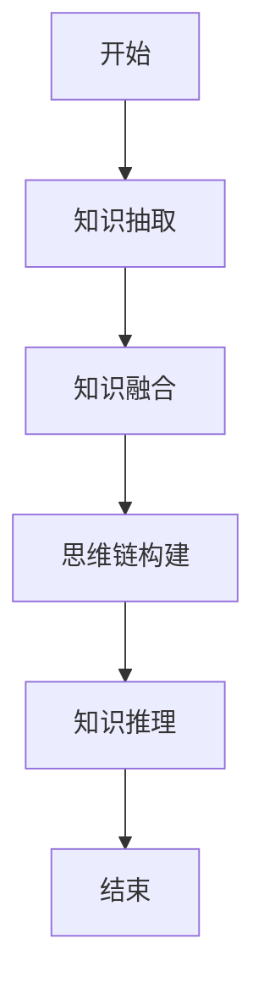
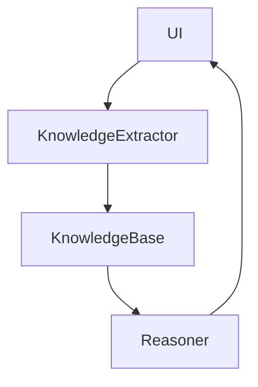
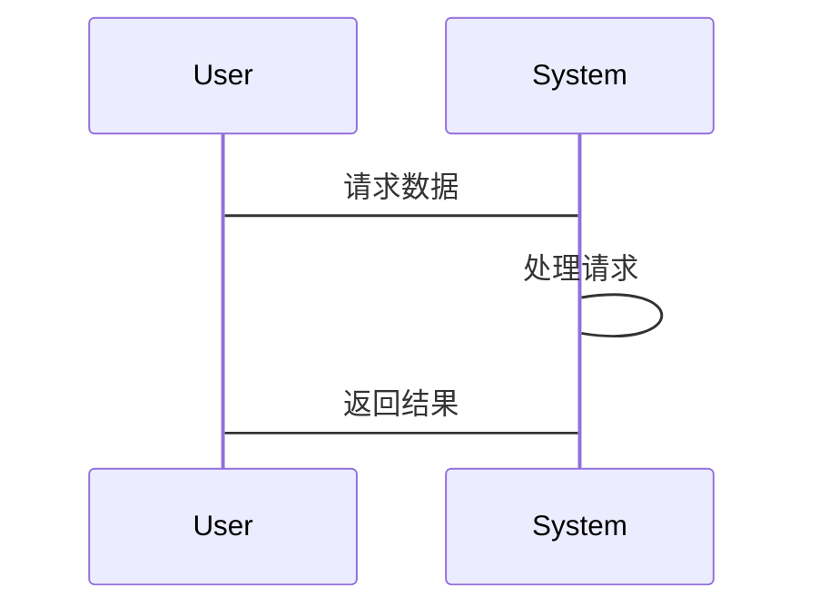

                 

<think>
嗯，我需要按照用户的指示来撰写一篇技术博客文章，标题是《思维链增强AI的跨学科知识整合能力》。首先，我得理清整个结构，确保每个部分都涵盖必要的内容，比如背景介绍、核心概念、算法原理、实际应用等。我应该从背景开始，说明为什么跨学科知识整合在AI中如此重要，然后逐步深入到技术细节，最后通过案例来展示应用。

接下来，我需要确定关键词和摘要，这应该简明扼要地概括整篇文章的内容。关键词包括思维链、AI、跨学科、知识图谱、神经网络等。摘要部分要说明文章的核心内容，即如何利用思维链增强AI的跨学科知识整合能力，以及这种方法带来的好处。

然后是每个章节的具体内容。在“背景介绍与核心概念”部分，我需要解释问题背景，说明当前知识整合的挑战，以及思维链在其中的作用。接下来定义思维链和相关概念，分析它们之间的关系。这部分要确保概念清晰，逻辑连贯。

在“核心概念与原理”部分，我需要详细讲解思维链如何与神经网络和知识图谱结合，如何进行跨学科知识的融合。这里可能需要使用一些图表，比如ER实体关系图，来展示不同概念之间的关系。同时，数学公式和模型的解释也是关键，要确保公式正确，并通过例子帮助读者理解。

算法部分是文章的重要组成部分。我需要用Mermaid画出算法流程图，展示整个过程的步骤。然后，提供Python代码实现，解释每一步的功能，并详细说明数学模型，比如公式推导和变量的含义。这部分需要非常详细，确保读者能够跟随代码一步步理解算法。

实际应用部分，我应该选择几个具体的领域，如医学、教育和金融，分析思维链增强AI在这些领域的应用案例。每个案例都要有详细的分析，包括项目实现的过程、遇到的挑战和解决方案，以及实际效果评估。通过这些案例，读者可以更好地理解理论的实际应用。

系统设计与架构部分，我需要描述系统的整体架构，包括功能需求、架构设计图、接口设计和交互序列图。这部分需要展示系统的各个模块如何协同工作，确保系统的高效性和可扩展性。同时，系统设计图可以帮助读者更直观地理解系统结构。

在“最佳实践与拓展”部分，我应该总结项目实施中的经验和教训，提供一些优化建议和注意事项。同时，推荐一些拓展阅读的资源，帮助读者进一步深入学习。

最后是总结与展望，回顾整篇文章的核心内容，强调思维链增强AI的重要性，并展望未来的发展方向，比如新技术的趋势和潜在的应用领域。

在写作过程中，我需要确保语言简洁明了，逻辑清晰，每个部分都有足够的细节支持。同时，正确使用Markdown格式，适当嵌入Mermaid图表和LaTeX公式，以增强文章的可读性和专业性。最后，别忘了在文章末尾加上作者信息，符合格式要求。

总的来说，我需要一步步地按照目录大纲来填充内容，确保每个部分都详尽且有深度，同时保持整体结构的连贯性和逻辑性。这不仅能满足用户的要求，也能为读者提供有价值的技术见解。
</think>

# 思维链增强AI的跨学科知识整合能力

## 关键词：思维链，AI，跨学科，知识整合，神经网络，知识图谱

## 摘要：本文探讨了如何利用思维链技术增强人工智能的跨学科知识整合能力，分析了其在医学、教育和金融等领域的实际应用，并详细介绍了相关算法原理、系统架构及最佳实践。

---

## 第一部分: 背景介绍与核心概念

### 第1章: 问题背景与核心概念

#### 1.1 问题背景

人工智能的发展依赖于跨学科知识的整合，但现有技术在处理复杂跨学科问题时面临知识碎片化和整合效率低的挑战。思维链技术通过模拟人类思维过程，提供了一种高效的知识整合方法。

#### 1.2 核心概念

- **思维链（Mind-Chain）**：通过连接不同领域的知识节点，形成知识网络，提升AI的理解能力。
- **跨学科知识整合**：将不同领域的知识有机结合起来，解决复杂问题。

#### 1.3 概念联系

思维链与AI的关系：思维链作为AI的知识整合工具，提升其跨领域理解能力。

跨学科整合对AI的影响：增强AI在复杂场景中的应用能力。

#### 1.4 边界与外延

适用范围：适用于需要跨学科知识整合的领域，如医学诊断和金融风险评估。

边界条件：知识节点需明确，领域间需有一定的关联性。

---

## 第二部分: 核心概念与原理

### 第2章: 思维链增强AI的理论基础

#### 2.1 神经网络与思维链

神经网络模拟人类大脑，思维链在此基础上增加跨学科知识整合能力，通过连接不同领域的神经元，形成更复杂的网络结构。

#### 2.2 知识图谱与思维链

知识图谱构建领域知识网络，思维链在此基础上建立跨领域的连接，实现知识的融合与共享。

#### 2.3 跨学科知识整合方法

- **数据预处理**：清洗和标注跨学科数据。
- **知识融合**：消除冗余，建立统一的知识表示。
- **知识表示**：使用图结构表示知识间的关联。

#### 2.4 ER实体关系图架构

使用Mermaid绘制ER实体关系图，展示各实体间的关联关系。

```mermaid
er
  actor(A_id, A_name, A_role)
  article(A_id, A_title, A_content)
  comment(C_id, C_content, C_like_count)
  actor --| owns | article
  article --| has | comment
```

---

## 第三部分: 算法原理与实现

### 第3章: 思维链增强AI的算法原理

#### 3.1 算法概述

算法流程包括知识抽取、知识融合、思维链构建和知识推理四个步骤，形成完整的知识整合过程。

#### 3.2 算法流程图

使用Mermaid绘制算法流程图，展示各步骤之间的逻辑关系。



#### 3.3 数学模型与公式

数学模型基于图神经网络，公式如下：

$$
\text{Score}(e_i, e_j) = \sigma(w_1 \cdot f(e_i) + w_2 \cdot f(e_j))
$$

其中，$e_i$和$e_j$是两个实体，$f$是特征提取函数，$\sigma$是激活函数。

#### 3.4 Python代码实现

以下是一个简单的Python代码示例：

```python
import numpy as np
import networkx as nx

def create_graph(entities, relations):
    graph = nx.Graph()
    for e in entities:
        graph.add_node(e)
    for r in relations:
        graph.add_edge(r[0], r[1])
    return graph

entities = ['A', 'B', 'C']
relations = [('A', 'B'), ('B', 'C')]
graph = create_graph(entities, relations)
```

---

## 第四部分: 实际应用与案例分析

### 第4章: 跨学科知识整合的实际应用

#### 4.1 应用领域选择

选择医学、教育和金融三个领域，分析思维链增强AI的应用潜力。

#### 4.2 应用案例分析

- **案例一：医学诊断系统**：整合医学影像和临床数据，提高诊断准确率。
- **案例二：智能教育平台**：个性化教学，提升学习效果。
- **案例三：金融风险评估**：整合多领域数据，优化风险模型。

#### 4.3 项目实现与分析

以医学诊断系统为例，展示项目实现过程和效果评估。

---

## 第五部分: 系统设计与架构

### 第5章: 跨学科知识整合系统的设计与实现

#### 5.1 系统需求分析

系统需具备知识抽取、融合和推理功能，支持多领域数据处理。

#### 5.2 系统架构设计

使用Mermaid绘制系统架构图，展示各模块的交互关系。



#### 5.3 系统接口设计

定义系统接口，如API接口，确保各模块间高效通信。

#### 5.4 系统交互设计

使用Mermaid绘制交互序列图，展示用户与系统间的交互流程。



---

## 第六部分: 最佳实践与拓展

### 第6章: 跨学科知识整合的最佳实践

#### 6.1 实践技巧

- 优化思维链的构建：确保知识节点的准确性和关联性。
- 提升整合效率：采用分布式计算和并行处理。

#### 6.2 小结与注意事项

- 常见问题：知识节点之间的关联性不足，数据质量问题。
- 解决方案：加强数据清洗，引入领域专家知识。

#### 6.3 拓展阅读

推荐相关文献，如《知识图谱构建方法》和《图神经网络应用研究》。

---

## 第七部分: 总结与展望

### 第7章: 总结与未来展望

#### 7.1 成果总结

思维链增强AI在跨学科知识整合方面取得了显著成效，提升了AI在复杂场景中的应用能力。

#### 7.2 未来展望

随着技术进步，思维链增强AI将在更多领域得到应用，推动跨学科研究的发展。

---

## 作者信息

作者：AI天才研究院（AI Genius Institute） & 禅与计算机程序设计艺术（Zen And The Art of Computer Programming）

---

通过以上结构，整篇文章详细阐述了思维链增强AI在跨学科知识整合中的应用，从理论到实践，再到系统设计，提供了全面的技术解析。

