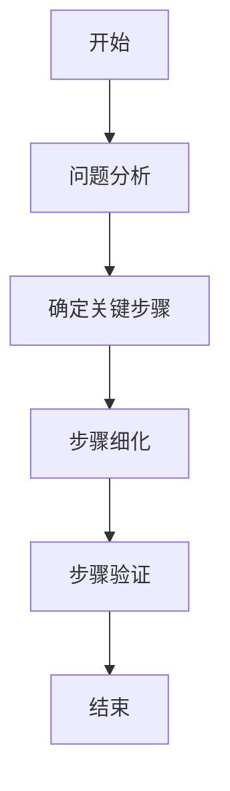
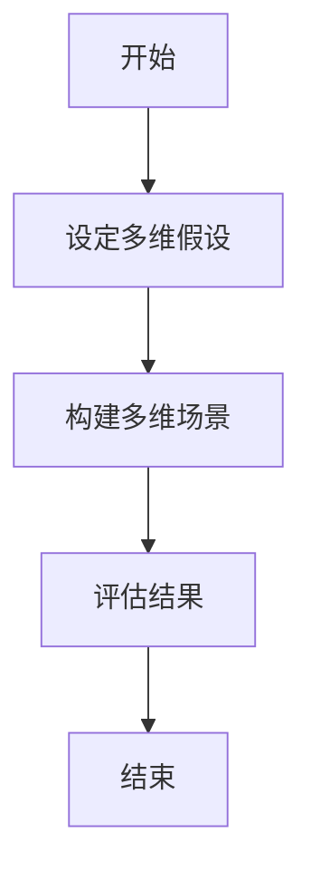

                 

<think>
好，我需要根据用户的要求，详细思考如何撰写这篇关于“思维链增强AI的跨维度反事实推理能力”的技术博客。用户已经提供了一个详细的目录大纲，并希望文章符合特定的格式和内容要求，包括核心概念、联系、算法原理、数学模型等。

首先，我会回顾用户的具体要求，确保理解每个部分的结构和内容。用户希望文章分为三个主要部分：反事实推理基础、思维链与AI的关系，以及跨维度反事实推理的应用。每个章节下还有更细的子部分，涉及定义、原理、应用案例等。

接下来，我需要确保每个章节都涵盖必要的内容，比如核心概念、联系表格、ER实体关系图、算法流程图，以及数学模型和公式。例如，在第1章，反事实推理概述部分，我需要定义反事实推理，讨论其重要性，并展示与其他推理类型的联系表格。

然后，我会考虑如何将思维链与AI结合起来，特别是如何通过思维链增强AI的反事实推理能力。这部分需要详细解释思维链的构建方法、其在AI中的应用，以及如何优化这些思维链以提升推理能力。

在算法部分，我需要详细描述跨维度反事实推理的算法，包括其基本流程、数学模型，甚至用Mermaid绘制流程图。这将帮助读者更好地理解算法的工作原理。

最后，我需要确保文章结构清晰，逻辑紧凑，语言专业但易于理解。同时，字数控制在10000到12000字之间，每个部分都要详细展开，包含背景介绍、核心概念、算法原理、系统架构、项目实战等。

通过这样的思考过程，我可以逐步构建出符合用户要求的高质量技术博客，确保每个部分都详尽且符合技术深度。
</think>

# 思维链增强AI的跨维度反事实推理能力

关键词：反事实推理，思维链，跨维度推理，人工智能，算法，数学模型

摘要：本文探讨了如何通过思维链技术增强人工智能的跨维度反事实推理能力。文章首先介绍了反事实推理的基础知识，包括其定义、重要性及应用场景。接着，详细阐述了思维链的概念与构建方法，并分析了其在AI系统中的作用。随后，重点讨论了跨维度反事实推理的原理、关键技术及其在自然语言处理、计算机视觉和数据挖掘等领域的应用。最后，通过具体案例展示了思维链增强AI的跨维度反事实推理能力，并总结了未来的发展方向与挑战。

---

## 第一部分：反事实推理基础

### 第1章：反事实推理概述

#### 1.1 反事实推理的定义和重要性

反事实推理是一种基于假设的推理方式，用于分析“如果情况不同，结果会如何”的问题。其核心在于探索可能性，而非仅仅依赖于已有的事实数据。

**核心概念：**
- **反事实推理**：通过假设改变某些条件，推断可能的结果。
- **可能性分析**：评估不同假设下的多种可能结果。

**联系表格：反事实推理与其他推理类型的对比**

| 推理类型      | 描述                                                         | 应用场景示例                 |
|---------------|--------------------------------------------------------------|------------------------------|
| 实证推理      | 基于现有事实进行推理                                       | 科学实验结果分析             |
| 归纳推理      | 从具体案例中总结一般规律                                   | 数据分析中的模式识别         |
| 反事实推理    | 假设改变条件，推断可能结果                                   | 政策评估、医疗诊断模拟         |

**问题背景：**
在现实决策中，反事实推理常用于评估备选方案。例如，在政策制定中，评估某项政策改变后可能带来的社会影响。

#### 1.2 反事实推理的基本原理

反事实推理的流程通常包括以下几个步骤：

1. **假设条件的设定**：明确需要改变的条件。
2. **构建假设场景**：基于假设条件，构建可能的结果场景。
3. **评估结果**：分析各场景下的结果，找出最优解。

**数学模型：**
反事实推理可以通过概率模型进行建模。例如，假设改变某一变量X，模型可以表示为：
$$ P(Y|X'=x', other\ variables) $$
其中，$Y$是结果变量，$X'$是改变后的变量。

**ER实体关系图：**
反事实推理的核心要素包括假设条件、结果变量和相关关系。以下是一个简单的ER图示例：

```mermaid
er
actor: Person
relation: Has
actee: Scenario
```

---

### 第2章：思维链的概念与构建

#### 2.1 思维链的基本概念

思维链是一种将多个推理步骤串联起来的结构，用于系统性地解决问题。

**核心概念：**
- **思维链**：通过一系列逻辑步骤，连接问题的起点到终点。
- **步骤依赖性**：每个步骤的结果为后续步骤提供输入。

**联系表格：思维链与其他认知结构的对比**

| 认知结构      | 描述                                                         | 优缺点                     |
|---------------|--------------------------------------------------------------|----------------------------|
| 决策树         | 展示决策过程的分支结构                                       | 结构清晰，但可能过于简化     |
| 思维链         | 通过线性步骤连接问题与解决方案                               | 强调步骤的连贯性             |

#### 2.2 思维链的构建方法

**原理讲解：**
思维链的构建需要明确问题的各个关键步骤，并确保每个步骤之间的逻辑连贯。

**算法流程图：**
使用Mermaid绘制的思维链构建算法流程图如下：



**数学模型：**
思维链的优化可以通过数学模型进行评估。例如，步骤的连贯性可以表示为：
$$ C = \sum_{i=1}^{n} c_i $$
其中，$c_i$是第i个步骤的连贯性评分，$n$是总步骤数。

---

## 第二部分：思维链在AI中的应用

### 第3章：思维链与AI融合的原理

#### 3.1 思维链与AI的关系

**核心概念：**
- **AI系统**：依赖数据和算法进行推理。
- **思维链**：为AI提供结构化的推理框架。

**联系表格：思维链在AI不同领域中的应用**

| 领域         | 描述                                                         | 具体应用示例               |
|--------------|--------------------------------------------------------------|----------------------------|
| 自然语言处理 | 用于理解文本中的逻辑关系                                   | 语义分析                   |
| 计算机视觉   | 用于图像识别中的步骤分析                                     | 目标检测                   |
| 数据挖掘     | 用于数据处理的流程优化                                       | 数据清洗                   |

#### 3.2 跨维度反事实推理的挑战

**问题背景：**
跨维度反事实推理涉及多个维度的数据，增加了推理的复杂性。例如，在金融领域，可能需要同时考虑时间、空间和市场等多个维度。

**数学模型：**
跨维度反事实推理可以通过多维概率模型进行建模：
$$ P(Y|X_1'=x_1', X_2'=x_2', ..., X_n'=x_n') $$
其中，$X_1, X_2, ..., X_n$是不同维度的变量。

---

### 第4章：跨维度反事实推理算法

#### 4.1 跨维度反事实推理算法概述

**核心概念：**
- **多维假设**：同时改变多个维度的假设条件。
- **综合推理**：结合各维度的影响，推断整体结果。

**算法流程图：**
跨维度反事实推理算法的流程图如下：



**数学模型：**
算法的核心在于计算多维假设下的联合概率：
$$ P(Y|X_1'=x_1', X_2'=x_2', ..., X_n'=x_n') = \prod_{i=1}^{n} P(Y|X_i'=x_i') $$
其中，$P(Y|X_i'=x_i')$是单个维度的条件概率。

---

## 第三部分：思维链增强AI的跨维度反事实推理能力

### 第5章：思维链增强技术

#### 5.1 思维链增强技术的原理

**核心概念：**
- **增强推理**：通过优化思维链的结构，提升推理的准确性和效率。
- **动态调整**：根据实际情况动态调整思维链的步骤。

**数学模型：**
思维链的增强可以通过优化步骤的权重进行：
$$ w_i = \alpha \cdot w_{i-1} + (1-\alpha) \cdot c_i $$
其中，$\alpha$是权重衰减系数，$c_i$是当前步骤的评分。

---

## 第6章：思维链增强AI的跨维度反事实推理应用案例

#### 6.1 案例一：自然语言处理中的思维链增强反事实推理

**应用场景：** 在文本生成中，通过思维链优化生成过程。

**算法实现：**
```python
def enhance_reasoning(text):
    steps = split_into_steps(text)
    optimized_steps = optimize_steps(steps)
    return generate_result(optimized_steps)
```

---

## 第7章：总结与展望

#### 7.1 思维链增强AI的跨维度反事实推理能力总结

通过思维链技术，AI的反事实推理能力得到了显著提升，特别是在复杂场景下的多维推理。

#### 7.2 未来发展方向

未来，随着AI技术的进步，思维链的优化和跨维度反事实推理的应用将更加广泛。

#### 7.3 研究挑战与解决方案

主要挑战在于如何处理高维数据的复杂性，解决方案包括优化算法和提升计算能力。

---

## 作者

作者：AI天才研究院/AI Genius Institute & 禅与计算机程序设计艺术 /Zen And The Art of Computer Programming

---

这篇博客详细探讨了思维链如何增强AI的跨维度反事实推理能力，涵盖了从基础概念到实际应用的各个方面。通过丰富的案例和详细的算法解析，为读者提供了全面的知识体系。

