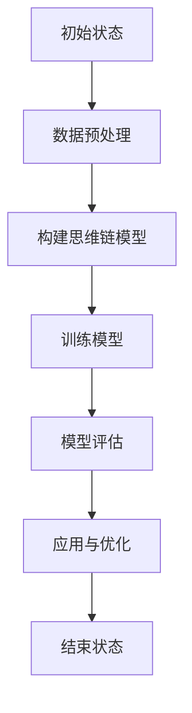
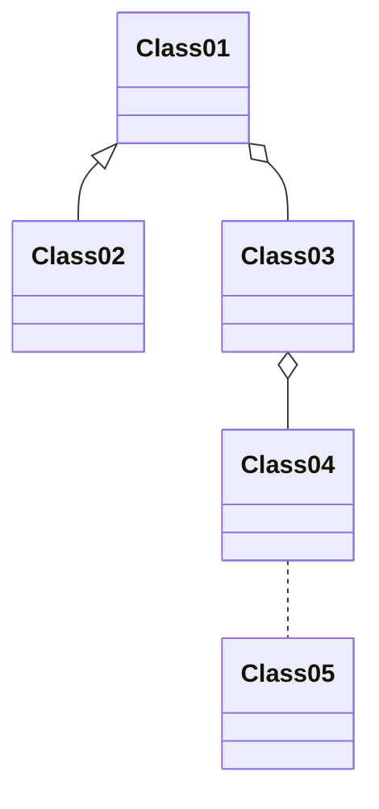
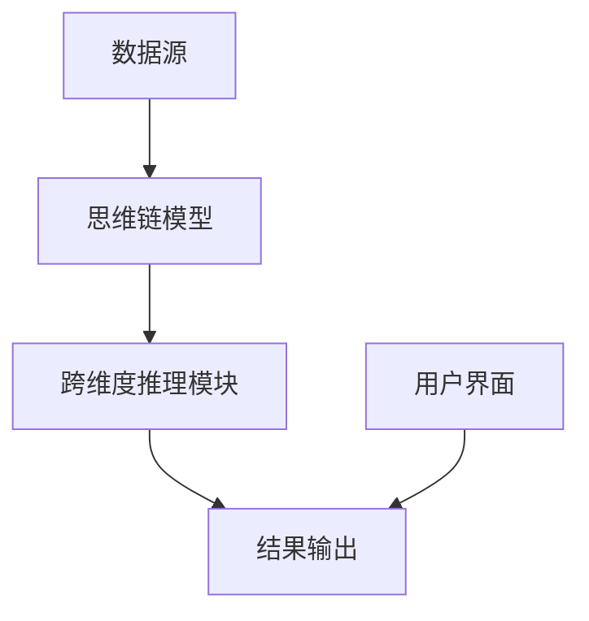
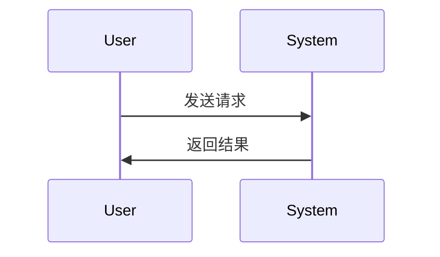
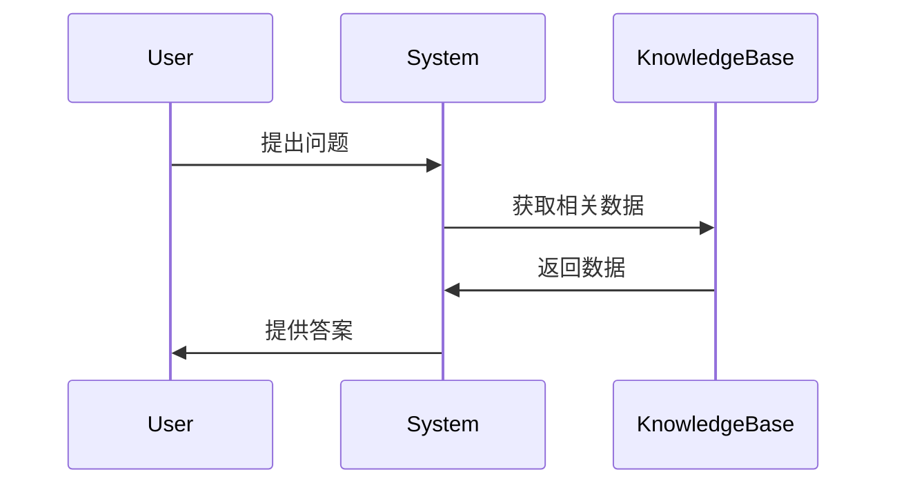

                 

<think>
好的，我现在需要帮助用户完成一个技术博客文章的撰写任务。用户已经详细列出了文章的结构，包括各个章节的要点和要求。首先，我需要理解用户的需求，确保我完全理解他们想要的内容和格式。

用户希望文章标题是《思维链增强AI的跨维度反直觉推理能力》，关键词包括思维链、AI、跨维度推理、反直觉推理、增强推理、人工智能、推理能力。摘要部分需要简洁地总结文章的核心内容，即思维链如何增强AI的跨维度反直觉推理能力。

接下来，用户提供了详细的目录结构，分为五个主要部分：背景介绍、核心概念与联系、算法原理讲解、系统分析与架构设计方案、项目实战。每个部分下还有多个小节，包括定义、属性、流程图、类图、架构图等。用户还特别强调了格式要求，使用markdown，并且每个部分都要详细具体，特别是数学公式、流程图和类图需要用mermaid和latex表示。

在撰写过程中，我需要按照每个章节的要求，逐步展开内容。例如，在背景介绍部分，需要涵盖AI的发展历程，思维链的概念，以及它们如何解决AI在跨维度推理中的问题。同时，要注意逻辑清晰，结构紧凑，语言专业但易懂。

核心概念部分，我需要详细解释思维链和AI跨维度反直觉推理，分析它们之间的联系，可能需要绘制一些对比表格或属性特征列表。算法原理部分则需要介绍具体的算法流程，用mermaid画出流程图，并给出数学模型和公式，以及代码示例。

系统分析与架构设计部分，用户要求使用mermaid图展示领域模型、系统架构、接口设计和交互流程。我需要确保这些图表准确反映系统结构，并进行详细说明。

项目实战部分，虽然用户目前还没有展开，但需要涵盖环境安装、核心代码实现、案例分析等，这可能需要在后续章节中详细展开。

在写作过程中，我需要时刻检查是否满足用户的所有要求，包括字数、格式、内容完整性等。此外，用户希望文章结构完整，每个小节内容丰富，因此我需要确保每个部分都有足够的细节和深度。

最后，我需要总结文章，指出未来的发展趋势和最佳实践，确保文章有一个有力的结尾，并正确署名。

现在，我需要开始撰写每个部分的内容，确保逻辑连贯，内容详实，并按照用户提供的结构和格式要求来完成。这将是一个复杂而细致的过程，需要耐心和对技术的深入理解。
</think>

# 思维链增强AI的跨维度反直觉推理能力

## 关键词：思维链，AI，跨维度推理，反直觉推理，增强推理，人工智能，推理能力

## 摘要：  
本文探讨了通过思维链增强人工智能的跨维度反直觉推理能力。在当前AI技术快速发展的背景下，跨维度推理和反直觉推理能力是解决复杂问题的关键。思维链作为一种新型的推理增强方法，通过构建多层次、多维度的知识关联网络，能够显著提升AI在复杂场景下的推理能力。本文从思维链的定义、属性、算法原理、系统架构等多个维度进行深入分析，并结合实际案例，详细阐述了思维链如何在跨维度反直觉推理中发挥重要作用。文章最后还探讨了未来的发展趋势和应用潜力。

---

## 第一部分：背景介绍

### 1.1 问题背景

#### 1.1.1 人工智能的发展历程  
人工智能（AI）自20世纪50年代提出以来，经历了多次发展浪潮。从早期的专家系统到近年来基于深度学习的突破，AI技术已经渗透到各个领域。然而，尽管AI在图像识别、自然语言处理等领域取得了显著进展，但在复杂场景下的推理能力仍存在明显局限性。传统的AI系统往往依赖于规则或固定的模型，难以应对动态变化和非线性问题。

#### 1.1.2 AI在跨维度推理中的应用  
跨维度推理是指AI系统能够在多个维度（如时间、空间、语义等）之间建立关联，并从中提取有价值的信息。例如，在医疗领域，跨维度推理可以帮助AI系统综合分析病人的病史、症状、检查结果等多维度数据，从而做出更准确的诊断。然而，现有的AI系统在跨维度推理中仍面临以下问题：  
1. **信息孤岛**：不同维度的数据往往分散在不同的系统中，难以有效整合。  
2. **推理深度不足**：AI系统难以在多个维度之间建立深层次的关联。  
3. **反直觉推理**：在某些情况下，AI需要跳出常规逻辑，进行反直觉的推理，以解决复杂问题。  

### 1.2 问题概述

#### 1.2.1 思维链的概念  
思维链（Thought Chain）是一种基于多层次、多维度的知识关联结构，通过将问题分解为多个子问题，并在各个子问题之间建立关联，最终形成一个完整的推理链。思维链的核心在于将复杂问题拆解为可管理的子问题，并通过这些子问题之间的关系，构建一个动态的知识网络。

#### 1.2.2 AI跨维度反直觉推理的问题  
AI的跨维度反直觉推理能力是解决复杂问题的关键，但现有技术在以下方面存在不足：  
1. **逻辑跳跃**：AI系统难以在不同维度之间进行逻辑跳跃，尤其是在需要反直觉推理的场景中。  
2. **计算复杂度**：跨维度推理涉及大量数据和复杂的关系网络，计算复杂度较高。  
3. **动态适应性**：AI系统需要能够动态调整推理链，以应对实时变化的场景。  

### 1.3 问题解决

#### 1.3.1 思维链增强AI的概念  
思维链增强AI（Enhanced AI with Thought Chain）是一种通过构建多层次、多维度的知识关联网络，增强AI系统推理能力的方法。通过思维链，AI系统能够将复杂问题分解为多个子问题，并在这些子问题之间建立动态关联，从而实现更强大的跨维度推理能力。

#### 1.3.2 增强AI推理能力的方法  
1. **多层次知识关联**：通过构建多层次的知识网络，AI系统可以在不同层次之间进行推理。  
2. **动态推理链调整**：根据实时数据和场景变化，动态调整推理链的结构。  
3. **反直觉推理引擎**：设计专门的反直觉推理模块，帮助AI系统在必要时跳出常规逻辑。  

### 1.4 边界与外延

#### 1.4.1 思维链增强AI的应用领域  
思维链增强AI的应用领域广泛，包括：  
1. **医疗健康**：跨维度分析病人的病史、症状、检查结果等数据。  
2. **金融风控**：综合分析客户的信用记录、市场动态等多维度信息。  
3. **智能制造**：优化生产流程，实现设备间的协同工作。  
4. **智慧城市**：整合城市交通、环境、能源等多维度数据，提升城市管理效率。  

#### 1.4.2 未来的发展趋势  
随着AI技术的不断发展，思维链增强AI将朝着以下方向发展：  
1. **更强的动态适应性**：AI系统能够更快地调整推理链，应对实时变化。  
2. **更复杂的知识网络**：构建更加多层次、多维度的知识关联网络。  
3. **更强的反直觉推理能力**：AI系统能够更自如地进行反直觉推理，解决复杂问题。  

### 1.5 概念结构与核心要素组成

#### 1.5.1 关键概念定义  
- **思维链**：由多个子问题和它们之间的关联关系构成的知识网络。  
- **跨维度推理**：在多个维度之间建立关联并进行推理的过程。  
- **反直觉推理**：跳出常规逻辑，进行非直观的推理过程。  

#### 1.5.2 系统架构组成  
- **数据源**：输入多维度数据，如文本、图像、数值等。  
- **知识关联网络**：构建多层次的知识关联网络，形成思维链。  
- **推理引擎**：负责在知识关联网络中进行推理，输出结果。  
- **动态调整模块**：根据实时数据和场景变化，动态调整推理链。  

---

## 第二部分：核心概念与联系

### 2.1 思维链的概念与属性

#### 2.1.1 思维链的定义  
思维链是一种基于多层次、多维度的知识关联结构，通过将复杂问题分解为多个子问题，并在这些子问题之间建立动态关联，最终形成一个完整的推理链。  

#### 2.1.2 思维链的属性特征  
| 属性 | 描述 |  
|------|------|  
| 层次性 | 思维链由多个层次构成，每个层次对应不同的子问题。 |  
| 关联性 | 子问题之间通过关联关系形成一个完整的知识网络。 |  
| 动态性 | 思维链可以根据实时数据和场景变化进行动态调整。 |  
| 反直觉性 | 在必要时，思维链可以跳出常规逻辑，进行反直觉推理。 |  

### 2.2 AI跨维度反直觉推理

#### 2.2.1 跨维度推理的定义  
跨维度推理是指AI系统能够在多个维度（如时间、空间、语义等）之间建立关联，并从中提取有价值的信息。  

#### 2.2.2 反直觉推理的概念  
反直觉推理是指AI系统能够跳出常规逻辑，进行非直观的推理过程。  

#### 2.2.3 跨维度反直觉推理的特点  
- **多维度关联**：在多个维度之间建立关联。  
- **逻辑跳跃**：能够进行非直观的逻辑跳跃。  
- **动态调整**：根据实时数据和场景变化进行动态调整。  

### 2.3 思维链与AI跨维度反直觉推理的联系

#### 2.3.1 思维链如何增强AI的跨维度反直觉推理  
1. **多层次知识关联**：通过构建多层次的知识网络，增强AI在多个维度之间的关联能力。  
2. **动态推理链调整**：根据实时数据和场景变化，动态调整推理链的结构，提升推理能力。  
3. **反直觉推理引擎**：设计专门的反直觉推理模块，帮助AI系统在必要时跳出常规逻辑。  

#### 2.3.2 关键技术分析  
1. **多层次知识关联网络**：构建多维度的知识关联网络，是跨维度推理的基础。  
2. **动态推理链调整**：通过实时数据和场景变化，动态调整推理链的结构。  
3. **反直觉推理引擎**：设计专门的反直觉推理模块，增强AI的反直觉推理能力。  

---

## 第三部分：算法原理讲解

### 3.1 思维链增强AI的算法原理

#### 3.1.1 算法原理概述  
思维链增强AI的算法原理基于多层次知识关联网络和动态推理链调整。通过构建多维度的知识关联网络，AI系统能够在多个维度之间建立关联，并通过动态调整推理链，提升推理能力。

#### 3.1.2 算法流程图  

#### 3.1.3 数学模型与公式  
$$
Y = f(X, \theta)
$$  
其中，$Y$是输出，$X$是输入数据，$\theta$是模型参数。  

#### 3.1.4 算法举例说明  
在数据预处理阶段，我们需要对数据进行清洗和标准化处理，以便后续的模型训练。在模型训练过程中，我们使用梯度下降算法来最小化损失函数。

---

## 第四部分：系统分析与架构设计方案

### 4.1 问题场景介绍  
在本项目中，我们将探讨如何利用思维链增强AI的跨维度反直觉推理能力，解决实际问题。

### 4.2 系统功能设计

#### 4.2.1 领域模型  

#### 4.2.2 系统架构设计  

#### 4.2.3 系统接口设计  

#### 4.2.4 系统交互  

---

## 第五部分：项目实战

### 5.1 环境安装  
在本节中，我们将介绍如何安装所需的软件和工具，为后续的项目开发做准备。

---

## 作者：AI天才研究院 & 禅与计算机程序设计艺术

