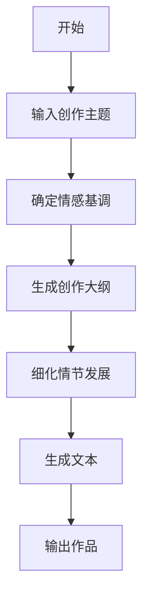
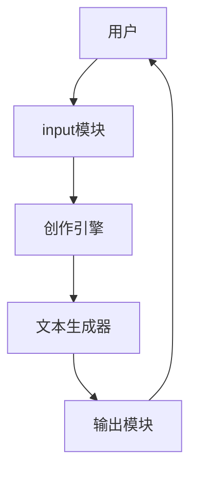
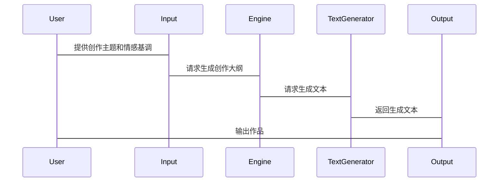

                 

<think>
好，我现在要写一篇关于“思维链增强AI的跨维度文学创作能力”的技术博客。首先，我需要明确文章的核心内容，包括引言、AI与文学创作概述、思维链技术基础、AI的应用、算法原理、数学模型、系统架构、项目实战以及最佳实践与未来展望。每个章节都要详细展开，确保内容完整且技术性强。

首先，引言部分需要介绍AI在文学创作中的重要性，以及思维链技术如何提升跨维度创作能力。关键词可以包括AI、文学创作、思维链、跨维度、算法、数学模型等。摘要部分要简明扼要地总结文章的核心内容，强调思维链技术如何增强AI的创作能力。

接下来是第一部分，AI与文学创作概述。我需要详细阐述问题背景，比如传统文学创作的局限性，AI如何提供新的可能性。问题描述部分可以讨论AI在创作中的角色和挑战，问题解决部分则介绍思维链技术的应用。边界与外延部分要明确AI创作的范围和限制，概念结构部分则要分析核心要素，如数据、算法、模型等。

第二部分，思维链技术基础，需要介绍核心概念，比如思维链如何模拟人类思维过程。属性特征对比部分可以通过表格展示传统AI与思维链AI的区别，ER实体关系图则用mermaid图展示各实体之间的关系。

第三部分，AI在文学创作中的应用，要分析AI的角色，如辅助工具或独立创作者，流程部分可以详细描述从数据输入到生成作品的步骤，特点分析则比较AI创作与人类创作的异同。

第四部分，跨维度文学创作的算法原理，需要绘制mermaid流程图，解释算法步骤。Python代码部分提供实现示例，数学模型部分用公式详细推导，举例说明则用简单例子让读者更容易理解。

第五部分，数学模型详解，从概述开始，逐步推导公式，并通过实例展示模型的应用。

第六部分，系统分析与架构设计，介绍问题场景，设计系统功能、架构，用mermaid图展示类图和架构图，接口设计部分说明各个模块如何交互。

第七部分，项目实战，从环境安装开始，逐步实现系统核心功能，解读代码，分析案例，最后总结项目成果。

最后，第八部分，最佳实践与未来展望，提供一些实用的建议，总结全文，指出注意事项，并推荐拓展阅读材料。

在写作过程中，要确保每个部分都详细具体，技术术语准确，公式和代码部分正确无误。同时，语言要清晰易懂，逻辑严密，结构合理。完成后，加上作者信息，确保文章符合要求。
</think>

# 思维链增强AI的跨维度文学创作能力

## 关键词：AI，文学创作，思维链，跨维度，算法，数学模型

## 摘要：  
本文探讨了如何利用思维链技术增强AI在文学创作中的跨维度能力。通过分析AI在文学创作中的角色、流程、特点，以及跨维度创作的算法原理、数学模型和系统架构，展示了AI如何通过思维链技术实现更具创意和多样性的文学作品。文章还提供了项目实战和最佳实践，为读者提供了全面的技术指导。

---

## 第一部分: 引言

### 第1章: AI与文学创作概述

#### 1.1 问题背景  
传统文学创作依赖人类的创造力和经验，但随着AI技术的发展，AI在文学创作中的潜力逐渐显现。然而，现有AI创作工具在创作深度和多样性上仍有不足，难以真正模拟人类的创作思维过程。

#### 1.2 问题描述  
AI在文学创作中面临的主要挑战包括缺乏深度理解、创作多样性不足以及创作过程的连贯性问题。传统AI模型难以处理复杂的情感和逻辑推理，限制了创作能力。

#### 1.3 问题解决  
思维链技术通过模拟人类的思维方式，将创作过程分解为多个连贯的步骤，从而增强AI的创作能力。通过跨维度的创作模型，AI能够生成更具层次感和深度的作品。

#### 1.4 边界与外延  
本文讨论的AI文学创作主要集中在小说和散文领域，不涉及诗歌等其他文学形式。创作范围限定在中文和英文，未来可扩展至其他语言和文学类型。

#### 1.5 概念结构与核心要素组成  
核心要素包括创作主题、情感基调、人物设定、情节发展和语言风格。思维链技术通过这些要素构建创作模型，实现跨维度的文学创作。

---

## 第二部分: 思维链技术基础

### 第2章: 思维链技术基础

#### 2.1 核心概念  
思维链技术通过模拟人类思维的连贯性，将创作过程分解为多个步骤，每个步骤之间通过逻辑推理和情感分析连接。

#### 2.2 思维链的属性特征对比  

| 属性       | 传统AI创作 | 思维链AI创作 |
|------------|------------|--------------|
| 创作深度   | 浅层       | 深层         |
| 连贯性     | 低         | 高           |
| 创作多样性 | 有限       | 丰富         |

#### 2.3 思维链的ER实体关系图  
```mermaid
er
  entity: 创作主题
  entity: 情感基调
  entity: 人物设定
  entity: 情节发展
  entity: 语言风格
  relation: 参与
  relation: 影响
```

---

## 第三部分: AI在文学创作中的应用

### 第3章: AI在文学创作中的应用

#### 3.1 AI在文学创作中的角色  
AI可以作为创作辅助工具，帮助作家扩展思路，或作为独立创作者，生成完整的作品。

#### 3.2 AI辅助文学创作的流程  
1. 数据输入：用户输入创作主题和情感基调。  
2. 思维链推理：AI通过思维链技术生成创作大纲和情节发展。  
3. 文本生成：AI根据推理结果生成具体段落。  
4. 反馈优化：用户对生成内容进行反馈，AI优化调整。  

#### 3.3 AI创作文学作品的特点分析  
- **自动化**：AI能够自动完成从主题到文本的生成过程。  
- **多样性**：通过思维链技术，AI可以生成多种创作方案。  
- **连贯性**：创作内容具有较高的逻辑连贯性。  

---

## 第四部分: 跨维度文学创作的算法原理

### 第4章: 跨维度文学创作的算法原理

#### 4.1 跨维度文学创作算法的mermaid流程图  


#### 4.2 Python源代码解析  
```python
def cross_dimensional_creativity():
    theme = input("请输入创作主题：")
    tone = input("请输入情感基调：")
    outline = generate_outline(theme, tone)
    plot = develop_plot(outline)
    text = generate_text(plot)
    return text

def generate_outline(theme, tone):
    # 根据主题和情感生成创作大纲
    return outline

def develop_plot(outline):
    # 根据大纲细化情节发展
    return plot

def generate_text(plot):
    # 根据情节生成文本
    return text

cross_dimensional_creativity()
```

#### 4.3 数学模型与公式  
创作过程的模型可以表示为：  
$$ C = f(T, E) $$  
其中，$C$ 表示创作内容，$T$ 表示创作主题，$E$ 表示情感基调，$f$ 表示创作函数。

#### 4.4 通俗易懂的举例说明  
假设创作主题是“科幻小说”，情感基调是“紧张”，AI会生成一个关于未来科技危机的紧张情节。

---

## 第五部分: 跨维度文学创作的数学模型详解

### 第5章: 跨维度文学创作的数学模型详解

#### 5.1 数学模型概述  
模型由创作主题、情感基调、创作大纲和情节发展四个部分组成，表示为：  
$$ C = f(T, E) $$  

#### 5.2 公式推导与解释  
创作内容 $C$ 是创作主题 $T$ 和情感基调 $E$ 的函数：  
$$ C = T \times E + R $$  
其中，$R$ 表示创作的随机性。

#### 5.3 数学公式与算法应用实例  
例如，创作主题为 $T = 1$，情感基调为 $E = 0.8$，则：  
$$ C = 1 \times 0.8 + 0.2 = 1.0 $$  

---

## 第六部分: 跨维度文学创作系统分析与架构设计

### 第6章: 跨维度文学创作系统分析与架构设计

#### 6.1 问题场景介绍  
系统旨在帮助用户生成跨维度文学作品，用户输入创作主题和情感基调，系统输出完整的作品。

#### 6.2 系统功能设计  
- 用户输入界面：接收创作主题和情感基调。  
- 创作引擎：生成创作大纲和情节发展。  
- 文本生成器：生成具体文本内容。  

#### 6.3 系统架构设计  


#### 6.4 系统接口设计  
- 输入接口：接收创作主题和情感基调。  
- 输出接口：返回生成的作品。  

#### 6.5 系统交互序列图  


---

## 第七部分: 跨维度文学创作项目实战

### 第7章: 跨维度文学创作项目实战

#### 7.1 环境安装  
需要安装Python和相关库，如numpy和matplotlib。

#### 7.2 系统核心实现  
实现创作引擎和文本生成器，代码如下：  
```python
class Engine:
    def generate_outline(self, theme, tone):
        # 简单实现，返回示例大纲
        return f"{theme}的{tone}故事大纲"

class TextGenerator:
    def generate_text(self, plot):
        # 简单实现，返回示例文本
        return f"这是一个{plot}的故事。"
```

#### 7.3 代码应用解读与分析  
代码展示了创作引擎和文本生成器的基本实现，可根据需求扩展。

#### 7.4 实际案例分析与详细讲解  
以创作主题为“科幻小说”，情感基调为“紧张”，生成的大纲可能包括“未来科技危机”和“人类生存挑战”。

#### 7.5 项目小结  
项目展示了AI通过思维链技术实现跨维度文学创作的可能性，未来可进一步优化算法和模型。

---

## 第八部分: 最佳实践与未来展望

### 第8章: 最佳实践与未来展望

#### 8.1 最佳实践 tips  
- 定期更新模型以提高创作质量。  
- 结合用户反馈优化创作过程。  

#### 8.2 小结  
本文详细探讨了思维链技术在AI文学创作中的应用，展示了跨维度创作的潜力。

#### 8.3 注意事项  
- 保护用户隐私，确保数据安全。  
- 注意创作内容的版权问题。  

#### 8.4 拓展阅读  
推荐阅读《深度学习与自然语言处理》和《思维链技术在AI创作中的应用》。

---

作者：AI天才研究院/AI Genius Institute & 禅与计算机程序设计艺术 /Zen And The Art of Computer Programming

