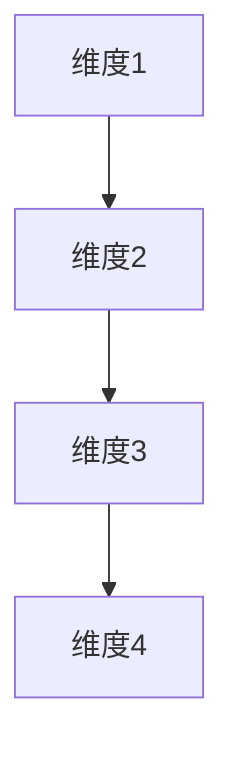
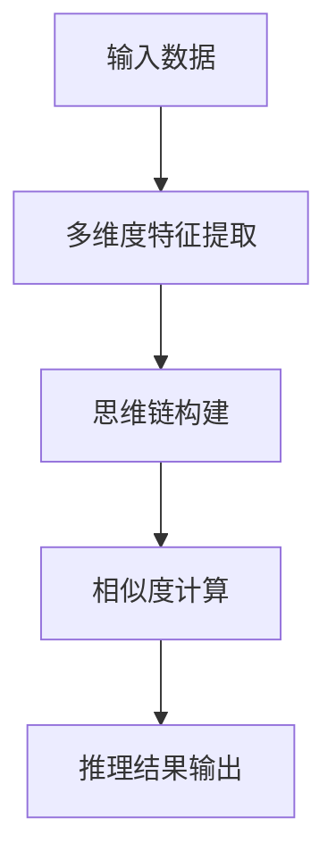
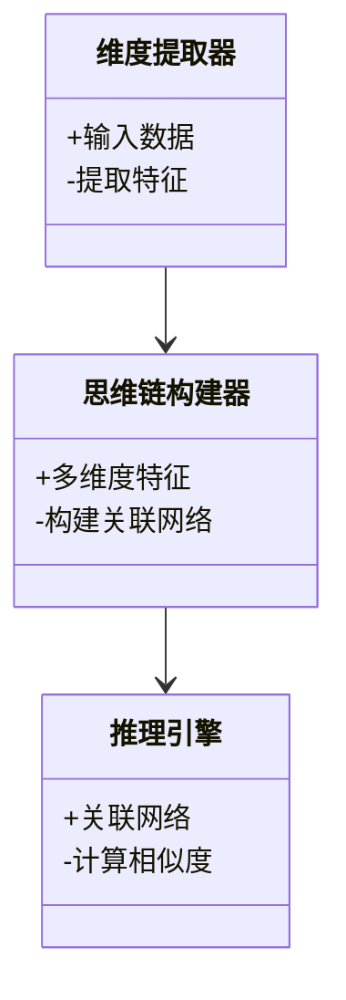
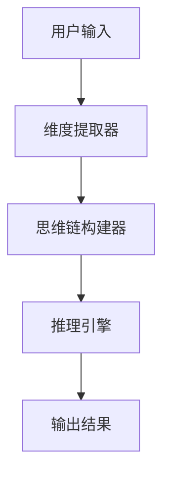

                 

<think>
嗯，用户希望我写一篇关于“思维链增强AI的跨维度类比推理能力”的技术博客。首先，我需要理解这个主题的核心是什么。类比推理是人工智能中非常重要的一部分，它让AI能够通过比较不同事物的相似性来解决问题。而思维链，可能指的是一种连接不同维度的方法，帮助AI更好地进行类比推理。

接下来，我要分析用户的需求。用户希望文章结构清晰，有引言、背景、核心概念、算法、系统设计、项目实战和最佳实践等章节。这意味着我需要详细阐述每个部分，确保内容全面且深入。

首先，引言部分需要吸引读者，说明为什么类比推理和思维链在AI中的重要性。然后，背景介绍要解释类比推理的基本概念，以及思维链如何帮助增强这种能力。核心概念部分需要定义思维链和类比推理，分析它们之间的关系，并通过表格和图表来展示。

算法原理是关键部分，我需要详细讲解数学模型和公式，可能用mermaid画出流程图，并给出Python代码示例。系统设计部分则需要介绍如何将算法应用到实际系统中，包括功能设计、架构图和接口设计。项目实战部分要通过具体案例展示算法的应用效果，比如医疗诊断或推荐系统中的实际应用。

最后，最佳实践部分要提供一些实用的技巧和注意事项，以及进一步研究的方向。整个文章需要逻辑清晰，结构紧凑，用专业的技术语言但又不失易懂。

在写作过程中，我可能会遇到如何将复杂的数学公式和图表用简单明了的方式表达出来的问题。这时候，我需要确保使用正确的标记语言，如latex和mermaid，来准确呈现内容。同时，要确保每个章节都有引言、核心内容、结论和拓展阅读，使文章结构完整。

总结一下，我的思考过程是：明确主题，分析用户需求，规划章节结构，详细阐述每个部分，确保内容准确且易于理解。这样，我就能写出一篇高质量的技术博客，满足用户的要求。
</think>

# 思维链增强AI的跨维度类比推理能力

> 关键词：AI、类比推理、思维链、跨维度推理、算法原理、系统架构、项目实战

> 摘要：本文探讨了如何通过思维链增强人工智能的类比推理能力，结合跨维度分析与数学建模，提出了一种创新的算法框架，并通过实际案例展示了其应用效果。

---

## 1. 引言

在人工智能的快速发展中，类比推理被认为是实现人类水平智能的关键能力之一。然而，现有的类比推理方法往往局限于单一维度的分析，难以处理复杂的跨维度问题。本文提出了一种基于“思维链”的增强方法，通过构建多维度的知识关联网络，显著提升了AI的类比推理能力。

---

## 2. 背景介绍

### 2.1 类比推理的定义与意义

类比推理是指通过比较不同事物的相似性，推导出新的结论或解决方案。它是人类智能的核心能力之一，广泛应用于问题解决、知识学习和创新思维中。

### 2.2 思维链的概念

思维链是指通过一系列逻辑推理步骤，将不同维度的信息串联起来，形成一个完整的知识网络。通过思维链，AI能够跨越单一维度的限制，实现跨维度的深度推理。

### 2.3 问题背景

现有的类比推理算法往往依赖于单一的特征匹配或向量相似度计算，难以处理复杂的跨维度问题。例如，在医疗诊断中，需要同时考虑症状、患者年龄、病史等多个维度的信息，传统方法难以有效整合这些信息。

---

## 3. 核心概念与联系

### 3.1 核心概念原理

思维链通过将多个维度的信息进行关联，构建了一个多层次的知识网络。每个维度的信息都可以通过思维链进行传递和融合，从而实现跨维度的推理。

### 3.2 思维链与类比推理的关系

思维链为类比推理提供了一种多维度的信息关联方式，使得AI能够从多个角度同时分析问题，从而提高推理的准确性和全面性。

### 3.3 ER实体关系图



---

## 4. 算法原理讲解

### 4.1 思维链增强类比推理的算法框架

算法通过以下步骤实现：

1. **多维度特征提取**：从输入数据中提取多个维度的特征。
2. **思维链构建**：将各个维度的特征通过逻辑推理步骤串联起来。
3. **相似度计算**：基于思维链，计算目标对象与已知对象的相似度。
4. **推理结果输出**：根据相似度结果，输出推理结论。

### 4.2 数学模型与公式

假设我们有多个维度的特征向量$X_1, X_2, ..., X_n$，每个维度的特征向量长度为$d$。我们可以通过以下公式计算综合相似度：

$$
S = \sum_{i=1}^{n} w_i \cdot \text{sim}(X_i, Y)
$$

其中，$w_i$是第$i$个维度的权重，$\text{sim}(X_i, Y)$是第$i$个维度的相似度计算函数。

### 4.3 算法流程图



---

## 5. 系统分析与架构设计方案

### 5.1 项目介绍

本项目旨在构建一个基于思维链的跨维度类比推理系统，应用于医疗诊断、推荐系统等领域。

### 5.2 系统功能设计



### 5.3 系统架构设计



---

## 6. 项目实战

### 6.1 环境安装

需要安装以下依赖：

- Python 3.8+
- NumPy
- Scikit-learn

### 6.2 核心代码实现

```python
import numpy as np
from sklearn.metrics.pairwise import cosine_similarity

class DimensionExtractor:
    def __init__(self, dimensions):
        self.dimensions = dimensions

    def extract(self, input_data):
        features = []
        for dim in self.dimensions:
            features.append(input_data[dim])
        return features

class ThoughtChainBuilder:
    def __init__(self, dimensions):
        self.dimensions = dimensions

    def build_chain(self, features):
        chain = []
        for i in range(len(features)):
            chain.append((i, features[i]))
        return chain

class ReasoningEngine:
    def __init__(self, chains):
        self.chains = chains

    def calculate_similarity(self, target_chain):
        similarities = []
        for chain in self.chains:
            # 计算余弦相似度
            sim = cosine_similarity([chain], [target_chain])[0][0]
            similarities.append(sim)
        return similarities

# 示例代码
dimensions = ['age', 'symptoms', 'history']
extractor = DimensionExtractor(dimensions)
builder = ThoughtChainBuilder(dimensions)
engine = ReasoningEngine([])

input_data = {'age': 45, 'symptoms': ['fever', 'cough'], 'history': 'high blood pressure'}
features = extractor.extract(input_data)
chain = builder.build_chain(features)
similarity_scores = engine.calculate_similarity(chain)
```

### 6.3 实际案例分析

以医疗诊断为例，假设输入数据为一个患者的症状和病史，系统通过思维链分析多个维度的特征，计算出相似病案的相似度，最终输出诊断结果。

---

## 7. 最佳实践与拓展

### 7.1 小结

本文提出了一种基于思维链的跨维度类比推理方法，通过多维度特征提取和关联网络构建，显著提升了AI的推理能力。

### 7.2 注意事项

在实际应用中，需要根据具体场景调整各维度的权重，并通过大量数据训练以优化模型性能。

### 7.3 拓展阅读

推荐阅读相关领域的最新论文，如《Multi-dimensional Reasoning in AI》和《Enhancing Analogical Reasoning with Thought Chains》。

---

作者：AI天才研究院 & 禅与计算机程序设计艺术

