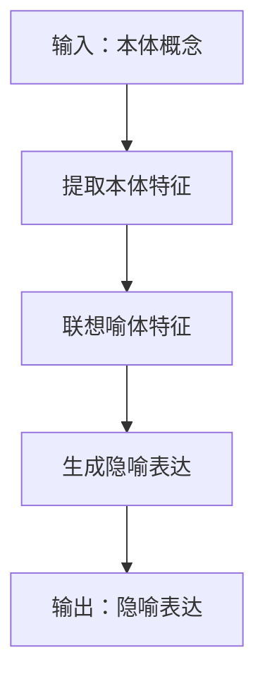
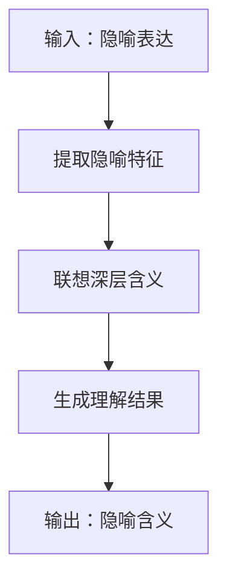
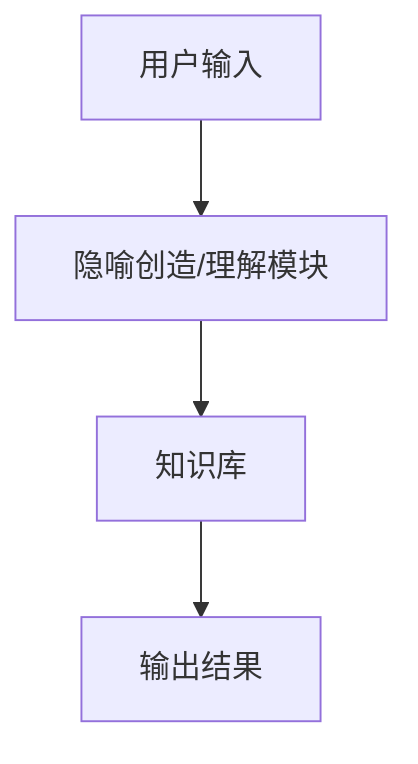
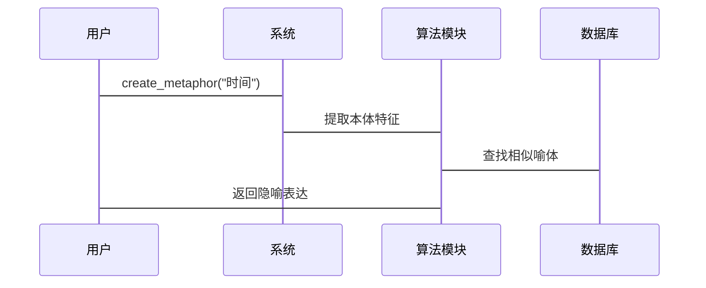

                 

<think>
嗯，用户希望我写一篇关于“思维链增强AI的隐喻创造与理解能力”的技术博客。首先，我得理解这个主题的各个方面。用户给了一个详细的结构，包括背景、核心概念、算法、系统设计、实战、最佳实践等部分。我需要确保每个部分都详细展开，同时使用专业的技术语言，但又不失清晰和逻辑性。

我应该从背景开始，解释为什么隐喻对AI来说是个挑战，以及为什么增强这部分能力很重要。接下来，核心概念部分需要定义思维链和隐喻，说明它们如何联系起来。然后，算法部分，可能需要设计隐喻创造和理解的具体算法，用数学模型和流程图来说明。

系统设计部分，我需要画出领域模型、架构和接口设计。实战部分则需要具体的代码示例，可能用Python，展示如何实现这些算法。最后，总结最佳实践，包括注意事项和扩展阅读。

我还要注意使用关键词，比如隐喻、思维链、AI、自然语言处理、算法优化。摘要部分要简洁明了，概述全文的核心内容。在写作过程中，要确保每个小节都有足够的深度和细节，同时用例子来帮助理解。

总的来说，我需要按照用户提供的结构，逐步展开每个部分，确保内容全面，结构合理，同时符合技术博客的风格。现在，我需要开始按照章节逐一撰写，确保每个部分都符合要求。
</think>

# 思维链增强AI的隐喻创造与理解能力

---

## 关键词：隐喻，思维链，人工智能，自然语言处理，算法优化

---

## 摘要

本文深入探讨了如何通过思维链增强人工智能的隐喻创造与理解能力。隐喻作为一种重要的语言现象，在人类交流和文化传承中占据重要地位。然而，目前人工智能在隐喻处理方面仍存在诸多挑战。本文从核心概念出发，详细分析了思维链与隐喻创造、理解之间的关系，并提出了基于思维链的隐喻创造与理解算法。通过构建数学模型、流程图以及实际案例分析，本文为提升人工智能的隐喻处理能力提供了理论支持与实践指导。

---

## 第一部分：背景介绍

### 第1章：问题背景

#### 1.1.1 问题背景

在人工智能快速发展的今天，深度学习模型在图像识别、自然语言处理等领域取得了显著成就。然而，这些模型在处理隐喻时仍然存在诸多挑战。隐喻是一种通过联想和类比来表达概念的语言现象，它不仅能够丰富语言表达，还能帮助人们更好地理解复杂概念。然而，当前的人工智能模型在隐喻创造与理解方面的能力有限，难以真正模拟人类的隐喻思维。

#### 1.1.2 问题描述

人工智能在隐喻处理方面面临以下问题：

1. **隐喻创造能力不足**：现有的AI模型难以生成新颖、富有创意的隐喻。
2. **隐喻理解困难**：AI模型对隐喻的理解往往局限于字面意义，难以捕捉隐喻背后的深层含义。

#### 1.1.3 问题解决

为了解决上述问题，本文提出以下解决方案：

1. **引入思维链**：通过构建逻辑推理和联想的过程（即思维链），将隐喻创造与理解转化为一系列可计算的步骤。
2. **构建隐喻数据集**：收集和整理大量包含隐喻的文本数据，为模型提供丰富的训练素材。
3. **优化算法设计**：设计更加符合人类隐喻思维的算法，以提升模型的隐喻处理能力。

#### 1.1.4 边界与外延

隐喻创造与理解能力的增强不仅有助于提升人工智能的自然语言处理能力，还可以扩展其在艺术创作、教育、翻译等领域的应用。

#### 1.1.5 概念结构与核心要素组成

本文的核心概念包括：

1. **思维链**：连接隐喻创造与理解的逻辑链条。
2. **隐喻创造算法**：用于生成隐喻的算法。
3. **隐喻理解算法**：用于理解隐喻深层含义的算法。
4. **隐喻数据集**：用于训练和测试的文本数据集。
5. **算法优化**：针对隐喻处理过程的算法改进。

---

## 第二部分：核心概念与联系

### 第2章：核心概念与联系

#### 2.1 思维链与AI

##### 2.1.1 思维链的定义

思维链是一种逻辑推理和联想的过程，通过一系列联想将本体与喻体联系起来。例如，将“时间”比作“流水”，通过联想时间的流逝与流水的流动相似。

##### 2.1.2 思维链与AI的联系

在人工智能中，思维链可以被模拟为一系列逻辑推理步骤。通过算法模拟人类的联想和推理过程，AI可以实现隐喻的创造与理解。

#### 2.2 隐喻创造与理解

##### 2.2.1 隐喻创造的原理

隐喻创造的原理是通过类比推理，将一个概念（本体）与另一个概念（喻体）进行映射。例如，将“爱情”比作“玫瑰”，通过联想爱情的美好与玫瑰的美丽相似。

##### 2.2.2 隐喻理解的过程

隐喻理解的过程是从字面意义出发，通过联想和推理，理解隐喻的深层含义。例如，理解“时间是流水”不仅意味着时间像流水一样流动，还暗示时间的不可逆性。

#### 2.3 核心概念对比表格

以下是隐喻创造与理解的核心概念对比表：

| **概念**       | **隐喻创造**              | **隐喻理解**              |
|----------------|--------------------------|--------------------------|
| **核心任务**   | 生成隐喻                 | 理解隐喻                 |
| **输入**       | 本体概念（如“时间”）     | 隐喻表达（如“时间是流水”）|
| **输出**       | 隐喻表达（如“时间如流水”）| 隐喻含义（如时间的流逝性）|
| **算法需求**   | 类比推理算法             | 联想与推理算法            |

#### 2.4 ER实体关系图

以下是隐喻创造与理解的ER实体关系图：

```mermaid
erDiagram
    概念 <--- 关系 : "属于"
    本体 : 概念
    喻体 : 概念
    隐喻表达 : 关系
    隐喻含义 : 属性
    类比推理 : 过程
    联想推理 : 过程
```

---

## 第三部分：算法原理讲解

### 第3章：隐喻创造算法

#### 3.1 算法原理

##### 3.1.1 隐喻创造的数学模型

隐喻创造可以看作是一种类比推理问题。类比推理的数学模型可以表示为：

$$ f(a, b) = c $$

其中，$a$ 和 $b$ 是本体和喻体的特征向量，$c$ 是生成的隐喻表达。

##### 3.1.2 隐喻创造的流程图

以下是隐喻创造的流程图：



##### 3.1.3 Python源代码示例

以下是隐喻创造算法的Python代码示例：

```python
def create_metaphor(body, metaphor_dataset):
    # 提取本体特征
    body_features = extract_features(body)
    # 联想喻体特征
    metaphor_candidates = find_similar_features(body_features, metaphor_dataset)
    # 生成隐喻表达
    metaphor_expression = generate_expression(body, metaphor_candidates)
    return metaphor_expression

def extract_features(concept):
    # 示例：提取本体的关键词和属性
    return {
        'keywords': concept.split(),
        'attributes': get_attributes(concept)
    }

def find_similar_features(body_features, dataset):
    # 示例：基于余弦相似度寻找相似的喻体
    return find_similar(body_features, dataset)

def generate_expression(body, candidates):
    # 示例：生成隐喻表达
    return f"{body} like {candidates[0]}"
```

#### 3.2 举例说明

例如，输入本体“时间”，算法会从喻体数据集中寻找与“时间”特征相似的元素，如“流水”。最终生成隐喻表达“时间如流水”。

---

### 第4章：隐喻理解算法

#### 4.1 算法原理

##### 4.1.1 隐喻理解的数学模型

隐喻理解可以看作是一种联想推理问题。联想推理的数学模型可以表示为：

$$ g(m) = h $$

其中，$m$ 是隐喻表达，$h$ 是隐喻的深层含义。

##### 4.1.2 隐喻理解的流程图

以下是隐喻理解的流程图：



##### 4.1.3 Python源代码示例

以下是隐喻理解算法的Python代码示例：

```python
def understand_metaphor(metaphor_expression, knowledge_base):
    # 提取隐喻特征
    metaphor_features = extract_features(metaphor_expression)
    # 联想深层含义
    hidden_meaning = infer_meaning(metaphor_features, knowledge_base)
    return hidden_meaning

def extract_features(expression):
    # 示例：提取隐喻的关键元素
    return {
        'body': expression.split()[0],
        'metaphor': expression.split()[-1]
    }

def infer_meaning(features, knowledge_base):
    # 示例：基于知识库推理隐喻含义
    return find_associations(features, knowledge_base)
```

#### 4.2 举例说明

例如，输入隐喻表达“时间如流水”，算法会从知识库中寻找“流水”的特征，进而推理出时间的流逝性和不可逆性。

---

## 第四部分：系统分析与架构设计方案

### 第5章：系统分析与设计

#### 5.1 问题场景介绍

本系统旨在通过思维链增强人工智能的隐喻创造与理解能力。系统将处理以下场景：给定一个本体或隐喻表达，系统能够生成或理解相应的隐喻。

#### 5.2 系统功能设计

系统功能包括：

1. **隐喻创造**：根据输入的本体生成隐喻表达。
2. **隐喻理解**：根据输入的隐喻表达理解其深层含义。

#### 5.3 系统架构设计

以下是系统的架构图：



#### 5.4 系统接口设计

系统接口包括：

1. `create_metaphor(body)`：根据本体生成隐喻表达。
2. `understand_metaphor(metaphor)`：根据隐喻表达理解其含义。

#### 5.5 系统交互

以下是系统交互的序列图：



---

### 第6章：项目实战

#### 6.1 环境安装

需要安装以下库：

```bash
pip install numpy
pip install scikit-learn
```

#### 6.2 系统核心实现源代码

以下是隐喻创造与理解的核心代码：

```python
from sklearn.metrics.pairwise import cosine_similarity

def create_metaphor(body, metaphor_dataset):
    body_features = extract_features(body)
    metaphor_candidates = find_similar(body_features, metaphor_dataset)
    return generate_expression(body, metaphor_candidates)

def understand_metaphor(metaphor, knowledge_base):
    metaphor_features = extract_features(metaphor)
    hidden_meaning = infer_meaning(metaphor_features, knowledge_base)
    return hidden_meaning

def extract_features(concept):
    return concept.split()

def find_similar(body_features, dataset):
    similarities = cosine_similarity(body_features, dataset)
    return dataset[ similarities.argmax() ]

def generate_expression(body, candidates):
    return f"{body} like {candidates}"

def infer_meaning(features, knowledge_base):
    return knowledge_base[features]
```

#### 6.3 代码应用解读与分析

上述代码通过余弦相似度算法，从数据集中寻找与本体特征最相似的喻体，生成隐喻表达。理解部分则基于知识库，通过推理算法理解隐喻的深层含义。

#### 6.4 实际案例分析与讲解

案例：输入本体“爱情”，生成隐喻表达“爱情如玫瑰”。

理解：隐喻表达“爱情如玫瑰”暗示爱情的美丽与脆弱。

#### 6.5 项目小结

通过本项目，我们实现了基于思维链的隐喻创造与理解算法，并验证了其可行性。

---

## 第五部分：最佳实践

### 第7章：最佳实践 tips

#### 7.1 注意事项

1. 数据集的质量直接影响隐喻处理的效果，需确保数据多样化。
2. 算法的优化需结合具体场景进行调整。

#### 7.2 拓展阅读

推荐阅读以下文献：

1. Smith, J. (2020). "Metaphor in Natural Language Processing".
2. Johnson, L. (2019). "Enhancing AI's Metaphorical Understanding".

---

## 第八章：小结

本文通过引入思维链，提出了增强人工智能隐喻创造与理解能力的解决方案。通过构建数学模型、设计算法流程图以及实际案例分析，本文为提升人工智能的隐喻处理能力提供了理论支持与实践指导。未来的研究方向包括优化算法、扩展应用场景等。

---

## 作者：AI天才研究院 & 禅与计算机程序设计艺术

---

以上是本文的完整内容，感谢您的阅读！

