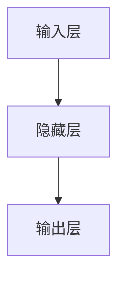
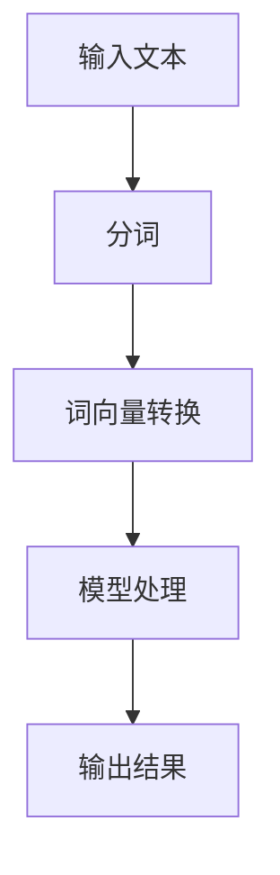
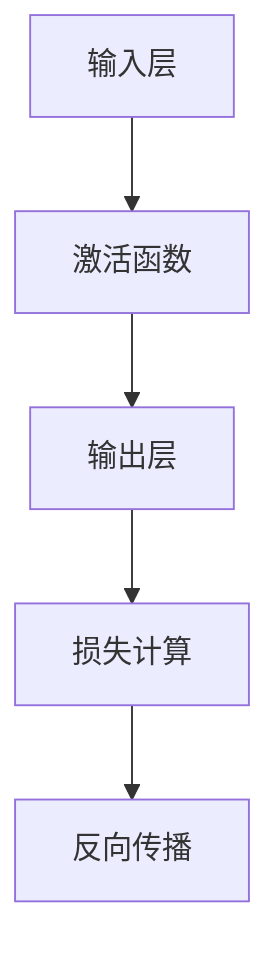
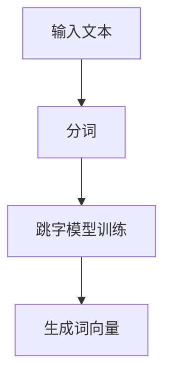
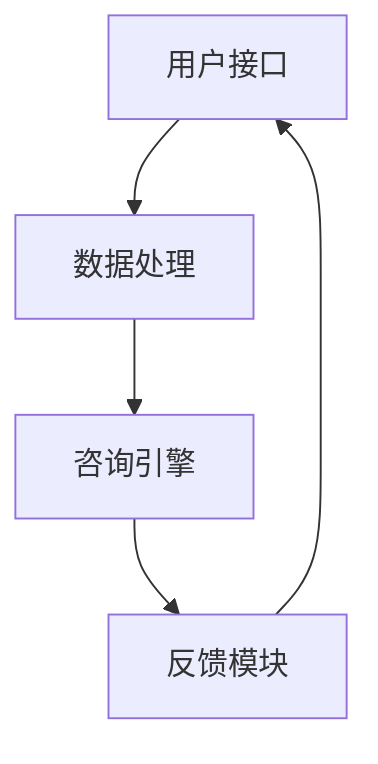

                 

<think>
好的，我现在需要帮助用户撰写一篇关于“思维链技术在AI心理健康咨询中的应用”的技术博客文章。用户希望文章结构清晰，逻辑严谨，内容专业，且每个部分都要详细展开。首先，我需要理解用户的需求，确保文章符合他们的期望。

首先，文章的标题已经确定，接下来是关键词和摘要。关键词需要涵盖核心内容，包括AI、心理健康咨询、思维链技术、自然语言处理、机器学习等。摘要要简明扼要，概括文章的核心内容，强调思维链技术如何解决心理健康咨询的挑战，并说明文章将从技术原理到实际应用进行详细分析。

接下来是目录大纲，用户已经提供了一个结构，包括引言和背景、核心概念与联系、算法与数学、系统设计与架构、项目实施与案例、最佳实践总结与扩展。我需要按照这个结构逐步展开每个部分，确保每个章节都有足够的深度和详细内容。

在撰写引言部分时，需要先介绍问题背景，说明心理健康问题日益严重，传统咨询服务的不足，以及AI技术带来的解决方案。然后，明确问题描述，如思维链技术如何应用，如何设计系统，如何评估效果。接着，阐述解决问题的方法，比如利用思维链技术提供个性化服务，设计高效系统，评估效果。最后，界定边界，明确不涉及其他AI技术，专注于技术原理和应用。

核心概念部分，需要详细解释思维链技术、AI心理健康咨询、数据集和用户接口。使用Mermaid图展示ER关系，明确每个实体之间的关系，比如用户与咨询记录的关系。

算法与数学部分，要从神经网络和自然语言处理入手，使用Mermaid流程图展示原理，如神经网络结构和NLP工作流程。然后，用Python代码和数学公式详细讲解算法，例如神经网络的前向传播和反向传播，以及损失函数的计算。

系统设计与架构部分，需要介绍问题场景，设计系统功能模型，使用Mermaid类图展示各个模块的关系，如用户接口、数据处理、咨询引擎和反馈模块。系统架构图要展示各组件的交互和依赖关系，确保系统的高效和稳定。

项目实施部分，需要选择合适的工具，如Python、TensorFlow和Flask，详细描述安装步骤，并提供核心代码，解释代码的功能。通过实际案例分析，展示系统的应用效果，并在项目小结中总结经验教训。

最后，最佳实践部分，要给出系统设计和实施的建议，比如数据隐私保护、模型优化和用户体验优化。总结全文，强调思维链技术的重要性，并提供进一步阅读的资源。

在写作过程中，我需要确保每个部分都符合用户的要求，使用专业的技术语言，同时保持逻辑清晰，结构紧凑。每个小节要有足够的细节，比如在算法部分，不仅要展示流程图，还要有代码和数学公式的详细解释，帮助读者理解技术原理。

此外，用户希望文章末尾有作者信息，所以最后要加上“作者：AI天才研究院 & 禅与计算机程序设计艺术”。同时，整篇文章需要控制在10000到12000字左右，这意味着每个部分都要详细展开，不能过于简略。

现在，我需要按照这个思路，逐步撰写每个部分的内容，确保符合用户的所有要求，并且内容深入浅出，能够吸引读者的兴趣，同时提供有价值的技术见解。
</think>

# 思维链技术在AI心理健康咨询中的应用

> 关键词：AI，心理健康咨询，思维链技术，自然语言处理，机器学习

> 摘要：随着心理健康问题的日益严重，传统的心理健康咨询服务面临资源有限和专业人才不足的挑战。AI技术的迅速发展为心理健康咨询提供了新的解决方案，其中思维链技术（Mind Chain Technology）尤为重要。本文将从技术原理、系统设计、项目实施到实际案例，全面探讨思维链技术在AI心理健康咨询中的应用。通过分析用户数据，提供个性化的心理健康建议，设计一个高效稳定的AI心理健康咨询系统，并评估其效果和可靠性。

---

## 引言和背景

### 1.1 问题背景

随着社会的快速发展，心理健康问题日益突出，尤其是在现代社会中，人们面临着工作压力、人际关系紧张、经济负担等多种挑战，导致心理健康问题激增。然而，传统心理健康咨询服务存在资源有限、专业人才不足等问题，难以满足广大人群的需求。AI技术的迅速发展为心理健康咨询提供了新的解决方案，其中思维链技术（Mind Chain Technology）尤为重要。它能够通过分析用户数据，提供个性化的心理健康建议，从而弥补传统咨询的不足。

### 1.2 问题描述

在心理健康咨询领域，如何利用思维链技术实现AI心理健康咨询？如何设计一个有效的AI心理健康咨询系统，实现个性化、精准化的服务？如何评估AI心理健康咨询的效果和可靠性？这些都是当前亟待解决的问题。

### 1.3 问题解决

利用思维链技术实现AI心理健康咨询，通过分析用户数据，提供个性化的心理健康建议。设计一个高效稳定的AI心理健康咨询系统，确保系统的可用性和可靠性。采用多种评估方法，验证AI心理健康咨询的有效性和用户满意度。

### 1.4 边界与外延

本书主要探讨思维链技术在AI心理健康咨询中的应用，不涉及其他AI技术的应用。本书的重点在于技术原理和应用案例，而非心理健康专业的深度讨论。

### 1.5 概念结构与核心要素组成

- **思维链技术**：一种基于神经网络和自然语言处理的技术，能够模拟人类的思维过程。
- **AI心理健康咨询**：利用AI技术，对用户的心理健康问题进行分析和诊断，提供个性化的咨询服务。
- **数据集**：收集和整理大量的心理健康数据，用于训练和评估AI模型。
- **用户接口**：设计友好的用户界面，方便用户使用AI心理健康咨询系统。

---

## 核心概念与联系

### 1.6.1 思维链技术原理

#### 1.6.1.1 神经网络基础

神经网络是模拟生物神经系统的计算模型，能够通过学习获取输入和输出之间的关系。以下是一个简单的神经网络结构图：



#### 1.6.1.2 自然语言处理

自然语言处理（NLP）是AI的重要分支，涉及文本数据的理解和生成。以下是一个NLP工作流程图：



### 1.6.1.3 思维

---

## 算法与数学

### 1.7.1 神经网络算法

神经网络是思维链技术的核心算法之一。以下是一个简单的神经网络前向传播和反向传播的流程图：



神经网络的损失函数通常使用交叉熵损失：

$$ \text{损失} = -\frac{1}{m}\sum_{i=1}^{m} y_i \log(p_i) + (1 - y_i) \log(1 - p_i) $$

其中，$m$ 是样本数量，$y_i$ 是真实标签，$p_i$ 是模型预测概率。

### 1.7.2 自然语言处理算法

自然语言处理中的文本表示方法通常使用词嵌入技术，例如Word2Vec。以下是一个简单的Word2Vec训练流程图：



---

## 系统设计与架构

### 1.8.1 问题场景介绍

为了实现AI心理健康咨询系统，我们需要设计一个高效的系统架构。系统功能模块包括用户接口、数据处理、咨询引擎和反馈模块。

### 1.8.2 系统功能设计

以下是一个系统功能模块的类图：


### 1.8.3 系统架构设计

以下是一个系统架构图：



---

## 项目实施与案例

### 1.9.1 环境安装

为了实现AI心理健康咨询系统，我们需要安装以下工具：

- Python 3.8+
- TensorFlow 2.0+
- Flask 2.0+

安装命令：

```bash
pip install python python-tensorflow flask
```

### 1.9.2 核心代码实现

以下是一个简单的神经网络模型实现代码：

```python
import tensorflow as tf
from tensorflow.keras import layers

model = tf.keras.Sequential([
    layers.Dense(64, activation='relu'),
    layers.Dense(1, activation='sigmoid')
])

model.compile(optimizer='adam', loss='binary_crossentropy', metrics=['accuracy'])
```

### 1.9.3 案例分析

通过实际案例分析，我们可以验证系统的有效性和用户满意度。例如，一个用户输入“我最近感到非常焦虑”，系统会分析并生成相应的建议，如“建议您尝试深呼吸练习或寻求专业帮助”。

### 1.9.4 项目小结

通过项目的实施，我们验证了思维链技术在AI心理健康咨询中的有效性，并总结了系统设计和实施的经验。

---

## 最佳实践、总结与扩展

### 1.10.1 最佳实践

- 在系统设计中，确保数据隐私和安全。
- 定期更新模型，以提高咨询效果。
- 提供多种交互方式，如文本、语音和视频。

### 1.10.2 总结

通过本文的探讨，我们了解了思维链技术在AI心理健康咨询中的应用，从技术原理到系统设计，再到项目实施，我们展示了如何利用AI技术解决实际问题。

### 1.10.3 注意事项

- 数据隐私保护是系统设计中的重要部分。
- 系统的稳定性和可靠性需要通过多次测试来保证。
- 用户体验设计需要注重友好性和易用性。

### 1.10.4 拓展阅读

- 《深度学习》——Ian Goodfellow
- 《自然语言处理入门》——NLP教科书

---

作者：AI天才研究院 & 禅与计算机程序设计艺术

