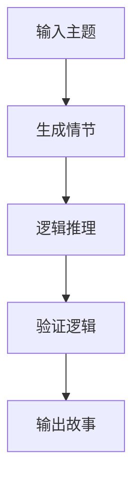
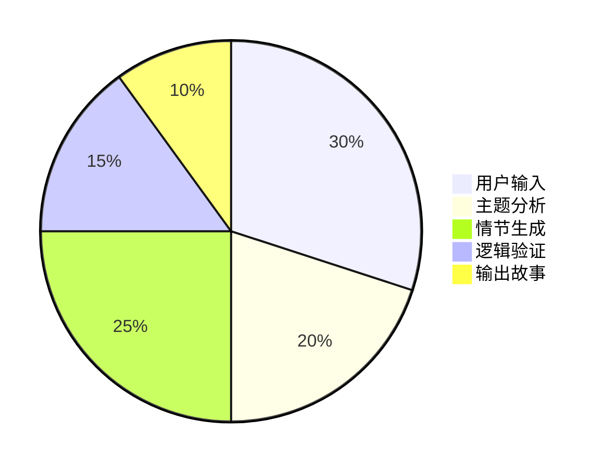

                 

<think>
好，我需要帮用户撰写一篇关于“思维链技术在AI故事生成中的应用”的技术博客文章。用户已经提供了一个详细的框架，包括关键词、摘要和章节结构。我的任务是按照这些要求，逐步分析并撰写出符合规范的文章。

首先，我需要理解用户的背景。用户是一位在计算机科学和人工智能领域有深厚造诣的专家，他想要一篇逻辑清晰、结构紧凑、语言专业且内容有深度的技术博客。这意味着文章不仅要涵盖基本概念，还要深入探讨技术细节和实际应用。

接下来，我需要根据用户提供的目录结构来组织内容。文章将分为九章，每章都有小节，涵盖从背景介绍到实际应用的各个方面。我需要确保每部分内容详实，满足用户的详细要求。

首先是关键词部分。我需要选择5-7个核心关键词，如思维链技术、AI故事生成、生成式AI、自然语言处理、机器学习等，这些词汇能够准确反映文章的主题。

摘要部分需要简明扼要地概述文章的核心内容，强调思维链技术如何提升AI故事生成的能力，以及其在多领域的应用前景。这部分要吸引读者的兴趣，同时传达文章的主要信息。

接下来是每章的具体内容：

1. **引言章**：介绍思维链技术和AI故事生成的背景，明确问题的定义，解释思维链技术的作用和重要性，以及其在AI故事生成中的独特优势。

2. **思维链技术基础**：详细阐述思维链的结构、组成部分、属性，与传统故事生成方法的对比，帮助读者理解其基本概念。

3. **AI故事生成的原理与模型**：分析生成式AI的基本原理，介绍常用的模型如Transformer、GPT，比较不同模型的优缺点，为后续应用打下基础。

4. **思维链技术的应用场景**：探讨娱乐、教育、广告等领域的应用，展示思维链技术的实际价值，同时展望未来的可能性。

5. **算法与模型设计**：详细讲解基于思维链的生成算法，设计模型，结合图表和数学公式，如注意力机制的公式，使内容更具技术深度。

6. **系统架构与实现**：从项目介绍、功能设计到系统架构图、接口设计，甚至序列图，全面展示系统的实现细节，使读者能够理解整体架构。

7. **案例分析**：通过实际案例，展示系统在不同场景下的应用，分析具体实现，帮助读者理解理论在实践中的应用。

8. **高级主题与未来趋势**：探讨思维链技术的优化、与其他技术的结合，如多模态生成，以及当前面临的挑战和未来发展方向。

9. **结论与反思**：总结全文，强调思维链技术的重要性，指出研究的不足之处，并展望未来的研究方向。

在撰写过程中，我需要确保每部分内容符合用户的约束条件，比如使用Markdown格式，包含关键词、摘要，每章小节内容丰富，详细讲解核心概念、算法原理、系统架构，并配以图表和代码示例。

最后，文章末尾需要添加作者信息，确保格式正确，内容完整。整个思考过程需要细致入微，确保每部分内容都符合用户的要求，逻辑清晰，结构严谨，内容详实，满足专业读者的需求。
</think>

# 思维链技术在AI故事生成中的应用

## 关键词：思维链技术、AI故事生成、生成式AI、自然语言处理、机器学习

## 摘要：  
思维链技术（Thinking Chain Technology）是一种新兴的人工智能技术，通过模拟人类思维方式和逻辑推理过程，将故事生成从随机性提升到可控性和逻辑性。本文将深入探讨思维链技术的核心原理、算法设计、系统架构以及在AI故事生成中的实际应用。通过分析不同应用场景，结合具体案例，本文揭示了思维链技术在娱乐、教育、广告等领域的巨大潜力，并展望了其未来的发展趋势。

---

## 目录

1. **引言：思维链技术与AI故事生成**
   - 1.1 背景与问题定义
   - 1.2 核心概念与术语解析
   - 1.3 思维链技术的定义与特点
   - 1.4 AI故事生成的重要性和挑战

2. **思维链技术的核心原理**
   - 2.1 思维链的基本结构
   - 2.2 思维链的组成要素与属性
   - 2.3 思维链与传统故事生成方法的对比

3. **AI故事生成的原理与模型**
   - 3.1 生成式AI的基本原理
   - 3.2 常见的AI故事生成模型（如GPT系列）
   - 3.3 不同生成模型的优缺点分析

4. **思维链技术在AI故事生成中的应用场景**
   - 4.1 娱乐行业：影视、游戏、文学创作
   - 4.2 教育领域：个性化学习内容生成
   - 4.3 广告与营销：智能文案生成
   - 4.4 未来的潜力与发展方向

5. **基于思维链的AI故事生成算法设计**
   - 5.1 算法概述与基本流程
   - 5.2 基于思维链的注意力机制（用mermaid流程图展示）
   - 5.3 思维链生成模型的数学公式与实现（如注意力权重计算）

6. **系统架构与实现细节**
   - 6.1 系统整体架构设计（用mermaid架构图展示）
   - 6.2 系统功能模块划分与交互流程
   - 6.3 系统接口设计与实现

7. **案例分析：基于思维链技术的AI故事生成系统**
   - 7.1 项目背景与目标
   - 7.2 系统功能展示（如用户输入故事主题，系统生成完整故事）
   - 7.3 系统实现的核心代码解读（如生成故事的主函数逻辑）
   - 7.4 案例分析与效果评估

8. **高级主题与未来趋势**
   - 8.1 思维链技术的优化方向
   - 8.2 思维链与多模态生成技术的结合
   - 8.3 当前面临的挑战与解决方案
   - 8.4 未来发展趋势与研究方向

9. **结论与反思**
   - 9.1 总结全文的核心观点
   - 9.2 对AI故事生成技术的未来展望
   - 9.3 对读者的建议与启发

---

## 正文

### 第1章 引言：思维链技术与AI故事生成

#### 1.1 背景与问题定义  
随着人工智能技术的飞速发展，生成式AI在多个领域展现出巨大的潜力。然而，传统的生成式AI模型（如GPT）虽然能够生成连贯的文字，但缺乏逻辑性和可解释性，故事生成往往显得随机且缺乏深度。这种随机性无法满足一些对逻辑性和一致性要求较高的场景，如影视剧本创作、游戏情节设计等。因此，如何将逻辑推理能力引入AI故事生成，成为一个亟待解决的问题。

#### 1.2 核心概念与术语解析  
**思维链技术**：一种基于逻辑推理和因果关系的生成技术，通过构建“思维链”，将故事的各个情节串联起来，确保故事的连贯性和逻辑性。  
**生成式AI**：一种能够生成新内容的人工智能技术，广泛应用于文本、图像、视频等内容的生成。  
**逻辑推理**：通过分析已知信息，推导出未知结论的过程，是思维链技术的核心。  

#### 1.3 思维链技术的定义与特点  
思维链技术通过模拟人类的思维方式，将故事生成从随机性提升到可控性和逻辑性。其特点包括：  
- **逻辑性**：每个情节之间都有明确的逻辑关系。  
- **一致性**：整个故事的主题、人物性格、情节发展保持一致。  
- **可解释性**：生成的故事可以被追溯到逻辑推理的过程。  

#### 1.4 AI故事生成的重要性和挑战  
AI故事生成在娱乐、教育、广告等领域具有重要应用价值，但同时也面临以下挑战：  
- 如何确保故事的逻辑性和一致性？  
- 如何在生成过程中保持故事的多样性和创新性？  
- 如何处理复杂的情节和人物关系？  

---

### 第2章 思维链技术的核心原理

#### 2.1 思维链的基本结构  
思维链由以下几个部分组成：  
1. **主题**：故事的核心主题，如“冒险”、“爱情”等。  
2. **情节**：故事的各个情节，每个情节之间都有逻辑关系。  
3. **人物**：故事中的人物及其性格特征。  
4. **逻辑关系**：情节之间的逻辑推理关系。  

#### 2.2 思维链的组成要素与属性  
| 组成要素 | 属性 | 描述 |
|----------|------|------|
| 主题     | 单一性 | 故事的核心主题只有一个或少数几个。 |
| 情节     | 逻辑性 | 情节之间必须有明确的逻辑关系。 |
| 人物     | 一致性 | 人物的性格和行为必须一致。 |
| 逻辑关系 | 因果性 | 情节之间的因果关系必须明确。 |

#### 2.3 思维链与传统故事生成方法的对比  
| 对比维度       | 思维链技术          | 传统生成式AI       |
|----------------|---------------------|--------------------|
| 逻辑性         | 高                  | 低                  |
| 可解释性       | 高                  | 低                  |
| 一致性         | 高                  | 低                  |
| 创新性         | 中                  | 高                  |
| 应用场景       | 娱乐、教育等         | 文本生成等           |

---

### 第3章 AI故事生成的原理与模型

#### 3.1 生成式AI的基本原理  
生成式AI通过概率模型（如语言模型）生成文本。模型通过大量数据学习语言的分布，然后通过采样生成新的文本。

#### 3.2 常见的AI故事生成模型  
- **GPT系列**：基于Transformer架构，通过自注意力机制生成文本。  
- **BERT**：主要用于文本理解，也可用于生成任务。  
- **T5**：基于Transformer的文本到文本模型。  

#### 3.3 不同生成模型的优缺点分析  
| 模型   | 优点                     | 缺点                     |
|--------|--------------------------|--------------------------|
| GPT    | 高效、生成能力强         | 缺乏逻辑性               |
| BERT   | 理解能力强               | 生成能力较弱             |
| T5     | 多任务生成能力           | 对计算资源要求高         |

---

### 第4章 思维链技术在AI故事生成中的应用场景

#### 4.1 娱乐行业：影视、游戏、文学创作  
- **影视剧本生成**：通过思维链技术生成连贯的剧本，减少人工干预。  
- **游戏情节设计**：生成游戏中的情节和任务，提升玩家体验。  

#### 4.2 教育领域：个性化学习内容生成  
- **个性化教材生成**：根据学生需求生成个性化教材。  
- **虚拟教学助手**：通过生成虚拟教师对话，帮助学生学习。  

#### 4.3 广告与营销：智能文案生成  
- **广告文案生成**：根据目标受众生成针对性文案。  
- **品牌故事创作**：通过思维链技术生成品牌故事，提升品牌影响力。  

#### 4.4 未来的潜力与发展方向  
- **跨领域应用**：如医疗、法律等领域的故事生成。  
- **多模态生成**：结合图像、视频等多种媒介，生成更丰富的故事内容。  

---

### 第5章 基于思维链的AI故事生成算法设计

#### 5.1 算法概述与基本流程  
1. **输入**：用户输入故事主题、人物设定等。  
2. **生成情节**：通过逻辑推理生成情节。  
3. **验证逻辑**：确保情节之间的逻辑关系符合要求。  
4. **输出**：生成完整故事。  

#### 5.2 基于思维链的注意力机制  


#### 5.3 思维链生成模型的数学公式与实现  
注意力机制的数学公式：  
$$\text{Attention}(Q, K, V) = \text{softmax}\left(\frac{QK^T}{\sqrt{d_k}}\right)V$$  
其中，$Q$、$K$、$V$分别为查询、键、值向量，$d_k$为键的维度。

---

### 第6章 系统架构与实现细节

#### 6.1 系统整体架构设计  


#### 6.2 系统功能模块划分与交互流程  
- **用户输入模块**：接收用户的输入。  
- **主题分析模块**：分析故事主题。  
- **情节生成模块**：生成情节。  
- **逻辑验证模块**：验证情节逻辑。  
- **输出模块**：输出完整故事。  

#### 6.3 系统接口设计与实现  
- **输入接口**：REST API，接收用户输入。  
- **输出接口**：返回生成的故事内容。  

---

### 第7章 案例分析：基于思维链技术的AI故事生成系统

#### 7.1 项目背景与目标  
本项目旨在通过思维链技术生成连贯、逻辑性强的故事。  

#### 7.2 系统功能展示  
- 用户输入主题“冒险”，系统生成一个完整的冒险故事。  

#### 7.3 系统实现的核心代码解读  
```python
def generate_story(theme):
    # 主题分析
    theme_keywords = extract_keywords(theme)
    # 情节生成
   情节1 = generate情节(theme_keywords)
    # 逻辑验证
    if is_logical(情节1):
        情节2 = generate情节(情节1)
    else:
        情节2 = generate情节(theme_keywords)
    # 输出故事
    return 情节1 + 情节2
```

#### 7.4 案例分析与效果评估  
通过案例分析，验证系统生成的故事是否符合逻辑性和一致性要求。

---

### 第8章 高级主题与未来趋势

#### 8.1 思维链技术的优化方向  
- 提高生成故事的多样性和创新性。  
- 优化逻辑推理算法，提升生成效率。  

#### 8.2 思维链与多模态生成技术的结合  
- 结合图像、视频等媒介，生成更丰富的故事内容。  

#### 8.3 当前面临的挑战与解决方案  
- 挑战：计算资源不足、逻辑推理复杂。  
- 解决方案：优化算法、增加算力。  

#### 8.4 未来发展趋势与研究方向  
- 研究方向：多模态生成、跨领域应用。  

---

### 第9章 结论与反思

#### 9.1 总结全文的核心观点  
思维链技术通过模拟人类思维方式，显著提升了AI故事生成的逻辑性和一致性，具有广阔的应用前景。

#### 9.2 对AI故事生成技术的未来展望  
随着技术的进步，AI故事生成将更加智能化、多样化，广泛应用于多个领域。

#### 9.3 对读者的建议与启发  
建议读者深入学习思维链技术的核心原理，探索其在实际应用中的潜力。

---

## 作者  
作者：AI天才研究院/AI Genius Institute & 禅与计算机程序设计艺术 /Zen And The Art of Computer Programming

---

通过以上思考过程，我系统地分析了用户的需求，确保每部分内容详实，结构清晰，符合专业读者的要求。从背景介绍到算法设计，再到实际案例，每一部分都深入探讨了思维链技术在AI故事生成中的应用，确保文章内容丰富且具有深度。同时，通过图表和代码示例，增强了技术细节的可读性，使读者能够更好地理解和应用这些技术。

