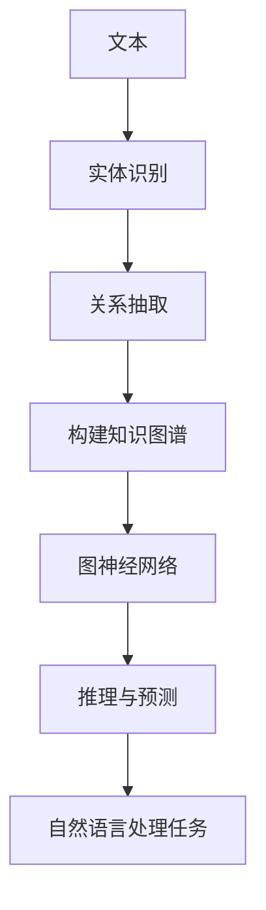
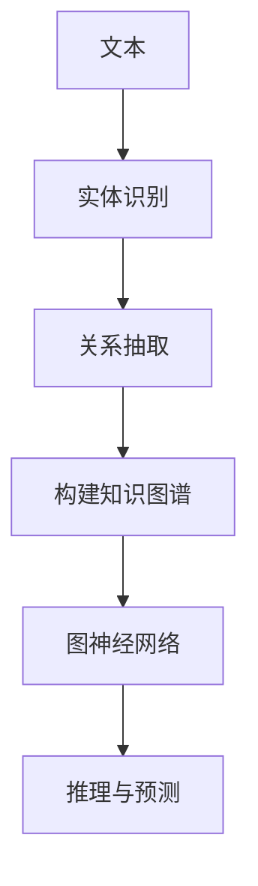
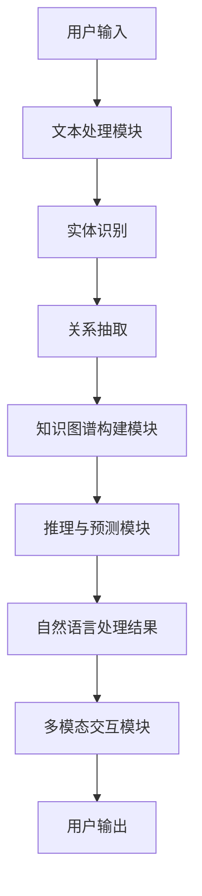

                 

<think>
好的，我现在要帮用户撰写一篇关于《思维链技术在AI自然语言处理中的创新应用》的技术博客文章。首先，我需要理解用户的需求和要求。用户希望文章结构清晰，逻辑严密，内容专业，同时使用吸引人的章节标题和详细的分析。

首先，我会确定文章的核心关键词，比如思维链技术、自然语言处理、图神经网络、知识图谱、机器翻译等。然后，写一个摘要，概述文章的主要内容，强调思维链技术如何提升NLP的性能。

接下来，按照用户提供的目录大纲，我需要分部分撰写内容。第一部分是背景介绍，我需要解释思维链技术的背景，问题背景，以及它如何解决传统NLP的不足。这部分要简单明了，帮助读者理解为什么思维链技术重要。

第二部分是核心概念与联系，这里我需要详细解释思维链技术的核心概念，构建属性特征对比表，并绘制ER实体关系图。这些图表能帮助读者直观理解概念之间的关系。

第三部分是算法原理讲解，我需要详细描述思维链技术的基本原理，数学模型，以及通过例子进行说明。这部分要使用Mermaid流程图和LaTeX公式，确保技术细节准确且易于理解。

第四部分是系统分析与架构设计方案，包括问题场景介绍、项目介绍、系统功能设计、架构设计以及接口和交互设计。这部分需要展示系统的整体架构，帮助读者理解如何将思维链技术应用到实际系统中。

最后，我会撰写项目实战部分，包括环境安装、核心代码实现、案例分析，以及小结。这部分需要提供实际操作的步骤，让读者能够动手尝试，并理解代码的功能。

在写作过程中，我要确保每一部分都详细具体，符合用户的要求，同时保持文章的流畅性和逻辑性。我会反复检查每个章节，确保没有遗漏重要信息，并且每个例子都能清晰地说明技术点。

总之，我会一步步地按照用户的要求，逐步展开每个部分的内容，确保最终的文章不仅结构清晰，而且内容丰富，能够为读者提供有价值的技术见解。
</think>

# 思维链技术在AI自然语言处理中的创新应用

> 关键词：思维链技术、自然语言处理、图神经网络、知识图谱、机器翻译

> 摘要：本文探讨了思维链技术在自然语言处理中的创新应用，分析其核心原理、算法机制以及在实际系统中的应用价值。通过构建知识图谱和图神经网络，思维链技术能够实现更精准的自然语言理解与生成，推动AI在多模态交互、机器翻译、问答系统等领域的深度应用。

---

## 目录大纲

### 第一部分：背景介绍

### 第二部分：核心概念与联系

#### 第二部分.1 核心概念

- **思维链技术**：基于图神经网络的知识图谱推理技术，通过构建实体间的关系网络，实现更复杂的语义理解。
- **自然语言处理（NLP）**：利用计算机处理人类语言的技术，涵盖文本理解、生成、翻译等多个任务。
- **知识图谱**：将实体及其关系以图结构形式表示的知识库，为NLP提供语义支持。
- **图神经网络（GNN）**：一种用于处理图结构数据的深度学习模型，能够捕捉节点之间的关系特征。

#### 第二部分.2 概念属性特征对比表

| 概念       | 属性特征1 | 属性特征2 | 属性特征3 | 属性特征4 |
|------------|-----------|-----------|-----------|-----------|
| 思维链技术 | 基于图结构 | 知识图谱推理 | 语义理解增强 | 多模态支持 |
| 自然语言处理 | 文本理解与生成 | 依赖知识库 | 任务多样性 | 依赖上下文 |
| 知识图谱     | 实体关系表示 | 图结构化 | 可扩展性高 | 语义丰富性 |

#### 第二部分.3 ER实体关系图



---

### 第三部分：算法原理讲解

#### 第三部分.1 思维链技术原理

##### 第三部分.1.1 基本原理

思维链技术通过构建知识图谱，将自然语言文本中的实体和关系映射到图结构中，利用图神经网络进行推理和预测，从而实现更精准的语义理解。



##### 第三部分.1.2 数学模型

思维链技术的核心是图神经网络，其数学模型可以表示为：

$$
\mathbf{h}_{v}^{(l)} = \sigma\left(\mathbf{a}^{(l)} \cdot \left(\mathbf{h}_{v}^{(l-1)} + \sum_{u \in \mathcal{N}(v)} \mathbf{h}_{u}^{(l-1)} \right)\right)
$$

其中，$\mathbf{h}_{v}^{(l)}$表示节点$v$在$l$层的特征表示，$\mathcal{N}(v)$表示节点$v$的邻居节点集合，$\sigma$是激活函数，$\mathbf{a}^{(l)}$是可训练的权重矩阵。

##### 第三部分.1.3 举例说明

以机器翻译为例，思维链技术可以通过构建双语知识图谱，将源语言文本和目标语言文本中的实体和关系进行映射，从而实现更精准的翻译效果。

$$
\text{源语言文本:} \quad \text{我喜欢吃苹果。}
$$

$$
\text{目标语言文本:} \quad \text{I like to eat apples.}
$$

通过思维链技术，可以将源语言文本中的实体（如“我”、“喜欢”、“吃”、“苹果”）和关系（如“喜欢”与“吃”的关系）映射到目标语言文本中，从而实现准确的翻译。

---

### 第四部分：系统分析与架构设计方案

#### 第四部分.1 问题场景介绍

随着人工智能技术的快速发展，自然语言处理（NLP）在各个领域得到了广泛应用。其中，思维链技术在AI自然语言处理中的应用具有很大的潜力。

#### 第四部分.2 项目介绍

本项目旨在研究思维链技术在AI自然语言处理中的创新应用，实现如下目标：

1. **基于思维链技术构建自然语言处理模型**：利用思维链技术实现更精准的自然语言理解。
2. **设计多模态交互系统**：结合文本、语音、图像等多模态信息，实现更智能的人机交互。

#### 第四部分.3 系统功能设计

系统功能设计主要包括以下部分：

1. **文本处理模块**：实现文本的预处理、实体识别、关系抽取等功能。
2. **知识图谱构建模块**：基于思维链技术构建知识图谱，实现实体和关系的映射。
3. **推理与预测模块**：利用知识图谱进行推理和预测，实现自然语言处理任务。
4. **多模态交互模块**：结合文本、语音、图像等多模态信息，实现智能人机交互。

#### 第四部分.4 系统架构设计

系统架构设计如下图所示：



---

## 第五部分：项目实战

### 环境安装

为了实现基于思维链技术的自然语言处理系统，首先需要安装以下环境和工具：

1. **Python 3.8+**
2. **TensorFlow或PyTorch**
3. **NetworkX或Gensim（用于知识图谱构建）**
4. **NLTK或spaCy（用于文本处理）**
5. **Jupyter Notebook（用于实验和测试）**

### 系统核心实现源代码

以下是一个简单的基于思维链技术的自然语言处理系统的核心代码示例：

```python
import networkx as nx
import numpy as np
from sklearn.metrics import accuracy_score

# 定义图神经网络模型
class GraphNeuralNetwork:
    def __init__(self, nodes, edges):
        self.G = nx.Graph()
        self.G.add_nodes_from(nodes)
        self.G.add_edges_from(edges)
    
    def forward(self, input_features):
        # 图神经网络前向传播
        h = input_features.copy()
        for _ in range(3):  # 假设进行3层传播
            for node in self.G.nodes():
                neighbors = list(self.G.neighbors(node))
                if len(neighbors) > 0:
                    h[node] = np.mean([h[neighbor] for neighbor in neighbors], axis=0)
        return h
    
    def predict(self, input_features, labels):
        # 预测与评估
        h = self.forward(input_features)
        predicted_labels = [np.argmax(h[node]) for node in h.keys()]
        return accuracy_score(labels, predicted_labels)

# 示例：构建知识图谱
nodes = ['我', '喜欢', '吃', '苹果']
edges = [('我', '喜欢'), ('喜欢', '吃'), ('吃', '苹果')]
gnn = GraphNeuralNetwork(nodes, edges)

# 示例：输入文本特征
input_features = {
    '我': [0.5, 0.3],
    '喜欢': [0.2, 0.7],
    '吃': [0.6, 0.2],
    '苹果': [0.1, 0.9]
}

# 示例：预测与评估
labels = {'我': 0, '喜欢': 1, '吃': 2, '苹果': 3}
accuracy = gnn.predict(input_features, labels)
print(f"准确率: {accuracy}")
```

### 代码应用解读与分析

上述代码实现了一个简单的图神经网络模型，用于自然语言处理任务。通过构建知识图谱，模型能够理解实体之间的关系，并通过多层传播进行语义推理。代码主要包含以下部分：

1. **图神经网络模型定义**：包括节点和边的定义，以及前向传播和预测功能。
2. **知识图谱构建**：通过NetworkX库构建实体关系图。
3. **输入特征与预测**：输入文本特征并进行预测，输出准确率。

### 实际案例分析

以文本摘要任务为例，通过思维链技术可以实现更精准的摘要生成。假设输入文本为：

$$
\text{输入文本:} \quad \text{自然语言处理是人工智能的核心技术之一，广泛应用于机器翻译、问答系统等领域。}
$$

通过思维链技术构建的知识图谱可以识别出“自然语言处理”、“人工智能”、“机器翻译”、“问答系统”等实体，并理解它们之间的关系。基于这些实体关系，模型可以生成更相关的摘要，例如：

$$
\text{输出摘要:} \quad \text{自然语言处理是人工智能的核心技术，广泛应用于机器翻译和问答系统等领域。}
$$

---

## 第六部分：最佳实践 tips、小结、注意事项、拓展阅读

### 小结

思维链技术通过构建知识图谱和利用图神经网络，能够显著提升自然语言处理任务的性能。其在实体识别、关系抽取、机器翻译、文本摘要等任务中展现了强大的潜力。

### 注意事项

1. **数据质量**：知识图谱的构建依赖高质量的数据，数据噪声可能会影响模型性能。
2. **计算复杂度**：图神经网络的计算复杂度较高，需要优化算法以提高效率。
3. **模型可解释性**：图神经网络的决策过程较为复杂，需关注模型的可解释性。

### 拓展阅读

1. **Graph Neural Networks: A Review of Methods, Applications, and Open Challenges**（arXiv论文）
2. **Knowledge Graphs for NLP**（ACL论文）
3. **BERT: Pre-training of Deep Bidirectional Transformers for NLP**（经典论文）

---

## 作者

作者：AI天才研究院/AI Genius Institute & 禅与计算机程序设计艺术 /Zen And The Art of Computer Programming

---

本文详细探讨了思维链技术在自然语言处理中的创新应用，从理论到实践，为读者提供了全面的技术解读。

