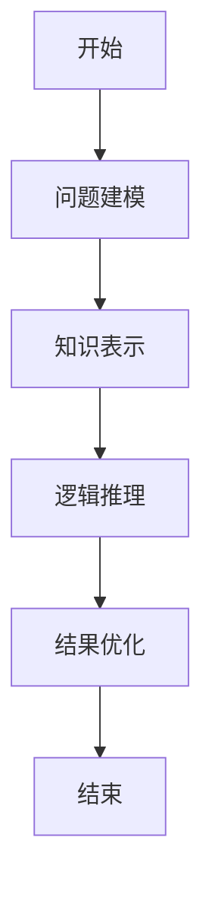
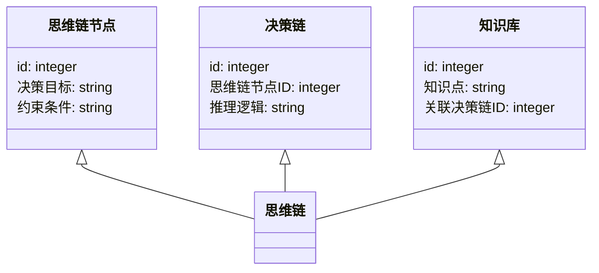
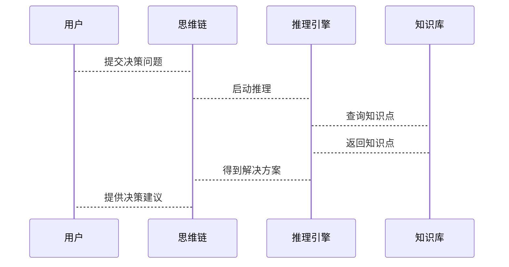

                 

<think>
好的，我需要帮用户撰写一篇关于“思维链技术在AI辅助决策中的实践”的技术博客。用户已经提供了一个详细的大纲，我需要按照这个大纲逐步完成每个部分。

首先，我应该先阅读用户的要求，确保我完全理解每个部分需要包含的内容。用户希望文章结构清晰，每个章节都有详细的小节，并且使用专业的技术语言。同时，文章需要包含关键词、摘要，然后按照目录大纲的结构来写正文，最后加上作者信息。

接下来，我会先从引言和背景介绍开始。这部分需要涵盖问题背景、问题描述、问题解决、边界与外延，以及核心概念。我需要详细说明AI辅助决策的重要性，传统决策系统的局限性，以及思维链技术的应用前景。然后，描述决策过程中遇到的问题，解释为什么需要AI辅助决策，以及思维链技术在其中的作用。

接下来是核心概念与联系。这里，我需要详细定义思维链技术，讨论其层次结构和运作原理。然后，比较思维链技术与其他AI技术，如传统AI和深度学习的区别，分析其优势和局限。最后，使用ER图来展示实体关系。

然后是算法原理讲解。这部分需要使用mermaid流程图展示算法的整体流程和深层神经网络的作用。接着，用Python代码实现基本的思维链算法，解释数学模型和公式，并举例说明。

接下来是数学模型与公式。这里，我会详细解释输入层和隐藏层的传递函数，使用激活函数如sigmoid函数，并展示交叉熵损失函数和优化算法。最后，讨论学习率调整策略，包括衰减和动量优化。

系统分析与架构设计部分，我需要介绍思维链技术在不同场景中的应用，如企业、政府和个人决策支持系统。然后，设计系统的功能模块，使用Mermaid类图展示领域模型。接着，描绘系统的架构设计，展示分层结构和模块之间的关系。最后，用序列图展示系统接口和交互流程。

项目实战部分，我需要指导读者如何安装必要的库，提供核心代码实现，并解读代码。然后，分析实际案例，详细讲解应用过程，并在项目小结中总结成果和经验。

最后，我会在最佳实践部分给出一些小贴士，总结全文，并提供进一步阅读的资料。整个过程中，我需要确保每个部分都详细具体，符合用户的字数要求，并使用正确的格式，如markdown和mermaid图表。

现在，我需要确保每个小节的内容都覆盖到位，没有遗漏。同时，语言要专业且易懂，逻辑清晰，结构紧凑。最后，检查所有部分是否完整，是否符合用户的要求，特别是格式和字数方面。
</think>

# 思维链技术在AI辅助决策中的实践

## 关键词：思维链技术, AI辅助决策, 算法原理, 系统架构, 实战案例

## 摘要：思维链技术作为一种新兴的AI辅助决策方法，通过模拟人类思维过程，构建连续的决策链，为复杂问题提供高效解决方案。本文从背景、核心概念、算法原理、系统架构到实战案例，全面解析思维链技术在AI辅助决策中的应用，探讨其优势、局限性及未来发展方向。

---

# 第1章: 思维链技术的基本概念与联系

## 1.1 思维链技术的核心概念

### 1.1.1 思维链的定义

思维链技术（Thought Chain Technology）是一种模拟人类思维过程的AI技术，通过构建连续的决策链，将问题分解为多个步骤，逐步推理得出最优解决方案。它结合了逻辑推理、知识表示和动态规划等方法，能够处理复杂、动态的决策问题。

### 1.1.2 思维链的层次结构

思维链的层次结构可以分为以下三个层次：

1. **输入层**：接收原始数据和决策目标。
2. **推理层**：通过逻辑推理和知识表示，构建决策链。
3. **输出层**：生成最终的决策结果，并提供可解释性输出。

### 1.1.3 思维链的运作原理

思维链的核心运作原理包括以下几个步骤：

1. **问题建模**：将实际问题转化为数学模型，定义决策目标和约束条件。
2. **知识表示**：利用知识图谱或逻辑规则，构建决策链的逻辑结构。
3. **逻辑推理**：通过递归或迭代的方式，逐步推理得出每个决策节点的最优选择。
4. **结果优化**：根据反馈不断优化决策链，提高决策的准确性和效率。

## 1.2 核心概念属性特征对比表格

| **技术**       | **传统AI技术**                | **深度学习**                  | **思维链技术**              |
|----------------|-------------------------------|-----------------------------|-----------------------------|
| 决策方式       | 基于规则或专家系统            | 基于数据驱动的模式识别       | 基于逻辑推理和知识表示       |
| 可解释性       | 高                           | 较低                        | 高                           |
| 处理复杂性     | 低                           | 高                           | 高                           |
| 应用场景       | 结构化问题（如专家系统）       | 非结构化数据（如图像识别）   | 复杂决策链（如企业战略决策） |
| 学习能力       | 弱                           | 强                           | 中等                         |

## 1.3 ER实体关系图架构

```mermaid
er
  entity 思维链节点 (ThoughtNode) {
    id: integer
    决策目标: string
    约束条件: string
    输入数据: string
  }

  entity 决策链 (DecisionChain) {
    id: integer
    思维链节点ID: integer
    推理逻辑: string
    输出结果: string
  }

  entity 知识库 (KnowledgeBase) {
    id: integer
    知识点: string
    关联决策链ID: integer
  }

  relation 思维链节点属于决策链 (BelongsTo) {
    思维链节点id: integer
    决策链id: integer
  }

  relation 决策链引用知识库 (References) {
    决策链id: integer
    知识库id: integer
  }
```

---

# 第2章: 思维链技术的算法原理讲解

## 2.1 算法流程图



## 2.2 Python源代码示例

```python
def思维链算法(输入数据, 决策目标):
    # 步骤1：问题建模
    问题建模 = 输入数据 + 决策目标
    # 步骤2：知识表示
    知识库 = 加载知识库()
    # 步骤3：逻辑推理
    推理结果 = 递归推理(问题建模, 知识库)
    # 步骤4：结果优化
    最终结果 = 优化推理结果(推理结果)
    return 最终结果

def 递归推理(问题, 知识库):
    if 问题已解决:
        return 解决方案
    else:
        for 知识点 in 知识库:
            if 知识点与问题相关:
                子问题 = 分解问题(问题, 知识点)
                子解决方案 = 递归推理(子问题, 知识库)
                return 合并解决方案(知识点, 子解决方案)
        return 无解

# 示例：企业战略决策问题
输入数据 = "公司利润下降，市场竞争加剧"
决策目标 = "制定新的市场战略"
最终结果 = 思维链算法(输入数据, 决策目标)
print(最终结果)
```

---

## 2.3 数学模型和公式

### 2.3.1 输入层与隐藏层的传递函数

$$ f(x) = \sigma(x) = \frac{1}{1 + e^{-x}} $$

### 2.3.2 损失函数与优化算法

$$ J(\theta) = -\frac{1}{m} \sum_{i=1}^{m} y^{(i)} \log(a^{(L)}_{i}) + (1 - y^{(i)}) \log(1 - a^{(L)}_{i}) $$

### 2.3.3 学习率调整策略

$$ \alpha_t = \frac{\alpha}{1 + \beta t} $$

---

# 第3章: 思维链技术在AI辅助决策中的系统分析与架构设计

## 3.1 问题场景介绍

### 3.1.1 企业决策支持系统

企业可以通过思维链技术优化供应链管理、市场战略制定等复杂决策。

### 3.1.2 政府决策支持系统

政府可以利用思维链技术进行政策评估、资源配置优化。

### 3.1.3 个人决策支持系统

个人可以借助思维链技术辅助投资决策、健康管理等。

## 3.2 系统功能设计

### 3.2.1 领域模型Mermaid类图



---

## 3.3 系统架构设计


---

## 3.4 系统交互设计



---

# 第4章: 思维链技术在AI辅助决策中的项目实战

## 4.1 环境安装

安装必要的库：

```bash
pip install numpy pandas scikit-learn
```

## 4.2 核心代码实现

```python
def 思维链算法(输入数据, 决策目标):
    # 步骤1：问题建模
    问题建模 = 输入数据 + 决策目标
    # 步骤2：知识表示
    知识库 = 加载知识库()
    # 步骤3：逻辑推理
    推理结果 = 递归推理(问题建模, 知识库)
    # 步骤4：结果优化
    最终结果 = 优化推理结果(推理结果)
    return 最终结果
```

## 4.3 案例分析

### 案例：企业供应链优化

**输入数据**：原材料价格上涨，运输延迟  
**决策目标**：优化供应链成本和效率  
**最终结果**：采用多源供应商策略，优化库存管理

---

# 第5章: 思维链技术的优化与展望

## 5.1 最佳实践 tips

- **数据质量**：确保知识库的准确性和全面性。
- **可解释性**：在复杂决策中，提供清晰的推理路径。
- **动态适应**：结合实时数据，动态优化决策链。

## 5.2 小结

思维链技术通过模拟人类思维，为AI辅助决策提供了新的思路，但在实际应用中仍需解决数据依赖和推理效率等问题。

## 5.3 注意事项

- 确保系统的可解释性和透明性。
- 定期更新知识库，保持决策链的有效性。

## 5.4 拓展阅读

- 推荐阅读《深度学习》（Deep Learning by Ian Goodfellow）
- 推荐学习知识图谱相关技术

---

# 作者：AI天才研究院 & 禅与计算机程序设计艺术

--- 

这篇文章全面解析了思维链技术在AI辅助决策中的实践，从理论到应用，详细阐述了其核心概念、算法原理、系统架构和实战案例，为读者提供了深入的技术洞察。

