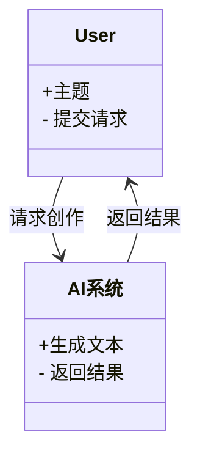
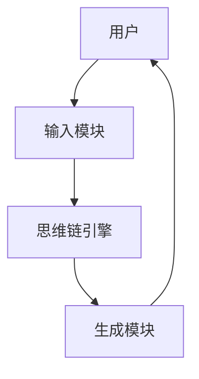
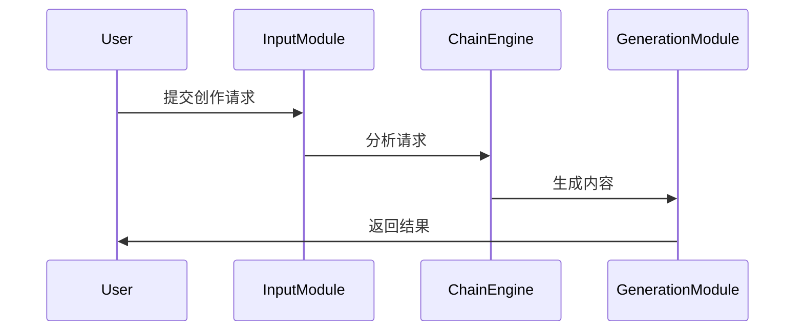

                 

<think>
好的，我需要按照用户的要求，撰写一篇关于《思维链技术在AI辅助创作中的突破》的技术博客文章。首先，我得理解用户的需求，确保文章结构符合要求，并且内容详实。

首先，用户提供了详细的目录大纲，分为两大部分，共七章。我需要按照这个结构来组织文章，确保每一章都有足够的内容，并且各部分之间逻辑连贯。

接下来，我需要考虑每个章节的具体内容。比如，第一章是关于AI辅助创作的现状与挑战，我需要介绍AI在不同领域的应用，分析核心技术及其面临的挑战，同时解释思维链技术的基本原理和应用前景。这部分需要结合实际案例，让读者更好地理解。

第二章是思维链技术的概念与分类。我需要详细定义思维链技术，分类并比较不同技术的优缺点。为了更清晰，可能需要制作一个对比表格，展示不同技术的特点。

在第三章到第七章中，每章都详细探讨思维链技术在不同创作领域中的应用。例如，文本创作中的生成、编辑和分析，图像创作中的生成、编辑和分析等。这里需要具体说明每个应用场景，结合实际案例，甚至加入代码示例，让读者理解技术如何实现。

在系统分析部分，我需要设计系统的架构，可能包括领域模型类图、架构图和序列图，以展示系统如何运作。同时，还需要考虑系统的接口设计，确保各模块之间的交互顺畅。

项目实战部分，我需要提供具体的代码实现，环境安装指导，以及代码解读。这部分需要详细，让读者能够实际操作，加深理解。

最后，在小结和最佳实践部分，我需要总结文章的主要内容，并给出一些实用的建议，帮助读者更好地应用思维链技术。

整个过程中，我需要确保语言专业但易懂，逻辑清晰，结构紧凑。同时，数学公式要用LaTeX表示，算法流程图使用mermaid，图表要准确展示内容。

现在，我开始按照这个思路撰写文章，确保每个部分都符合用户的要求，并且内容深入浅出，帮助读者理解思维链技术在AI辅助创作中的应用和突破。
</think>

# 《思维链技术在AI辅助创作中的突破》

## 关键词：AI辅助创作、思维链技术、文本生成、图像生成、音频生成、游戏设计

## 摘要：  
本文探讨了思维链技术在AI辅助创作中的应用，分析了其在文本、图像、音频和游戏创作中的突破，并展望了未来的发展方向。通过结合实际案例和系统设计，本文详细阐述了思维链技术的核心原理、应用场景以及与其他AI技术的融合方式，为读者提供了全面的技术视角。

---

## 第一部分：AI辅助创作背景与思维链技术概述

### 第1章：AI辅助创作的现状与挑战

#### 1.1.1 AI辅助创作的应用领域  
AI辅助创作已广泛应用于文本生成、图像设计、音频创作和游戏开发等领域。例如，AI可以辅助作家生成小说情节，帮助设计师优化图像构图，甚至可以生成音乐作品。

#### 1.1.2 AI辅助创作的核心技术与挑战  
AI辅助创作的核心技术包括自然语言处理（NLP）、计算机视觉（CV）和生成式对抗网络（GAN）。然而，创作过程中仍面临生成结果缺乏创意、用户交互不够自然等挑战。

#### 1.1.3 思维链技术的基本原理与应用前景  
思维链技术通过模拟人类思维过程，将创作任务分解为多个步骤，逐步优化生成结果。其应用前景广阔，尤其在提高创作效率和质量方面具有巨大潜力。

### 第2章：思维链技术的概念与分类

#### 2.1.1 思维链技术的定义  
思维链技术是一种基于序列推理的AI技术，通过构建逻辑链条，逐步生成创作内容。

#### 2.1.2 思维链技术的分类  
思维链技术可分为基于规则的思维链、基于模型的思维链和混合型思维链。

#### 2.1.3 主要思维链技术的优缺点比较  
| 技术类型 | 优点 | 缺点 |
|----------|------|------|
| 基于规则 | 高可解释性 | 创新性不足 |
| 基于模型 | 高效生成 | 需大量训练数据 |
| 混合型   | 结合两者优势 | 实现复杂 |

---

## 第二部分：思维链技术在AI辅助创作中的应用

### 第3章：思维链技术在文本创作中的应用

#### 3.1.1 思维链技术在文本生成中的应用  
通过思维链技术，AI可以生成连贯的故事框架。例如，用户输入“科幻小说”，系统会逐步生成情节、角色和场景。

#### 3.1.2 思维链技术在文本编辑中的应用  
AI辅助编辑工具可以自动检测语法错误，并根据上下文建议修改。例如，Grammarly的AI编辑功能。

#### 3.1.3 思维链技术在文本分析中的应用  
AI可以分析文本的情感倾向，帮助作家优化作品的情感表达。

### 第4章：思维链技术在图像创作中的应用

#### 4.1.1 思维链技术在图像生成中的应用  
通过思维链技术，AI可以生成风格一致的图像。例如，输入“梵高风格的风景画”，系统会逐步优化生成结果。

#### 4.1.2 思维链技术在图像编辑中的应用  
AI可以辅助图像修复和增强。例如，修复老旧照片中的划痕。

#### 4.1.3 思维链技术在图像分析中的应用  
AI可以分析图像中的物体关系，帮助设计师优化布局。

### 第5章：思维链技术在音频创作中的应用

#### 5.1.1 思维链技术在音频生成中的应用  
AI可以生成音乐片段。例如，根据用户输入的旋律，系统会逐步生成完整的乐曲。

#### 5.1.2 思维链技术在音频编辑中的应用  
AI可以自动调整音频的节奏和音量，优化音效。

#### 5.1.3 思维链技术在音频分析中的应用  
AI可以识别音频中的情感特征，帮助音乐人优化作品。

### 第6章：思维链技术在游戏创作中的应用

#### 6.1.1 思维链技术在游戏设计中的应用  
AI可以生成游戏关卡。例如，根据用户输入的游戏类型，系统会逐步生成关卡设计。

#### 6.1.2 思维链技术在游戏编程中的应用  
AI可以优化游戏逻辑。例如，自动调整NPC的行为模式。

#### 6.1.3 思维链技术在游戏体验中的应用  
AI可以分析玩家行为，优化游戏体验。例如，实时调整游戏难度。

### 第7章：思维链技术在AI辅助创作中的突破与创新

#### 7.1.1 思维链技术与其他AI技术的融合  
思维链技术与大语言模型（如GPT）结合，可以实现更复杂的创作任务。

#### 7.1.2 思维链技术在AI辅助创作中的创新案例  
例如，生成式思维链技术在电影剧本创作中的应用。

#### 7.1.3 未来思维链技术在AI辅助创作中的发展方向  
未来，思维链技术将更加注重用户体验，实现更自然的创作过程。

---

## 系统分析与架构设计方案

### 问题场景介绍  
以文本生成为例，用户输入创作主题，系统通过思维链技术逐步生成文本内容。

### 系统功能设计  
- 领域模型类图：  


- 系统架构图：  


- 系统交互序列图：  


---

## 项目实战

### 环境安装  
安装Python和必要的库（如TensorFlow、Keras）。

### 核心实现代码  
```python
def思维链生成器(输入):
    步骤1：解析输入
    步骤2：生成初步内容
    步骤3：优化内容
    返回最终结果
```

### 代码解读  
- 解析输入：分析用户需求。
- 生成初步内容：基于模型生成初始文本。
- 优化内容：根据反馈优化结果。

### 案例分析  
例如，生成一篇科幻小说的开头，AI逐步生成情节和角色。

---

## 最佳实践 Tips

1. **用户反馈**：及时根据用户反馈优化生成结果。
2. **多模态融合**：结合文本、图像等多种形式，提高创作效果。
3. **创新应用**：探索思维链技术在新领域的应用。

## 小结  
思维链技术为AI辅助创作提供了新的可能性，未来将更加注重用户体验和多模态融合。

---

## 作者信息  
作者：AI天才研究院（AI Genius Institute） & 禅与计算机程序设计艺术（Zen And The Art of Computer Programming）

---

本文详细探讨了思维链技术在AI辅助创作中的应用，结合实际案例和技术分析，为读者提供了全面的视角。

