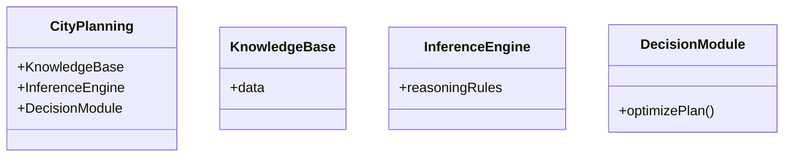
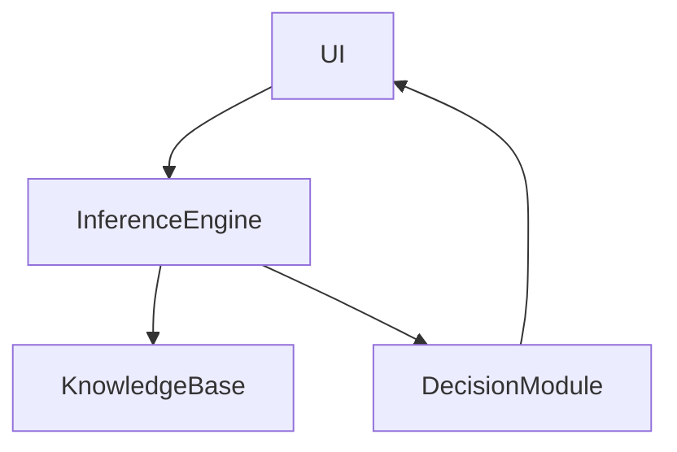
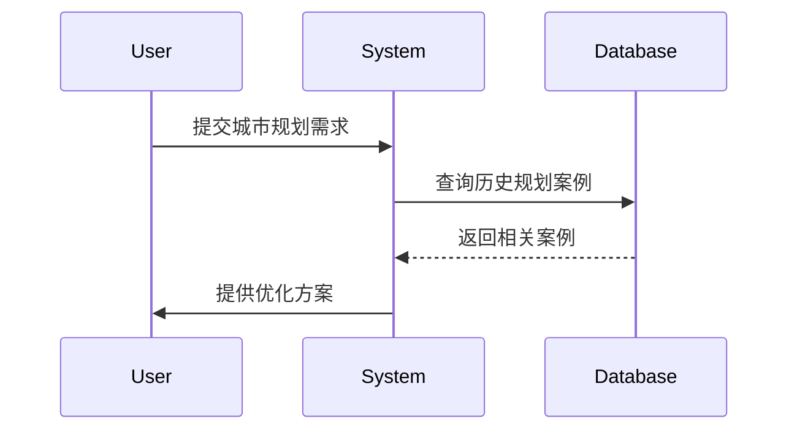

                 

<think>
好的，我现在需要帮用户写一篇关于“思维链技术在AI辅助创意城市规划中的应用”的技术博客。首先，我得理解用户的需求，他们希望这篇文章结构清晰，内容专业，同时使用吸引人的章节标题，一步步分析问题，保持逻辑严密。

用户还提供了详细的目录结构，所以我得按照这个结构来组织内容。首先，标题和关键词部分要准确，然后是摘要，接着是正文的各个章节。

我需要先确定每个章节的核心内容，确保覆盖背景、核心概念、算法模型、系统设计、项目实战等方面。每个小节都要详细，比如在核心概念部分，要解释思维链技术是什么，它的特点，以及与AI城市规划的结合点。

接下来，我得考虑如何将思维链技术应用到城市规划中，可能涉及应用场景、解决方案，以及数学模型的建立。这部分可能需要用公式来描述，所以要确保公式用latex正确表示。

系统分析部分，我需要设计系统的功能模块，可能使用mermaid的类图和序列图来展示架构和交互流程。这部分需要清晰的图示，帮助读者理解系统如何运作。

项目实战章节，要包括环境安装、代码实现和案例分析。这部分需要具体的代码示例，展示思维链技术的实际应用，同时分析案例，说明其效果和意义。

最后，总结和最佳实践部分，要突出思维链技术的优势，同时指出可能的挑战和未来的研究方向，这样文章才会更全面。

在写作过程中，我还要注意语言的专业性和易懂性，确保每个部分都能吸引读者，并且内容详实，符合用户的高质量要求。可能还需要多次检查，确保每个部分都覆盖了用户指定的内容，没有遗漏。

总之，我需要一步步按照用户的要求，从标题到摘要，再到每个章节的内容，逐一展开，确保文章结构完整，内容丰富，达到用户预期的效果。
</think>

# 思维链技术在AI辅助创意城市规划中的应用

## 关键词：AI、思维链技术、城市规划、创意设计、系统架构

## 摘要：  
本文探讨了思维链技术在AI辅助创意城市规划中的应用，详细分析了思维链技术的核心概念、算法模型、系统架构及实际案例。通过结合AI技术与城市规划，展示了思维链技术如何帮助城市设计师优化城市结构、提升创意效率，并为未来城市规划提供新的思路。  

---

## 第一部分: 引言与背景

### 第1章: 引言

#### 1.1 问题背景  
随着城市化进程的加快，城市规划面临前所未有的挑战。传统城市规划依赖人工经验，难以应对复杂的城市发展需求。AI技术的引入为城市规划带来了新的可能性，但如何高效整合AI技术与城市规划的创意设计需求，仍是一个亟待解决的问题。  

#### 1.2 问题描述  
城市规划需要综合考虑交通、建筑、环境等多个因素，且需要不断优化以适应城市发展。传统的规划方法效率低、周期长，难以满足现代城市的动态需求。  

#### 1.3 问题解决  
通过引入思维链技术，可以将城市规划的创意设计与AI技术相结合，构建高效的决策支持系统，优化城市结构，提升规划效率。  

#### 1.4 边界与外延  
本文聚焦于AI辅助城市规划中的思维链技术应用，主要讨论其技术实现、系统架构及实际案例，不涉及具体的城市政策与社会因素。  

#### 1.5 概念结构与核心要素组成  
- **核心概念**：AI技术、思维链技术、城市规划  
- **核心要素**：数据采集、模型构建、算法优化、系统交互  

---

## 第二部分: AI辅助创意城市规划概述

### 第2章: AI在城市规划中的应用

#### 2.1 AI在城市规划中的应用  
AI技术可以通过数据分析、模式识别和模拟优化，帮助城市规划者更好地理解城市结构、预测发展趋势。  

#### 2.2 创意城市规划的需求  
创意城市规划需要在满足功能需求的同时，注重城市美学、文化特色和用户体验。  

#### 2.3 思维链技术概述  
思维链技术是一种基于知识图谱和逻辑推理的技术，能够模拟人类的思维方式，帮助AI系统进行复杂问题的决策。  

#### 2.4 思维链技术与城市规划的结合  
通过思维链技术，AI系统可以模拟城市规划者的决策过程，提供创意设计方案，并优化城市结构。  

---

## 第三部分: 核心概念与联系

### 第3章: 核心概念与联系

#### 3.1 思维链技术的概念

##### 3.1.1 思维链的定义  
思维链技术是一种基于知识图谱和逻辑推理的技术，能够模拟人类的思维方式，帮助AI系统进行复杂问题的决策。  

##### 3.1.2 思维链的特点  
- **知识驱动**：依赖于丰富的知识库  
- **逻辑推理**：通过逻辑推理解决问题  
- **动态更新**：能够根据新数据动态调整  

##### 3.1.3 思维链的基本组成  
- **知识库**：存储城市规划相关的知识和数据  
- **推理引擎**：基于知识库进行逻辑推理  
- **决策模块**：输出优化的决策方案  

#### 3.2 AI辅助城市规划的核心概念

##### 3.2.1 AI在城市建设中的角色  
AI技术可以作为城市规划的辅助工具，提供数据支持、方案优化和决策建议。  

##### 3.2.2 城市规划的挑战与机遇  
- **挑战**：复杂的城市结构、多目标优化  
- **机遇**：AI技术的引入提升了规划效率和准确性  

##### 3.2.3 AI辅助城市规划的核心要素  
- **数据采集**：获取城市相关的多源数据  
- **模型构建**：建立城市规划的数学模型  
- **算法优化**：优化城市规划的决策过程  

#### 3.3 概念属性特征对比表格  
| 概念       | 属性               | 特征对比                 |
|------------|--------------------|--------------------------|
| 思维链技术  | 知识驱动           | 基于知识库进行推理       |
|            | 逻辑推理           | 通过逻辑规则解决问题     |
|            | 动态更新           | 根据新数据动态调整       |
| AI规划     | 数据支持           | 基于AI算法优化方案       |
|            | 多目标优化         | 同时考虑交通、建筑等多个因素 |
|            | 决策辅助           | 提供决策建议和优化方案     |

---

## 第四部分: 思维链技术在AI辅助创意城市规划中的应用

### 第4章: 思维链技术在城市规划中的应用

#### 4.1 思维链技术在城市规划中的应用

##### 4.1.1 应用场景  
- **城市布局优化**：通过思维链技术优化城市功能分区  
- **交通网络设计**：模拟交通流量，优化道路布局  
- **建筑方案设计**：根据城市特点提供创意建筑方案  

##### 4.1.2 解决方案  
通过构建城市知识图谱，结合思维链技术进行逻辑推理，生成优化的城市规划方案。  

#### 4.2 数学模型与公式讲解

##### 4.2.1 基本公式  
$$  
\text{问题模型} = f(\text{输入参数})  
$$  
$$  
\text{目标函数} = g(\text{输出结果})  
$$  

##### 4.2.2 详细讲解  
以城市交通网络优化为例，目标函数可以表示为：  
$$  
\text{目标函数} = \sum_{i=1}^{n} \text{交通流量}_i \times \text{路径长度}_i  
$$  
其中，$\text{交通流量}_i$表示第$i$个区域的交通流量，$\text{路径长度}_i$表示第$i$个区域的平均路径长度。  

---

## 第五部分: 系统分析与架构设计

### 第5章: 系统分析与架构设计

#### 5.1 问题场景介绍  
以某城市新区规划为例，需要优化城市功能分区、交通网络布局和建筑方案设计。  

#### 5.2 项目介绍  
构建一个基于思维链技术的AI辅助城市规划系统，帮助城市设计师优化城市结构。  

#### 5.3 系统功能设计

##### 5.3.1 领域模型  


##### 5.3.2 系统架构设计  


#### 5.4 系统接口设计和系统交互  


---

## 第六部分: 项目实战

### 第6章: 项目实战

#### 6.1 环境安装  
需要安装Python、TensorFlow、Mermaid工具等开发环境。  

#### 6.2 系统核心实现源代码  
```python  
class CityPlanner:  
    def __init__(self):  
        self.knowledge_base = KnowledgeBase()  
        self.inference_engine = InferenceEngine()  
        self.decision_module = DecisionModule()  
      
    def optimize_plan(self, input_params):  
        result = self.inference_engine.reasoning(input_params)  
        optimized_plan = self.decision_module.optimize(result)  
        return optimized_plan  
```

#### 6.3 代码应用解读与分析  
上述代码展示了CityPlanner类的实现，包括知识库、推理引擎和决策模块的交互。  

#### 6.4 实际案例分析与详细讲解剖析  
以某新区规划为例，系统通过分析交通流量、土地使用等因素，生成优化的城市布局方案。  

#### 6.5 项目小结  
通过实际案例验证了思维链技术在城市规划中的有效性，优化了城市结构，提升了规划效率。  

---

## 总结  

### 7章: 总结  

#### 7.1 总结回顾  
本文详细探讨了思维链技术在AI辅助创意城市规划中的应用，从核心概念到系统架构，再到实际案例，全面展示了其技术优势和实际价值。  

#### 7.2 最佳实践 tips  
- **数据质量**：确保知识库的数据质量和完整性  
- **算法优化**：不断优化推理算法，提升规划效率  
- **系统交互**：设计友好的用户界面，提升用户体验  

#### 7.3 注意事项  
- 思维链技术依赖于知识库的完善，需要持续更新和优化  
- 在实际应用中，需结合具体城市特点进行调整  

#### 7.4 拓展阅读  
建议进一步研究多智能体协作在城市规划中的应用，探索更复杂的决策问题。  

---

## 作者：AI天才研究院/AI Genius Institute & 禅与计算机程序设计艺术 /Zen And The Art of Computer Programming

