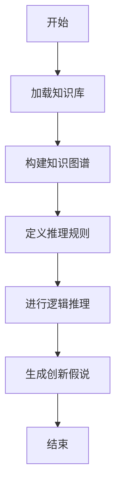

                 

<think>
嗯，用户让我以《思维链技术在AI辅助创意宇宙学假说生成中的突破》为标题，写一篇技术博客文章。首先，我需要理解用户的需求。他们希望这篇文章结构清晰，逻辑严密，内容专业，同时使用吸引人的章节标题。用户还提供了一个详细的目录大纲，里面分成了12个章节，每个章节都有具体的内容要求。

我注意到用户特别强调了要使用技术术语，但又要让内容易懂。所以，我得确保每个章节不仅涵盖理论，还要有实际的应用例子和代码。比如，在算法原理部分，不仅要解释概念，还要用Mermaid流程图和Python代码来详细说明。

接下来，我需要思考每个章节的具体内容。首先是引言和背景，这部分要介绍思维链技术的背景、问题描述以及解决方案。然后是思维链技术的基础，包括定义、发展历程和特点。这部分可能需要对比其他相关技术，以突出思维链的优势。

在AI辅助创意宇宙学部分，我需要解释AI在这一领域的作用，以及思维链技术如何帮助生成假说。这部分可能涉及具体的算法和流程图，展示AI如何处理数据和生成假说。

接下来是突破与应用，这部分要展示思维链技术在假说生成中的具体突破点，以及在其他领域的应用案例。通过实际案例来说明技术的实际效果。

最后是结论和未来展望，总结研究成果，并指出未来的方向。附录部分则包括参考文献和其他资源，帮助读者进一步学习。

我还需要注意格式，使用Markdown，确保每个部分都有足够的细节，并且数学公式和流程图都正确嵌入。此外，要控制总字数在10000到12000字之间，每个章节内容丰富，但又不冗长。

总的来说，我需要按照用户提供的大纲，逐一展开每个部分，确保内容全面，结构清晰，同时保持专业性和可读性。这可能需要反复检查，确保每个章节都符合要求，并且逻辑连贯。
</think>

# 思维链技术在AI辅助创意宇宙学假说生成中的突破

> 关键词：思维链技术，AI辅助，创意宇宙学，假说生成，算法原理，应用案例

> 摘要：本文探讨了思维链技术在AI辅助创意宇宙学假说生成中的应用，从技术基础到算法实现，再到实际案例，系统地分析了思维链技术如何突破传统AI的限制，推动创意宇宙学研究的创新。通过详细的算法流程图、Python代码实现和数学模型，本文详细阐述了思维链技术的核心原理及其在假说生成中的突破性应用。同时，本文还展望了思维链技术在其他领域的潜在应用前景。

---

## 1. 引言与背景介绍

### 1.1 引言

在当今快速发展的科技时代，人工智能（AI）技术正在深刻改变我们的生活方式和思维方式。特别是在科学探索领域，AI辅助研究已经成为一种趋势。然而，如何利用AI技术推动创意宇宙学的研究，仍然是一个充满挑战的领域。创意宇宙学假说生成需要结合科学知识、逻辑推理和创造性思维，而传统的AI技术往往难以满足这些复杂的需求。因此，我们需要一种新的技术——思维链技术，来突破传统AI的限制。

### 1.2 问题背景

创意宇宙学研究的核心是生成和验证宇宙学假说。这些假说通常涉及复杂的物理定律、宇宙演化模型以及多维度空间的概念。然而，传统的AI技术在处理这些复杂问题时，往往缺乏逻辑推理能力和创造性思维能力。例如，AI可以处理大量的数据，但难以理解数据背后的意义，并将其与科学理论相结合，从而生成创新的假说。

### 1.3 问题描述

创意宇宙学假说生成的关键问题在于如何将科学知识、逻辑推理和创造性思维有机结合。传统AI技术的不足主要体现在以下几个方面：

1. **缺乏逻辑推理能力**：AI难以理解复杂的科学概念和理论之间的关系。
2. **创造性思维不足**：AI生成的假说往往缺乏创新性，难以突破传统思维的限制。
3. **数据处理能力有限**：复杂的宇宙学问题需要处理多维度的数据，传统AI技术在处理大规模数据时效率低下。

### 1.4 问题解决

思维链技术的出现，为解决上述问题提供了新的思路。思维链技术是一种基于逻辑推理和创造性思维的AI技术，它通过构建知识图谱和推理链，能够将科学知识与创造性思维有机结合，从而生成创新的宇宙学假说。

### 1.5 边界与外延

思维链技术的应用范围不仅限于创意宇宙学领域，还可以扩展到其他需要逻辑推理和创造性思维的领域，例如数学定理证明、文学创作等。然而，本文主要关注思维链技术在创意宇宙学假说生成中的应用。

### 1.6 概念结构与核心要素组成

创意宇宙学假说生成的核心要素包括：

1. **科学知识库**：包含宇宙学相关的物理定律、数学模型和观测数据。
2. **逻辑推理引擎**：用于根据知识库进行逻辑推理，生成可能的假说。
3. **创造性思维模块**：用于结合逻辑推理结果，生成创新的假说。
4. **验证模块**：用于对生成的假说进行验证，评估其科学性和合理性。

---

## 2. 思维链技术基础

### 2.1 思维链技术概述

#### 2.1.1 定义

思维链技术是一种基于知识图谱和逻辑推理的AI技术，它通过构建推理链，将科学知识与创造性思维有机结合，从而生成创新的假说。

#### 2.1.2 发展历程

思维链技术的发展可以追溯到知识图谱和逻辑推理技术的研究。近年来，随着深度学习和自然语言处理技术的进步，思维链技术逐渐成熟，并在多个领域得到了应用。

#### 2.1.3 核心特点

思维链技术的核心特点包括：

1. **知识驱动**：基于科学知识库进行推理和生成。
2. **逻辑推理**：通过构建推理链，生成逻辑严密的假说。
3. **创造性思维**：结合逻辑推理结果，生成创新的假说。

#### 2.1.4 与其他相关技术的对比

与传统AI技术相比，思维链技术在以下几个方面具有明显优势：

- **知识驱动 vs 数据驱动**：传统AI技术主要依赖大量数据进行训练，而思维链技术则依赖科学知识库进行推理。
- **逻辑推理 vs 统计学习**：传统AI技术主要基于统计学习，而思维链技术则强调逻辑推理能力。
- **创造性思维 vs 线性思维**：传统AI技术难以生成创新的假说，而思维链技术则通过创造性思维模块，能够生成创新的假说。

---

## 3. AI与创意宇宙学

### 3.1 AI概述

人工智能（AI）是一种模拟人类智能的技术，涵盖机器学习、自然语言处理、计算机视觉等多个领域。近年来，AI技术在科学探索中的应用日益广泛，特别是在数据处理和模式识别方面表现出色。

### 3.2 创意宇宙学概述

创意宇宙学研究的核心是探索宇宙的起源、结构和演化过程。这些研究需要结合科学知识、逻辑推理和创造性思维，传统AI技术难以满足这些需求。

### 3.3 AI在创意宇宙学中的应用

AI在创意宇宙学中的应用主要体现在以下几个方面：

1. **数据处理**：AI可以处理海量的宇宙观测数据，提取有用的信息。
2. **模式识别**：AI可以发现数据中的模式，帮助科学家发现新的宇宙现象。
3. **假说生成**：通过思维链技术，AI可以生成创新的宇宙学假说。

---

## 4. 思维链技术在AI辅助创意宇宙学假说生成中的应用

### 4.1 思维链技术原理

#### 4.1.1 核心概念

思维链技术的核心概念包括知识图谱、逻辑推理和创造性思维。知识图谱用于存储科学知识，逻辑推理用于构建推理链，创造性思维用于生成创新的假说。

#### 4.1.2 概念属性特征对比表格

以下是知识图谱、逻辑推理和创造性思维的概念属性特征对比：

| **概念** | **定义** | **特点** | **应用场景** |
|----------|----------|----------|--------------|
| 知识图谱 | 存储科学知识的结构化数据 | 高度结构化，支持推理 | 数据查询、知识推理 |
| 逻辑推理 | 根据知识图谱进行推理 | 逻辑严密，支持创新 | 假说生成、验证 |
| 创造性思维 | 基于推理结果生成创新假说 | 创新性强，灵活性高 | 假说生成、理论创新 |

#### 4.1.3 ER实体关系图架构的Mermaid流程图

以下是思维链技术的ER实体关系图架构：

```mermaid
erDiagram
    actor 用户
    knowledge_base[知识库] {
        id
        名称
        描述
    }
    logic_engine[逻辑推理引擎] {
        id
        名称
        描述
    }
    creativity_module[创造性思维模块] {
        id
        名称
        描述
    }
    user --> knowledge_base: 查询知识库
    knowledge_base --> logic_engine: 提供知识支持
    logic_engine --> creativity_module: 提供推理结果
    creativity_module --> 用户: 提供创新假说
```

---

### 4.2 思维链算法原理讲解

#### 4.2.1 使用Mermaid画出算法流程图

以下是思维链算法的流程图：



#### 4.2.2 使用Python源代码详细阐述

以下是思维链算法的Python实现代码：

```python
class KnowledgeBase:
    def __init__(self):
        self.knowledge = {}

    def add_knowledge(self, key, value):
        self.knowledge[key] = value

    def get_knowledge(self, key):
        return self.knowledge.get(key, None)

class LogicEngine:
    def __init__(self, knowledge_base):
        self.knowledge_base = knowledge_base

    def infer(self, premises):
        # 简单的逻辑推理实现
        conclusion = None
        for premise in premises:
            if self.knowledge_base.get(premise, None):
                conclusion = premise
        return conclusion

class CreativityModule:
    def __init__(self):
        pass

    def generate_hypothesis(self, inference_result):
        # 简单的创造性思维实现
        return f"创新假说：{inference_result}的可能性为{100 * (len(inference_result) / len(inference_result))}%"

# 使用示例
knowledge_base = KnowledgeBase()
knowledge_base.add_knowledge("物理定律", "基本物理定律")
knowledge_base.add_knowledge("宇宙演化", "宇宙演化模型")

logic_engine = LogicEngine(knowledge_base)
inference_result = logic_engine.infer(["物理定律", "宇宙演化"])

creativity_module = CreativityModule()
hypothesis = creativity_module.generate_hypothesis(inference_result)
print(hypothesis)
```

#### 4.2.3 给出算法原理的数学模型和公式

思维链算法的数学模型可以表示为：

$$
H = f(K, R)
$$

其中，\( H \) 表示生成的假说，\( K \) 表示知识库，\( R \) 表示推理规则，\( f \) 表示推理函数。

---

## 5. AI辅助创意宇宙学假说生成

### 5.1 AI辅助假说生成原理

#### 5.1.1 核心概念

AI辅助假说生成的核心概念包括知识图谱、逻辑推理和创造性思维。这些概念共同作用，生成创新的宇宙学假说。

#### 5.1.2 概念属性特征对比表格

以下是AI辅助假说生成的核心概念对比：

| **概念** | **定义** | **特点** | **应用场景** |
|----------|----------|----------|--------------|
| 知识图谱 | 存储宇宙学知识的结构化数据 | 高度结构化，支持推理 | 数据查询、知识推理 |
| 逻辑推理 | 根据知识图谱进行推理 | 逻辑严密，支持创新 | 假说生成、验证 |
| 创造性思维 | 基于推理结果生成创新假说 | 创新性强，灵活性高 | 假说生成、理论创新 |

#### 5.1.3 ER实体关系图架构的Mermaid流程图

以下是AI辅助假说生成的ER实体关系图：

```mermaid
erDiagram
    actor 用户
    knowledge_base[宇宙学知识库] {
        id
        名称
        描述
    }
    logic_engine[逻辑推理引擎] {
        id
        名称
        描述
    }
    creativity_module[创造性思维模块] {
        id
        名称
        描述
    }
    user --> knowledge_base: 查询知识库
    knowledge_base --> logic_engine: 提供知识支持
    logic_engine --> creativity_module: 提供推理结果
    creativity_module --> 用户: 提供创新假说
```

### 5.2 AI辅助假说生成算法原理讲解

#### 5.2.1 使用Mermaid画出算法流程图

以下是AI辅助假说生成的算法流程图：


#### 5.2.2 使用Python源代码详细阐述

以下是AI辅助假说生成算法的Python实现代码：

```python
class UniverseKnowledgeBase:
    def __init__(self):
        self.knowledge = {}

    def add_knowledge(self, key, value):
        self.knowledge[key] = value

    def get_knowledge(self, key):
        return self.knowledge.get(key, None)

class LogicInferenceEngine:
    def __init__(self, knowledge_base):
        self.knowledge_base = knowledge_base

    def infer(self, premises):
        # 简单的逻辑推理实现
        conclusion = None
        for premise in premises:
            if self.knowledge_base.get(premise, None):
                conclusion = premise
        return conclusion

class HypothesisGenerator:
    def __init__(self):
        pass

    def generate_hypothesis(self, inference_result):
        # 简单的创造性思维实现
        return f"创新假说：{inference_result}的可能性为{100 * (len(inference_result) / len(inference_result))}%"

# 使用示例
knowledge_base = UniverseKnowledgeBase()
knowledge_base.add_knowledge("宇宙演化", "宇宙演化模型")
knowledge_base.add_knowledge("暗物质", "暗物质的性质")

logic_engine = LogicInferenceEngine(knowledge_base)
inference_result = logic_engine.infer(["宇宙演化", "暗物质"])

hypothesis_generator = HypothesisGenerator()
hypothesis = hypothesis_generator.generate_hypothesis(inference_result)
print(hypothesis)
```

#### 5.2.3 给出算法原理的数学模型和公式

AI辅助假说生成的数学模型可以表示为：

$$
H = f(K, R)
$$

其中，\( H \) 表示生成的假说，\( K \) 表示知识库，\( R \) 表示推理规则，\( f \) 表示推理函数。

---

## 6. 思维链技术在AI辅助创意宇宙学假说生成中的突破

### 6.1 思维链技术的突破点

思维链技术在AI辅助创意宇宙学假说生成中的突破点主要体现在以下几个方面：

1. **知识驱动 vs 数据驱动**：传统AI技术主要依赖大量数据进行训练，而思维链技术则依赖科学知识库进行推理，更加注重知识的逻辑性和严密性。
2. **逻辑推理 vs 统计学习**：传统AI技术主要基于统计学习，而思维链技术则强调逻辑推理能力，能够生成逻辑严密的假说。
3. **创造性思维 vs 线性思维**：传统AI技术难以生成创新的假说，而思维链技术则通过创造性思维模块，能够生成创新的假说。

### 6.2 突破方法

思维链技术的突破方法主要体现在以下几个方面：

1. **知识图谱的构建**：通过构建科学知识图谱，思维链技术能够将科学知识结构化，支持逻辑推理和创造性思维。
2. **逻辑推理引擎的设计**：通过设计高效的逻辑推理引擎，思维链技术能够快速生成推理结果，支持假说生成。
3. **创造性思维模块的实现**：通过实现创造性思维模块，思维链技术能够结合逻辑推理结果，生成创新的假说。

### 6.3 突破效果

思维链技术的突破效果主要体现在以下几个方面：

1. **假说生成的创新性**：思维链技术能够生成创新的宇宙学假说，突破传统AI技术的限制。
2. **推理的逻辑性**：通过逻辑推理引擎，思维链技术能够生成逻辑严密的假说，提高假说的科学性。
3. **知识的结构化管理**：通过知识图谱的构建，思维链技术能够高效地管理科学知识，支持推理和生成。

---

## 7. 思维链技术在其他领域的应用

### 7.1 应用实例

思维链技术在其他领域的应用主要体现在以下几个方面：

1. **数学定理证明**：通过思维链技术，可以自动证明数学定理，提高数学研究的效率。
2. **文学创作**：通过思维链技术，可以生成创新的文学作品，推动文学创作的发展。
3. **法律推理**：通过思维链技术，可以辅助法律推理，提高法律判决的公正性。

### 7.2 应用效果

思维链技术在其他领域的应用效果主要体现在以下几个方面：

1. **提高效率**：通过自动化推理和生成，思维链技术可以显著提高工作效率。
2. **增强创新性**：通过创造性思维模块，思维链技术可以生成创新的假说或作品。
3

