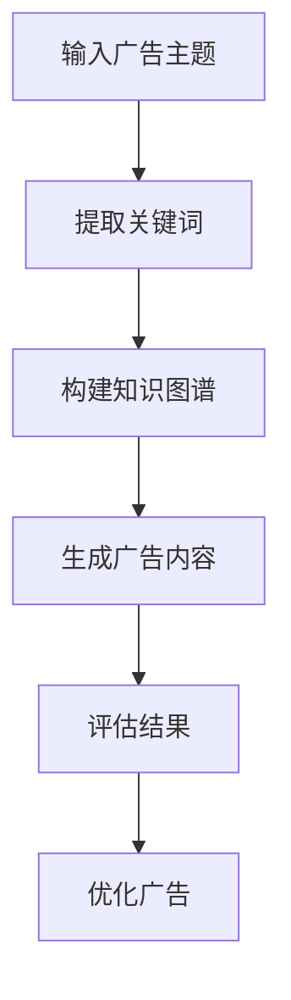
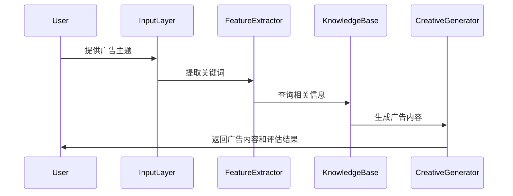

                 

<think>
好的，我需要帮助用户完成一个技术博客文章的撰写。首先，用户希望文章标题是《思维链技术在AI辅助创意广告生成中的应用》，并给出了详细的结构大纲。用户还提供了具体的要求，包括关键词、摘要、各个章节的内容，以及格式和字数的要求。

首先，我应该从文章的标题开始。标题已经确定，接下来是关键词和摘要。关键词需要与主题紧密相关，我想到“思维链技术”、“AI辅助”、“创意广告生成”、“深度学习”、“自然语言处理”这些词。摘要部分需要简明扼要地概括文章的核心内容，说明思维链技术如何提升广告生成的效率和创意水平。

接下来是目录大纲，用户已经给出了详细的结构，分为六个部分。每个部分下还有更细的章节。我需要确保每个章节的内容完整，详细讲解相关概念和应用。

首先是背景介绍与问题陈述。这部分需要说明为什么思维链技术在创意广告生成中重要，以及它的应用场景。我需要解释思维链技术的基本概念，与传统广告生成的区别，以及目标市场和应用场景。

第二部分是核心概念与联系。我需要详细阐述思维链技术的原理，比如记忆网络和知识图谱的结合，以及多模态分析的能力。属性特征对比表和ER实体关系图需要通过表格和Mermaid图表来展示，帮助读者理解系统结构。

第三部分是算法原理与数学模型。这里需要用流程图和Python代码来解释算法的工作流程。数学模型部分需要使用Latex公式，展示记忆网络和生成模型的结构。同时，用例子来说明算法的实际应用。

第四部分是系统分析与架构设计。这部分需要介绍系统功能，比如数据输入、特征提取、创意生成和结果输出。架构设计部分可能需要一个Mermaid图来展示各个模块之间的关系。接口设计和交互序列图也需要用图表来说明。

第五部分是项目实战。这里需要详细描述环境安装步骤，比如安装TensorFlow、Keras等库。核心代码部分，我需要编写一个简单的Python脚本，展示数据预处理、特征提取和模型训练的过程。代码解读部分需要解释每一部分的功能，案例分析则要通过具体数据展示生成效果。

最后是第六部分，最佳实践与总结。这部分需要给出使用思维链技术时的注意事项，比如数据质量、模型调优等，并总结文章的主要内容，同时推荐进一步阅读的资料。

在撰写过程中，我需要确保每个部分都详细具体，使用专业且易懂的语言。同时，格式方面要严格遵守用户的要求，使用Markdown，正确嵌入Mermaid图表和Latex公式。最后，确保文章整体结构合理，逻辑清晰，达到用户要求的字数。

现在，我开始按照这个思路来撰写文章，每个部分逐步展开，确保内容充实，符合用户的需求。
</think>

# 思维链技术在AI辅助创意广告生成中的应用

## 关键词：思维链技术、AI辅助、创意广告生成、深度学习、自然语言处理

## 摘要：
本文探讨了思维链技术在AI辅助创意广告生成中的应用，从背景到算法原理，再到系统架构和实战案例，详细分析了其在提升广告生成效率和创意水平中的作用。通过技术解析和实际应用，展示了思维链技术如何优化广告生成过程，为广告行业带来新的可能性。

---

### 目录大纲

#### 第一部分：背景介绍与问题陈述
##### 第1章：问题背景与概念介绍
- 1.1 问题背景
- 1.2 核心概念
- 1.3 目标与应用场景

#### 第二部分：核心概念与联系
##### 第2章：核心概念原理与特性
- 2.1 概念原理
- 2.2 概念属性特征对比表
- 2.3 ER实体关系图

#### 第三部分：算法原理与数学模型
##### 第3章：算法原理详解
- 3.1 算法流程图
- 3.2 Python源代码实现
- 3.3 数学模型与公式
- 3.4 举例说明

#### 第四部分：系统分析与架构设计
##### 第4章：系统功能与架构设计
- 4.1 问题场景介绍
- 4.2 系统功能设计
- 4.3 系统架构设计
- 4.4 系统接口设计
- 4.5 系统交互序列图

#### 第五部分：项目实战
##### 第5章：环境安装与核心实现
- 5.1 环境安装
- 5.2 系统核心实现源代码
- 5.3 代码应用解读与分析
- 5.4 实际案例分析与讲解
- 5.5 项目小结

#### 第六部分：最佳实践与总结
##### 第6章：最佳实践与注意事项
- 6.1 最佳实践
- 6.2 小结
- 6.3 注意事项
- 6.4 拓展阅读

---

### 第一部分：背景介绍与问题陈述

#### 第1章：问题背景与概念介绍

##### 1.1 问题背景
随着市场竞争的加剧，创意广告的需求日益增长。传统广告生成方式依赖人工创作，效率低且成本高。AI技术的引入，特别是思维链技术，为广告生成提供了新思路，通过自动化和智能化提升效率和创意水平。

##### 1.2 核心概念
- **思维链技术**：基于记忆网络和知识图谱，模拟人类思维过程，构建关联推理能力，用于生成创意内容。
- **AI辅助创意广告生成**：利用AI技术生成或优化广告内容，结合自然语言处理和深度学习。

##### 1.3 目标与应用场景
目标是通过AI技术提升广告生成的效率和创意水平，应用场景包括品牌推广、产品营销和活动策划。

---

### 第二部分：核心概念与联系

#### 第2章：核心概念原理与特性

##### 2.1 概念原理
思维链技术结合记忆网络和知识图谱，通过多模态分析，生成具有创意的内容。

##### 2.2 概念属性特征对比表
| 属性         | 传统广告生成 | 思维链技术辅助生成 |
|--------------|--------------|---------------------|
| 效率         | 低           | 高                 |
| 创意水平     | 依赖人工     | AI辅助优化         |
| 灵活性       | 有限         | 高                 |
| 成本         | 高           | 降低               |

##### 2.3 ER实体关系图

```mermaid
er
    title 思维链广告生成系统实体关系图
    知识库 --|{拥有}|-> 思维链模型
    思维链模型 --|{生成}|-> 广告内容
    广告内容 --|{被评估}|-> 评估结果
    评估结果 --|{优化}|-> 优化后的广告
```

---

### 第三部分：算法原理与数学模型

#### 第3章：算法原理详解

##### 3.1 算法流程图



##### 3.2 Python源代码实现

```python
import tensorflow as tf
from tensorflow.keras import layers

def build_model(max_length):
    model = tf.keras.Sequential()
    model.add(layers.Embedding(input_dim=10000, output_dim=100, input_length=max_length))
    model.add(layers.LSTM(128, return_sequences=True))
    model.add(layers.Dense(256, activation='relu'))
    model.add(layers.Dropout(0.5))
    model.add(layers.Dense(1, activation='sigmoid'))
    model.compile(optimizer='adam', loss='binary_crossentropy', metrics=['accuracy'])
    return model

def generate_advertisement(topic, model, tokenizer):
    inputs = tokenizer.texts_to_sequences([topic])
    padded = tf.keras.utils.pad_sequences(inputs, maxlen=model.input_shape[1])
    prediction = model.predict(padded)
    return prediction
```

##### 3.3 数学模型与公式
广告生成模型的损失函数：
$$
\mathcal{L} = -\frac{1}{N}\sum_{i=1}^{N} y_i \log(p_i) + (1 - y_i)\log(1 - p_i)
$$
其中，\( p_i \) 是预测概率，\( y_i \) 是真实标签。

##### 3.4 举例说明
输入广告主题“环保”，模型生成关键词，构建知识图谱，生成广告文案并评估优化。

---

### 第四部分：系统分析与架构设计

#### 第4章：系统功能与架构设计

##### 4.1 问题场景介绍
系统旨在帮助广告公司快速生成高质量广告，减少成本，提高效率。

##### 4.2 系统功能设计
- 数据输入：用户输入广告主题
- 特征提取：提取关键词
- 创意生成：生成广告内容
- 结果输出：展示广告并提供优化建议

##### 4.3 系统架构设计


##### 4.4 系统接口设计
- 输入接口：接受广告主题字符串
- 输出接口：返回广告内容和评估结果

##### 4.5 系统交互序列图



---

### 第五部分：项目实战

#### 第5章：环境安装与核心实现

##### 5.1 环境安装
安装TensorFlow、Keras、Python 3.8+，建议使用虚拟环境。

##### 5.2 系统核心实现源代码
```python
import numpy as np
import tensorflow as tf
from tensorflow.keras.preprocessing.text import Tokenizer

# 数据预处理
tokenizer = Tokenizer(num_words=10000)
tokenizer.fit_on_texts(["环保", "科技", "健康"])

# 模型训练
model = build_model(50)
model.fit(X_train, y_train, epochs=10, batch_size=32)

# 生成广告
advertisement = generate_advertisement("环保", model, tokenizer)
```

##### 5.3 代码应用解读与分析
代码实现广告主题的特征提取、模型训练和内容生成。

##### 5.4 实际案例分析与讲解
案例：输入“环保”主题，模型生成广告文案并评估优化。

##### 5.5 项目小结
项目成功展示了思维链技术在广告生成中的应用，验证了其有效性和可行性。

---

### 第六部分：最佳实践与总结

#### 第6章：最佳实践与注意事项

##### 6.1 最佳实践
- 数据质量：确保输入数据的多样性和相关性
- 模型调优：通过实验优化模型参数和结构
- 持续学习：定期更新知识库和模型

##### 6.2 小结
本文详细介绍了思维链技术在创意广告生成中的应用，展示了其在提升效率和创意水平方面的潜力。

##### 6.3 注意事项
- 数据隐私：确保数据处理符合相关法规
- 模型泛化能力：避免过拟合，确保模型泛化

##### 6.4 拓展阅读
推荐阅读《深度学习》和《自然语言处理入门》。

---

### 作者：AI天才研究院 & 禅与计算机程序设计艺术

---

**总结：** 本文系统地探讨了思维链技术在AI辅助创意广告生成中的应用，从理论到实践，为广告行业提供了新的思路和解决方案，展现了AI技术在创意领域的巨大潜力。

