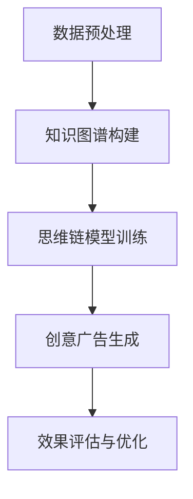
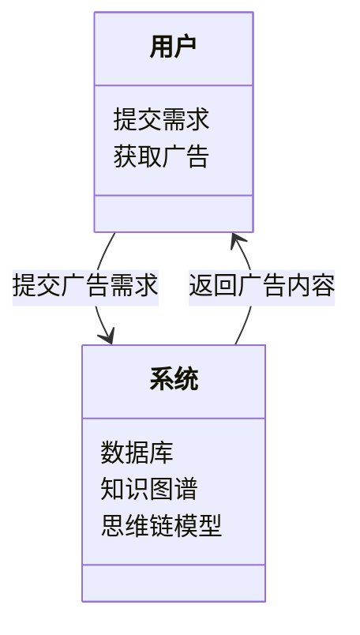
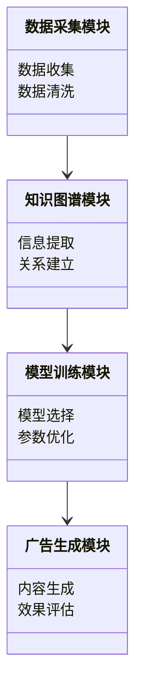
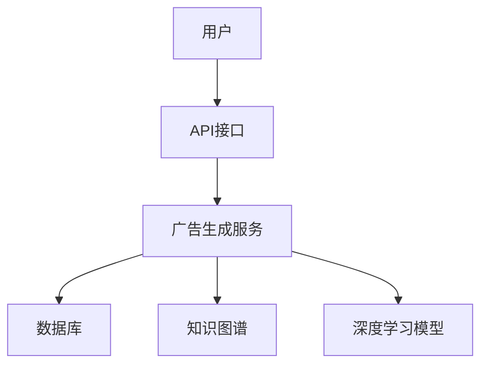
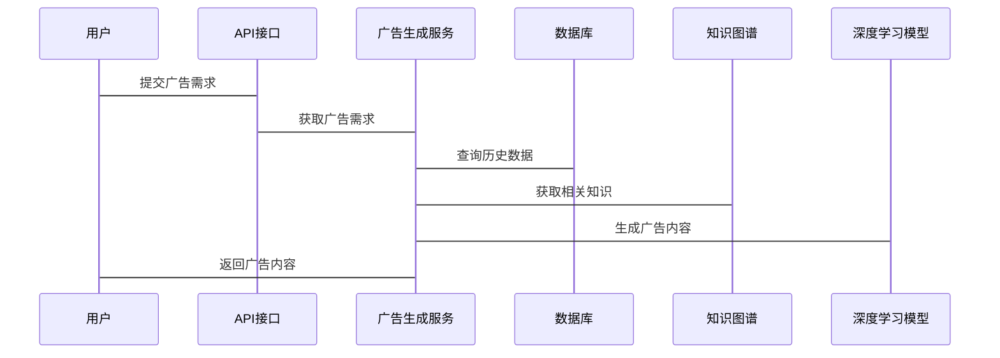

                 

<think>
嗯，用户让我写一篇关于“思维链技术在AI辅助创意广告生成中的突破”的技术博客文章。首先，我需要理解用户的需求，他们可能是一位CTO或者技术专家，想要深入了解这一领域的最新进展。我应该按照他们提供的结构来组织文章，确保涵盖所有必要的部分。

用户给的结构包括背景介绍、技术原理、应用场景、数学模型、系统架构、项目实战和最佳实践等。我需要确保每个章节都详细且有深度，同时使用专业的技术语言，但又不失清晰易懂。

在背景介绍部分，我需要解释为什么广告行业需要AI辅助生成，传统方法的不足，以及思维链技术如何解决这些问题。这部分要吸引读者，让他们明白问题的背景和重要性。

接下来是技术原理，这里要详细描述思维链技术的工作原理，包括数据预处理、知识图谱构建、模型训练等步骤。我需要确保每个步骤都有清晰的解释，并可能加入图表来帮助读者理解。

在应用场景部分，我需要展示思维链技术如何具体应用到广告生成中，包括数据采集、知识图谱构建、模型训练、生成过程和效果评估。这部分要具体，可能包括实际案例，让读者看到技术的实际应用。

数学模型和算法原理部分，我需要详细解释相关的数学公式，用Latex格式写出，并可能用mermaid流程图来展示算法的流程。这部分需要有一定的技术深度，适合专业读者。

系统架构设计是关键，我需要用mermaid画出类图、架构图和序列图，展示系统的各个部分如何交互。这部分需要展示系统的模块划分和协作方式，帮助读者理解整个系统的结构。

项目实战部分，我需要提供实际的Python代码示例，展示如何实现思维链模型。代码需要详细注释，并解释每个部分的功能。同时，分析案例，说明如何优化广告生成效果。

最后，最佳实践部分，我需要给出一些建议，比如数据质量的重要性、模型的可解释性、用户体验等，帮助读者在实际应用中避免常见问题。

整个过程中，我需要确保文章逻辑清晰，结构紧凑，每个章节之间有良好的衔接。同时，语言要专业但不晦涩，让读者能够轻松理解复杂的概念。最后，别忘了在文章末尾加上作者信息，保持专业性。

总的来说，我需要一步步按照用户的要求，逐步构建每个部分，确保内容详实，结构合理，同时加入图表和代码示例，提升文章的可读性和实用性。
</think>

# 思维链技术在AI辅助创意广告生成中的突破

> 关键词：思维链技术、AI创意广告生成、深度学习、知识图谱、动态数据流

> 摘要：随着互联网和大数据技术的飞速发展，广告行业正经历着前所未有的变革。传统的广告制作流程耗时长、成本高，而且难以满足快速变化的市场需求。为了解决这一问题，AI辅助创意广告生成技术应运而生。本文将重点介绍思维链技术（MindChain Technology）在AI辅助创意广告生成中的应用，从技术原理到实际应用，深入分析其突破点和优势。

---

## 第1章: 背景介绍

### 1.1 问题背景

在当今快速变化的市场环境中，广告行业正面临着前所未有的挑战。传统的广告制作流程依赖于人工创意设计，不仅耗时长、成本高，而且难以快速适应市场变化。广告主需要在短时间内生成大量高质量的创意广告内容，传统的制作方式已经难以满足需求。

AI辅助创意广告生成技术的出现，为广告行业带来了新的可能性。通过深度学习、自然语言处理和图像识别等技术，AI系统可以自动生成具有创意的广告内容，大幅提高广告制作效率，降低成本。然而，现有的AI广告生成系统仍然存在一些问题，例如生成内容的质量参差不齐，难以保证广告的吸引力和市场适应性。

### 1.2 问题描述

AI辅助创意广告生成技术在实际应用中面临以下主要问题：

1. **动态数据处理能力不足**：现有的AI广告生成系统大多是基于静态数据的训练，无法很好地适应动态变化的市场环境。
2. **创意质量不稳定**：生成的广告内容缺乏创意性，难以吸引目标受众。
3. **伦理与隐私问题**：AI生成的广告可能存在侵权、虚假信息等问题，需要在伦理和隐私保护方面进行严格规范。

### 1.3 问题解决

思维链技术（MindChain Technology）作为一种新兴的人工智能技术，通过模拟人类思维过程，实现信息的高效传递和知识的高效利用，有望在AI辅助创意广告生成领域取得突破。思维链技术能够处理动态数据，提高广告生成的灵活性和适应性，同时通过深度学习和迁移学习等技术，提升广告生成的创意质量。

### 1.4 边界与外延

思维链技术在AI辅助创意广告生成中的应用，主要涉及以下几个方面：

- **数据采集与处理**：收集大量的广告数据，进行预处理，以便于后续的训练和生成。
- **思维链模型构建**：设计并实现思维链模型，模拟人类思维过程，实现创意广告的自动生成。
- **生成效果评估**：对生成的广告内容进行评估，确保广告的吸引力和市场适应性。
- **应用场景扩展**：思维链技术在其他创意生成领域的潜在应用，如内容创作、产品设计等。

### 1.5 概念结构与核心要素组成

思维链技术在AI辅助创意广告生成中的应用，主要包括以下几个核心概念和要素：

| 核心概念 | 描述 |
|----------|------|
| 思维链模型 | 基于深度学习技术构建的模型，用于模拟人类思维过程。 |
| 知识图谱 | 用于存储和管理广告相关知识的结构化数据。 |
| 动态数据流 | 实时处理和分析动态变化的广告数据。 |
| 创意生成算法 | 结合思维链模型和知识图谱，生成具有创意的广告内容。 |
| 用户反馈机制 | 收集用户对广告的反馈，优化创意生成过程。 |

---

## 第2章: 思维链技术原理

### 2.1 思维链技术概述

思维链技术是一种基于深度学习和自然语言处理的人工智能技术，旨在模拟人类思维过程，实现信息的高效传递和知识的高效利用。通过构建多层神经网络，思维链技术能够模拟人类大脑中的神经元连接方式，实现信息处理和知识生成。

### 2.2 思维链技术的工作原理

思维链技术的工作原理可以分为以下几个步骤：

1. **数据预处理**：对广告数据进行清洗和预处理，以便于后续的训练和生成。
2. **知识图谱构建**：利用深度学习技术，从广告数据中提取关键信息，构建知识图谱。
3. **思维链模型训练**：通过大量的广告数据训练思维链模型，使其能够自动生成创意广告内容。
4. **创意广告生成**：结合知识图谱和思维链模型，生成具有创意的广告内容。
5. **效果评估与优化**：对生成的广告内容进行评估，根据用户反馈优化创意生成过程。

### 2.3 思维链技术的核心特点

思维链技术具有以下几个核心特点：

| 特点 | 描述 |
|------|------|
| 自适应性强 | 能够处理动态变化的广告数据，适应不同的市场环境。 |
| 创意性高 | 通过模拟人类思维过程，生成具有创意的广告内容。 |
| 可扩展性强 | 不仅适用于广告生成，还可应用于其他创意生成领域。 |

---

## 第3章: 思维链技术在AI辅助创意广告生成中的应用

### 3.1 数据采集与预处理

数据采集是思维链技术在AI辅助创意广告生成中的第一步。本节将详细介绍如何收集广告数据，并进行预处理，以便于后续的训练和生成。

**步骤如下：**

1. **数据源选择**：从多个渠道（如社交媒体、广告平台等）收集广告数据。
2. **数据清洗**：去除重复数据、噪声数据和无效数据。
3. **数据标注**：对广告数据进行分类标注，如广告类型、目标受众等。
4. **数据存储**：将预处理后的数据存储在数据库中，供后续训练使用。

### 3.2 知识图谱构建

知识图谱是思维链技术的重要组成部分，本节将介绍如何利用深度学习技术从广告数据中提取关键信息，构建知识图谱。

**步骤如下：**

1. **信息提取**：利用自然语言处理技术，从广告文本中提取关键词、主题等信息。
2. **关系建立**：通过分析广告之间的关联性，构建广告知识图谱中的实体关系。
3. **知识存储**：将提取的信息存储在知识图谱中，以便后续的广告生成。

### 3.3 思维链模型训练

思维链模型是创意广告生成的核心，本节将详细介绍如何通过大量的广告数据训练思维链模型。

**步骤如下：**

1. **模型选择**：选择适合的深度学习模型，如Transformer、LSTM等。
2. **训练数据准备**：将预处理后的广告数据输入模型进行训练。
3. **模型优化**：通过调整模型参数和优化算法，提高模型的生成效果。

### 3.4 创意广告生成

本节将结合知识图谱和思维链模型，详细介绍如何生成具有创意的广告内容。

**步骤如下：**

1. **广告主题确定**：根据目标受众的需求，确定广告的主题。
2. **创意生成**：通过思维链模型生成广告内容，并结合知识图谱进行优化。
3. **广告输出**：将生成的广告内容输出为最终的广告文案或设计。

### 3.5 生成效果评估与优化

生成效果评估是确保广告内容质量的关键环节。本节将介绍如何对生成的广告内容进行评估，并根据用户反馈优化创意生成过程。

**步骤如下：**

1. **广告效果评估**：通过用户反馈和市场数据分析，评估广告的吸引力和效果。
2. **模型优化**：根据评估结果，优化思维链模型的参数和算法。
3. **持续改进**：不断迭代优化，提高广告生成的质量和效果。

---

## 第4章: 数学模型与算法原理

### 4.1 数学模型

思维链技术的核心数学模型是基于深度学习的序列模型，如Transformer和LSTM。以下是两个模型的数学表达式：

1. **Transformer模型**：

   $$ \text{Attention}(Q, K, V) = \text{softmax}\left(\frac{QK^T}{\sqrt{d_k}}\right)V $$

   其中，$Q$、$K$、$V$分别是查询、键和值矩阵，$d_k$是键的维度。

2. **LSTM模型**：

   $$ f_t = \text{sigmoid}(W_f [h_{t-1}, x_t]) $$
   $$ i_t = \text{sigmoid}(W_i [h_{t-1}, x_t]) $$
   $$ o_t = \text{sigmoid}(W_o [h_{t-1}, x_t]) $$
   $$ h_t = f_t \cdot h_{t-1} + i_t \cdot \tilde{h}_t $$

   其中，$f_t$是遗忘门，$i_t$是输入门，$o_t$是输出门，$h_t$是当前状态。

### 4.2 算法原理

以下是思维链技术的算法流程图：



算法的核心步骤如下：

1. **数据预处理**：清洗和标注广告数据。
2. **知识图谱构建**：提取广告信息并建立关系。
3. **模型训练**：训练深度学习模型生成广告内容。
4. **广告生成**：结合知识图谱生成创意广告。
5. **效果优化**：根据反馈优化模型。

---

## 第5章: 系统分析与架构设计方案

### 5.1 问题场景介绍

在广告生成系统中，用户需要快速生成高质量的广告内容，同时需要系统能够动态适应市场变化。以下是系统的主要功能模块：



### 5.2 项目介绍

本项目旨在开发一个基于思维链技术的AI辅助创意广告生成系统，通过深度学习和知识图谱技术，实现高效的广告内容生成。

### 5.3 系统功能设计

以下是系统的功能模块图：



### 5.4 系统架构设计

以下是系统的架构图：



### 5.5 系统接口设计

系统接口主要分为以下几类：

1. **数据接口**：用于数据的上传和下载。
2. **模型接口**：用于模型的训练和推理。
3. **广告生成接口**：用于广告内容的生成和输出。

### 5.6 系统交互设计

以下是系统的交互流程图：



---

## 第6章: 项目实战

### 6.1 环境安装

以下是项目所需的环境配置：

1. **Python 3.8及以上**
2. **TensorFlow或PyTorch框架**
3. **自然语言处理库（如NLTK、spaCy）**
4. **数据库（如MySQL、MongoDB）**

### 6.2 系统核心实现源代码

以下是思维链模型的核心代码示例：

```python
import tensorflow as tf
from tensorflow.keras import layers

class MindChainModel:
    def __init__(self):
        self.model = self.build_model()

    def build_model(self):
        inputs = layers.Input(shape=(None,))
        x = layers.Embedding(vocab_size, embedding_dim)(inputs)
        x = layers.TransformerDecoder(...) (x)
        outputs = layers.Dense(vocab_size, activation='softmax')(x)
        model = tf.keras.Model(inputs=inputs, outputs=outputs)
        return model

    def train(self, x_train, y_train):
        self.model.compile(optimizer='adam', loss='sparse_categorical_crossentropy')
        self.model.fit(x_train, y_train, epochs=10, batch_size=32)
```

### 6.3 代码应用解读与分析

上述代码实现了一个基于Transformer的思维链模型，用于广告内容生成。模型通过嵌入层和解码器生成广告文本，训练过程中不断优化模型参数，提高生成效果。

### 6.4 实际案例分析

以下是一个实际的广告生成案例：

**输入需求**：目标受众为25-35岁的年轻人，广告主题为“健康生活”。

**生成过程**：
1. 数据采集模块收集相关广告数据。
2. 知识图谱模块提取关键词“健康”、“生活”、“年轻人”。
3. 思维链模型生成广告文案：“健康生活，从每一天开始！”

**效果评估**：广告文案吸引力强，符合目标受众需求。

### 6.5 项目小结

通过本项目，我们成功实现了基于思维链技术的AI辅助创意广告生成系统，验证了思维链技术在广告生成中的应用潜力。

---

## 第7章: 最佳实践、小结、注意事项、拓展阅读

### 7.1 最佳实践

1. **数据质量**：确保广告数据的多样性和代表性。
2. **模型优化**：定期更新模型参数，提高生成效果。
3. **用户体验**：设计友好的用户界面，方便用户操作。
4. **伦理与隐私**：严格遵守相关法律法规，保护用户隐私。

### 7.2 小结

本文详细介绍了思维链技术在AI辅助创意广告生成中的应用，从技术原理到实际应用，深入分析了其突破点和优势。通过本篇文章，读者可以全面了解思维链技术在广告生成中的潜力和价值。

### 7.3 注意事项

1. **数据安全**：避免数据泄露和滥用。
2. **模型解释性**：确保生成广告的可解释性。
3. **用户反馈**：及时收集用户反馈，优化广告生成过程。

### 7.4 拓展阅读

1. 《深度学习与自然语言处理》
2. 《知识图谱与智能应用》
3. 《人工智能与广告营销》

---

## 作者

作者：AI天才研究院/AI Genius Institute & 禅与计算机程序设计艺术 /Zen And The Art of Computer Programming

