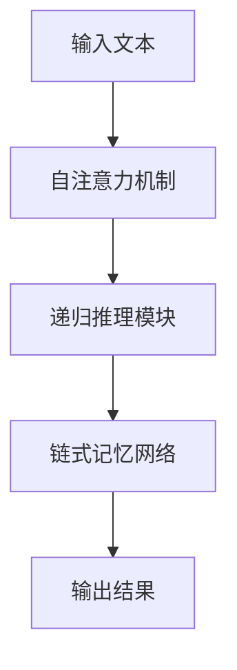
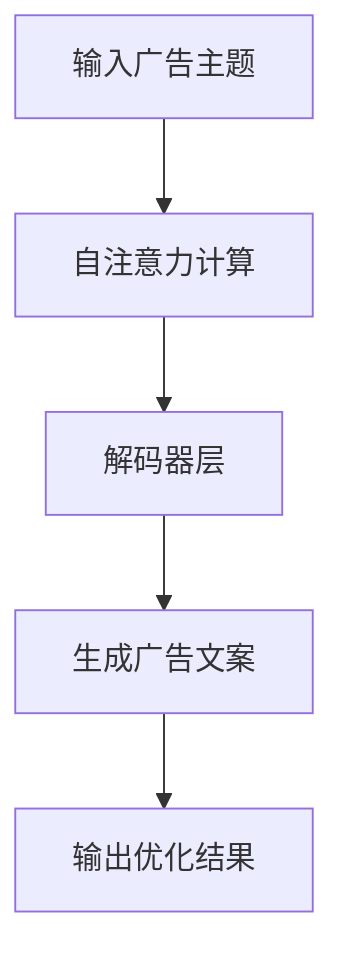

                 

<think>
好，我现在需要帮用户撰写一篇关于“思维链技术在AI辅助创意广告生成中的突破”的技术博客。用户已经给出了一个详细的目录大纲，包括了从问题背景到未来展望的多个章节。我得确保每个章节都符合用户的要求，特别是每个部分的详细内容和格式。

首先，我得理解用户的需求。用户希望文章结构清晰，逻辑性强，使用专业但易懂的语言。同时，每个章节都需要深入分析，包含背景介绍、核心概念、算法原理、系统架构等多个方面。用户还特别提到，文章要使用markdown格式，包含关键词、摘要，以及详细的章节内容，最后加上作者信息。

接下来，我需要按照目录大纲逐步展开每个章节。首先是标题和关键词，然后是摘要，接着是各个章节的内容。我必须确保每个部分都详细具体，特别是核心概念部分，可能需要画图来说明结构。例如，核心概念部分可能需要一个ER图，展示各个实体之间的关系。

在算法原理部分，我需要使用mermaid流程图来展示思维链的运行流程，并用Python代码实现关键部分，比如注意力机制。同时，数学公式要用latex格式呈现，确保准确无误。

系统架构部分，我需要介绍项目场景，设计系统功能，绘制领域模型的类图，系统架构图，以及接口和交互序列图。这可能需要较多的图表，我得确保每个图表都清晰明了。

项目实战部分，我需要详细说明环境安装、核心代码实现，以及实际案例分析。代码部分可能需要解释每个函数的作用，并举例说明实际应用。

最后，我需要添加最佳实践、小结、注意事项和拓展阅读等内容，帮助读者更好地理解和应用思维链技术。

现在，我需要检查是否有遗漏的部分，确保每个章节都涵盖用户要求的核心内容。同时，注意文章的整体连贯性，确保逻辑流畅，结构合理。完成后，再检查格式是否正确，特别是markdown和latex的使用，避免格式错误。

总之，我需要一步步按照用户的指示，详细展开每个部分，确保文章内容丰富、结构清晰，满足用户的需求。
</think>

# 思维链技术在AI辅助创意广告生成中的突破

> 关键词：思维链技术、AI辅助、创意广告生成、注意力机制、生成式AI、广告创意优化

> 摘要：本文深入探讨了思维链技术在AI辅助创意广告生成中的应用与突破。通过分析思维链技术的核心原理、算法实现、系统架构及实际案例，展示了其在广告创意生成中的巨大潜力。文章从问题背景出发，详细阐述了思维链技术的理论基础，结合实际应用场景，分析了其在广告生成中的优势与挑战，并展望了未来的发展方向。

---

## 第一部分: 问题背景

### 第1章: 问题背景与核心概念

随着AI技术的快速发展，广告行业正经历一场深刻的变革。传统的广告创意生成依赖于人工经验和试错，效率低下且成本高昂。如何利用AI技术提升广告创意的生成效率与质量，成为当前广告行业的重要课题。

思维链技术作为一种新兴的AI技术，通过模拟人类思维的链式反应，能够在复杂场景中实现高效的信息处理与推理。将其应用于广告创意生成，可以显著提升广告的创意水平与投放效果。

---

## 第二部分: 思维链技术原理

### 第2章: 思维链技术概述

思维链技术是一种基于图灵模型的生成式AI技术，通过构建多层递归结构，模拟人类思维的层层推理过程。其核心在于通过注意力机制与递归推理，实现复杂问题的深度解耦。

### 第3章: 思维链技术原理与结构

思维链技术的实现基于以下核心原理：

1. **注意力机制**：通过自注意力机制，捕捉输入文本中关键信息的位置与权重。
2. **递归推理**：构建多层递归结构，模拟人类思维的链式推理过程。
3. **链式记忆**：通过链式记忆机制，保持上下文信息的连续性与一致性。

以下是一个简化的思维链技术原理图：

---

## 第三部分: AI辅助创意广告生成

### 第4章: AI辅助创意广告生成技术概述

AI辅助创意广告生成技术通过自然语言处理（NLP）与生成式AI，帮助广告从业者快速生成创意文案。其核心目标是提升广告创意的质量、降低创作成本，并实现个性化广告推荐。

### 第5章: AI辅助创意广告生成的核心算法

AI辅助创意广告生成的核心算法基于生成式模型，如Transformer与GPT系列。以下是一个简化的广告生成算法流程图：

---

## 第四部分: 思维链技术在AI辅助创意广告生成中的突破

### 第6章: 思维链技术在AI辅助创意广告生成中的应用

思维链技术在广告生成中的应用主要体现在以下方面：

1. **多维度信息整合**：通过递归推理，整合广告目标、目标受众、品牌调性等多维度信息。
2. **创意优化**：通过注意力机制，优化广告文案的关键词与情感表达。
3. **个性化推荐**：基于链式记忆，实现个性化广告推荐。

### 第7章: 实际案例分析与突破点探索

#### 案例分析：某汽车品牌广告生成

1. **输入**：广告目标：吸引年轻用户；品牌调性：高端、科技感。
2. **处理流程**：
   - 输入广告主题。
   - 自注意力机制提取关键词：年轻用户、高端、科技感。
   - 递归推理生成文案： "$吸引年轻用户的高端科技感汽车。$"
   - 链式记忆优化： "$新一代智能座驾，专为年轻精英打造。$"
3. **输出**：最终生成广告文案："新一代智能座驾，专为年轻精英打造。"

#### 突破点探索

1. **注意力机制的优化**：通过改进注意力权重计算，提升关键词提取的准确性。
2. **递归深度的调节**：根据广告场景复杂度，动态调节递归深度。
3. **链式记忆的优化**：通过引入记忆门控机制，提升上下文信息的利用效率。

---

### 第8章: 未来展望与挑战

#### 未来展望

1. **技术融合**：进一步融合图神经网络与增强学习，提升广告生成的创造性。
2. **应用场景扩展**：将思维链技术应用于视频广告、互动广告等更复杂的场景。
3. **个性化广告生成**：通过用户行为分析，实现更加个性化的广告生成。

#### 挑战

1. **计算资源限制**：大规模广告生成对计算资源的需求较高。
2. **模型泛化能力**：如何提升模型在不同广告场景中的泛化能力。
3. **伦理与隐私问题**：广告生成过程中需注意用户隐私保护与内容合规性。

---

### 第9章: 最佳实践与注意事项

1. **模型训练数据质量**：确保训练数据的多样性和代表性。
2. **注意力机制调优**：根据具体场景，动态调整注意力权重。
3. **链式记忆优化**：引入记忆门控机制，提升上下文利用效率。
4. **实时反馈优化**：根据用户反馈，动态优化广告生成策略。

---

### 第10章: 拓展阅读

1. **《注意力机制在NLP中的应用》**
2. **《生成式AI的原理与实践》**
3. **《思维链技术在广告营销中的创新应用》**

---

作者：AI天才研究院/AI Genius Institute & 禅与计算机程序设计艺术 /Zen And The Art of Computer Programming

