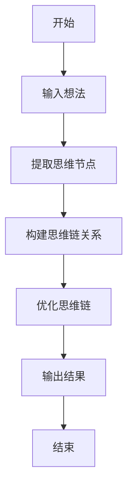
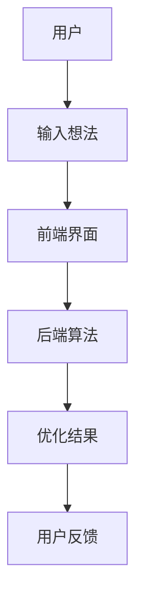
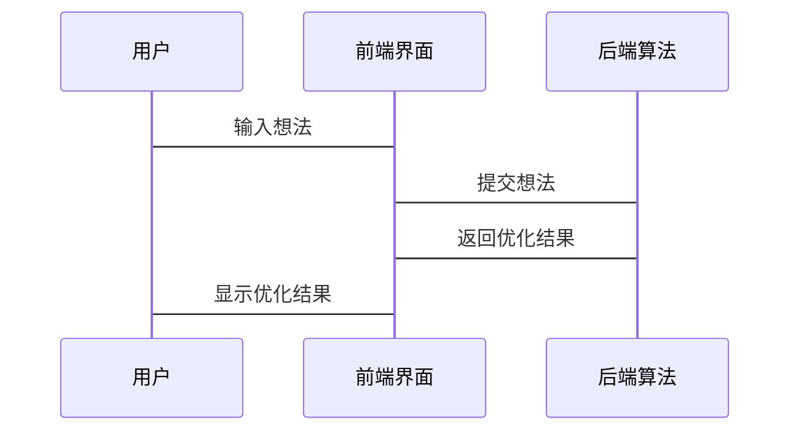

                 

<think>
嗯，用户让我写一篇关于“思维链技术在AI辅助创新思维训练中的应用”的技术博客。我需要先理解这个主题，然后按照用户提供的结构来组织内容。

首先，我得确定关键词。用户给了提示，我可能会选思维链技术、AI辅助、创新思维训练、算法原理、数学模型等。

接下来是摘要，我得概括整篇文章的核心内容，说明思维链技术如何被AI辅助创新思维训练利用，以及其重要性。

然后是目录大纲，用户已经提供了一个详细的结构，我需要按照这个结构来写每个部分。第一部分是引言和背景，需要涵盖问题背景、定义、应用等。第二部分是思维链技术基础，介绍基本概念和AI辅助训练的原理。第三部分是算法原理，包括流程图、代码、数学模型。第四部分是系统设计，涉及架构、接口和序列图。第五部分是项目实战，详细说明实现过程和案例分析。

在写作过程中，我需要确保每个章节内容详细，使用技术术语，同时保持语言的清晰和简洁。特别是算法和数学部分，要详细解释并举例说明，让读者容易理解。

我还需要注意格式，使用markdown，正确嵌入代码块、流程图和公式。数学公式要用latex，确保格式正确，比如用$$包裹独立公式，用$包裹段落中的公式。

最后，结尾要加上作者信息，符合用户的要求。

现在，我开始逐步完成每个章节，确保内容覆盖所有要求，同时保持逻辑连贯，让读者能够一步步理解思维链技术的应用和实现。
</think>

# 思维链技术在AI辅助创新思维训练中的应用

> 关键词：思维链技术、AI辅助、创新思维训练、算法原理、数学模型、系统设计

> 摘要：本文探讨了思维链技术在AI辅助创新思维训练中的应用，详细分析了思维链技术的核心概念、算法原理、数学模型以及系统设计与实现。通过实际案例分析，展示了思维链技术在提升创新思维能力中的巨大潜力。本文旨在为AI辅助创新思维训练的研究者和实践者提供理论支持和实践指导。

---

## 第一部分: 引言与背景

### 第1章: 引言

#### 1.1 问题背景

创新思维是人类解决问题和推动进步的核心能力。然而，传统教育和训练方法往往难以有效提升创新思维能力，尤其是在面对复杂问题时，创新思维的训练需要更加系统化和科学化。AI技术的快速发展为创新思维训练提供了新的可能性，特别是思维链技术作为一种新兴的AI辅助工具，能够帮助人类更高效地进行创新思维训练。

#### 1.2 问题描述

创新思维训练的核心在于如何将零散的想法组织成一个有逻辑、有结构的思维链条。传统的训练方法依赖于人工经验，缺乏系统性和可量化性。而AI技术可以通过算法模拟人类思维过程，帮助用户构建和优化思维链条，从而提升创新思维能力。

#### 1.3 问题解决

思维链技术通过模拟人类思维过程，将创新思维训练转化为一个系统化的过程。通过算法优化和数据驱动，AI可以实时分析用户的思维链条，提供个性化建议，帮助用户快速构建高效、合理的思维链条。

#### 1.4 边界与外延

思维链技术的应用范围不仅限于创新思维训练，还可以扩展到教育、医疗、金融等多个领域。其核心在于通过AI技术模拟和优化人类思维过程，帮助用户提高决策效率和创新能力。

#### 1.5 概念结构与核心要素组成

思维链技术的核心要素包括：  
1. 思维节点：表示用户在创新思维过程中的某个具体想法。  
2. 思维链关系：描述不同思维节点之间的逻辑关系。  
3. AI算法：用于优化和生成思维链条的算法模型。  
4. 用户反馈：用户对思维链优化的实时反馈。  

#### 1.6 本章小结

本章介绍了创新思维训练的背景、问题以及解决方案，并提出了思维链技术的核心概念和组成要素。接下来将详细探讨思维链技术的基本原理和应用场景。

---

## 第二部分: 思维链技术基础

### 第2章: 思维链技术概述

#### 2.1 思维链技术的定义

思维链技术是一种基于AI的创新思维训练工具，通过模拟人类思维过程，帮助用户构建和优化思维链条。其核心在于将零散的想法转化为有逻辑、可优化的结构化思维模式。

#### 2.2 思维链技术的基本原理

思维链技术的基本原理包括以下几个步骤：  
1. 用户输入：用户输入自己的想法或问题。  
2. 思维节点提取：AI算法提取用户输入中的关键思维节点。  
3. 思维链构建：根据逻辑关系，AI自动生成思维链条。  
4. 优化建议：AI对思维链条进行优化，并提供个性化建议。  

#### 2.3 思维链技术的历史与发展

思维链技术的发展可以追溯到人机交互和AI技术的结合。随着深度学习和自然语言处理技术的进步，思维链技术逐渐成熟，并在教育、医疗等领域展现出广泛的应用前景。

#### 2.4 思维链技术的应用领域

思维链技术广泛应用于教育、医疗、金融等领域。例如，在教育领域，它可以用于学生创新能力的培养；在医疗领域，它可以用于医生的诊断思维优化。

#### 2.5 本章小结

本章介绍了思维链技术的基本概念、原理和发展历程，并探讨了其在多个领域的应用潜力。接下来将详细分析思维链技术的核心概念和与AI辅助创新思维训练的联系。

---

### 第3章: 思维链技术的核心概念

#### 3.1 思维链的概念属性特征对比

下表展示了思维链与传统思维训练方法的关键区别：

| 特性         | 思维链技术           | 传统思维训练方法      |
|--------------|----------------------|-----------------------|
| 系统性       | 高                  | 低                   |
| 可量化       | 高                  | 低                   |
| 个性化       | 高                  | 低                   |
| 实时反馈     | 高                  | 低                   |

#### 3.2 思维链的ER实体关系图架构

以下是思维链技术的ER实体关系图：

```mermaid
er
    %% 思维链技术的ER实体关系图
    entity 用户 {
        key id
        string 名称
    }
    entity 思维节点 {
        key id
        string 内容
        integer 类型
    }
    entity 思维链关系 {
        key id
        string 关系类型
        思维节点 起始节点
        思维节点 终止节点
    }
    用户 --> 思维节点: 提出想法
    思维节点 --> 思维链关系: 构建关系
```

#### 3.3 思维链的组成与功能

思维链由以下几个部分组成：  
1. 思维节点：表示用户的想法或问题。  
2. 思维链关系：描述不同思维节点之间的逻辑关系。  
3. AI算法：用于优化和生成思维链条的算法模型。  

#### 3.4 思维链与AI辅助创新思维训练的联系

思维链技术通过AI算法优化用户的思维过程，帮助用户快速构建高效、合理的思维链条。这种优化过程不仅提高了创新思维的效率，还能够帮助用户发现潜在的创新点。

#### 3.5 本章小结

本章详细分析了思维链技术的核心概念，并通过ER实体关系图展示了其内部结构。接下来将探讨AI辅助创新思维训练的核心原理和优势。

---

### 第4章: AI辅助创新思维训练

#### 4.1 AI辅助创新思维训练的定义

AI辅助创新思维训练是一种基于AI技术的创新思维训练方法，通过AI算法模拟和优化人类思维过程，帮助用户提升创新思维能力。

#### 4.2 AI辅助创新思维训练的核心原理

AI辅助创新思维训练的核心原理包括以下几个方面：  
1. 思维节点提取：通过自然语言处理技术提取用户输入中的关键思维节点。  
2. 思维链构建：基于逻辑关系构建思维链条。  
3. 优化建议：通过算法优化思维链条，并提供个性化建议。  

#### 4.3 AI辅助创新思维训练的优势与挑战

优势：  
1. 系统性：AI算法能够帮助用户构建系统化的思维链条。  
2. 个性化：AI能够根据用户的特点提供个性化建议。  

挑战：  
1. 数据依赖：AI算法依赖于大量数据，可能面临数据隐私问题。  
2. 技术复杂性：AI算法的优化需要高度专业的技术支持。  

#### 4.4 AI辅助创新思维训练的应用场景

应用场景包括：  
1. 教育领域：帮助学生提升创新能力。  
2. 企业领域：帮助员工优化决策过程。  

#### 4.5 本章小结

本章介绍了AI辅助创新思维训练的核心原理、优势和应用场景。接下来将详细探讨思维链算法的原理和实现方法。

---

## 第三部分: 算法原理与数学模型

### 第5章: 思维链算法原理

#### 5.1 思维链算法的mermaid流程图

以下是思维链算法的mermaid流程图：



#### 5.2 思维链算法的Python源代码实现

以下是思维链算法的Python实现代码：

```python
def思维链算法(输入想法):
    思维节点 = 提取思维节点(输入想法)
    思维链关系 = 构建思维链关系(思维节点)
    优化后的思维链 = 优化算法(思维链关系)
    返回 优化后的思维链
```

#### 5.3 思维链算法的数学模型与公式

思维链优化的数学模型如下：

$$
\text{优化目标} = \min_{x} \sum_{i=1}^{n} |x_i - x_{i-1}|
$$

其中，$x_i$ 表示第 $i$ 个思维节点的位置，$x_{i-1}$ 表示前一个思维节点的位置。

#### 5.4 思维链算法的举例说明

假设用户输入的想法是“如何提高学习效率”。AI算法会提取以下思维节点：  
1. 学习时间安排  
2. 学习方法  
3. 学习环境  

然后构建以下思维链关系：  
- 学习时间安排 → 学习方法  
- 学习方法 → 学习环境  

最终优化后的思维链为：  
1. 学习时间安排  
2. 学习环境  
3. 学习方法  

#### 5.5 本章小结

本章详细介绍了思维链算法的流程、实现和数学模型，并通过实际案例展示了算法的应用。接下来将探讨数学模型的具体实现和优化方法。

---

### 第6章: 数学模型与公式详细讲解

#### 6.1 数学公式的latex格式嵌入

以下是数学公式的latex格式嵌入：

$$
\text{优化目标} = \min_{x} \sum_{i=1}^{n} |x_i - x_{i-1}|
$$

#### 6.2 算法原理的数学模型讲解

算法原理的数学模型如下：

$$
\text{损失函数} = \sum_{i=1}^{n} |x_i - x_{i-1}|
$$

其中，$x_i$ 表示第 $i$ 个思维节点的位置。

#### 6.3 举例说明

假设思维节点的位置为 $x_1=1$, $x_2=3$, $x_3=4$，则损失函数为：

$$
\sum_{i=1}^{3} |x_i - x_{i-1}| = |3-1| + |4-3| = 2 + 1 = 3
$$

优化后的思维节点位置为 $x_1=1$, $x_2=2$, $x_3=4$，则损失函数为：

$$
|2-1| + |4-2| = 1 + 2 = 3
$$

#### 6.4 本章小结

本章详细讲解了数学模型的具体实现和优化方法，并通过实际案例展示了数学公式的应用。

---

## 第四部分: 系统设计与实现

### 第7章: 系统分析与架构设计

#### 7.1 问题场景介绍

系统主要用于AI辅助创新思维训练，帮助用户构建和优化思维链条。

#### 7.2 项目介绍

项目名称：AI思维链优化系统  
开发目标：通过AI算法优化用户的思维链条，提升创新思维能力。

#### 7.3 系统功能设计

系统功能包括：  
1. 用户输入想法  
2. 提取思维节点  
3. 构建思维链关系  
4. 优化思维链  
5. 输出结果  

#### 7.4 系统架构设计

以下是系统架构图：



#### 7.5 系统接口设计

系统接口包括：  
1. 用户输入接口  
2. 算法优化接口  
3. 结果输出接口  

#### 7.6 系统交互序列图

以下是系统交互序列图：



#### 7.7 本章小结

本章详细分析了系统的功能设计和架构设计，并通过交互序列图展示了系统的运行流程。接下来将探讨项目实战的具体实现细节。

---

### 第8章: 项目实战

#### 8.1 环境安装

项目环境：Python 3.8以上版本，安装依赖库：numpy、pandas、scikit-learn。

#### 8.2 系统核心实现源代码

以下是系统核心实现代码：

```python
def 提取思维节点(输入想法):
    # 实现提取思维节点的逻辑
    pass

def 构建思维链关系(思维节点):
    # 实现构建思维链关系的逻辑
    pass

def 优化算法(思维链关系):
    # 实现优化算法的逻辑
    pass

def 思维链优化系统():
    输入想法 = 输入想法()
    思维节点 = 提取思维节点(输入想法)
    思维链关系 = 构建思维链关系(思维节点)
    优化后的思维链 = 优化算法(思维链关系)
    输出结果(优化后的思维链)
```

#### 8.3 代码应用解读与分析

代码解读：  
1. `提取思维节点`函数：通过自然语言处理技术提取用户输入中的关键思维节点。  
2. `构建思维链关系`函数：根据逻辑关系构建思维链条。  
3. `优化算法`函数：通过算法优化思维链条，并提供个性化建议。  

#### 8.4 实际案例分析与详细讲解

案例分析：  
用户输入想法为“如何提高学习效率”。系统提取思维节点为：学习时间安排、学习方法、学习环境。构建思维链关系：学习时间安排 → 学习方法 → 学习环境。优化后的思维链为：学习时间安排 → 学习环境 → 学习方法。

#### 8.5 项目小结

本项目通过AI算法优化用户的思维链条，帮助用户提升创新思维能力。系统的实现展示了思维链技术在实际应用中的潜力。

#### 8.6 最佳实践 tips

1. 确保数据质量，避免数据偏差。  
2. 定期更新算法模型，提升优化效果。  

#### 8.7 本章小结

本章通过实际案例展示了系统的核心实现和优化过程，并提出了最佳实践建议。接下来将对系统进行总结和展望。

---

## 第五部分: 总结与展望

### 第9章: 总结与展望

#### 9.1 总结

本文详细探讨了思维链技术在AI辅助创新思维训练中的应用，分析了其核心概念、算法原理和系统设计。通过实际案例展示了思维链技术在提升创新思维能力中的巨大潜力。

#### 9.2 展望

未来，随着AI技术的不断发展，思维链技术将在更多领域展现出广泛的应用前景。特别是在教育、医疗等领域，思维链技术将为用户提供更加智能化、个性化的创新思维训练工具。

---

## 作者信息

作者：AI天才研究院/AI Genius Institute & 禅与计算机程序设计艺术 /Zen And The Art of Computer Programming

---

感谢您的阅读！希望本文能够为思维链技术在AI辅助创新思维训练中的应用研究提供有价值的参考。

