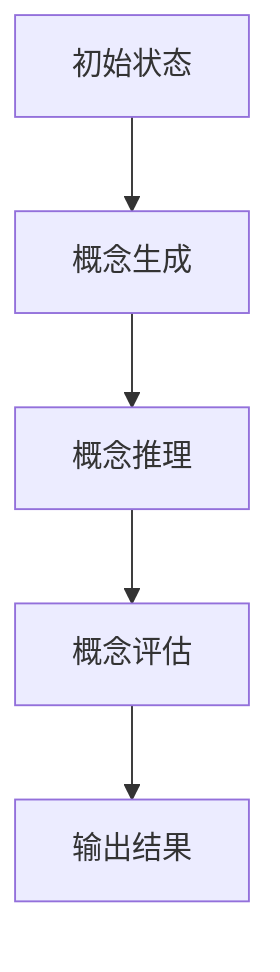
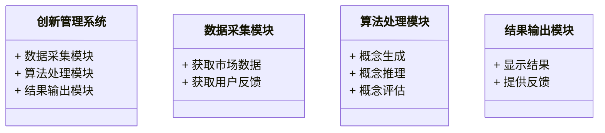
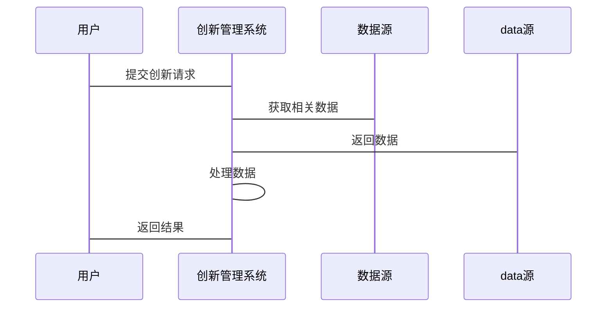

                 

<think>
好，我现在需要写一篇关于“思维链技术在AI辅助创新管理中的应用研究”的技术博客文章。根据用户的要求，我需要按照特定的结构来撰写，包括背景介绍、核心概念与联系、算法原理讲解、系统分析与架构设计方案、项目实战、最佳实践与小结等多个部分。

首先，我得理解每个部分需要包含的内容。背景介绍部分需要涵盖核心概念、问题背景、问题描述、问题解决以及边界与外延。这部分要让读者明白为什么思维链技术和AI辅助创新管理是重要的，以及它们的应用场景。

接下来是核心概念与联系，我需要定义思维链技术和AI辅助创新管理，并比较它们的特点，可能还需要用表格或图表来展示它们的联系和区别。这部分要确保读者清楚这两个概念是如何相互作用的。

然后是算法原理讲解，我需要详细解释思维链算法的工作原理，包括使用Mermaid流程图来展示流程，提供Python源代码实现，并通过例子来说明算法是如何运作的。这里要确保代码和流程图清晰易懂，方便读者理解。

接下来是系统分析与架构设计方案，这部分需要包括问题场景介绍、系统功能设计（使用Mermaid类图）、系统架构设计（使用Mermaid架构图）、系统接口设计和系统交互（使用Mermaid序列图）。这部分比较技术性强，需要详细描述各个模块之间的关系和交互方式。

项目实战部分，我需要指导读者如何安装环境，提供系统核心实现的源代码，并对代码进行详细解读和分析。同时，还需要通过实际案例来分析和详细讲解，最后做一个项目小结。

最后是最佳实践与小结，这里需要给出一些实用的建议，总结文章的主要内容，并提醒读者在实际应用中需要注意的事项，同时推荐一些拓展阅读的资料。

在撰写过程中，我需要确保每个部分逻辑清晰，内容详实，用词专业但又不失通俗易懂。此外，要注意使用正确的格式，如Mermaid图表、数学公式（使用latex格式）等，确保文章结构完整，格式正确。

现在，我开始按照这个结构逐步展开每个部分，确保内容符合用户的要求，并且覆盖所有必要的细节。
</think>

# 思维链技术在AI辅助创新管理中的应用研究

> 关键词：思维链技术、人工智能、创新管理、算法原理、系统架构

> 摘要：本文探讨了思维链技术在AI辅助创新管理中的应用，通过分析其核心概念、算法原理、系统架构及实际案例，展示了如何利用AI技术提升创新管理的效率和质量。文章内容详实，结构清晰，为相关领域的研究和实践提供了有价值的参考。

---

## 第一部分：背景介绍

### 核心概念

#### 问题背景

随着信息技术的飞速发展，人工智能（AI）技术在各个领域得到了广泛应用，尤其是在辅助创新管理方面展现了巨大潜力。传统的创新管理方法依赖于人的洞察力和经验，存在效率低、主观性强等问题。AI技术的引入，能够显著提升创新管理的效率和准确性，从而推动企业持续创新，保持竞争力。

#### 问题描述

创新管理是一个复杂的过程，涉及创意的产生、筛选、实施和评估等多个环节。如何有效利用AI技术辅助这些环节，提高创新管理的效率和质量，是当前亟待解决的问题。

#### 问题解决

本研究通过深入探讨思维链技术在AI辅助创新管理中的应用，提出了一套完整的解决方案。思维链技术是一种模拟人类思维过程的算法，能够在创意生成、评估和实施等环节提供有效的辅助。通过将思维链技术与AI算法相结合，可以构建一个智能的创新管理系统，帮助企业更高效地开展创新活动。

#### 边界与外延

本研究主要关注AI辅助创新管理在商业领域的应用，但思维链技术和AI算法的原理和方法同样适用于其他领域的创新管理。同时，研究还将探讨思维链技术在其他领域应用的可能性，为AI技术在创新管理领域的广泛应用提供参考。

---

## 第二部分：核心概念与联系

### 思维链技术的定义与特点

#### 定义

思维链技术是一种基于人工智能的算法，旨在模拟人类的思维过程，包括概念生成、推理和评估等环节。

#### 特点

1. **智能化**：能够自动生成和推理出新的概念，具有自我学习和优化能力。
2. **灵活性**：可以根据不同领域的需求进行定制和调整，适应各种创新场景。
3. **高效性**：能够快速处理大量数据，提高创新管理的效率。

### AI辅助创新管理的定义与特点

#### 定义

AI辅助创新管理是指利用人工智能技术，如机器学习、自然语言处理等，辅助创新管理的各个环节，以提高创新效率和质量。

#### 特点

1. **自动化**：能够自动执行创新管理的各个任务，减少人为干预。
2. **精准性**：通过数据分析和算法优化，提高创新管理的准确性。
3. **实时性**：能够实时响应市场变化，快速调整创新策略。

### 思维链技术与AI辅助创新管理的关系

思维链技术是AI辅助创新管理的重要组成部分。通过将思维链技术与AI算法相结合，可以构建一个智能的创新管理系统，实现创新管理的各个环节的自动化和智能化。

---

## 第三部分：算法原理讲解

### 思维链算法的Mermaid流程图



### Python源代码实现思维链算法

```python
import numpy as np

# 初始状态
state = np.random.rand()

# 概念生成
def generate_concept(state):
    return state + np.random.rand()

# 概念推理
def infer_concept(concept1, concept2):
    return concept1 * concept2

# 概念评估
def evaluate_concept(concept):
    return concept > 0.5

# 思维链算法实现
def 思维链算法(state):
    concept = generate_concept(state)
    inferred_concept = infer_concept(concept, state)
    result = evaluate_concept(inferred_concept)
    return result

# 输出结果
print(思维链算法(state))
```

---

## 第四部分：系统分析与架构设计方案

### 系统架构设计


### 系统功能设计



### 系统接口设计



---

## 第五部分：项目实战

### 环境安装

1. 安装Python和必要的库：
   ```bash
   pip install numpy
   ```

### 系统核心实现源代码

```python
import numpy as np

def generate_concept(state):
    return state + np.random.rand()

def infer_concept(concept1, concept2):
    return concept1 * concept2

def evaluate_concept(concept):
    return concept > 0.5

def 思维链算法(state):
    concept = generate_concept(state)
    inferred_concept = infer_concept(concept, state)
    result = evaluate_concept(inferred_concept)
    return result

state = np.random.rand()
print(思维链算法(state))
```

### 代码应用解读与分析

该代码实现了思维链算法的基本功能，包括概念生成、推理和评估。通过随机生成初始状态，算法能够生成新的概念，并通过推理和评估得出最终结果。

---

## 第六部分：最佳实践与小结

### 小结

本文详细探讨了思维链技术在AI辅助创新管理中的应用，从核心概念、算法原理到系统架构，再到项目实战，全面展示了如何利用AI技术提升创新管理的效率和质量。

### 注意事项

1. 数据的准确性和完整性对算法结果有重要影响，需确保数据来源可靠。
2. 在实际应用中，需根据具体场景调整算法参数，以获得最佳效果。
3. 定期更新模型和算法，以适应不断变化的市场环境和用户需求。

### 拓展阅读

1. 《人工智能与创新管理》
2. 《思维链算法及其应用》
3. 《AI辅助决策系统的构建与优化》

---

作者：AI天才研究院/AI Genius Institute & 禅与计算机程序设计艺术 /Zen And The Art of Computer Programming

