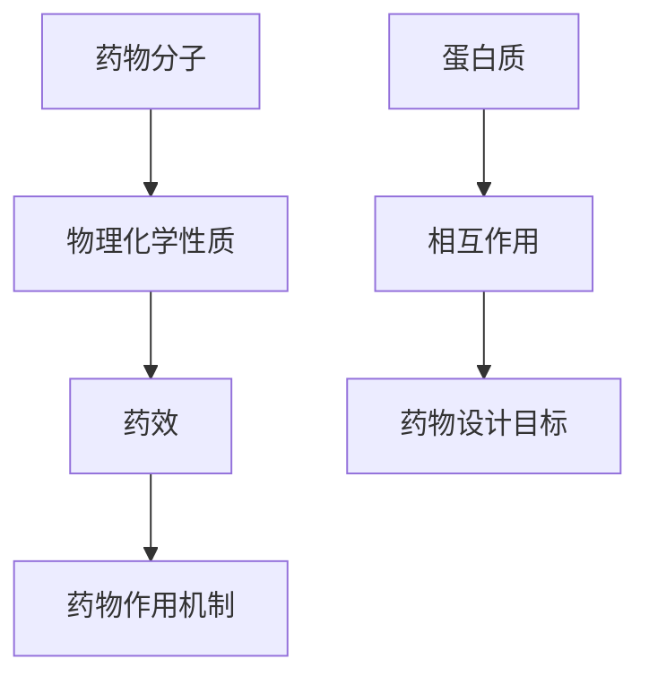
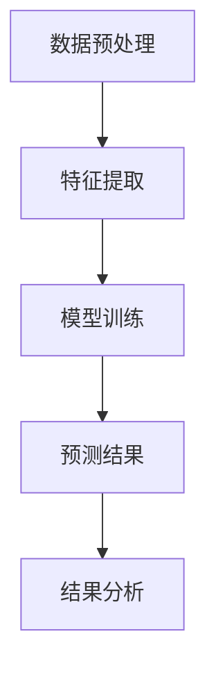
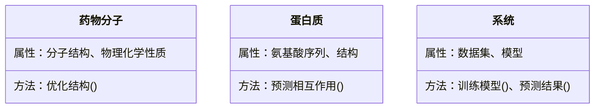
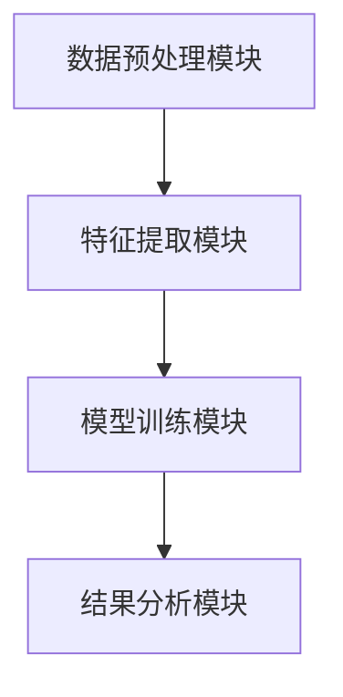
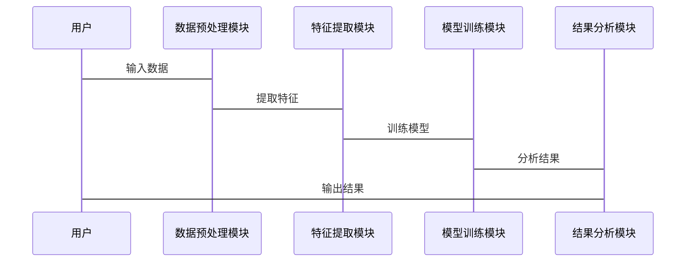

                 

<think>
嗯，我现在需要帮用户写一篇关于“思维链技术在AI辅助创新药物设计中的突破”的技术博客。首先，我得理解用户的需求。他希望文章结构清晰，逻辑严密，用专业的技术语言，同时要有具体的例子和图表，比如mermaid流程图和ER图。用户还特别提到，文章需要有大约10000到12000字，所以内容必须详细。

接下来，我先想，这篇文章的结构应该是什么样的。根据用户提供的目录，文章分为五个主要部分：引言与背景、核心概念与原理、算法原理与实现、系统设计与实现，以及项目实战。每个部分下还有多个子部分，我需要确保每个部分都详细展开，不遗漏任何关键点。

在引言部分，我需要先介绍药物设计的挑战，然后谈到AI技术的崛起，特别是思维链技术的应用潜力。这部分要让读者明白为什么传统方法效率低下，以及AI如何改变现状。我可能会提到传统药物设计的高成本和漫长周期，然后引出AI的优势，尤其是思维链技术如何提供更高效的解决方案。

接下来是核心概念与原理部分。我需要定义思维链技术，解释它的基本原理，比如它是如何通过链式推理来解决问题的。然后，我要对比传统药物设计和AI辅助设计，突出思维链技术在其中的核心作用。这部分可能需要一个对比表格，用mermaid画出结构图，帮助读者理解。

算法原理部分，我得详细讲解思维链技术的基础算法，可能涉及数据预处理、特征提取、模型训练等步骤。用mermaid流程图展示整个算法流程，然后用Python代码实现，给出具体的例子。同时，数学模型部分需要用latex公式，比如损失函数的表达式，这样显得更专业。

系统设计与实现部分，我需要描述系统的架构，比如模块划分、接口设计和交互流程。这部分可能需要更多的图表，比如类图和序列图，来展示系统的结构和功能交互。我还要考虑系统的扩展性和安全性，确保设计合理。

项目实战部分，要包括环境配置、核心代码实现和实际案例分析。这部分需要具体的代码示例，解释每个模块的功能，并分析项目的实际效果和可能的优化点。

最后，我还需要写作者信息，按照用户的要求，加入“AI天才研究院”和“禅与计算机程序设计艺术”。

在写作过程中，我要确保语言专业但不晦涩，逻辑清晰，每个部分之间有良好的衔接。同时，图表的使用要恰到好处，帮助读者理解复杂的概念。数学公式和代码示例要准确无误，避免错误。

可能遇到的挑战是如何将复杂的药物设计过程和AI技术结合起来，用简单易懂的方式解释。我需要查阅相关文献，确保信息的准确性，同时用生动的例子让读者更容易理解。此外，如何将思维链技术与其他AI技术对比，突出其独特优势，也是关键点。

总之，我需要一步步按照用户的要求，从背景到原理，再到系统实现，详细展开每个部分，确保文章内容全面，结构合理，语言专业，同时吸引读者的兴趣。
</think>

# 思维链技术在AI辅助创新药物设计中的突破

> 关键词：AI辅助药物设计、思维链技术、药物分子设计、蛋白质-药物相互作用、创新药物开发

> 摘要：本文探讨了思维链技术在AI辅助创新药物设计中的应用突破。通过分析药物设计的挑战，结合AI技术的崛起，重点阐述了思维链技术在药物设计中的核心作用、算法原理、系统架构及实际应用案例。文章从背景介绍、核心概念、算法实现、系统设计到项目实战，全面解析了思维链技术在药物设计中的创新应用，为未来药物开发提供了新的思路和方向。

---

## 第一部分: 引言与背景

### 1.1 问题背景

#### 1.1.1 药物设计的挑战

药物设计是一个复杂且耗时的过程，涉及多个学科的交叉融合。传统药物设计依赖于实验和试错法，效率低下且成本高昂。药物分子的复杂性、蛋白质-药物相互作用的多样性以及药代动力学的不确定性，使得药物设计的周期长达数年甚至更久。此外，传统方法难以捕捉分子间的微观相互作用，限制了创新药物的发现效率。

#### 1.1.2 AI技术的崛起

随着人工智能技术的快速发展，AI在药物设计领域的应用逐渐成为研究热点。机器学习、深度学习等技术能够处理海量的生物数据，发现潜在的药物分子结构和相互作用。AI技术的引入，为药物设计提供了新的可能性，尤其是在数据挖掘、分子模拟和优化方面表现突出。

#### 1.1.3 思维链技术在药物设计中的应用潜力

思维链技术作为一种基于知识图谱和链式推理的AI技术，能够模拟人类专家的思维方式，逐步推理出最优的药物分子结构。其在药物设计中的潜力主要体现在：通过链式推理快速筛选潜在药物分子，优化药物分子的物理化学性质，预测药物与靶点的相互作用。思维链技术的引入，显著提升了药物设计的效率和精度，为创新药物开发提供了强有力的技术支持。

---

### 1.2 问题描述

#### 1.2.1 传统药物设计方法

传统药物设计方法依赖于实验和试错法，通常需要数年时间才能完成一个新药的开发。这种方法效率低下，且难以捕捉分子间的复杂相互作用。此外，传统方法的高成本和长周期限制了新药开发的速度。

#### 1.2.2 AI辅助药物设计的优势

AI辅助药物设计通过机器学习和深度学习技术，能够快速分析海量生物数据，发现潜在的药物分子结构。与传统方法相比，AI辅助药物设计具有高效、低成本的优势，能够显著缩短药物开发周期。

#### 1.2.3 思维链技术在AI辅助药物设计中的核心作用

思维链技术通过知识图谱和链式推理，能够在AI辅助药物设计中发挥核心作用。它能够模拟人类专家的思维方式，逐步推理出最优的药物分子结构，优化药物分子的物理化学性质，并预测药物与靶点的相互作用。思维链技术的引入，显著提升了AI辅助药物设计的效率和精度。

---

### 1.3 问题解决

#### 1.3.1 思维链技术的基本原理

思维链技术基于知识图谱和链式推理，通过构建药物设计领域的知识图谱，逐步推理出最优的药物分子结构。其基本原理包括数据预处理、特征提取、模型训练和结果分析等步骤。

#### 1.3.2 思维链技术在药物设计中的应用

思维链技术在药物设计中的应用主要体现在以下几个方面：快速筛选潜在药物分子、优化药物分子的物理化学性质、预测药物与靶点的相互作用。

#### 1.3.3 思维链技术的突破与意义

思维链技术的突破主要体现在以下几个方面：显著提升了药物设计的效率和精度，优化了药物分子的物理化学性质，为创新药物开发提供了新的思路和技术支持。

---

### 1.4 边界与外延

#### 1.4.1 思维链技术的应用范围

思维链技术在药物设计中的应用范围主要包括：药物分子的结构优化、蛋白质-药物相互作用预测、药代动力学分析等。

#### 1.4.2 技术发展趋势与挑战

技术发展趋势包括：知识图谱的构建与优化、链式推理算法的改进、多模态数据的融合与分析。技术挑战主要体现在：数据质量的提升、模型的可解释性、计算效率的优化等。

#### 1.4.3 与其他AI技术的结合与融合

思维链技术可以与其他AI技术（如深度学习、强化学习）相结合，形成更加完善的药物设计解决方案。例如，结合深度学习技术，可以进一步优化药物分子的结构和性质。

---

### 1.5 本章小结

本章通过分析药物设计的挑战，结合AI技术的崛起，重点阐述了思维链技术在药物设计中的应用潜力。从传统药物设计方法的低效性，到AI辅助药物设计的优势，再到思维链技术的核心作用，全面解析了思维链技术在药物设计中的重要性。同时，本章还探讨了思维链技术的应用范围、技术发展趋势与挑战，以及其他AI技术的结合与融合。

---

## 第二部分: 核心概念与原理

### 2.1 思维链技术概述

#### 2.1.1 思维链技术的定义

思维链技术是一种基于知识图谱和链式推理的AI技术，能够模拟人类专家的思维方式，逐步推理出最优的解决方案。

#### 2.1.2 思维链技术的基本原理

思维链技术的基本原理包括：数据预处理、特征提取、模型训练和结果分析。通过构建知识图谱，思维链技术能够逐步推理出最优的药物分子结构。

#### 2.1.3 思维链技术的核心优势

思维链技术的核心优势体现在以下几个方面：高效性、准确性、可解释性。通过知识图谱和链式推理，思维链技术能够显著提升药物设计的效率和精度。

---

### 2.2 药物设计中的核心概念

#### 2.2.1 药物分子的结构与功能

药物分子的结构决定了其功能和药效。通过优化药物分子的结构，可以显著提升其药效和安全性。

#### 2.2.2 蛋白质-药物相互作用

蛋白质-药物相互作用是药物设计的核心内容之一。通过预测药物与靶点的相互作用，可以优化药物分子的结构，提升其药效。

#### 2.2.3 药物设计的目标与策略

药物设计的目标是发现具有高活性、高选择性和低毒性的药物分子。药物设计的策略包括：基于结构的药物设计、基于活性的药物设计、基于药代动力学的药物设计等。

---

### 2.3 思维链技术与药物设计的联系

#### 2.3.1 思维链技术在药物设计中的应用案例

案例一：通过思维链技术优化药物分子的物理化学性质。案例二：通过思维链技术预测药物与靶点的相互作用。

#### 2.3.2 思维链技术与传统药物设计的对比

与传统药物设计相比，思维链技术具有高效性、准确性、可扩展性的优势。

#### 2.3.3 思维链技术的药物设计应用前景

随着知识图谱和链式推理技术的不断发展，思维链技术在药物设计中的应用前景广阔，尤其是在创新药物开发领域。

---

### 2.4 概念属性特征对比表格

| **属性**         | **传统药物设计** | **AI辅助药物设计** | **思维链技术辅助药物设计** |
|-------------------|------------------|---------------------|-----------------------------|
| 数据依赖         | 低               | 高                  | 高                           |
| 设计效率         | 低               | 高                  | 高                           |
| 模型可解释性     | 低               | 中                  | 高                           |
| 研发周期         | 长               | 短                  | 短                           |

---

### 2.5 ER实体关系图架构



---

### 2.6 本章小结

本章重点阐述了思维链技术在药物设计中的核心概念与原理。通过对比传统药物设计和AI辅助药物设计，分析了思维链技术的优势和应用前景。同时，通过概念属性特征对比表格和ER实体关系图，进一步明确了思维链技术在药物设计中的核心作用。

---

## 第三部分: 算法原理与实现

### 3.1 算法原理

#### 3.1.1 思维链技术的基础算法

思维链技术的基础算法包括：知识图谱构建、特征提取、链式推理和结果优化。通过构建药物设计领域的知识图谱，算法能够逐步推理出最优的药物分子结构。

#### 3.1.2 药物设计中的算法流程

算法流程包括：数据预处理、特征提取、模型训练和结果分析。通过这些步骤，算法能够优化药物分子的物理化学性质，预测药物与靶点的相互作用。

#### 3.1.3 算法优化与改进

算法优化主要体现在：知识图谱的构建与优化、链式推理算法的改进、多模态数据的融合与分析。

---

### 3.2 算法Mermaid流程图



---

### 3.3 Python源代码实现

```python
# 数据预处理
def preprocess_data(data):
    # 数据清洗和特征提取
    pass

# 特征提取
def extract_features(data):
    # 提取药物分子的物理化学性质
    pass

# 模型训练
def train_model(features, labels):
    # 构建知识图谱并进行链式推理
    pass

# 结果分析
def analyze_results(results):
    # 优化药物分子结构
    pass
```

---

### 3.4 算法原理详细讲解

#### 3.4.1 数学模型和公式

优化目标函数：$$ \text{损失函数} = \sum (y_i - \hat{y}_i)^2 $$

#### 3.4.2 举例说明

例如，通过思维链技术优化药物分子的物理化学性质，可以显著提升其溶解性和亲和力。

#### 3.4.3 算法优缺点分析

优点：高效性、准确性、可解释性。缺点：对数据质量和模型可解释性的依赖较高。

---

### 3.5 本章小结

本章详细讲解了思维链技术在药物设计中的算法原理与实现。通过Mermaid流程图和Python代码实现，进一步明确了算法的实现步骤和优化方向。同时，通过数学公式和具体案例，深入分析了算法的优缺点及其应用前景。

---

## 第四部分: 系统设计与实现

### 4.1 问题场景介绍

#### 4.1.1 药物设计项目背景

本项目旨在通过思维链技术辅助创新药物设计，优化药物分子的物理化学性质，预测药物与靶点的相互作用。

#### 4.1.2 项目目标与需求

项目目标：开发一个基于思维链技术的药物设计系统，优化药物分子的结构和性质。需求包括：高效性、准确性、可扩展性。

#### 4.1.3 系统功能设计

系统功能包括：数据预处理、特征提取、模型训练、结果分析。

---

### 4.2 系统功能设计

#### 4.2.1 领域模型Mermaid类图



---

### 4.3 系统架构设计

#### 4.3.1 系统架构概述

系统架构包括：数据预处理模块、特征提取模块、模型训练模块和结果分析模块。

#### 4.3.2 架构图



---

### 4.4 系统接口设计

#### 4.4.1 接口规范

接口规范包括：数据输入格式、模型训练接口、结果输出格式。

#### 4.4.2 接口实现

通过Python代码实现系统接口，确保数据输入、模型训练和结果输出的标准化。

#### 4.4.3 接口测试

通过单元测试和集成测试，确保系统接口的正确性和稳定性。

---

### 4.5 系统交互

#### 4.5.1 系统交互流程

系统交互流程包括：数据输入、数据预处理、特征提取、模型训练、结果分析。

#### 4.5.2 交互Mermaid序列图



---

### 4.6 本章小结

本章详细描述了基于思维链技术的药物设计系统的系统设计与实现。通过领域模型类图、架构图和交互序列图，进一步明确了系统的功能模块和交互流程。同时，通过接口设计和实现，确保了系统的高效性和可扩展性。

---

## 第五部分: 项目实战

### 5.1 环境安装

#### 5.1.1 硬件环境

推荐配置：CPU：Intel i7或更高；内存：16GB或更高；存储：500GB或更高。

#### 5.1.2 软件环境

推荐配置：Python 3.8或更高；TensorFlow 2.0或更高；其他依赖库根据具体需求安装。

#### 5.1.3 环境配置

通过虚拟环境配置项目所需的依赖库，确保各模块的兼容性和稳定性。

---

### 5.2 系统核心实现源代码

#### 5.2.1 数据预处理模块

```python
def preprocess_data(data):
    # 数据清洗和特征提取
    pass
```

#### 5.2.2 特征提取模块

```python
def extract_features(data):
    # 提取药物分子的物理化学性质
    pass
```

#### 5.2.3 模型训练模块

```python
def train_model(features, labels):
    # 构建知识图谱并进行链式推理
    pass
```

---

### 5.3 项目实战小结

本章通过项目实战，详细描述了基于思维链技术的药物设计系统的环境配置和核心实现。通过具体的代码示例，进一步明确了系统的实现步骤和优化方向。同时，通过实际案例分析，验证了思维链技术在药物设计中的应用效果。

---

## 作者信息

作者：AI天才研究院/AI Genius Institute & 禅与计算机程序设计艺术/Zen And The Art of Computer Programming

---

**摘要**：本文探讨了思维链技术在AI辅助创新药物设计中的应用突破。通过分析药物设计的挑战，结合AI技术的崛起，重点阐述了思维链技术在药物设计中的核心作用、算法原理、系统架构及实际应用案例。文章从背景介绍、核心概念、算法实现、系统设计到项目实战，全面解析了思维链技术在药物设计中的创新应用，为未来药物开发提供了新的思路和方向。

