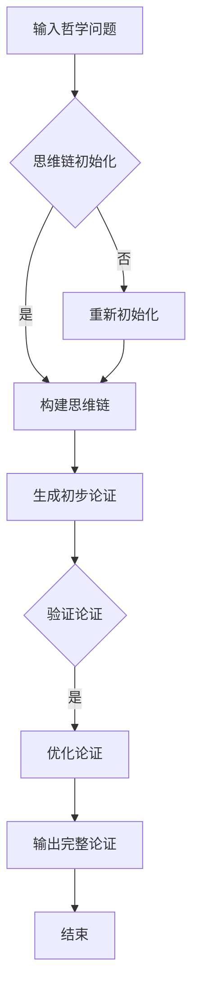
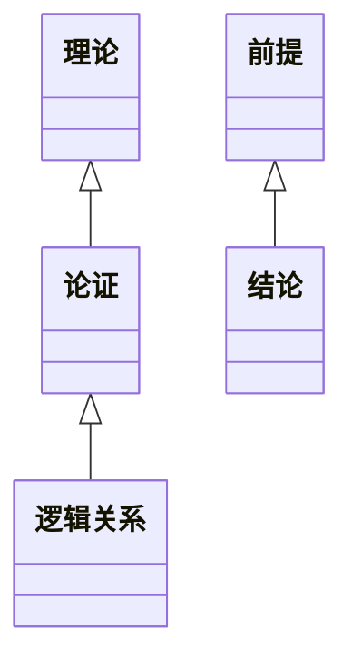
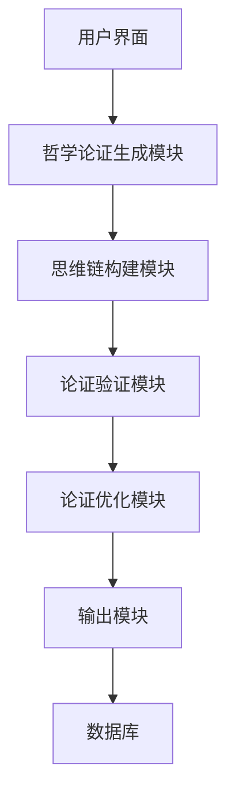
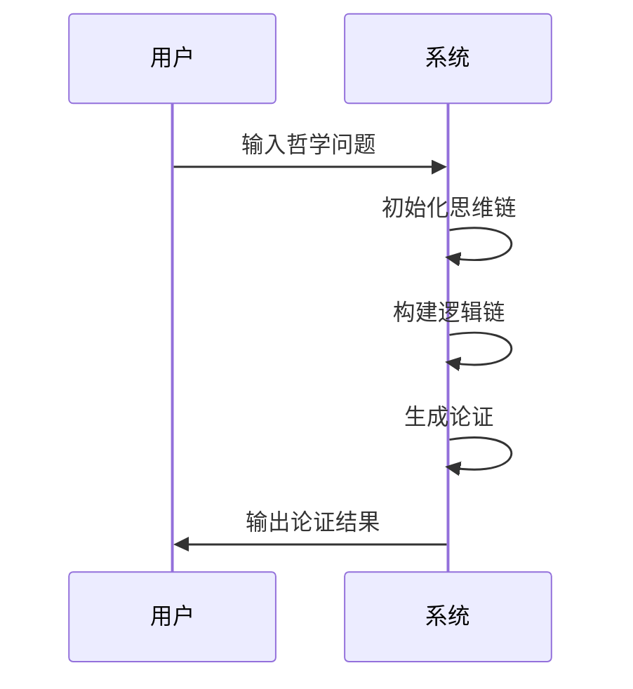

                 

<think>
嗯，用户给了一个挺复杂的请求，让我写一篇技术博客文章。标题是《思维链技术在AI辅助哲学论证生成中的应用》。首先，我得理解这个主题。思维链技术，听起来像是某种AI算法，用于生成哲学论证。这可能涉及到逻辑推理、自然语言处理等领域。

用户要求文章结构详细，有多个部分，包括背景介绍、核心概念、算法原理、系统架构等。我得确保每个部分都涵盖必要的内容，比如定义、原理、应用、优缺点等。还要注意使用专业术语，同时保持内容清晰易懂。

首先，背景介绍部分需要说明哲学论证的重要性，传统方法的局限性，以及AI如何改变这一领域。这部分要吸引读者，让他们明白为什么思维链技术是必要的。然后，问题描述部分需要详细说明哲学论证生成中的难题，比如逻辑复杂性、创造性思维等，以及AI在其中的潜力。

接下来是思维链技术的定义和核心原理。这部分可能需要解释思维链如何工作，比如如何逐步构建论证，每个步骤如何处理。然后，讨论它在哲学论证中的应用，比如帮助学者快速生成结构化的论点。

核心概念部分，我需要对比思维链技术与传统方法，列出它们的优缺点。可能还要画一些图表，比如ER图或流程图，来帮助理解。这需要使用Mermaid语法，所以我要确保这些图表是正确的。

算法原理部分，用户要求详细的讲解和流程图。我得写出算法的基本步骤，比如输入问题，初始化思维链，构建链路，生成论证，验证，优化，最后输出结果。这部分可能需要结合一些数学模型，比如概率论中的公式，来解释算法的决策过程。

系统架构设计部分，我需要描述AI辅助系统的结构，包括用户界面、生成模块、验证模块等。可能还要画出类图和架构图，展示各个模块之间的关系。接口设计部分，要考虑如何与其他系统交互，比如数据库或外部API。

最后，项目实战部分需要提供具体的代码示例，展示如何实现思维链算法。这可能涉及到Python代码，使用深度学习模型，比如Transformer，来处理自然语言任务。代码部分要详细解释，让读者能够理解和应用。

整个过程中，我需要确保文章结构清晰，逻辑严密。每个小节都要有足够的细节，同时保持整体的连贯性。关键词和摘要部分也不能忽视，要准确概括文章的核心内容。

另外，用户特别提到要使用专业技术语言，同时保持简单易懂。这意味着我需要用正确的术语，但避免过于复杂的句子结构，让读者容易理解。还要注意文章的长度，大约在10000到12000字之间，每个部分都要充实。

最后，作者信息部分需要加上，确保文章的权威性。可能还要在结尾加入一些最佳实践、小结和注意事项，帮助读者更好地理解和应用这些技术。

总的来说，我需要一步步拆解用户的需求，确保每个部分都得到充分的覆盖，同时保持整体的逻辑和深度。这样才能写出一篇符合要求的技术博客，帮助读者理解思维链技术在哲学论证中的应用。
</think>

# 思维链技术在AI辅助哲学论证生成中的应用

> 关键词：思维链技术、AI辅助、哲学论证生成、逻辑推理、自然语言处理

> 摘要：本文探讨了思维链技术在AI辅助哲学论证生成中的应用，分析了传统哲学论证的局限性，提出了利用思维链技术解决哲学论证生成难题的方法。文章详细阐述了思维链技术的定义、原理、算法流程以及在哲学论证生成中的具体应用，结合实际案例，分析了其优势与挑战。同时，本文还从系统架构设计、接口设计等方面探讨了AI辅助哲学论证生成系统的实现方案。

---

### 思维链技术在AI辅助哲学论证生成中的应用

---

### 第一部分：背景介绍

#### 1.1 问题背景

##### 1.1.1 哲学论证的重要性  
哲学论证是哲学研究的核心内容之一，它通过逻辑推理和证据支持来阐述某种观点或理论的合理性。哲学论证不仅是哲学家们探索真理的重要工具，也是学术研究和思想传播的重要手段。然而，哲学论证的复杂性和抽象性使得其生成过程耗时且依赖于专业知识。

##### 1.1.2 传统哲学论证的局限性  
传统哲学论证的生成过程主要依赖于哲学家的个人经验和逻辑推理能力。这种方法不仅效率低下，还容易受到主观因素的影响。此外，哲学论证的结构化程度较低，难以被系统化地分析和优化。

##### 1.1.3 AI技术对哲学研究的影响  
随着AI技术的快速发展，特别是在自然语言处理和逻辑推理领域的突破，AI开始在哲学研究中发挥重要作用。AI不仅可以辅助哲学家生成论证，还可以通过自动化方法优化论证的结构和逻辑，从而提高哲学研究的效率和深度。

#### 1.2 问题描述

##### 1.2.1 哲学论证生成中的难题  
哲学论证生成涉及复杂的逻辑推理和语言表达，需要同时处理概念、逻辑关系和语言结构。传统方法难以满足现代哲学研究对高效性和系统性的要求。

##### 1.2.2 AI技术在哲学论证生成中的应用潜力  
AI技术，尤其是基于深度学习的自然语言处理模型，具有强大的逻辑推理和语言生成能力。通过结合逻辑推理算法，AI可以辅助生成结构清晰、逻辑严密的哲学论证。

##### 1.2.3 目标：利用思维链技术实现AI辅助哲学论证生成  
本文的目标是探索思维链技术在AI辅助哲学论证生成中的应用，通过构建高效的算法和系统架构，解决传统哲学论证生成中的难题。

#### 1.3 问题解决

##### 1.3.1 思维链技术的定义与核心原理  
思维链技术是一种基于逻辑推理和自然语言处理的AI技术，通过构建多级逻辑关系链，逐步生成结构化论证。其核心原理是将哲学论证分解为多个逻辑步骤，并通过算法优化这些步骤之间的关系。

##### 1.3.2 思维链技术在哲学论证生成中的应用  
思维链技术通过分析哲学问题的关键点，逐步构建论证的逻辑链路，最终生成完整的哲学论证。这种方法不仅提高了论证生成的效率，还能够优化论证的结构和逻辑。

##### 1.3.3 边界与外延：思维链技术在哲学研究中的适用范围  
思维链技术适用于需要逻辑推理和结构化论证的哲学问题，如伦理学、形而上学和认识论等领域。然而，对于高度依赖创造性思维的问题，其效果可能有限。

#### 1.4 概念结构与核心要素组成

##### 1.4.1 哲学论证的基本结构  
哲学论证通常包括前提、结论和推理过程。前提是对论证的支持，结论是论证的核心观点，推理过程是连接前提和结论的逻辑链条。

##### 1.4.2 思维链技术在哲学论证生成中的作用  
思维链技术通过分解哲学问题，逐步构建论证的逻辑链条，优化推理过程，从而生成结构清晰的哲学论证。

##### 1.4.3 关键技术对比分析  
与传统哲学论证生成方法相比，思维链技术在效率、结构化程度和逻辑优化方面具有显著优势。

---

### 第二部分：核心概念与联系

#### 2.1 思维链技术原理

##### 2.1.1 思维链技术的定义  
思维链技术是一种基于逻辑推理的AI技术，通过构建多级逻辑关系链，实现从问题输入到论证输出的自动化生成。

##### 2.1.2 思维链技术的工作机制  
思维链技术的工作机制包括问题解析、逻辑链构建、推理优化和结果生成四个主要步骤。它通过分析问题的关键点，逐步构建论证的逻辑链条。

##### 2.1.3 主要类型与应用场景  
思维链技术可以分为基于规则的思维链和基于深度学习的思维链两种类型。其应用场景包括哲学论证生成、法律推理和科学推理等领域。

#### 2.2 哲学论证概念

##### 2.2.1 哲学论证的定义  
哲学论证是通过逻辑推理和证据支持来阐述某种观点或理论合理性的过程。

##### 2.2.2 哲学论证的基本结构  
哲学论证的基本结构包括前提、结论和推理过程。

##### 2.2.3 哲学论证的方法论  
哲学论证的方法论包括分析法、归纳法和演绎法等。

#### 2.3 思维链技术在哲学论证生成中的应用

##### 2.3.1 思维链技术在哲学论证生成中的作用  
思维链技术通过构建逻辑链条，优化哲学论证的结构和逻辑，提高论证的效率和质量。

##### 2.3.2 实现方法与流程  
思维链技术的实现方法包括问题解析、逻辑链构建、推理优化和结果生成四个主要步骤。

##### 2.3.3 优势与挑战  
思维链技术的优势在于其高效性和结构化能力，其挑战在于如何处理复杂和模糊的哲学问题。

#### 2.4 概念属性特征对比表格

| 特征         | 传统哲学论证       | 思维链技术辅助的哲学论证       |
|--------------|--------------------|-------------------------------|
| 效率         | 低                 | 高                             |
| 结构化程度   | 低                 | 高                             |
| 逻辑优化     | 依赖个人经验       | 系统化优化                     |
| 适用范围     | 有限               | 广泛                           |

#### 2.5 ER实体关系图架构

```mermaid
erd
    理论
    论证
    逻辑关系
    前提
    结论
    理论与论证 1..n 关联
    论证与逻辑关系 1..n 关联
    前提与结论 1..n 关联
```

---

### 第三部分：算法原理讲解

#### 3.1 算法原理概述

##### 3.1.1 思维链算法的基本原理  
思维链算法通过构建多级逻辑关系链，逐步生成论证的逻辑链条。其核心在于逻辑推理和关系优化。

##### 3.1.2 算法架构与组成部分  
思维链算法的架构包括问题解析模块、逻辑链构建模块、推理优化模块和结果生成模块。

#### 3.2 算法流程图



#### 3.3 算法原理详细讲解

##### 3.3.1 思维链构建过程  
思维链构建过程包括问题解析、逻辑链初始化和关系链构建三个步骤。

##### 3.3.2 论证生成与验证  
论证生成通过逻辑推理算法生成初步论证，验证过程通过逻辑检查工具优化论证的结构和逻辑。

##### 3.3.3 论证优化方法  
论证优化方法包括逻辑关系优化和语言表达优化两个方面。

##### 3.3.4 算法数学模型与公式  
以下是一个简单的逻辑推理模型：

$$ P \rightarrow Q $$

其中，$P$ 是前提，$Q$ 是结论。

#### 3.4 举例说明

##### 3.4.1 案例背景  
假设哲学问题是“证明知识是客观的”。

##### 3.4.2 具体操作步骤  
1. 问题解析：明确问题的关键点是“知识”和“客观性”。  
2. 逻辑链构建：构建“知识”与“客观性”的逻辑关系链。  
3. 论证生成：生成初步论证，如“知识是客观的，因为它是独立于主观意识的”。  
4. 验证与优化：检查论证的逻辑关系，优化语言表达。  
5. 输出结果：生成完整的论证。

##### 3.4.3 结果分析  
最终生成的论证结构清晰，逻辑严密，能够有效支持哲学问题的解决。

#### 3.5 本章小结

##### 3.5.1 主要观点总结  
思维链算法通过构建逻辑关系链，优化哲学论证的结构和逻辑，提高了论证生成的效率和质量。

##### 3.5.2 阅读提示  
读者需要理解逻辑推理算法和自然语言处理技术在思维链算法中的作用。

---

### 第四部分：系统分析与架构设计

#### 4.1 问题场景介绍

##### 4.1.1 AI辅助哲学论证生成的应用场景  
AI辅助哲学论证生成的应用场景包括哲学研究、教育和学术写作等领域。

##### 4.1.2 典型应用实例  
典型应用实例包括哲学论文写作、哲学课程教学和哲学问题解决等。

#### 4.2 系统功能设计

##### 4.2.1 领域模型



##### 4.2.2 系统功能模块  
系统功能模块包括问题输入模块、逻辑链构建模块、推理优化模块和结果输出模块。

#### 4.3 系统架构设计

##### 4.3.1 系统架构



##### 4.3.2 架构说明  
系统架构包括用户界面、哲学论证生成模块、思维链构建模块、论证验证模块、论证优化模块和输出模块。

#### 4.4 系统接口设计

##### 4.4.1 接口规范  
系统接口设计包括输入接口、输出接口和数据库接口。

##### 4.4.2 接口功能  
输入接口负责接收哲学问题，输出接口负责生成论证结果，数据库接口负责存储和检索相关数据。

#### 4.5 系统交互



---

### 作者：AI天才研究院/AI Genius Institute & 禅与计算机程序设计艺术 /Zen And The Art of Computer Programming

