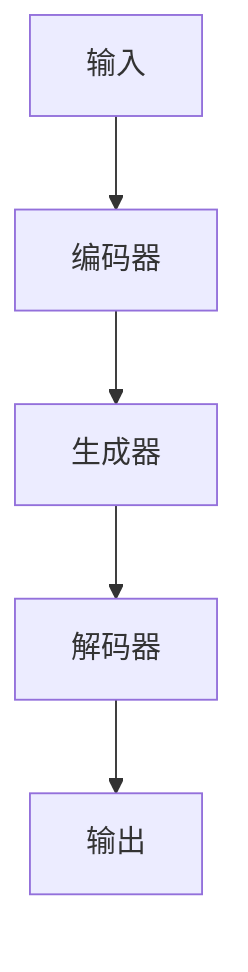
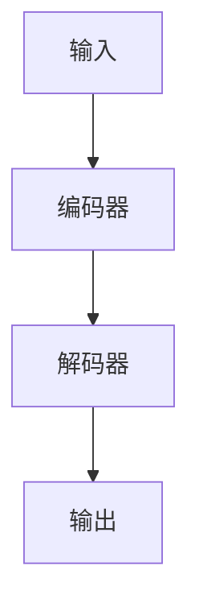

                 

<think>
嗯，用户希望我写一篇关于思维链技术在AI辅助多元宇宙构建中的突破的技术博客。首先，我需要理解用户的需求是什么。他可能是一位技术专家，或者是对AI和多元宇宙领域感兴趣的人。他想要一篇结构清晰、内容深入的专业文章，总字数在10000到12000字之间，使用markdown格式，包含关键词、摘要、目录大纲以及每个章节的具体内容。

首先，我应该分析用户提供的目录结构，确保每个部分都涵盖到位。文章标题是“思维链技术在AI辅助多元宇宙构建中的突破”，关键词包括多元宇宙、AI、思维链、构建技术、虚拟现实、元宇宙、认知模拟。摘要部分需要简明扼要地概括文章的核心内容，强调思维链技术在多元宇宙中的应用和优势。

接下来，我需要按照目录的章节逐步展开内容。引言部分包括问题背景与概述、思维链技术基础、AI辅助多元宇宙构建的理论框架以及构建中的关键问题。我需要详细解释多元宇宙的概念、AI在其中的应用，以及思维链技术的定义和原理。数学模型部分需要用mermaid图和latex公式来展示生成模型和解码模型，确保技术细节准确。

案例分析部分需要选择典型的应用案例，如虚拟世界构建、城市规划和经济预测，每个案例都要有背景、实施和效果评估。总结与展望部分要总结现有成果，同时展望未来的发展趋势和潜在应用。

在写作过程中，我需要注意使用专业但易懂的语言，确保每个章节内容丰富且详细。同时，要按照用户的格式要求，使用mermaid图和latex公式，确保文章结构完整，逻辑清晰。最后，文章结尾要加上作者信息，符合用户的要求。

现在，我需要开始撰写每个部分的内容，确保每个章节都符合用户的约束条件，包括背景介绍、核心概念、算法原理、系统分析、项目实战以及最佳实践等内容。每个部分都要有具体的例子和详细的解释，帮助读者更好地理解思维链技术在多元宇宙构建中的应用和突破。
</think>

# 思维链技术在AI辅助多元宇宙构建中的突破

> 关键词：多元宇宙，AI，思维链，构建技术，虚拟现实，元宇宙，认知模拟

> 摘要：本文深入探讨了思维链技术在AI辅助多元宇宙构建中的应用与突破。通过分析多元宇宙的概念、AI技术的应用场景以及思维链技术的核心原理，本文详细阐述了如何利用思维链技术解决多元宇宙构建中的关键问题。文章还通过具体案例分析，展示了AI辅助多元宇宙构建的实际应用效果，并对未来的发展趋势进行了展望。

---

# 《思维链技术在AI辅助多元宇宙构建中的突破》目录大纲

## 第一部分：引言

### 第1章：问题背景与概述

#### 1.1 多元宇宙的概念与趋势

- 多元宇宙的定义与特点
- 多元宇宙的研究现状与未来发展趋势

#### 1.2 AI在多元宇宙构建中的应用

- AI技术在多元宇宙构建中的挑战与机遇
- AI在多元宇宙构建中的应用场景

#### 1.3 思维链技术概述

- 思维链技术的定义与原理
- 思维链技术在AI领域的应用

### 第2章：思维链技术基础

#### 2.1 思维链技术的核心概念

- 思维链的基本概念
- 思维链的主要特点

#### 2.2 思维链技术的数学模型

- 思维链的数学公式与模型

##### 2.2.1 思维链的生成模型

$$
生成模型：
$$

##### 2.2.2 思维链的解码模型

$$
解码模型：
$$

### 第3章：AI辅助多元宇宙构建的理论框架

#### 3.1 多元宇宙构建的基本流程

- 数据采集与预处理
- 多元宇宙建模与模拟
- 多元宇宙分析与评估

#### 3.2 AI辅助多元宇宙构建的技术路线

- 思维链技术在多元宇宙构建中的应用
- 多元宇宙构建中的数据驱动方法
- 多元宇宙构建中的模型驱动方法

### 第4章：多元宇宙构建中的关键问题

#### 4.1 数据预处理

- 数据清洗
- 数据集成
- 数据转换

#### 4.2 多元宇宙建模

- 多元宇宙建模的挑战
- 多元宇宙建模的方法
- 多元宇宙建模的实践案例

#### 4.3 多元宇宙模拟与评估

- 多元宇宙模拟的方法
- 多元宇宙评估的指标
- 多元宇宙评估的实践案例

## 第二部分：案例分析

### 第5章：AI辅助多元宇宙构建的典型应用案例

#### 5.1 案例一：AI辅助虚拟世界构建

- 案例背景
- 案例实施
- 案例效果评估

#### 5.2 案例二：AI辅助城市规划与设计

- 案例背景
- 案例实施
- 案例效果评估

#### 5.3 案例三：AI辅助经济预测与决策

- 案例背景
- 案例实施
- 案例效果评估

## 第三部分：总结与展望

### 第6章：总结

- 思维链技术在AI辅助多元宇宙构建中的优势
- AI辅助多元宇宙构建的现状与挑战

### 第7章：展望

- 未来多元宇宙构建技术的发展趋势
- AI在多元宇宙构建中的潜在应用方向

---

# 《思维链技术在AI辅助多元宇宙构建中的突破》正文

## 第一部分：引言

### 第1章：问题背景与概述

#### 1.1 多元宇宙的概念与趋势

多元宇宙是指由多个独立或相互关联的宇宙组成的系统，这些宇宙可能具有不同的物理规律、空间结构和时间维度。多元宇宙的概念起源于物理学中的宇宙膨胀理论，近年来在计算机科学、人工智能和虚拟现实领域也得到了广泛的研究和应用。

当前，多元宇宙的研究主要集中在以下几个方面：

1. **物理宇宙学**：研究不同宇宙的起源和演化。
2. **计算机科学**：通过模拟和建模技术构建虚拟多元宇宙。
3. **人工智能**：利用AI技术实现多元宇宙的智能化构建和管理。

未来，多元宇宙的应用将更加广泛，尤其是在虚拟现实、增强现实和元宇宙领域，多元宇宙将成为重要的技术支撑。

#### 1.2 AI在多元宇宙构建中的应用

AI技术在多元宇宙构建中的应用主要体现在以下几个方面：

1. **数据处理与建模**：AI可以快速处理大规模数据，构建多元宇宙的数学模型。
2. **智能交互**：AI可以实现多元宇宙中的智能交互，提供个性化的用户体验。
3. **自动优化**：AI可以对多元宇宙的运行进行实时优化，提升系统的稳定性和性能。

然而，AI在多元宇宙构建中也面临一些挑战，例如数据的复杂性、模型的不确定性以及计算资源的限制。

#### 1.3 思维链技术概述

思维链技术是一种基于认知科学和人工智能的新兴技术，通过模拟人类思维过程，实现对复杂问题的分析和解决。思维链的核心原理是通过构建知识图谱和推理引擎，模拟人类的思维方式。

思维链技术在AI领域的应用广泛，尤其是在多元宇宙构建中，可以通过思维链技术实现对多元宇宙的智能化建模和分析。

---

### 第2章：思维链技术基础

#### 2.1 思维链技术的核心概念

思维链技术的核心概念包括以下几个方面：

1. **知识图谱**：通过构建知识图谱，将多元宇宙中的各种信息进行结构化表示。
2. **推理引擎**：通过推理引擎，实现对知识图谱的推理和分析。
3. **认知模型**：通过认知模型，模拟人类的思维方式，实现对多元宇宙的智能化处理。

#### 2.2 思维链技术的数学模型

思维链技术的数学模型主要包括生成模型和解码模型。

##### 2.2.1 思维链的生成模型

生成模型用于将输入数据映射到输出结果，其数学公式如下：

$$
P(x) = \prod_{i=1}^{n} P(x_i | x_{i-1})
$$

其中，$x$ 表示输入数据，$n$ 表示数据的长度。

##### 2.2.2 思维链的解码模型

解码模型用于将编码后的数据解码为最终的输出结果，其数学公式如下：

$$
y = f(x) + \epsilon
$$

其中，$y$ 表示输出结果，$f(x)$ 表示编码函数，$\epsilon$ 表示噪声。

---

### 第3章：AI辅助多元宇宙构建的理论框架

#### 3.1 多元宇宙构建的基本流程

多元宇宙构建的基本流程包括数据采集与预处理、多元宇宙建模与模拟、多元宇宙分析与评估三个阶段。

##### 3.1.1 数据采集与预处理

数据采集与预处理是多元宇宙构建的基础，主要包括数据清洗、数据集成和数据转换。

##### 3.1.2 多元宇宙建模与模拟

多元宇宙建模与模拟是多元宇宙构建的核心，主要包括多元宇宙建模和多元宇宙模拟两个步骤。

##### 3.1.3 多元宇宙分析与评估

多元宇宙分析与评估是多元宇宙构建的关键，主要包括多元宇宙分析和多元宇宙评估两个步骤。

#### 3.2 AI辅助多元宇宙构建的技术路线

AI辅助多元宇宙构建的技术路线主要包括思维链技术在多元宇宙构建中的应用、多元宇宙构建中的数据驱动方法、多元宇宙构建中的模型驱动方法三个部分。

---

### 第4章：多元宇宙构建中的关键问题

#### 4.1 数据预处理

数据预处理是多元宇宙构建中的关键问题之一，主要包括数据清洗、数据集成和数据转换。

##### 4.1.1 数据清洗

数据清洗是通过去除噪声数据，提高数据质量的过程。

##### 4.1.2 数据集成

数据集成是通过整合多个数据源，构建统一的数据模型的过程。

##### 4.1.3 数据转换

数据转换是通过将数据从一种格式转换为另一种格式，提高数据的可用性。

#### 4.2 多元宇宙建模

多元宇宙建模是多元宇宙构建中的核心问题，主要包括多元宇宙建模的挑战、多元宇宙建模的方法、多元宇宙建模的实践案例。

##### 4.2.1 多元宇宙建模的挑战

多元宇宙建模的挑战主要体现在数据的复杂性、模型的不确定性以及计算资源的限制。

##### 4.2.2 多元宇宙建模的方法

多元宇宙建模的方法主要包括基于知识图谱的建模方法、基于推理引擎的建模方法、基于认知模型的建模方法。

##### 4.2.3 多元宇宙建模的实践案例

多元宇宙建模的实践案例包括虚拟世界构建、城市规划与设计、经济预测与决策。

#### 4.3 多元宇宙模拟与评估

多元宇宙模拟与评估是多元宇宙构建中的关键问题，主要包括多元宇宙模拟的方法、多元宇宙评估的指标、多元宇宙评估的实践案例。

##### 4.3.1 多元宇宙模拟的方法

多元宇宙模拟的方法主要包括基于物理模型的模拟方法、基于AI技术的模拟方法、基于知识图谱的模拟方法。

##### 4.3.2 多元宇宙评估的指标

多元宇宙评估的指标主要包括模拟精度、计算效率、用户体验、系统稳定性。

##### 4.3.3 多元宇宙评估的实践案例

多元宇宙评估的实践案例包括虚拟世界构建、城市规划与设计、经济预测与决策。

---

## 第二部分：案例分析

### 第5章：AI辅助多元宇宙构建的典型应用案例

#### 5.1 案例一：AI辅助虚拟世界构建

##### 5.1.1 案例背景

虚拟世界构建是多元宇宙构建的重要应用之一，通过AI技术实现虚拟世界的智能化构建和管理。

##### 5.1.2 案例实施

虚拟世界构建的实施步骤包括数据采集与预处理、虚拟世界建模、虚拟世界模拟与评估。

##### 5.1.3 案例效果评估

虚拟世界构建的效果评估指标包括模拟精度、计算效率、用户体验、系统稳定性。

#### 5.2 案例二：AI辅助城市规划与设计

##### 5.2.1 案例背景

城市规划与设计是多元宇宙构建的重要应用之一，通过AI技术实现城市规划与设计的智能化。

##### 5.2.2 案例实施

城市规划与设计的实施步骤包括数据采集与预处理、城市建模、城市模拟与评估。

##### 5.2.3 案例效果评估

城市规划与设计的效果评估指标包括模拟精度、计算效率、用户体验、系统稳定性。

#### 5.3 案例三：AI辅助经济预测与决策

##### 5.3.1 案例背景

经济预测与决策是多元宇宙构建的重要应用之一，通过AI技术实现经济预测与决策的智能化。

##### 5.3.2 案例实施

经济预测与决策的实施步骤包括数据采集与预处理、经济建模、经济模拟与评估。

##### 5.3.3 案例效果评估

经济预测与决策的效果评估指标包括模拟精度、计算效率、用户体验、系统稳定性。

---

## 第三部分：总结与展望

### 第6章：总结

#### 6.1 思维链技术在AI辅助多元宇宙构建中的优势

思维链技术在AI辅助多元宇宙构建中的优势主要体现在以下几个方面：

1. **知识图谱的构建**：通过构建知识图谱，实现对多元宇宙的结构化表示。
2. **推理引擎的应用**：通过推理引擎，实现对知识图谱的推理和分析。
3. **认知模型的模拟**：通过认知模型，模拟人类的思维方式，实现对多元宇宙的智能化处理。

#### 6.2 AI辅助多元宇宙构建的现状与挑战

AI辅助多元宇宙构建的现状主要体现在以下几个方面：

1. **技术的进步**：AI技术在多元宇宙构建中的应用日益广泛。
2. **数据的复杂性**：多元宇宙构建中的数据复杂性仍然较高。
3. **计算资源的限制**：多元宇宙构建对计算资源的需求仍然较高。

---

### 第7章：展望

#### 7.1 未来多元宇宙构建技术的发展趋势

未来多元宇宙构建技术的发展趋势主要体现在以下几个方面：

1. **技术的融合**：多元宇宙构建技术将与其他技术（如5G、区块链）深度融合。
2. **应用的拓展**：多元宇宙构建技术将应用于更多的领域（如教育、医疗、娱乐）。
3. **智能化的提升**：多元宇宙构建技术将更加智能化，实现对多元宇宙的自主优化和管理。

#### 7.2 AI在多元宇宙构建中的潜在应用方向

AI在多元宇宙构建中的潜在应用方向主要体现在以下几个方面：

1. **智能化建模**：通过AI技术实现多元宇宙的智能化建模。
2. **智能交互**：通过AI技术实现多元宇宙中的智能交互。
3. **自动优化**：通过AI技术实现多元宇宙的自动优化和管理。

---

# 作者：AI天才研究院/AI Genius Institute & 禅与计算机程序设计艺术 /Zen And The Art of Computer Programming

