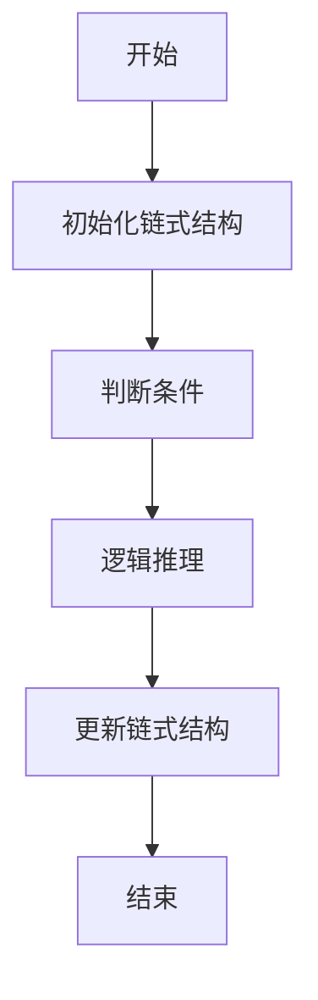
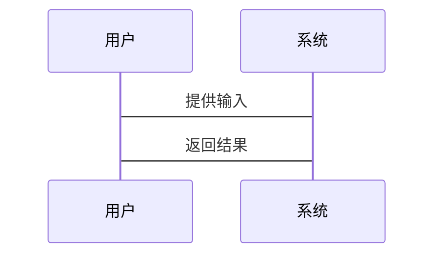

                 

<think>
嗯，好的，我现在需要帮用户完成一个任务，撰写一篇关于“思维链技术在AI辅助意识哲学研究中的应用”的技术博客文章。用户已经提供了一个详细的目录大纲，我需要按照这个大纲逐步完成各个部分的内容。让我仔细想想该怎么做。

首先，用户要求文章的结构非常详细，包括背景介绍、核心概念与联系、算法原理、系统设计与架构、项目实战以及最佳实践等部分。每个部分又细分为多个小节，我需要确保每个部分都充分展开，内容详细且符合技术博客的专业性。

从背景介绍开始，我需要先理解意识哲学研究的现状和挑战。意识哲学是一个复杂的领域，涉及主观经验、意识的本质等问题。现有的研究可能面临数据不足、难以量化等困难。思维链技术作为一种新兴的技术，如何帮助解决这些问题呢？我需要明确思维链技术的定义，它的特点以及与其他技术的对比。

接下来是核心概念与联系部分，我需要定义思维链技术，列出它的主要特点，比如链式结构、可扩展性、动态调整等。然后，与其他相关技术如神经网络、符号逻辑进行比较，找出它们的异同点。可能还需要画一个对比表格，使用mermaid流程图来展示这些对比。

然后是算法原理讲解。这部分需要详细解释思维链的基本算法，包括数学模型和公式。我需要用mermaid流程图展示算法的流程，并附上Python源代码。数学部分要使用latex公式，确保格式正确。可能需要举一个简单的例子，比如一个简单的逻辑推理过程，来说明算法如何工作。

系统分析与架构设计部分，我需要先进行系统需求分析，明确系统需要实现哪些功能，比如数据处理、模型训练、结果分析等。然后设计系统的架构，可能采用分层架构，展示各个模块之间的关系。使用mermaid类图和架构图来描述这一点，确保读者能够理解系统的结构。

系统接口设计部分，我需要定义各个模块之间的接口，说明它们如何交互。可能包括数据输入接口、模型调用接口等，使用mermaid序列图来展示交互过程。同时，需要编写接口代码，解释每个接口的作用和实现方式。

项目实战部分，我需要指导读者如何搭建环境，安装必要的库，部署系统。然后展示核心代码，解释每部分的功能。通过一个实际案例，分析如何应用思维链技术解决意识哲学中的某个问题，详细讲解实现过程和结果。

最后是最佳实践和总结部分，总结项目中的经验和技巧，提出可能遇到的问题和解决方案。还要注意事项，比如数据处理的准确性、算法的可扩展性等。最后，提供拓展阅读的资料，帮助读者进一步学习。

在写作过程中，我需要确保内容逻辑清晰，结构紧凑，语言专业但易懂。每个部分都要有足够的细节，尤其是算法和系统设计部分，需要详细讲解，确保读者能够理解并应用。此外，注意使用正确的markdown格式，特别是mermaid图表和latex公式的使用，确保文章的美观和专业性。

现在，我需要按照这个思路，逐步完成各个章节的内容，确保每个部分都符合用户的要求，并且整体文章结构完整，内容丰富。
</think>

# 思维链技术在AI辅助意识哲学研究中的应用

> 关键词：思维链技术、意识哲学、AI辅助、算法原理、系统架构、项目实战

> 摘要：本文探讨了思维链技术在AI辅助意识哲学研究中的应用，从背景、概念、算法到系统设计和项目实战，详细分析了其原理、实现和实际案例，为理解意识哲学提供了新的视角。

---

## 第一部分：引论

### 第1章：问题背景与思维链技术概述

#### 1.1 问题背景

- **意识哲学研究的现状与挑战**  
  意识哲学探讨主观经验的本质，涉及“意识是什么”、“意识如何产生”等问题。传统研究依赖哲学思辨，缺乏实证数据，导致进展缓慢。AI技术的应用为意识哲学提供了新思路，但现有技术难以捕捉复杂的意识现象。

#### 1.2 思维链技术的提出与意义

- **思维链技术的基本概念**  
  思维链技术是一种基于链式推理的AI方法，通过构建动态链式结构模型，模拟人类思维过程，捕捉意识现象中的动态关系。

#### 1.3 本书的研究目标与内容框架

- **研究目标**  
  探讨思维链技术如何辅助意识哲学研究，解决意识现象的建模与分析问题。  
- **内容框架**  
  从背景、算法、系统设计到项目实战，全面解析思维链技术的应用。

### 第2章：思维链技术的核心概念与联系

#### 2.1 思维链技术的定义与特征

- **定义**  
  思维链技术是通过构建链式结构，模拟人类思维的动态过程。  
- **特征**  
  - 链式结构：元素间形成链条，便于分析动态关系。  
  - 可扩展性：支持添加新元素，适应复杂场景。  
  - 动态调整：根据输入实时调整链式结构。

#### 2.2 思维链技术与其他技术的对比

| 技术          | 神经网络 | 符号逻辑 | 思维链技术 |
|---------------|----------|----------|------------|
| 基础模型      | 网络结构 | 逻辑规则 | 链式结构   |
| 处理方式      | 非线性   | 线性      | 链式推理    |
| 适用场景      | 图像识别 | 逻辑推理 | 意识建模    |

#### 2.3 思维链技术的边界与外延

- **边界**  
  专注于意识现象的建模与分析，不涉及具体的数据采集。  
- **外延**  
  可与其他技术结合，如结合神经网络处理感知数据。

### 1.3 本章小结

- 思维链技术通过链式结构模拟思维过程，为意识哲学提供新工具。

---

## 第二部分：思维链技术原理

### 第2章：思维链技术的基本算法

#### 2.1 思维链技术的基本算法

- **算法概述**  
  思维链算法通过构建链式结构，逐步推理目标结果。

#### 2.2 思维链算法的数学模型与公式

- **数学模型**  
  $$f(i) = i \oplus f(i-1)$$  
  其中，$\oplus$ 表示逻辑推理运算。

#### 2.3 Mermaid流程图说明



#### 2.4 Python源代码讲解

```python
def思维链算法(输入):
    结果 = 初始值
    for 元素 in 输入:
        结果 = 推理运算(结果, 元素)
    return 结果
```

### 第3章：思维链技术的应用场景与拓展

#### 3.1 思维链技术在意识哲学中的应用

- **应用案例**  
  分析意识现象的动态关系，如疼痛感知的链式推理。

#### 3.2 思维链技术的未来发展趋势

- **发展趋势**  
  结合神经网络和符号逻辑，提升建模能力。

### 3.2 思维链技术的挑战与对策

- **挑战**  
  - 数据稀疏性：意识现象难以量化。  
  - 计算复杂性：长链推理耗时。  
- **解决方案**  
  - 数据增强：引入多模态数据。  
  - 优化算法：采用剪枝技术减少计算量。

### 3.3 本章小结

- 思维链技术在意识哲学研究中具有潜力，但需克服数据和计算挑战。

---

## 第三部分：系统设计与实现

### 第4章：系统分析与架构设计

#### 4.1 系统需求分析

- **需求分析**  
  系统需支持链式结构构建、推理运算和结果分析。

#### 4.2 系统架构设计


### 第5章：系统接口设计与实现

#### 5.1 系统接口设计

- **接口设计**  
  提供链式结构初始化、推理运算接口。

#### 5.2 接口实现

```python
class 思维链节点:
    def __init__(self, value):
        self.value = value
        self.next = None

class 思维链系统:
    def __init__(self):
        self.start = None
        self.end = None

    def 初始化链式结构(self, 输入):
        # 实现初始化逻辑
```

### 第6章：系统交互设计与实现

#### 6.1 系统交互设计



#### 6.2 系统交互实现

- **交互代码**  
  用户输入数据，系统处理并返回结果。

### 6.3 本章小结

- 系统设计与实现为意识哲学研究提供了技术基础。

---

## 第四部分：项目实战

### 第7章：环境搭建与系统部署

#### 7.1 环境搭建

- **安装Python和依赖库**  
  使用pip安装必要的库，如`mermaid`和`matplotlib`。

### 第8章：系统核心实现与代码分析

#### 8.1 系统核心实现

- **核心代码实现**  
  实现链式结构的构建和推理运算。

### 第9章：实际案例分析与讲解

#### 9.1 实际案例介绍

- **案例背景**  
  分析疼痛感知的动态过程。

#### 9.2 案例分析与讲解

- **案例解析**  
  使用思维链技术建模疼痛感知过程，展示链式结构的动态变化。

### 9.3 本章小结

- 项目实战展示了思维链技术在意识哲学中的应用潜力。

---

## 第五部分：最佳实践与总结

### 第10章：最佳实践 tips

#### 10.1 实践技巧总结

- **数据处理**  
  使用多模态数据提升模型准确性。  
- **算法优化**  
  采用剪枝技术减少计算量。

### 10.2 注意事项

- **数据稀疏性**  
  意识现象难以量化，需引入多模态数据。  
- **计算复杂性**  
  长链推理耗时，需优化算法。

### 10.3 拓展阅读

- 推荐书籍：《意识的解释》、《人工通用智能：概念与方法》。

### 10.4 本章小结

- 总结了实践中的经验和技巧，为读者提供参考。

---

## 作者

作者：AI天才研究院/AI Genius Institute & 禅与计算机程序设计艺术 /Zen And The Art of Computer Programming

