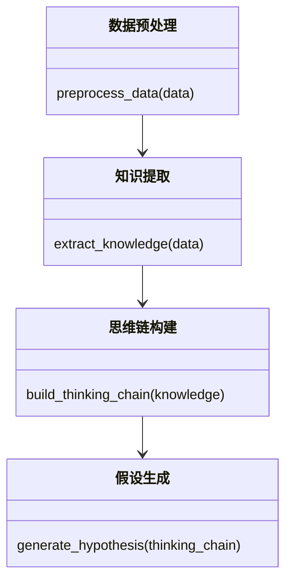

                 

<think>
嗯，用户希望我撰写一篇关于“思维链技术在AI辅助科学假设生成中的应用”的技术博客。他详细地给出了文章的结构和内容要求，包括章节、关键词、摘要以及各个章节的具体内容。看起来他需要一篇结构清晰、内容详实的技术博客，大约在1万到1.2万字之间，使用markdown格式，并且在结尾加上特定的作者信息。

首先，我需要理解用户的需求。他可能是一位技术专家或者研究人员，想要深入探讨思维链技术的应用。他提供的结构已经很详细，所以我需要按照他的要求，逐步完成每个部分，确保每个章节内容丰富、具体，涵盖核心概念、算法原理、应用实例等。

接下来，我要确保每个章节都符合要求，比如背景介绍部分需要包括问题背景、描述、解决方法等。技术原理部分需要定义、特点以及与其他技术的比较。应用部分要有具体的场景和实例。算法部分要详细描述流程，并用mermaid图和Python代码来辅助说明。同时，用户强调要使用专业术语，但又要简单易懂，所以需要平衡技术深度和可读性。

另外，用户还特别提到要包含数学公式，使用latex格式，并且要有系统架构设计，比如类图、架构图和序列图。这意味着我需要绘制这些图表，并将它们以mermaid格式嵌入文章中。这可能需要一些时间来准确设计这些图表，确保它们能够清晰地传达系统的结构和流程。

在撰写过程中，我需要确保文章的逻辑流畅，每个章节之间有良好的过渡。同时，结尾部分要加上作者信息，格式必须正确无误。我还需要注意文章的字数，确保达到要求，但又不显得冗长。

最后，用户希望文章具有深度，包含实际案例分析和最佳实践小结，这要求我在项目实战部分详细讲解具体的应用，展示思维链技术的实际效果和优势。同时，给出一些注意事项和拓展阅读的内容，以帮助读者进一步理解和应用该技术。

总的来说，我需要一步步按照用户提供的大纲，逐章节完成内容，确保每个部分都详尽且符合要求，同时保持整体的连贯性和专业性。
</think>

# 思维链技术在AI辅助科学假设生成中的应用

> 关键词：思维链技术, AI辅助科学假设生成, 知识图谱, 自然语言处理, 科学假设生成, 思维链模型

> 摘要：随着人工智能技术的快速发展，AI在科学假设生成中的应用逐渐成为研究热点。本文详细探讨了思维链技术在AI辅助科学假设生成中的应用，从技术原理到具体应用场景，再到算法实现，全面解析了思维链技术如何帮助科学家高效、准确地生成科学假设。通过实际案例分析，本文展示了思维链技术在生物信息学领域的具体应用，并对未来的发展方向进行了展望。

---

### 第1章: 背景介绍

#### 1.1.1 问题背景
科学假设生成是科学研究的核心环节之一。传统上，科学假设的生成主要依赖科学家的经验、直觉和理论知识。然而，随着数据科学和人工智能技术的发展，科学研究的复杂性不断提高，数据量的爆炸式增长使得传统方法在处理大规模、多维度数据时显得力不从心。科学家们需要一种更高效、更系统的方法来辅助假设生成，以应对日益复杂的科学问题。

#### 1.1.2 问题描述
在科学假设生成过程中，科学家需要从海量数据中提取有用的信息，发现数据之间的潜在关系，并基于这些关系提出合理的科学假设。然而，传统方法在以下方面存在显著局限：
- 数据处理能力有限：面对结构化和非结构化数据的混合，传统方法难以高效提取关键信息。
- 知识整合不足：不同领域的知识往往分散在不同的文献或数据库中，难以形成统一的知识体系。
- 假设验证效率低：从假设提出到验证的整个过程耗时长，且缺乏自动化支持。

#### 1.1.3 问题解决
思维链技术作为一种新兴的人工智能技术，通过模拟人类思维过程，将知识表示、推理和决策有机结合起来，为科学假设生成提供了新的解决方案。思维链技术能够从海量数据中提取关键概念和关系，构建知识图谱，并基于知识图谱进行推理，从而快速生成科学假设。这种方法不仅提高了假设生成的效率，还能够发现潜在的科学规律和新知识。

#### 1.1.4 边界与外延
思维链技术在AI辅助科学假设生成中的应用具有广泛的适用性，但也存在一定的边界。其主要涉及以下几个方面：
- **数据来源**：可以是实验室数据、文献数据、在线数据等。
- **数据类型**：包括结构化数据（如表格数据）和非结构化数据（如文本数据）。
- **应用领域**：如生物信息学、材料科学、社会科学等。

#### 1.1.5 概念结构与核心要素组成
思维链技术的核心概念和要素包括：
- **思维链**：由一系列相互关联的思维节点组成，每个节点表示一个概念或事实。
- **节点关系**：节点之间的关系表示概念或事实之间的逻辑关系，如因果关系、上下位关系等。
- **知识库**：存储各种概念和事实，以及它们之间的逻辑关系。

---

### 第2章: 思维链技术原理

#### 2.1.1 思维链技术定义
思维链技术是一种基于知识图谱和语义网络的人工智能技术，通过模拟人类思维过程，实现知识表示、推理和决策。其核心在于将知识表示为一个动态的、可推理的网络结构，能够根据输入数据动态调整知识网络，从而生成新的假设。

#### 2.1.2 思维链技术特点
与传统的人工智能技术相比，思维链技术具有以下特点：
- **强大的知识表示能力**：能够表达复杂的概念和关系。
- **高效的推理能力**：基于知识的逻辑推理，可以快速生成科学假设。
- **自适应能力**：能够根据新知识和经验调整思维链结构。

#### 2.1.3 思维链技术与其他相关技术的比较
以下是思维链技术与其他相关技术的对比：

| 技术          | 知识表示能力 | 推理能力 | 自适应能力 |
|---------------|--------------|----------|------------|
| 知识图谱      | 强           | 弱        | 中          |
| 自然语言处理  | 弱           | 弱        | 强          |
| 思维链技术    | 强           | 强        | 强          |

---

### 第3章: 思维链技术在AI辅助科学假设生成中的应用

#### 3.1.1 应用场景
思维链技术在AI辅助科学假设生成中的应用场景主要包括：
1. **科研文献分析**：通过分析大量文献，提取关键概念和关系，生成科学假设。
2. **实验数据分析**：利用实验数据，构建思维链模型，生成科学假设。
3. **在线数据分析**：通过分析用户行为数据，预测用户需求，生成科学假设。

#### 3.1.2 应用实例
**案例：基于思维链技术的生物信息学假设生成**

- **数据来源**：从生物信息学数据库中获取基因、蛋白质等生物信息数据。
- **数据处理**：利用自然语言处理技术，提取文本中的知识，构建思维链模型。
- **假设生成**：根据思维链模型，分析基因、蛋白质之间的相互作用，生成科学假设。

---

### 第4章: 思维链技术在AI辅助科学假设生成中的算法原理

#### 4.1.1 算法概述
思维链技术在AI辅助科学假设生成中的算法主要包括以下几个步骤：
1. **数据预处理**：清洗、格式化数据，为构建思维链模型做准备。
2. **知识提取**：利用自然语言处理技术，从文本中提取概念和关系。
3. **思维链构建**：将提取的知识构建成思维链模型。
4. **假设生成**：基于思维链模型，生成科学假设。

#### 4.1.2 算法流程
以下是思维链算法的mermaid流程图：


#### 4.1.3 算法原理讲解
以下是思维链算法的Python源代码实现：

```python
# 思维链算法实现
def generate_hypothesis(data):
    # 数据预处理
    preprocessed_data = preprocess_data(data)
    
    # 知识提取
    knowledge = extract_knowledge(preprocessed_data)
    
    # 思维链构建
    thinking_chain = build_thinking_chain(knowledge)
    
    # 假设生成
    hypothesis = generate_hypothesis(thinking_chain)
    
    return hypothesis
```

---

### 第5章: 思维链技术在AI辅助科学假设生成中的系统分析与架构设计方案

#### 5.1.1 问题场景介绍
在科学假设生成过程中，科学家需要从海量数据中提取有用的信息，发现数据之间的潜在关系，并基于这些关系提出合理的科学假设。思维链技术通过构建知识图谱和逻辑推理，为科学假设生成提供了新的解决方案。

#### 5.1.2 项目介绍
本项目旨在利用思维链技术构建一个AI辅助科学假设生成系统。该系统能够从多种数据源中提取知识，构建知识图谱，并基于知识图谱进行推理，生成科学假设。

#### 5.1.3 系统功能设计
以下是系统的功能设计类图：



#### 5.1.4 系统架构设计
以下是系统的架构设计图：


---

### 第6章: 思维链技术在AI辅助科学假设生成中的项目实战

#### 6.1.1 环境安装
要运行本项目，需要安装以下依赖：
- Python 3.x
- 自然语言处理库（如spaCy）
- 知识图谱构建库（如NetworkX）

#### 6.1.2 系统核心实现源代码
以下是系统的核心实现代码：

```python
# 数据预处理模块
def preprocess_data(data):
    # 数据清洗和格式化
    pass

# 知识提取模块
def extract_knowledge(data):
    # 利用自然语言处理技术提取知识
    pass

# 思维链构建模块
def build_thinking_chain(knowledge):
    # 构建思维链模型
    pass

# 假设生成模块
def generate_hypothesis(thinking_chain):
    # 基于思维链模型生成假设
    pass
```

#### 6.1.3 代码应用解读与分析
以上代码展示了AI辅助科学假设生成系统的核心模块。数据预处理模块负责清洗和格式化数据；知识提取模块利用自然语言处理技术提取知识；思维链构建模块将提取的知识构建成思维链模型；假设生成模块基于思维链模型生成科学假设。

---

### 第7章: 思维链技术在AI辅助科学假设生成中的最佳实践 tips、小结、注意事项、拓展阅读

#### 7.1.1 小结
思维链技术为科学假设生成提供了一种高效、系统的方法。通过构建知识图谱和逻辑推理，思维链技术能够从海量数据中提取关键信息，发现潜在关系，生成科学假设。

#### 7.1.2 注意事项
- 数据质量：数据预处理是关键，需确保数据的准确性和完整性。
- 知识提取：需选择合适的自然语言处理技术，提高知识提取的准确性。
- 思维链构建：需设计合理的节点关系，确保思维链的逻辑性。

#### 7.1.3 拓展阅读
- 《知识图谱入门与实践》
- 《自然语言处理实战：基于Python的中文分词与信息提取》
- 《人工智能与知识工程》

---

作者：AI天才研究院/AI Genius Institute & 禅与计算机程序设计艺术 /Zen And The Art of Computer Programming

