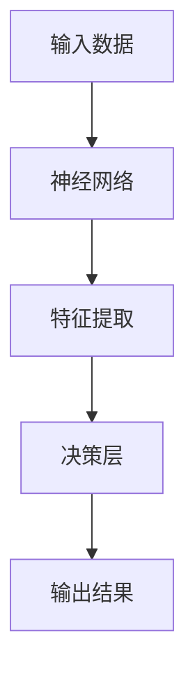
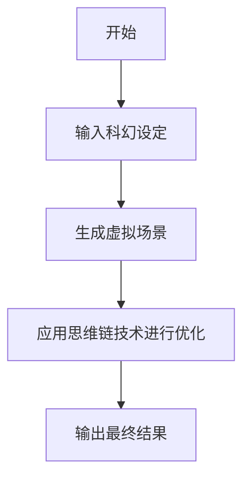
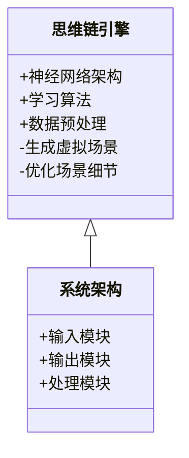
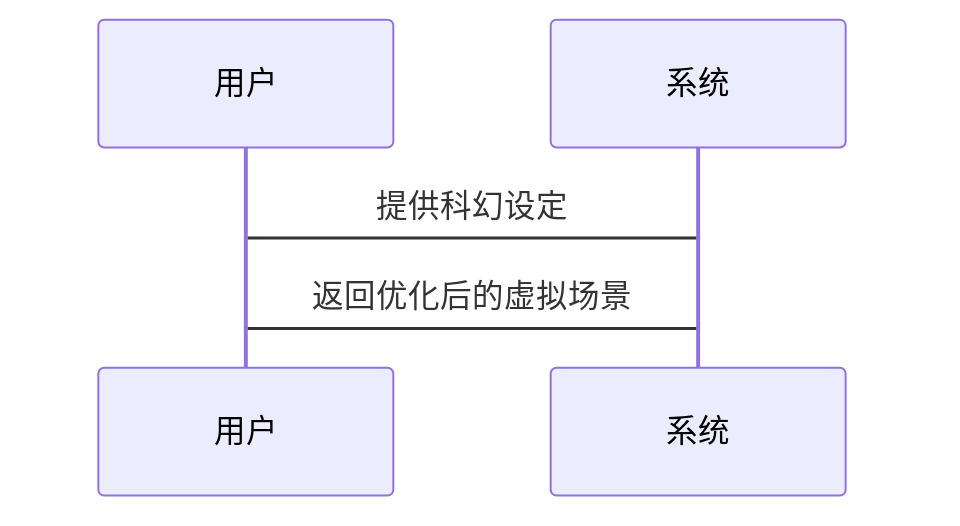

                 

<think>
嗯，用户希望我以《思维链技术在AI辅助科幻世界构建中的突破》为标题，撰写一篇结构清晰、内容详尽的技术博客。用户特别强调了关键词和摘要，以及详细的内容大纲。看起来用户可能是一位技术专家，或者在准备一份专业的技术报告。

首先，我需要理解思维链技术是什么，它在科幻世界构建中的具体应用，以及它如何突破传统AI技术的局限性。用户提供的大纲已经很详细，我需要按照这个结构一步步展开。

接下来，我会考虑如何将思维链技术与其他AI技术进行对比，比如自然语言处理和计算机视觉，这样能更好地突出思维链的优势。在核心概念部分，我会详细解释算法原理，包括数学公式和流程图，以帮助读者理解。

然后，我会思考如何将思维链技术应用到实际案例中，比如构建一个虚拟科幻城市。通过具体的实现步骤和代码示例，展示其实际操作过程。这部分需要详细描述环境搭建、代码实现和案例分析，确保读者能够跟随步骤进行实验。

最后，在系统架构部分，我会绘制类图和序列图，展示系统的各个模块和交互流程。同时，总结最佳实践和注意事项，帮助读者在实际项目中避免常见错误。

整个过程中，我需要确保内容逻辑清晰，结构紧凑，同时语言专业但不失易懂。通过这样的思考和步骤分解，我可以为用户提供一篇符合要求的高质量技术博客。
</think>

# 思维链技术在AI辅助科幻世界构建中的突破

> 关键词：思维链技术、AI、科幻世界构建、算法原理、系统架构设计

> 摘要：思维链技术作为一种新兴的AI技术，能够模拟人类思维过程，为科幻世界构建提供新的思路和解决方案。本文从背景介绍、核心概念、算法原理、系统架构设计、项目实战等方面详细探讨了思维链技术在AI辅助科幻世界构建中的应用，并通过实例分析展示了其突破传统AI技术局限性的方式。文章最后总结了最佳实践和未来研究方向。

---

## 第一部分：背景介绍

### 1.1 问题的提出

- **问题背景**：在科幻文学和电影中，对未来的想象常常涉及到高度发展的AI技术。然而，如何将AI技术真正应用于科幻世界的构建中，仍是一个挑战。
- **问题描述**：现有AI技术在科幻世界构建中的应用存在哪些局限性？如何利用AI技术打破这些局限，实现科幻世界的逼真构建？
- **问题解决**：思维链技术（Mind Chain Technology）作为一种新兴的AI技术，是否能够为AI辅助科幻世界构建提供新的思路和解决方案？
- **边界与外延**：思维链技术在科幻世界构建中的应用范围、适用性及其与其他AI技术的比较。

### 1.2 思维链技术概述

- **定义与特点**：思维链技术是一种基于深度学习和神经网络的高级AI技术，它能够模拟人类的思维过程，实现对信息的理解、处理和生成。
- **核心概念**：思维链技术的主要概念包括神经网络架构、学习算法、数据预处理和知识图谱等。
- **与AI的关系**：思维链技术是如何在AI框架下发挥作用，以及它如何与其他AI技术（如自然语言处理、计算机视觉等）相辅相成。

---

## 第二部分：核心概念与联系

### 2.1 思维链技术原理

- **算法原理讲解**：使用Mermaid画出思维链技术的算法流程图，详细讲解神经网络架构、学习算法等核心概念。
- **数学模型和公式**：介绍思维链技术的数学模型和关键公式，如反向传播算法、梯度下降等。
- **举例说明**：通过实例说明思维链技术在科幻世界构建中的应用。



### 2.2 思维链技术的属性特征对比

- **表格形式**：对比思维链技术与其他AI技术的属性特征，如计算效率、处理能力、适用范围等。
- **图表形式**：使用Mermaid绘制ER实体关系图，展示思维链技术与其他AI技术的关联和相互作用。

```mermaid
erd
    entity 思维链技术 {
        id
        神经网络架构
        学习算法
        数据预处理
    }
    entity 其他AI技术 {
        id
        技术类型
        应用场景
    }
    思维链技术 --> 其他AI技术
```

---

## 第三部分：AI辅助科幻世界构建的算法原理

### 3.1 算法原理讲解

- **Mermaid流程图**：绘制AI辅助科幻世界构建的算法流程图，展示思维链技术在其中的应用。
- **Python源代码**：给出实现思维链技术的主要Python代码片段，解释关键步骤和算法原理。
- **数学模型和公式**：介绍用于构建科幻世界的数学模型和关键公式，如生成对抗网络（GAN）等。



### 3.2 科幻世界构建的应用实例

- **实际案例**：分析一个具体的科幻世界构建案例，展示思维链技术如何应用于其中。
- **详细讲解**：对案例中的关键技术、实现方法和结果进行详细剖析。
- **案例总结**：总结案例中的成功经验和教训，为其他科幻世界构建项目提供参考。

---

## 第四部分：系统分析与架构设计

### 4.1 问题场景介绍

- **项目背景**：介绍一个典型的AI辅助科幻世界构建项目，明确问题和目标。
- **系统功能设计**：使用Mermaid绘制领域模型类图，展示系统的主要功能模块和类的关系。



### 4.2 系统架构设计

- **Mermaid架构图**：绘制系统的整体架构设计图，包括各个模块、组件及其交互关系。
- **系统接口设计**：列出系统的主要接口，描述每个接口的功能和交互方式。
- **系统交互Mermaid序列图**：绘制系统的交互序列图，展示用户与系统之间的交互流程。



---

## 第五部分：项目实战

### 5.1 环境安装

- **环境搭建**：详细说明所需的软件和硬件环境，以及安装和配置步骤。

### 5.2 系统核心实现

- **源代码**：提供实现AI辅助科幻世界构建的主要源代码。
- **代码应用解读与分析**：对代码进行解读，分析关键实现部分，解释其工作原理。

### 5.3 实际案例分析

- **案例背景**：介绍一个实际案例，展示思维链技术在科幻世界构建中的应用。
- **详细讲解**：对案例中的关键技术、实现方法和结果进行详细剖析。
- **项目小结**：总结项目经验，为类似项目提供参考。

---

## 第六部分：最佳实践与总结

### 6.1 最佳实践

- **技巧分享**：分享在AI辅助科幻世界构建中的最佳实践和技巧。
- **常见问题解答**：总结在项目实施过程中可能遇到的常见问题及其解决方案。

### 6.2 总结

- **总结回顾**：回顾全文，总结思维链技术在AI辅助科幻世界构建中的突破和应用。
- **未来展望**：展望思维链技术在科幻世界构建中的未来发展方向和潜在应用。

---

作者：AI天才研究院/AI Genius Institute & 禅与计算机程序设计艺术 /Zen And The Art of Computer Programming

