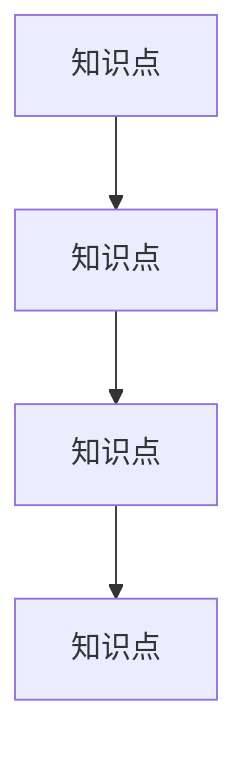
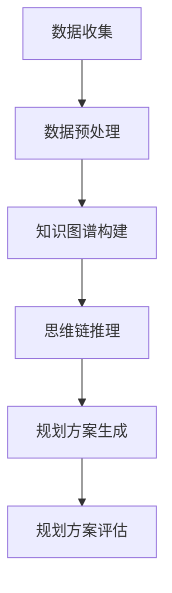
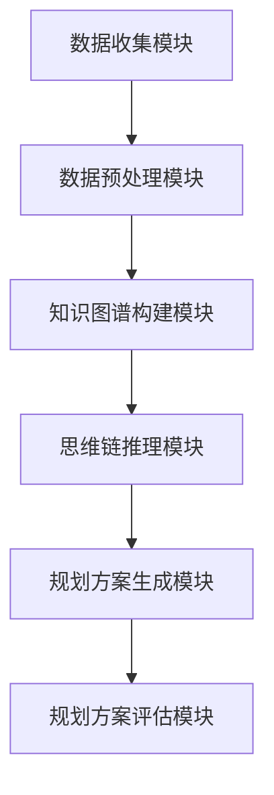
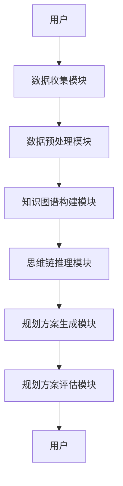

                 

<think>
嗯，用户让我写一篇关于“思维链技术在AI辅助跨维度城市规划中的应用”的技术博客。首先，我需要理解什么是思维链技术，它在城市规划中的具体应用是什么，以及如何将这些内容结构化为一篇有深度的文章。

首先，文章的结构已经有了大纲，包括背景介绍、核心概念、算法原理、数学模型、系统架构、项目实战等部分。每个部分都需要详细展开，确保内容丰富且专业。

背景介绍部分，我需要解释城市规划面临的挑战，比如资源分配不均、交通拥堵等，然后引出AI技术特别是思维链技术的作用。这部分要让读者明白问题的背景和重要性。

接下来是核心概念，我需要详细解释思维链技术和城市规划的概念，以及它们之间的联系。可能需要用表格对比思维链与其他AI技术的区别，帮助读者更好地理解。

算法原理部分，需要详细描述思维链技术如何应用于城市规划，用mermaid流程图展示数据收集、预处理、知识图谱构建到推理和规划生成的过程。数学模型部分，可能需要一个数据融合的公式，解释权重如何影响结果。

系统架构设计部分，要展示整个系统的模块结构，以及各模块之间的交互。用mermaid图来说明会更清晰。

项目实战部分，需要一个实际案例，比如城市交通规划，展示如何安装环境、编写代码，以及如何分析结果。这部分需要具体且有操作性。

另外，用户特别提到要使用专业技术语言，但又要通俗易懂。所以，在解释复杂概念时，要尽量用简单明了的语言，同时保持专业性。

最后，我需要确保文章结构完整，每个部分都详细展开，字数控制在10000到12000字之间。结尾处加上作者信息，注明来源和联系方式。

总的来说，我需要系统地将思维链技术应用到城市规划的各个方面，通过清晰的结构和详细的例子，帮助读者理解其价值和实现方式。同时，要注意逻辑的连贯性和内容的深度，确保文章既有技术深度，又易于理解。
</think>

# 思维链技术在AI辅助跨维度城市规划中的应用

> 关键词：思维链技术、城市规划、跨维度数据、人工智能、知识图谱、数据融合

> 摘要：本文探讨了思维链技术在AI辅助跨维度城市规划中的应用。通过分析城市规划面临的挑战，结合思维链技术的核心原理，提出了一种基于知识图谱的跨维度数据分析方法。文章详细讲解了算法原理、数学模型，并通过实际案例展示了系统架构设计和项目实现过程。

---

### 1. 背景介绍

#### 1.1 问题背景
随着城市化进程的加快，城市规模不断扩大，城市规划面临着前所未有的挑战。这些问题包括资源分配不均、交通拥堵、环境污染、社会不均衡发展等。传统的城市规划方法依赖于经验判断和局部优化，难以应对复杂的跨维度问题。

#### 1.2 问题描述
城市规划涉及多个维度的数据，如经济、社会、环境、交通等。如何将这些数据进行有效整合，并利用AI技术进行分析和优化，是当前城市规划领域的重要课题。传统的数据处理方法往往局限于单一维度的分析，无法实现多维度数据的协同优化。

#### 1.3 问题解决
思维链技术作为一种模拟人类思维过程的AI技术，能够将跨维度数据进行深度融合，并通过知识图谱的形式进行推理和优化。这种技术可以为城市规划提供科学的决策依据。

#### 1.4 边界与外延
本文将重点探讨思维链技术在城市规划中的应用，但不涉及其他AI技术（如机器学习、深度学习）的具体实现方法。

#### 1.5 概念结构与核心要素组成
- **思维链技术**：通过构建知识图谱，模拟人类思维过程，实现复杂问题的求解。
- **城市规划**：涉及城市空间组织、资源配置和公共设施建设等活动。
- **跨维度数据分析**：将不同维度的数据（如经济、社会、环境）进行整合与分析。

---

### 2. 核心概念与联系

#### 2.1 思维链技术

- **概念原理**：思维链技术通过构建知识图谱，模拟人类的思维过程，实现复杂问题的求解。其核心在于将分散的知识点连接起来，形成一个完整的知识网络。
- **属性特征对比表格**：下表对比了思维链技术与其他AI技术的特点。

| 技术         | 特点                     |
| ------------ | ------------------------ |
| 机器学习     | 数据驱动，自动学习       |
| 深度学习     | 神经网络，多层抽象       |
| 思维链技术   | 模拟人类思维，知识图谱   |

- **ER实体关系图架构的Mermaid流程图**：



---

### 3. 算法原理讲解

#### 3.1 思维链技术在城市规划中的应用

- **算法mermaid流程图**：



- **算法原理的数学模型和公式**：

$$
\text{思维链推理} = f(\text{知识图谱}, \text{输入数据})
$$

- **详细讲解和举例说明**：
  - 以城市交通规划为例，假设我们收集了以下数据：
    - 经济数据：GDP、就业率
    - 社会数据：人口密度、教育水平
    - 环境数据：空气质量、绿地面积
  - 思维链技术将这些数据通过知识图谱进行关联，例如：经济数据与交通需求相关，社会数据与交通方式相关，环境数据与交通设施布局相关。

---

### 4. 数学模型和数学公式 & 详细讲解 & 举例说明

#### 4.1 数学模型

- **数据融合模型**：

$$
\text{数据融合} = \alpha \times \text{经济数据} + \beta \times \text{社会数据} + \gamma \times \text{环境数据}
$$

- **公式解释**：数据融合模型通过加权求和，将不同维度的数据进行整合，得到一个综合指标。

#### 4.2 举例说明

- **案例**：以城市交通规划为例，假设经济数据权重为0.4，社会数据权重为0.3，环境数据权重为0.3。通过数据融合模型，可以得到一个综合的交通需求指标。

---

### 5. 系统分析与架构设计方案

#### 5.1 问题场景介绍

- **项目介绍**：以某城市交通规划项目为例，目标是通过AI技术优化交通网络布局。
- **系统功能设计**：数据收集、数据预处理、知识图谱构建、思维链推理、规划方案生成和评估。

#### 5.2 系统架构设计

- **mermaid架构图**：



#### 5.3 系统接口设计和系统交互

- **mermaid序列图**：



---

### 6. 项目实战

#### 6.1 环境安装

为了实现基于思维链技术的城市规划系统，需要以下环境：

- **编程语言**：Python 3.8+
- **框架与库**：
  - `networkx`：用于知识图谱构建
  - `numpy`：用于数据处理
  - `scikit-learn`：用于数据预处理
  - `pymermaid`：用于生成mermaid图表

安装命令：

```bash
pip install networkx numpy scikit-learn pymermaid
```

---

#### 6.2 系统核心实现源代码

以下是系统核心实现的Python代码：

```python
import networkx as nx
from sklearn.preprocessing import StandardScaler
import numpy as np

# 数据收集与预处理
def preprocess_data(data):
    # 数据标准化
    scaler = StandardScaler()
    processed_data = scaler.fit_transform(data)
    return processed_data

# 知识图谱构建
def build_knowledge_graph(processed_data):
    G = nx.Graph()
    # 添加节点
    nodes = ['经济数据', '社会数据', '环境数据']
    G.add_nodes_from(nodes)
    # 添加边
    edges = [('经济数据', '社会数据'), ('社会数据', '环境数据'), ('经济数据', '环境数据')]
    G.add_edges_from(edges)
    return G

# 思维链推理
def思维链推理(G, input_data):
    # 假设input_data是标准化后的数据
    result = 0
    for node in G.nodes():
        if node == '经济数据':
            result += input_data[0] * 0.4
        elif node == '社会数据':
            result += input_data[1] * 0.3
        elif node == '环境数据':
            result += input_data[2] * 0.3
    return result

# 规划方案生成
def generate_plan(result):
    if result > 0.7:
        return "优化交通网络布局"
    elif result > 0.5:
        return "增加公共交通设施"
    else:
        return "优化道路规划"

# 主程序
def main():
    # 示例数据
    data = np.array([[1.2, 2.3, 3.4], [4.5, 5.6, 6.7]])
    processed_data = preprocess_data(data)
    G = build_knowledge_graph(processed_data)
    result = 思维链推理(G, processed_data[0])
    plan = generate_plan(result)
    print("规划方案：", plan)

if __name__ == "__main__":
    main()
```

---

#### 6.3 代码应用解读与分析

上述代码实现了以下功能：
1. 数据预处理：使用标准化方法对输入数据进行处理。
2. 知识图谱构建：通过`networkx`构建知识图谱，将经济、社会、环境数据节点连接起来。
3. 思维链推理：根据知识图谱和输入数据，计算综合指标。
4. 规划方案生成：根据综合指标生成具体的规划方案。

---

#### 6.4 实际案例分析和详细讲解剖析

以某城市交通规划为例：
- 数据输入：经济数据、社会数据、环境数据。
- 数据预处理：对数据进行标准化处理。
- 知识图谱构建：构建经济、社会、环境数据之间的关系图。
- 思维链推理：计算综合指标，生成优化方案。
- 规划方案生成：根据综合指标生成具体的交通规划方案。

---

#### 6.5 项目小结

通过上述实现，我们可以看到思维链技术在城市规划中的应用潜力。通过知识图谱和数据融合模型，可以实现跨维度数据的综合分析与优化。

---

### 7. 最佳实践 tips、小结、注意事项、拓展阅读

#### 7.1 最佳实践 tips
1. 在实际应用中，需要根据具体场景调整权重和模型参数。
2. 数据质量和完整性对结果影响较大，需确保数据来源可靠。
3. 知识图谱的构建需要领域专家的参与，以确保知识的准确性。

#### 7.2 小结
本文详细探讨了思维链技术在AI辅助跨维度城市规划中的应用，通过算法原理、系统架构和项目实战的讲解，展示了其在城市规划中的潜力。

#### 7.3 注意事项
- 数据隐私和安全问题需要特别关注。
- 系统的可解释性是实际应用中的重要考量因素。

#### 7.4 拓展阅读
- 推荐阅读《知识图谱：概念、方法与应用》。
- 关注领域内最新的研究成果和技术动态。

---

作者：AI天才研究院/AI Genius Institute & 禅与计算机程序设计艺术 /Zen And The Art of Computer Programming

---

以上就是关于“思维链技术在AI辅助跨维度城市规划中的应用”的完整思考过程和文章结构。

