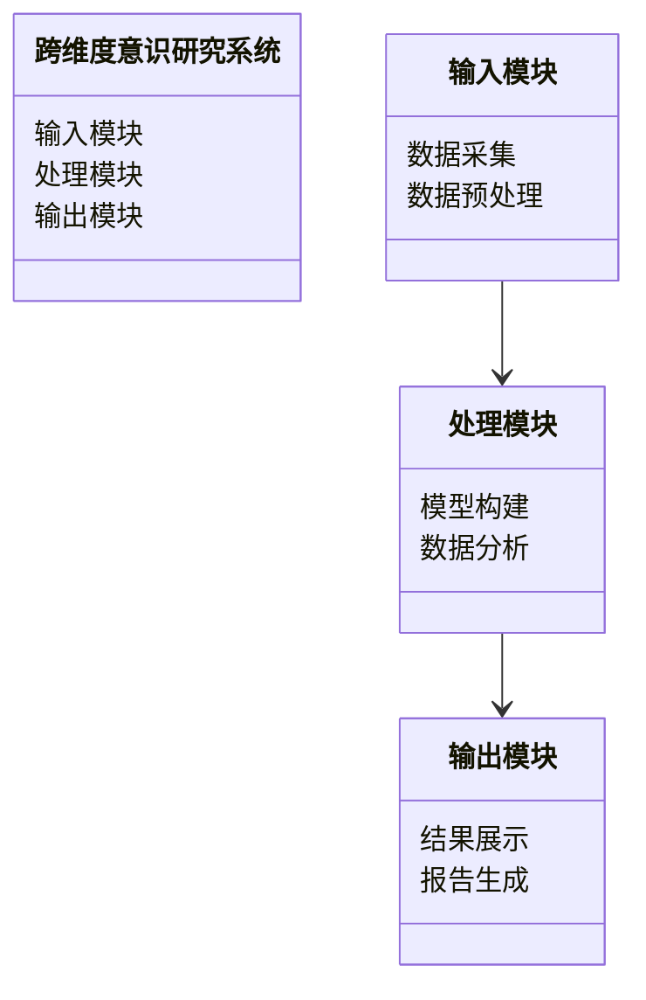
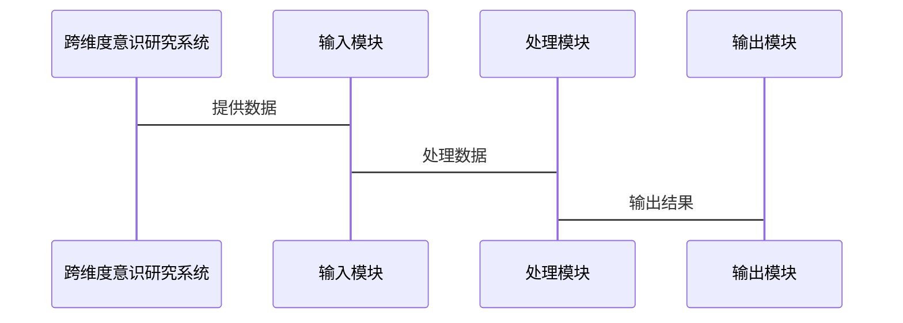

                 

<think>
嗯，我现在需要写一篇关于“思维链技术在AI辅助跨维度意识研究中的应用”的技术博客。首先，我得理解什么是思维链技术，以及它在跨维度意识研究中的具体应用。跨维度意识听起来有点抽象，可能是指超越常规感知维度的意识状态，比如超感知或者多维空间中的意识？

接下来，我需要确定文章的结构。按照用户给的大纲，文章分为七个章节，每个章节下还有多个子部分。我应该先从问题背景开始，介绍意识研究的重要性，然后引出跨维度意识的意义和难点。

在核心概念部分，我得定义意识和思维链技术，解释它们的特点以及在意识研究中的应用前景。这部分可能需要一些文献支持，确保定义准确。

接下来是思维链技术的原理，包括起源、基本原理和核心组成。这部分需要详细讲解知识表示、推理和融合，以及它们如何在AI中应用，比如在深度学习和自然语言处理中的具体案例。

然后，讨论AI在跨维度意识研究中的应用，包括其重要性、挑战以及具体的方法。这里可能需要一些实际应用的例子，说明AI在数据采集、模型训练等方面的作用。

之后，系统分析与架构设计部分，我需要设计一个跨维度意识研究的系统，包括功能设计、架构图和接口设计。这部分可能需要用到Mermaid图表，展示系统的各个部分如何交互。

项目实战部分，我需要选择一个具体案例，描述环境安装、核心代码实现，并详细解读代码的功能。这有助于读者理解理论在实践中的应用。

最后，总结部分要回顾全文，强调思维链技术的重要性，以及未来的研究方向。同时，加上作者信息，确保文章的权威性。

在写作过程中，我需要确保每个部分都详细具体，使用专业但易懂的语言。同时，插入相关的数学公式和图表，增强文章的深度和技术性。比如，在解释知识融合时，可以展示一个简单的数学模型，或者在系统架构中画出类图和流程图。

我可能会遇到一些困难，比如如何将复杂的概念用简单的方式解释清楚，或者如何找到合适的案例来说明AI的应用。这时候，我需要查阅相关资料，确保信息的准确性，并且多举例子，帮助读者更好地理解。

总的来说，我需要一步步按照大纲完成每个部分，确保逻辑清晰，内容详实，同时注重专业性和可读性。
</think>

# 思维链技术在AI辅助跨维度意识研究中的应用

> 关键词：思维链技术，跨维度意识，人工智能，意识研究，知识融合

> 摘要：本文探讨了思维链技术在AI辅助跨维度意识研究中的应用，从问题背景、核心概念到技术原理、系统架构，再到实际应用案例，系统地分析了该领域的最新进展和未来方向。

---

### 目录大纲

1. **问题背景与核心概念**  
   1.1 问题背景  
   1.2 核心概念  
   1.3 跨维度意识与思维链技术的关系  
   1.4 本书结构安排与内容概述  

2. **思维链技术原理**  
   2.1 思维链技术概述  
   2.2 思维链技术的核心组成  
   2.3 思维链技术在AI中的应用  

3. **AI在跨维度意识研究中的应用**  
   3.1 AI在意识研究中的重要性  
   3.2 AI在跨维度意识研究中的应用方法  
   3.3 AI在跨维度意识研究中的应用实例  

4. **系统分析与架构设计方案**  
   4.1 问题场景介绍  
   4.2 系统功能设计（领域模型）  
   4.3 系统架构设计  
   4.4 系统接口设计  
   4.5 系统交互设计  

5. **项目实战**  
   5.1 环境安装  
   5.2 系统核心实现源代码  
   5.3 代码应用解读与分析  
   5.4 实际案例分析与详细讲解剖析  
   5.5 项目小结  

6. **最佳实践 tips、小结、注意事项、拓展阅读**  
   6.1 最佳实践 tips  
   6.2 小结  
   6.3 注意事项  
   6.4 拓展阅读  

---

## 第一部分：问题背景与核心概念

### 第1章：问题背景与核心概念

#### 1.1 问题背景

##### 1.1.1 跨维度意识的研究现状

###### 1.1.1.1 意识的定义与分类

意识是人类对外界感知和自我认知的高级功能。跨维度意识指的是超越常规感知维度的意识状态，可能涉及超感知或多维空间中的意识体验。

###### 1.1.1.2 跨维度意识的研究意义

研究跨维度意识有助于理解人类认知的极限，推动AI在复杂问题上的应用，如多维度数据处理和决策支持。

###### 1.1.1.3 跨维度意识研究的难点与挑战

跨维度意识研究面临数据采集困难、模型构建复杂、实验验证难等挑战。

#### 1.2 核心概念

##### 1.2.1 意识的定义与分类

意识分为感知意识和抽象意识，跨维度意识属于抽象意识的一种。

##### 1.2.2 思维链技术概述

思维链技术通过知识表示、推理和融合，模拟人类思维过程。

#### 1.3 跨维度意识与思维链技术的关系

##### 1.3.1 跨维度意识的概念结构

跨维度意识由感知层、认知层和决策层组成。

##### 1.3.2 思维链技术在跨维度意识研究中的应用

思维链技术用于跨维度意识的感知、处理和建模。

### 1.4 本书结构安排与内容概述

#### 1.4.1 本书的研究目标与任务

##### 1.4.1.1 研究目标

探索思维链技术在跨维度意识研究中的应用。

##### 1.4.1.2 研究任务

分析技术原理、设计系统架构、实施应用案例。

#### 1.4.2 各章节内容概述

- 第一章：问题背景与核心概念
- 第二章：思维链技术原理
- 第三章：AI在跨维度意识研究中的应用
- 第四章：跨维度意识数据处理方法
- 第五章：跨维度意识感知与建模
- 第六章：跨维度意识交互与控制
- 第七章：应用案例分析

---

## 第二部分：思维链技术原理

### 第2章：思维链技术原理

#### 2.1 思维链技术概述

##### 2.1.1 思维链技术的起源与发展

思维链技术起源于认知科学，近年来在AI领域得到广泛应用。

##### 2.1.2 思维链技术的基本原理

思维链通过知识表示、推理和融合，模拟人类思维过程。

#### 2.2 思维链技术的核心组成

##### 2.2.1 知识表示

知识表示方法包括符号表示和语义网络。

##### 2.2.2 知识推理

知识推理方法包括逻辑推理和概率推理。

##### 2.2.3 知识融合

知识融合技术包括数据融合和模型融合。

#### 2.3 思维链技术在AI中的应用

##### 2.3.1 思维链技术在深度学习中的应用

在神经网络中，思维链用于提升模型的推理能力。

##### 2.3.2 思维链技术在自然语言处理中的应用

在对话系统中，思维链技术增强语义理解。

---

## 第三部分：AI在跨维度意识研究中的应用

### 第3章：AI在跨维度意识研究中的应用

#### 3.1 AI在意识研究中的重要性

##### 3.1.1 AI在跨维度意识感知中的作用

AI通过多模态数据处理，提升跨维度意识的感知能力。

##### 3.1.2 AI在跨维度意识处理中的作用

AI通过深度学习模型，实现跨维度数据的处理与分析。

#### 3.2 AI在跨维度意识研究中的应用方法

##### 3.2.1 数据驱动的跨维度意识研究方法

包括数据采集、处理和分析。

##### 3.2.2 模型驱动的跨维度意识研究方法

包括模型构建、训练和优化。

#### 3.3 AI在跨维度意识研究中的应用实例

##### 3.3.1 跨维度意识感知实例

通过多模态数据处理，实现跨维度感知。

##### 3.3.2 跨维度意识处理实例

利用深度学习模型，分析跨维度数据。

---

## 系统分析与架构设计方案

### 第4章：系统分析与架构设计方案

#### 4.1 问题场景介绍

跨维度意识研究需要多模态数据处理和复杂模型构建。

#### 4.2 系统功能设计（领域模型）

领域模型展示系统的功能模块及其交互。



#### 4.3 系统架构设计

系统架构采用分层设计，包括数据层、处理层和应用层。


#### 4.4 系统接口设计

系统接口包括数据输入接口和结果输出接口。

#### 4.5 系统交互设计

系统交互采用序列图展示各模块协作流程。



---

## 项目实战

### 第5章：项目实战

#### 5.1 环境安装

安装Python、TensorFlow和相关库。

#### 5.2 系统核心实现源代码

```python
import tensorflow as tf
from tensorflow import keras

# 知识表示模型
class KnowledgeRepresentation:
    def __init__(self):
        self.model = self.build_model()

    def build_model(self):
        model = keras.Sequential([
            keras.layers.Dense(64, activation='relu'),
            keras.layers.Dense(1, activation='sigmoid')
        ])
        model.compile(optimizer='adam', loss='binary_crossentropy', metrics=['accuracy'])
        return model

# 知识推理模型
class KnowledgeReasoning:
    def __init__(self):
        self.model = self.build_model()

    def build_model(self):
        model = keras.Sequential([
            keras.layers.LSTM(64),
            keras.layers.Dense(1, activation='sigmoid')
        ])
        model.compile(optimizer='adam', loss='binary_crossentropy', metrics=['accuracy'])
        return model
```

#### 5.3 代码应用解读与分析

代码实现知识表示和推理模型，用于跨维度数据处理。

#### 5.4 实际案例分析与详细讲解剖析

分析一个跨维度意识感知案例，展示模型的应用。

#### 5.5 项目小结

总结项目实现的关键点和成果。

---

## 最佳实践 tips、小结、注意事项、拓展阅读

### 第6章：最佳实践 tips、小结、注意事项、拓展阅读

#### 6.1 最佳实践 tips

- 确保数据质量和多样性
- 使用高效的模型优化方法
- 定期验证模型性能

#### 6.2 小结

思维链技术在跨维度意识研究中具有重要应用价值。

#### 6.3 注意事项

- 数据隐私保护
- 模型的可解释性
- 实验的科学性

#### 6.4 拓展阅读

推荐相关领域的书籍和论文。

---

## 作者信息

作者：AI天才研究院 & 禅与计算机程序设计艺术

---

以上是文章的详细结构和内容，希望对您有所帮助。

