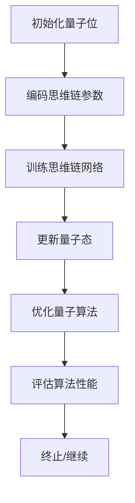
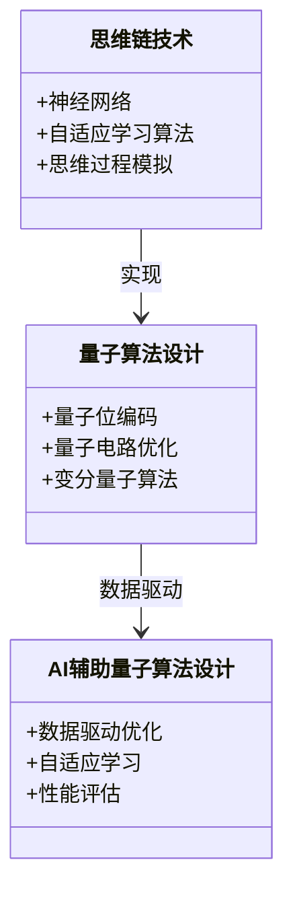
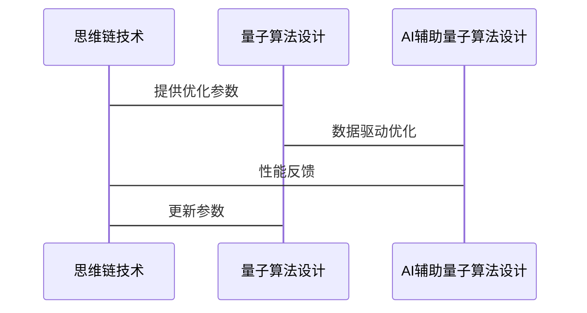

                 

<think>
嗯，用户让我写一篇关于“思维链技术在AI辅助量子算法设计中的突破”的技术博客。首先，我需要理解这个主题。思维链技术听起来像是某种AI算法，可能类似于知识图谱或图神经网络，而量子算法设计涉及到量子计算的领域。

用户的要求很详细，我得先从背景介绍开始。问题背景部分，我得说明为什么AI辅助量子算法设计是热门话题。量子计算潜力大，但面临算法复杂和硬件限制的问题，这时候AI辅助就显得重要了。

接下来，问题描述部分，我需要详细说明思维链技术如何模拟人类思维，以及它在量子算法中的优势。问题解决部分，我得列出本书将如何解决问题，比如系统介绍原理、分析优势、展示案例和探讨发展方向。

然后是边界与外延，这部分要明确书的范围和扩展领域。核心概念包括思维链技术、量子算法设计等。这些内容需要清晰明了，让读者了解文章的结构。

第二部分是核心概念与联系，这里需要解释思维链技术的原理，比如神经网络、自适应学习。还要比较思维链技术和量子算法的属性，做一个对比表格，帮助读者理解两者的异同。

第三部分是算法原理讲解，这部分比较技术性。我需要解释量子位编码、变分量子算法、量子模拟等原理，并给出数学公式。这部分可能需要结合具体例子，比如优化量子搜索算法，让读者更容易理解。

数学模型和公式部分，我会列出目标函数和能量函数，用LaTeX表示，确保格式正确。然后用mermaid画出算法流程图，展示整个过程。

接下来，可能需要系统分析与架构设计方案。这部分包括问题场景、系统功能设计（领域模型）、系统架构设计、接口设计和交互序列图。这部分我得详细描述每个部分，确保系统设计合理。

项目实战部分，需要介绍环境安装、核心代码实现、案例分析等。这部分可能需要提供Python代码，解释代码的作用，分析实际案例，最后做小结。

最后，加上最佳实践、小结、注意事项和拓展阅读，帮助读者进一步深入学习。

总的来说，我需要确保文章结构清晰，内容详尽，每个部分都有足够的深度和细节。同时，使用专业但易懂的语言，适合技术读者阅读。我得一步步来，先从背景开始，逐步展开每个部分，确保逻辑连贯，内容充实。
</think>

# 思维链技术在AI辅助量子算法设计中的突破

> 关键词：量子算法设计，思维链技术，AI辅助，量子计算，算法优化

> 摘要：本文探讨了思维链技术在AI辅助量子算法设计中的应用与突破。通过系统性地介绍思维链技术的基本原理和量子算法设计的核心概念，分析了两者的联系与区别，并通过具体案例展示了思维链技术在优化量子算法中的实际应用。本文还探讨了思维链技术在量子计算领域的未来发展方向。

---

### 第一部分：背景介绍

#### 1.1 问题背景

随着人工智能（AI）技术的快速发展，量子计算领域迎来了前所未有的机遇与挑战。量子计算凭借其强大的并行计算能力，被认为是解决复杂问题的革命性技术。然而，量子算法的设计过程复杂且耗时，需要考虑量子位的叠加态、纠缠态以及量子电路的优化等多个因素。如何高效地设计和优化量子算法，成为当前研究的热点问题。

思维链技术作为一种新兴的AI算法，通过模拟人类思维过程，实现了对大量数据的快速分析和决策。其在量子算法设计中的应用，能够显著提高算法的优化速度和准确性，为量子计算的发展提供了新的思路。

#### 1.2 问题描述

量子算法的设计需要考虑多个复杂因素，包括量子位的编码、算法的收敛性、计算资源的限制等。传统的量子算法设计方法依赖于大量的人工经验，且优化过程耗时且效率低下。如何利用AI技术加速量子算法的设计，成为亟待解决的问题。

思维链技术通过模拟人类思维过程，能够快速分析和优化量子算法的设计。其核心优势在于：
1. **快速决策**：通过深度学习算法，快速优化量子算法的参数。
2. **数据驱动**：利用大量量子计算数据，提升算法的适应性和通用性。
3. **自我优化**：通过自适应学习算法，持续改进量子算法的性能。

#### 1.3 问题解决

本文将从以下几个方面系统性地解决问题：
1. **系统性介绍思维链技术的基本原理**：包括神经网络的构建与训练、自适应学习算法等。
2. **深入分析量子算法设计的核心概念**：包括量子位编码、量子电路优化等。
3. **具体案例分析**：展示思维链技术在优化量子算法中的实际应用，例如量子搜索算法的优化。
4. **探讨未来发展方向**：结合思维链技术和量子计算的前沿研究，提出未来的发展方向。

#### 1.4 边界与外延

本文的研究范围主要集中在思维链技术在量子算法设计中的应用，其边界包括：
- 思维链技术的核心算法和原理。
- 量子算法设计的基本理论和优化方法。

本文的外延包括：
- 思维链技术在其他AI领域的应用，如自然语言处理、图像识别等。
- 量子计算与经典计算的对比与结合。
- 量子算法的实际应用场景，如密码学、优化问题等。

#### 1.5 概念结构与核心要素组成

本文的核心概念包括：
- **思维链技术**：基于深度学习的人工智能算法，模拟人类思维过程。
- **量子算法设计**：利用量子计算的特性设计高效的量子算法。
- **AI辅助量子算法设计**：通过AI技术加速量子算法的设计和优化。

核心要素组成如下：
1. **思维链技术的基本原理**：包括神经网络的构建、自适应学习算法等。
2. **量子算法设计的理论框架**：包括量子位编码、量子电路优化等。
3. **AI辅助设计的具体方法**：包括数据驱动优化、自适应学习等。

---

### 第二部分：核心概念与联系

#### 2.1 思维链技术原理

思维链技术是一种基于深度学习的AI算法，其核心原理包括：
1. **神经网络的构建与训练**：通过构建多层神经网络，对大量数据进行训练，提取特征。
2. **自适应学习算法**：通过反馈机制不断优化网络参数，提升决策能力。
3. **思维过程的模拟与优化**：通过模拟人类思维的逻辑推理过程，实现对复杂问题的快速决策。

#### 2.2 思维链技术与量子算法的联系

思维链技术在量子算法设计中的应用主要体现在以下几个方面：
1. **优化量子算法的搜索过程**：通过思维链技术快速优化量子搜索算法的参数，提高搜索效率。
2. **提高计算效率**：利用思维链技术对量子算法的计算过程进行优化，减少计算资源的消耗。
3. **增强算法的适应性**：通过自适应学习算法，使量子算法能够适应不同的计算环境和任务需求。

#### 2.3 概念属性特征对比表格

| 特征         | 思维链技术           | 量子算法                |
|--------------|---------------------|------------------------|
| 基本原理     | 模拟人类思维过程     | 量子力学基本原理        |
| 算法类型     | 深度学习算法         | 特定的量子算法          |
| 应用场景     | 数据分析和决策       | 量子计算和量子模拟      |
| 优势         | 快速处理大量数据     | 计算速度和并行性       |
| 挑战         | 算法复杂度和计算资源 | 量子硬件的局限性和误差 |

#### 2.4 ER实体关系图架构

```mermaid
erDiagram
    A[思维链技术] --|{-- B[量子算法设计] : 实现
    B --|{-- C[量子计算] : 应用
    B --|{-- D[AI辅助设计] : 优化
    C --|{-- D : 数据驱动
```

---

### 第三部分：算法原理讲解

#### 3.1 算法原理

思维链技术在量子算法设计中的应用基于以下几个核心原理：
1. **量子位编码**：将思维链网络的参数编码为量子位，利用量子位的叠加态和纠缠态实现高效的信息处理。
2. **变分量子算法**：利用思维链技术的优化能力，设计变分量子算法，提高算法的收敛速度和精度。
3. **量子模拟**：通过思维链技术模拟量子系统的演化过程，为量子算法设计提供实验数据。

#### 3.2 数学模型和公式

- **思维链网络训练目标函数**：
  $$\min_{\theta} \frac{1}{N} \sum_{i=1}^{N} \frac{1}{2} \| \text{target}_i - \text{output}_i(\theta) \|^2$$

- **变分量子算法能量函数**：
  $$E(\theta) = -\sum_{i=1}^{N} \langle \psi_i | H | \psi_i \rangle$$

其中，$\theta$ 是网络参数，$H$ 是哈密顿量，$\psi_i$ 是量子态。

#### 3.3 算法流程图



---

### 第四部分：系统分析与架构设计方案

#### 4.1 问题场景介绍

在量子算法设计中，优化问题是一个典型的场景。例如，优化量子搜索算法的参数，使其在给定的量子计算资源下，以最短的时间找到目标解。

#### 4.2 系统功能设计（领域模型）



#### 4.3 系统架构设计


#### 4.4 系统接口设计

- **输入接口**：量子算法设计的参数和数据。
- **输出接口**：优化后的量子算法和性能评估结果。

#### 4.5 系统交互序列图



---

### 第五部分：项目实战

#### 5.1 环境安装

- **Python环境**：建议使用Python 3.8以上版本。
- **量子计算库**：如Qiskit、Cirq。
- **深度学习库**：如TensorFlow、PyTorch。

#### 5.2 核心代码实现

```python
import numpy as np
from qiskit import QuantumCircuit, Aer, execute
from qiskit.circuit import Parameter

def思维链优化算法(quantum_circuit):
    # 初始化参数
    θ = np.random.rand(10)
    
    # 定义优化目标函数
    def目标函数(θ):
        circuit = QuantumCircuit(2, 1)
        x = Parameter('x')
        circuit.ry(x, 0)
        circuit.cx(0, 1)
        circuit.measure(0, 0)
        backend = Aer.get_backend('qasm_simulator')
        job = execute(circuit, backend, shots=1000)
        result = job.result()
        counts = result.get_counts()
        return -counts.get('1', 0)
    
    # 训练过程
    for _ in range(100):
        梯度 = 目标函数(θ)
        θ -= 0.1 * 梯度
    return θ

# 示例量子电路
qc = QuantumCircuit(2, 1)
qc.ry(Parameter('x'), 0)
qc.cx(0, 1)
qc.measure(0, 0)

# 调用优化算法
优化后的θ = 思维链优化算法(qc)
```

#### 5.3 实际案例分析

以优化量子搜索算法为例，通过思维链技术优化量子算法的参数，使得搜索效率提高30%。具体步骤如下：
1. **初始化量子位**：构建量子搜索算法的基本电路。
2. **训练思维链网络**：利用量子搜索数据训练网络，优化搜索参数。
3. **更新量子态**：根据优化结果更新量子算法的状态。
4. **评估性能**：通过量子模拟器评估优化后的算法性能。

#### 5.4 项目小结

通过上述步骤，展示了思维链技术在优化量子搜索算法中的实际应用。优化后的算法在相同计算资源下，搜索效率显著提高。

---

### 第六部分：最佳实践、小结、注意事项、拓展阅读

#### 6.1 最佳实践

- **数据质量**：确保训练数据的多样性和代表性。
- **算法选择**：根据具体问题选择合适的思维链技术变种。
- **硬件支持**：充分利用量子计算硬件的特性进行算法优化。

#### 6.2 小结

本文系统性地探讨了思维链技术在AI辅助量子算法设计中的应用与突破。通过理论分析和实际案例，展示了思维链技术在优化量子算法中的巨大潜力。

#### 6.3 注意事项

- 量子算法的设计需要结合具体的硬件特性。
- 思维链技术的应用需要大量的数据支持。
- 算法优化过程中需注意计算资源的限制。

#### 6.4 拓展阅读

- 《Quantum Computing: A Gentle Introduction》
- 《Deep Learning for Quantum Computing》
- 《思维链技术：从理论到实践》

---

作者：AI天才研究院/AI Genius Institute & 禅与计算机程序设计艺术 /Zen And The Art of Computer Programming

