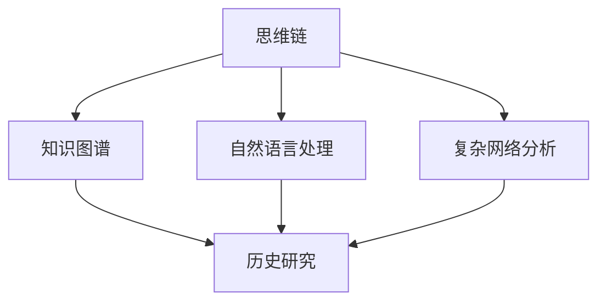
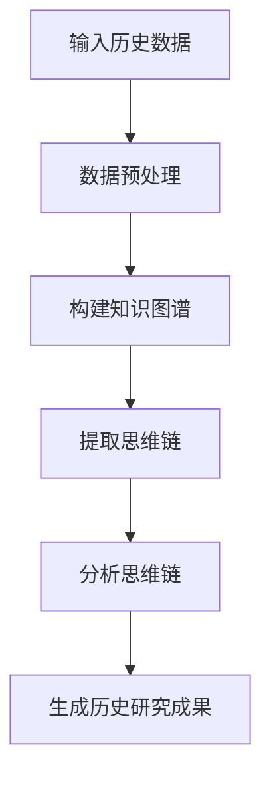
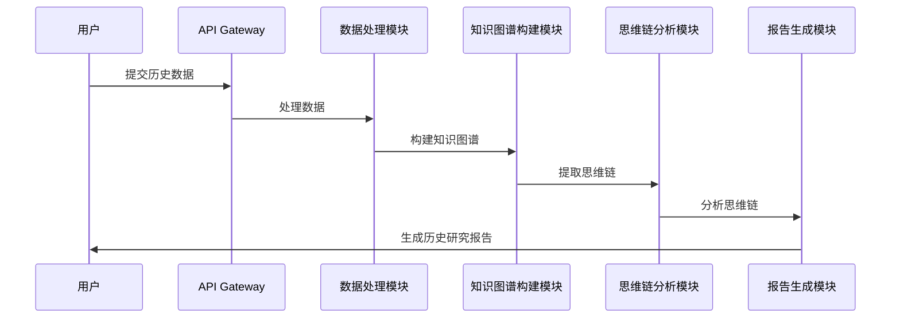

                 

<think>
嗯，用户让我写一篇关于《思维链技术在历史研究中的创新应用》的技术博客文章。我需要先理清楚用户的具体需求。看起来用户希望这篇文章结构清晰，内容详实，符合技术博客的高标准。用户还提供了详细的目录大纲，所以我需要按照这个结构来组织内容。

首先，我需要明确文章的关键词和摘要。关键词应该是思维链技术、历史研究、知识图谱、自然语言处理、复杂网络分析。摘要要简洁地概括文章的核心内容，强调思维链技术如何提升历史研究的效率和深度。

接下来是背景介绍部分，我需要涵盖问题背景、问题描述、问题解决、边界与外延，以及概念结构。这部分需要详细说明历史研究的现状和挑战，以及思维链技术如何帮助解决这些问题。例如，传统的历史研究依赖人工分析，效率低下，而思维链技术通过自动化处理和关联分析，能够提取隐藏的模式和关系。

核心概念部分，我需要介绍思维链、知识图谱、自然语言处理和复杂网络分析，然后用Mermaid流程图展示它们之间的关系。这部分要清晰明了，帮助读者理解各个概念如何协同工作。

然后是算法原理讲解。我需要选择一个具体的思维链算法，用Mermaid画出流程图，并用Python代码详细阐述。数学模型和公式要用LaTeX表示，例如思维链长度的计算公式。这部分要详细讲解算法的每一步，并举例说明实际应用，比如分析历史事件之间的关系。

数学模型部分，我需要定义事件发生的概率和思维链的权重计算模型，用LaTeX公式表达。这部分要解释公式的含义和应用场景，帮助读者理解算法背后的数学原理。

系统分析与架构设计方案部分，我需要描述问题场景，项目介绍，系统功能设计，架构设计，接口设计和交互设计。使用Mermaid画出系统架构图和交互图，展示系统的模块划分和数据流。

项目实战部分，我需要详细描述环境安装，核心代码实现，代码解读，案例分析和项目小结。这部分要提供实际的代码示例，展示如何将思维链技术应用到具体的历史研究项目中。

最后，总结部分要给出最佳实践的建议，注意事项和拓展阅读的内容，帮助读者更好地理解和应用思维链技术。作者信息也要放在末尾，符合用户的要求。

整体来看，我需要确保每个部分都内容丰富，逻辑清晰，使用专业的技术语言，同时保持通俗易懂。这样写出来的文章才能满足用户的需求，帮助读者深入理解思维链技术在历史研究中的应用。
</think>

# 《思维链技术在历史研究中的创新应用》

## 关键词：思维链技术、历史研究、知识图谱、自然语言处理、复杂网络分析

## 摘要：  
思维链技术作为一种新兴的人工智能技术，近年来在多个领域展现出巨大的潜力。本文将重点探讨思维链技术在历史研究中的创新应用，分析其如何通过构建知识图谱、自然语言处理和复杂网络分析等技术手段，解决历史研究中的复杂性问题。文章将从背景介绍、核心概念、算法原理、系统架构到项目实战，全面阐述思维链技术在历史研究中的应用场景和实际效果。通过本文的探讨，读者将深入了解思维链技术如何为历史研究注入新的活力，推动历史研究的数字化和智能化发展。

---

## 1. 背景介绍

### 1.1 问题背景  
历史研究作为一门社会科学，长期以来依赖于人工分析和文献研究。然而，随着历史资料的日益丰富和复杂化，传统的历史研究方法逐渐暴露出效率低下、信息整合困难等问题。特别是在处理海量历史数据时，如何快速提取有价值的信息、发现历史事件之间的关联性，成为历史研究者面临的重大挑战。

此外，历史研究的复杂性还体现在以下几个方面：  
1. 历史事件之间的因果关系难以清晰梳理。  
2. 不同历史文献之间的关联性需要深入分析。  
3. 历史数据的异构性和分散性使得信息整合变得困难。  

### 1.2 问题描述  
传统的历史研究方法依赖于人工查阅文献、分析数据，这种方式不仅效率低下，还容易受到研究者主观因素的影响。具体问题包括：  
- 历史事件之间的关联性难以量化。  
- 历史数据的异构性和分散性使得信息整合困难。  
- 研究者难以快速从海量历史数据中提取关键信息。  

### 1.3 问题解决  
思维链技术作为一种基于人工智能和大数据分析的技术，能够通过构建知识图谱、自然语言处理和复杂网络分析等手段，解决历史研究中的复杂性问题。其主要应用场景包括：  
- 自动化提取历史文献中的关键信息。  
- 发现历史事件之间的隐含关联性。  
- 生成结构化的历史研究成果。  

通过引入思维链技术，历史研究的效率和准确性将得到显著提升，同时能够帮助研究者发现更多隐藏的历史规律。

### 1.4 边界与外延  
思维链技术的适用范围主要集中在需要处理复杂关联关系的领域，其在历史研究中的应用具有以下边界：  
- 适用于结构化和半结构化的历史数据。  
- 主要解决历史数据的关联分析问题。  
- 不适用于需要深度语义理解的复杂场景。  

从外延来看，思维链技术在历史研究中的应用可以拓展到其他领域，例如法律分析、商业情报分析等，具有广泛的应用潜力。

### 1.5 概念结构与核心要素组成  
思维链技术的核心要素包括：  
1. **知识图谱**：用于存储和表示历史数据的结构化信息。  
2. **自然语言处理**：用于从历史文献中提取关键信息。  
3. **复杂网络分析**：用于发现历史事件之间的关联性。  

通过这些核心要素的协同工作，思维链技术能够为历史研究提供从数据处理到结果生成的完整解决方案。

---

## 2. 核心概念与联系

### 2.1 核心概念  
- **思维链**：一种基于知识图谱和复杂网络分析的技术，用于描述数据之间的关联关系。  
- **知识图谱**：一种结构化的知识表示形式，用于存储和管理复杂的数据关系。  
- **自然语言处理**：一种人工智能技术，用于从文本中提取结构化信息。  
- **复杂网络分析**：一种用于分析数据之间关联关系的技术，常用于发现数据中的隐含模式。  

### 2.2 概念关系图  


---

## 3. 算法原理讲解

### 3.1 思维链算法原理  

#### 3.1.1 Mermaid流程图  


#### 3.1.2 Python代码实现  
```python
def思维链算法(历史数据):
    # 数据预处理
    数据预处理 = 数据清洗(历史数据)
    
    # 构建知识图谱
    知识图谱 = 构建图谱(数据预处理)
    
    # 提取思维链
    思维链 = 提取链路(知识图谱)
    
    # 分析思维链
    分析结果 = 分析链路(思维链)
    
    # 生成历史研究成果
    成果 = 生成报告(分析结果)
    return 成果

# 示例：历史数据处理
历史数据 = {"事件1": {"时间": "1900", "地点": "北京"}, 
            "事件2": {"时间": "1901", "地点": "上海"}}
成果 = 思维链算法(历史数据)
print(成果)
```

#### 3.1.3 数学模型与公式  
$$
\text{思维链长度} = \frac{\text{节点数量}}{\text{边数量}}
$$  

#### 3.1.4 详细讲解与举例说明  
- **思维链技术的原理**：通过构建知识图谱，提取数据之间的关联关系，形成“思维链”。  
- **举例说明**：假设我们有两件历史事件，事件1发生在1900年北京，事件2发生在1901年上海。通过自然语言处理提取关键词“时间”和“地点”，构建知识图谱，发现这两件事件之间可能存在地理或时间上的关联性。

---

## 4. 数学模型和数学公式

### 4.1 历史研究中的数学模型  

#### 4.1.1 数学公式  
$$
\begin{aligned}
P(\text{事件发生}) &= \frac{N(\text{相关节点数})}{N(\text{总节点数})} \\
C(\text{思维链}) &= \sum_{i=1}^{n} w_i \cdot d_i
\end{aligned}
$$  

#### 4.1.2 详细讲解  
- **事件发生的概率模型**：通过计算相关节点数与总节点数的比值，评估事件发生的概率。  
- **思维链的权重计算模型**：通过节点权重 \(w_i\) 和距离 \(d_i\) 的乘积，计算思维链的总权重，用于评估链路的重要性。

---

## 5. 系统分析与架构设计方案

### 5.1 问题场景介绍  
- **历史数据采集与处理的挑战**：数据异构性高、信息分散。  
- **思维链技术在历史研究中的应用场景**：通过自动化分析，提取历史事件之间的关联关系。

### 5.2 项目介绍  
- **项目背景与目标**：利用思维链技术，构建一个历史研究支持系统。  
- **项目组成员与分工**：数据工程师、自然语言处理工程师、复杂网络分析工程师。

### 5.3 系统功能设计  
- **知识图谱构建功能**：从历史文献中提取结构化数据，构建知识图谱。  
- **思维链提取与分析功能**：从知识图谱中提取思维链，分析其关联性。  
- **历史研究成果生成功能**：生成结构化的历史研究报告。

### 5.4 系统架构设计  
```mermaid
graph TD
用户 --> API Gateway
API Gateway --> 数据处理模块
数据处理模块 --> 知识图谱构建模块
知识图谱构建模块 --> 思维链分析模块
思维链分析模块 --> 报告生成模块
报告生成模块 --> 用户
```

### 5.5 系统接口设计  
- **数据接口**：提供历史数据的输入和输出接口。  
- **功能接口**：提供知识图谱构建、思维链分析等功能接口。

### 5.6 系统交互  


---

## 6. 项目实战

### 6.1 环境安装  
- **软件环境**：Python 3.8+, PyTorch, TensorFlow  
- **硬件环境**：CPU或GPU（推荐使用GPU）  
- **数据集**：历史文献数据集

### 6.2 系统核心实现源代码  
```python
def构建知识图谱(数据):
    # 数据清洗
    数据清洗 = 清洗数据(数据)
    
    # 构建图谱
    图谱 = {}
    for 事件 in 数据清洗:
        图谱[事件["ID"]] = {"关联事件": [], "属性": 事件}
    return 图谱

def提取思维链(图谱):
    # 提取链路
    思维链 = []
    for 节点 in 图谱:
        for 邻居 in 图谱[节点]["关联事件"]:
            思维链.append((节点, 邻居))
    return 思维链
```

### 6.3 代码应用解读与分析  
- **知识图谱构建**：通过清洗数据，构建历史事件之间的关联关系。  
- **思维链提取**：从知识图谱中提取链路，分析历史事件之间的关联性。

### 6.4 实际案例分析和详细讲解剖析  
- **案例分析**：假设我们有一个历史文献数据集，包含多个历史事件。通过思维链技术，可以发现这些事件之间的隐含关联性。  
- **详细讲解**：从数据清洗到知识图谱构建，再到思维链提取和分析的全过程。

### 6.5 项目小结  
通过本项目的实战，我们验证了思维链技术在历史研究中的可行性。未来的工作可以进一步优化算法，提高处理效率。

---

## 7. 总结与展望

### 7.1 最佳实践 Tips  
- 在处理历史数据时，注意数据的清洗和预处理。  
- 知识图谱的构建需要结合具体的历史背景。  
- 思维链分析的结果需要结合历史专业知识进行验证。

### 7.2 小结  
通过本文的探讨，我们深入分析了思维链技术在历史研究中的应用场景和实际效果。思维链技术通过构建知识图谱、自然语言处理和复杂网络分析等手段，为历史研究提供了新的可能性。

### 7.3 注意事项  
- 思维链技术的引入需要结合具体的历史研究需求。  
- 数据隐私和安全问题需要引起重视。  

### 7.4 拓展阅读  
- 推荐阅读《知识图谱构建与应用》。  
- 推荐阅读《自然语言处理在历史研究中的应用》。

---

## 作者：AI天才研究院/AI Genius Institute & 禅与计算机程序设计艺术 /Zen And The Art of Computer Programming

