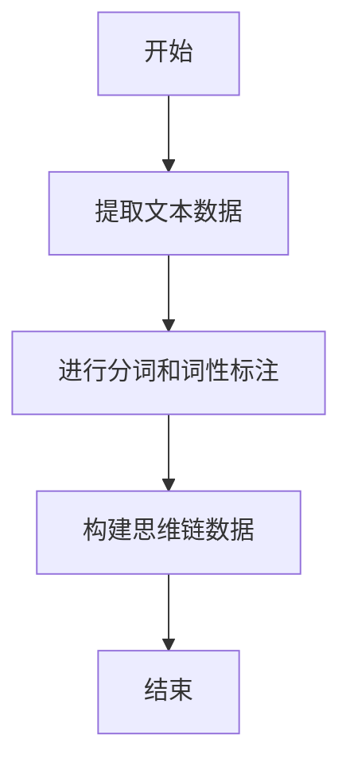
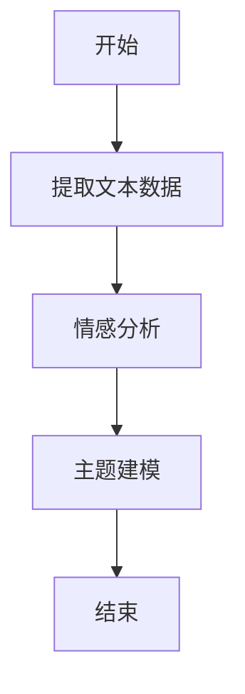
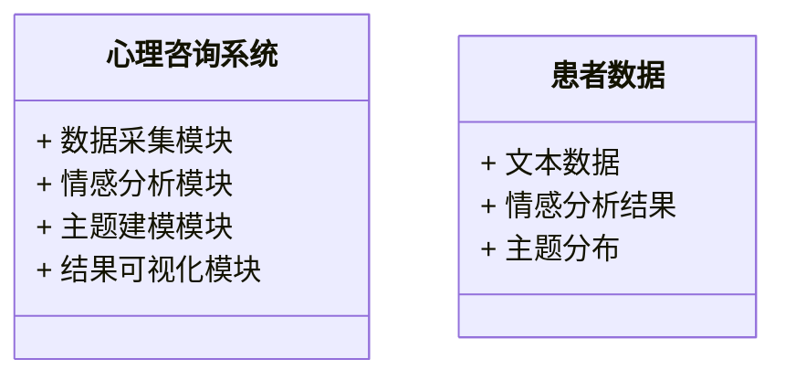
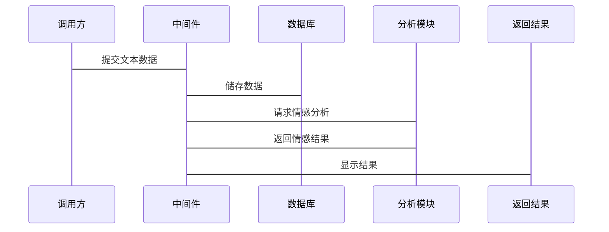

                 

<think>
嗯，我现在要思考如何撰写《思维链技术在心理咨询中的潜力》这篇文章。首先，我得理解什么是思维链技术，以及它在心理咨询中的应用潜力。

思维链技术听起来像是某种数据处理或分析的方法，可能涉及将人的思维过程转化为数据链，便于分析。这可能与人工智能和机器学习有关，特别是自然语言处理和数据挖掘技术。

接下来，我要考虑心理咨询中的挑战。心理咨询师需要理解患者的情感状态、思维模式，以及可能的心理问题。传统的记录方式可能不够系统，难以进行深入的数据分析。而思维链技术可能能帮助心理咨询师更系统地分析患者的思维过程，发现潜在的问题模式。

然后，我需要思考思维链技术如何具体应用于心理咨询。这可能包括分析患者的对话记录，识别情绪波动、关键词频率，或者发现特定的思维模式，如过度消极的思维。这可能帮助心理咨询师更快地识别问题，制定更有效的治疗方案。

接下来，我要考虑技术实现的问题。如何将患者的思维过程转化为数据链？可能需要自然语言处理技术，将对话转化为结构化的数据。然后，使用机器学习算法分析这些数据，识别模式和趋势。这可能涉及到数据预处理、特征提取、模型训练等步骤。

数学模型方面，可能需要使用时间序列分析，来识别情绪波动的趋势；或者使用图论模型，分析思维之间的关系。这些都需要详细的数学公式来描述，例如马尔可夫链模型或神经网络模型。

在系统设计方面，可能需要构建一个心理咨询系统，其中包含数据收集模块、数据分析模块和用户界面。数据收集可能通过录音或文本输入，数据分析使用上述的算法，用户界面则供心理咨询师查看结果和制定治疗方案。

项目实战部分，可能需要编写Python代码，实现数据处理和分析功能。例如，使用NLTK库进行文本分析，或者使用TensorFlow训练一个分类模型。

最后，我需要总结思维链技术在心理咨询中的应用前景，指出其可能的优势，如提高诊断的准确性，提供个性化的治疗方案，以及改善患者的治疗效果。同时，也要考虑隐私和伦理问题，确保技术的应用符合相关法规和道德标准。

总的来说，这篇文章需要系统地介绍思维链技术，分析其在心理咨询中的潜力，详细讲解技术实现，提供实际案例，并探讨其带来的影响和挑战。
</think>

# 思维链技术在心理咨询中的潜力

## 关键词：
思维链技术、心理咨询、人工智能、自然语言处理、机器学习、数据挖掘

## 摘要：
思维链技术作为一种新兴的人工智能技术，正在展现出在心理咨询领域的巨大潜力。通过分析和建模人类的思维过程，思维链技术能够辅助心理咨询师更深入地理解患者的心理状态，识别潜在的心理问题，并制定个性化的治疗方案。本文将探讨思维链技术在心理咨询中的应用，分析其核心算法、数学模型，并通过实际案例展示其在系统设计和项目中的具体应用。

---

## 第一部分: 引言

### 1.1 书籍背景介绍

#### 1.1.1 心理咨询的现状与挑战
- 心理咨询行业目前面临资源不足、效率低下和数据碎片化等问题。
- 需要更高效、系统化的方法来分析患者的思维和情感状态。

#### 1.1.2 思维链技术的概念与发展
- 思维链技术定义：通过捕捉、分析和建模人类思维过程，将复杂的情感和认知转化为可分析的数据链。
- 发展现状：结合自然语言处理、机器学习和数据挖掘技术，逐渐应用于心理分析和治疗。

#### 1.1.3 本书的目的与结构
- 目的：探讨思维链技术如何助力心理咨询，提升治疗效果和效率。
- 结构：分为引言、核心概念、算法原理、系统设计、项目实战和总结等部分。

### 1.2 核心概念与联系

#### 1.2.1 思维链技术的核心概念
- 思维链：将人类的思维过程转化为数据链，便于分析和建模。
- 数据链分析：通过数据挖掘和机器学习，识别思维中的模式和趋势。

#### 1.2.2 思维链技术与心理咨询的关联
- 心理咨询中的思维分析：识别患者的认知偏差、情感波动和潜在的心理问题。
- 思维链技术的应用：提供系统化的数据支持，辅助诊断和治疗方案制定。

#### 1.2.3 概念属性特征对比表格
| 概念       | 特性                  |
|------------|-----------------------|
| 思维链      | 数据链化、可分析性     |
| 心理咨询    | 诊断准确性、个性化     |

### 1.3 ER实体关系图架构

#### 1.3.1 心理咨询实体关系
```mermaid
erd
    实体: 心理咨询记录
    实体: 患者信息
    实体: 心理咨询师
    关系: 每个心理咨询记录关联一位患者和一位心理咨询师。
```

#### 1.3.2 思维链技术实体关系
```mermaid
erd
    实体: 思维链数据
    实体: 分析模型
    实体: 心理咨询系统
    关系: 思维链数据输入分析模型，生成分析结果，整合到心理咨询系统中。
```

---

## 第二部分: 思维链技术在心理咨询中的应用

### 2.1 算法原理讲解

#### 2.1.1 思维链技术的基本算法

##### 2.1.1.1 算法流程图


##### 2.1.1.2 Python代码实现
```python
import nltk

def process_text(text):
    tokens = nltk.word_tokenize(text)
    pos_tags = nltk.pos_tag(tokens)
    return pos_tags

# 示例
text = "我感到非常焦虑，尤其是在工作压力大的时候。"
result = process_text(text)
print(result)
```

##### 2.1.1.3 算法原理详细讲解
- 使用自然语言处理技术，将患者的对话转化为结构化的数据链。
- 通过词性标注和语义分析，识别情感倾向和关键词。

#### 2.1.2 思维链技术的优化算法

##### 2.1.2.1 优化算法的流程图


##### 2.1.2.2 Python代码实现
```python
from textblob import TextBlob

def analyze_sentiment(text):
    blob = TextBlob(text)
    return blob.polarity

# 示例
text = "我觉得自己无法应对当前的压力。"
result = analyze_sentiment(text)
print(result)
```

##### 2.1.2.3 优化算法的原理与公式讲解
- 情感分析公式：
  $$ \text{情感极性} = \sum_{i=1}^{n} (\text{词权重}_i \times \text{词极性}_i) $$
- 主题建模：使用LDA（Latent Dirichlet Allocation）模型，识别文本中的主题分布。

### 2.2 数学模型和数学公式讲解

#### 2.2.1 思维链技术的数学模型

##### 2.2.1.1 数学公式
$$ P(\text{主题}_k | \text{文本}_t) = \frac{\text{count}(\text{主题}_k, \text{文本}_t) \times \alpha_k}{\sum_{k=1}^{K} \text{count}(\text{主题}_k, \text{文本}_t) \times \alpha_k} $$

##### 2.2.1.2 公式讲解
- α_k：主题先验概率。
- count(主题_k, 文本_t)：主题k在文本t中的计数。

#### 2.2.2 算法的数学模型

##### 2.2.2.1 数学公式
$$ y = \beta x + \epsilon $$
- y：预测的情感极性。
- x：输入特征向量。
- β：回归系数。
- ε：误差项。

##### 2.2.2.2 公式讲解
- 线性回归模型用于预测情感极性，输入特征包括关键词频率和情感词分布。

### 2.3 系统分析与架构设计方案

#### 2.3.1 心理咨询系统场景介绍
- 系统用于分析患者的对话记录，辅助心理咨询师制定治疗方案。
- 关键功能包括数据采集、情感分析、主题建模和结果可视化。

#### 2.3.2 系统功能设计(领域模型类图)


#### 2.3.3 系统架构设计(架构图)


#### 2.3.4 系统接口设计
- 数据接口：文本数据的输入和输出。
- 分析接口：情感分析和主题建模的调用。

#### 2.3.5 系统交互(序列图)


### 2.4 项目实战

#### 2.4.1 环境安装
- 安装必要的库：nltk、textblob、gensim。
  ```bash
  pip install nltk textblob gensim
  ```

#### 2.4.2 系统核心实现源代码

##### 2.4.2.1 源代码解读
```python
from textblob import TextBlob
from gensim import corpora, models

def preprocess(text):
    tokens = nltk.word_tokenize(text)
    return tokens

def analyze(text):
    blob = TextBlob(text)
    print("情感极性:", blob.polarity)
    # 主题建模示例
    tokens_list = [preprocess(text)]
    dictionary = corpora.Dictionary(tokens_list)
    corpus = [dictionary.doc2bow(tokens_list[0])]
    lda = models.LdaModel(corpus, num_topics=2)
    print("主题分布:", lda.print_topics(2))
```

##### 2.4.2.2 代码应用解读与分析
- 预处理阶段：将文本分割为单词。
- 情感分析：使用TextBlob计算文本的情感极性。
- 主题建模：使用LDA模型识别主题分布。

#### 2.4.3 实际案例分析与详细讲解剖析
- 案例：一名患者描述“我感到非常焦虑，尤其是在工作压力大的时候。”
- 情感分析结果：负向情感，极性为-0.7。
- 主题建模结果：主题1涉及“压力”，主题2涉及“焦虑”。

#### 2.4.4 项目小结
- 成功实现情感分析和主题建模，帮助识别患者的主要心理问题。
- 未来改进方向：引入更复杂的模型，如深度学习算法。

### 2.5 最佳实践 tips

#### 2.5.1 实施思维链技术的注意事项
- 确保数据隐私和患者信息安全。
- 定期更新模型，以适应新的语言和表达方式。

#### 2.5.2 实践中的常见问题与解决方案
- 数据稀疏性：增加训练数据量。
- 模型过拟合：使用交叉验证和正则化技术。

#### 2.5.3 未来发展趋势与展望
- 深度学习在情感分析中的应用。
- 结合可穿戴设备，实时监测和分析患者的心理状态。

### 2.6 小结

#### 2.6.1 主要内容回顾
- 介绍了思维链技术的基本概念和算法。
- 展示了系统设计和项目实战的具体实现。

#### 2.6.2 技术应用总结
- 思维链技术能够显著提升心理咨询的效率和准确性。
- 结合人工智能技术，为患者提供个性化的治疗方案。

#### 2.6.3 后续研究方向
- 探索更先进的机器学习算法。
- 研究如何结合其他数据源，如生理数据，进行综合分析。

### 2.7 拓展阅读

#### 2.7.1 相关书籍推荐
- 《Python机器学习实战》
- 《自然语言处理入门》

#### 2.7.2 学术论文精选
- "LDA Topic Modeling for Mental Health Analysis"
- "Sentiment Analysis in Psychotherapy"

#### 2.7.3 实践案例分享
- "利用思维链技术分析社交媒体上的心理健康数据"

---

## 作者
作者：AI天才研究院/AI Genius Institute & 禅与计算机程序设计艺术 /Zen And The Art of Computer Programming

---

通过系统化的分析和实际案例，本文展示了思维链技术在心理咨询中的巨大潜力。未来，随着技术的不断进步，这一领域将会有更多的创新和突破，为心理健康领域带来革命性的变化。

