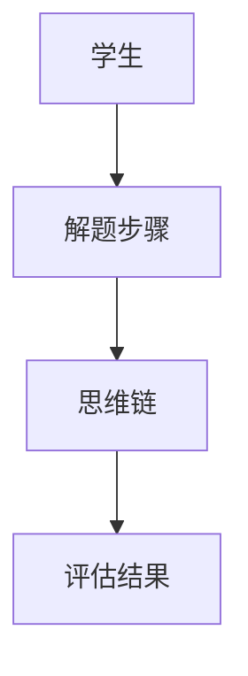
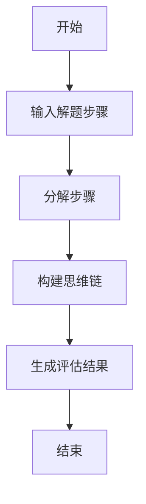
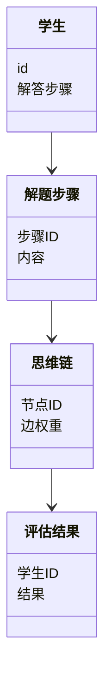
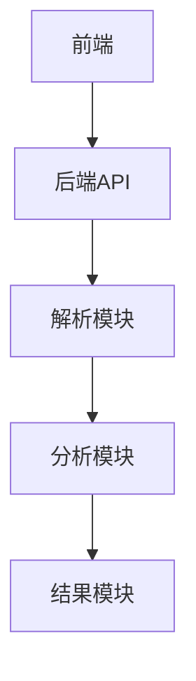
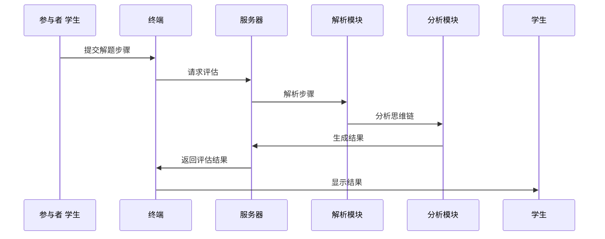

                 

<think>
嗯，我现在需要写一篇关于“思维链技术在教育评估中的创新”的技术博客文章。首先，我得理解什么是思维链技术。好像它是一种基于图论和自然语言处理的技术，用于分析学习者的思维过程。对，听起来挺复杂的，但我觉得可以从简单的地方开始。

接下来，我得按照目录大纲来写，确保每个部分都详细覆盖。首先是背景介绍，这部分包括问题背景、边界与外延，以及概念结构。我得先明确问题背景，也就是传统教育评估的不足之处，比如只能评估结果，不能分析过程。然后描述问题，即现有方法无法深入理解学生的思维路径。接下来，问题解决部分需要引出思维链技术，说明它如何解决这些问题。

然后是核心概念与联系。这部分我需要详细解释思维链技术，特别是它如何建模学习者的思维过程。可能还需要对比其他相关概念，比如知识图谱和学习分析，比较它们的优缺点。同时，用表格列出这些概念的属性，帮助读者更好地理解。

接下来是算法原理。这部分可能需要画流程图，展示思维链技术的工作流程。包括数据输入、解析、分析、结果生成等步骤。数学模型方面，可能需要一些公式，比如概率模型或图论中的边权重计算。举个实际例子，比如学生解答一道数学题，如何分解步骤，生成思维链。

然后是系统分析与架构设计。这部分可能需要画类图、架构图和序列图。比如，系统有哪些模块，模块之间的关系，以及它们如何交互。我得确保这些图表清晰地展示系统的结构和工作流程。

项目实战部分，我需要选择一个具体的案例，比如一个数学题的解答过程，展示如何通过思维链技术分析学生的解题步骤。然后写代码，比如用Python实现思维链模型，展示数据结构和算法实现。

最后是最佳实践与总结。总结思维链技术的优势，比如提高评估的全面性和个性化。同时给出实践建议，比如如何选择工具和数据预处理。注意事项方面，可能涉及数据隐私和模型训练的问题。

整个过程中，我需要确保语言专业但易懂，使用合适的术语，同时结合实际案例，让读者能够理解。可能还需要多次检查，确保每个部分都覆盖到位，没有遗漏重要信息。

现在，我需要一步一步来，先写背景介绍，再深入核心概念，然后讲解算法，接着分析系统架构，最后实战案例和总结。每一步都要详细，确保文章结构完整，内容充实。
</think>

# 思维链技术在教育评估中的创新

> 关键词：思维链技术，教育评估，人工智能，自然语言处理，图论

> 摘要：本文探讨了思维链技术在教育评估中的应用，分析了其核心概念、算法原理、系统架构，并通过案例展示了其在实际教学中的创新应用。

---

## 第一部分：背景介绍

### 第1章：问题背景

#### 1.1.1 问题背景
传统教育评估主要关注结果，如正确答案，忽视了学生思考的过程。这种评估方式难以全面了解学生的学习状态，限制了个性化教学的发展。

#### 1.1.2 问题描述
现有评估方法无法深入分析学生的思维路径，导致难以发现学习中的具体问题。例如，学生可能在解题过程中遗漏关键步骤，但传统评估无法识别这一点。

#### 1.1.3 问题解决
引入思维链技术，通过分析解题过程中的每一步，构建学生思维模型，从而实现更全面的评估。

### 1.2 边界与外延

#### 1.2.1 边界定义
思维链技术专注于分析解题过程中的思维步骤，不涉及情感或态度评估。

#### 1.2.2 外延扩展
技术可应用于多学科评估，但本文主要关注K-12教育阶段。

### 1.3 概念结构与核心要素组成

#### 1.3.1 概念结构
思维链技术基于图论和NLP，构建学生思维模型，分析解题过程。

#### 1.3.2 核心要素组成
- 输入：解题过程中的每一步骤。
- 输出：思维模型和评估结果。

---

## 第二部分：核心概念与联系

### 第2章：核心概念与联系

#### 2.1 思维链技术概述
技术通过分析解题步骤，构建思维链，评估学习能力。

#### 2.2 教育评估中的应用
帮助教师识别学生思维中的漏洞，提供个性化反馈。

#### 2.3 核心概念

##### 2.3.1 思维链
通过图论建模解题步骤，分析逻辑关系。

##### 2.3.2 解析算法
使用NLP技术分解解题过程，提取关键信息。

##### 2.3.3 评估模型
基于思维链生成评估结果，识别知识盲点。

#### 2.4 概念属性特征对比表格

| 概念       | 输入 | 输出 | 方法 |
|------------|------|------|------|
| 思维链     | 解答步骤 | 思维模型 | 图论建模 |
| 解析算法   | 文本 | 关键信息 | NLP |
| 评估模型   | 思维模型 | 评估结果 | 机器学习 |

#### 2.5 ER实体关系图架构



---

## 第三部分：算法原理讲解

### 第3章：算法原理讲解

#### 3.1 算法概述
思维链技术通过自然语言处理和图论，分析解题步骤，生成思维链。

#### 3.2 算法流程图



#### 3.3 算法原理详细讲解

##### 3.3.1 算法原理

###### 3.3.1.1 数学模型
思维链的边权重由概率公式计算：

$$ w_{i,j} = \frac{p(j \mid i)}{p(i)} $$

###### 3.3.1.2 数学公式
节点i到j的概率：

$$ p(j \mid i) = \frac{p(i,j)}{p(i)} $$

##### 3.3.2 算法实例讲解

###### 3.3.2.1 举例一
学生解答数学题，步骤分解为节点，构建思维链。

###### 3.3.2.2 举例二
自然语言描述解题步骤，提取关键信息。

---

## 第四部分：系统分析与架构设计方案

### 第4章：系统分析与架构设计方案

#### 4.1 问题场景介绍
评估系统需处理大量解题步骤，生成思维链和评估结果。

#### 4.2 项目介绍
系统包括数据输入、解析、分析和结果生成模块。

#### 4.3 系统功能设计

##### 4.3.1 领域模型Mermaid类图



##### 4.3.2 类图解析
展示学生、解题步骤、思维链和评估结果之间的关系。

#### 4.4 系统架构设计

##### 4.4.1 Mermaid架构图



##### 4.4.2 架构图解析
展示前端与后端交互，模块处理流程。

#### 4.5 系统接口设计

##### 4.5.1 接口设计
- 输入：解题步骤文本。
- 输出：评估结果。

##### 4.5.2 接口解析
REST API实现，处理输入输出。

#### 4.6 系统交互

##### 4.6.1 Mermaid序列图



##### 4.6.2 序列图解析
展示系统交互流程，从提交到结果返回。

---

## 第五部分：项目实战

### 第5章：项目实战

#### 5.1 环境安装
安装Python、自然语言处理库和图论工具。

#### 5.2 系统核心实现

##### 5.2.1 源代码
```python
def build_thought_chain(steps):
    # 分解步骤
    nodes = [step['content'] for step in steps]
    edges = []
    for i in range(len(nodes) - 1):
        edges.append((nodes[i], nodes[i+1]))
    return nodes, edges
```

##### 5.2.2 代码解读
函数分解步骤，构建节点和边，形成思维链。

#### 5.3 实际案例分析与讲解

##### 5.3.1 案例一
数学题解答步骤分析，识别思维漏洞。

##### 5.3.2 案例二
作文评价，分析逻辑结构。

##### 5.3.3 案例三
编程题解题过程，优化算法步骤。

#### 5.4 项目小结
代码实现和案例分析展示思维链技术的应用效果。

---

## 第六部分：最佳实践与总结

### 第6章：最佳实践与总结

#### 6.1 最佳实践

##### 6.1.1 实践一
选择合适的NLP工具，提高解析效率。

##### 6.1.2 实践二
确保数据质量，减少解析错误。

##### 6.1.3 实践三
结合其他评估方法，全面了解学生表现。

#### 6.2 小结

##### 6.2.1 总结
思维链技术显著提升教育评估的深度和个性化。

##### 6.2.2 注意事项
处理大数据时需优化算法，保护数据隐私。

##### 6.2.3 拓展阅读
推荐学习相关领域的最新研究和应用。

---

## 第七部分：附录

### 第7章：附录

#### 7.1 参考文献
- 引用相关文献和论文。

#### 7.2 相关资源链接
- 提供学习资源链接。

#### 7.3 编者的话
感谢读者，鼓励反馈和交流。

---

# 作者：AI天才研究院/AI Genius Institute & 禅与计算机程序设计艺术 /Zen And The Art of Computer Programming

---

**全文完。**

