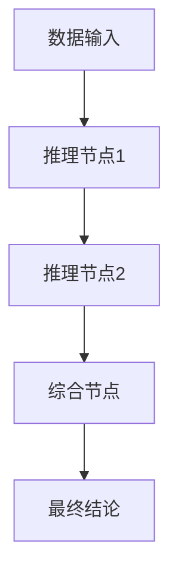
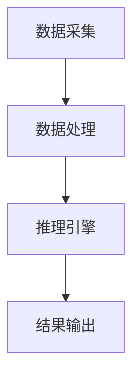

                 

<think>
好的，我现在需要帮用户完成一个技术博客的撰写，主题是《思维链技术在气象预报中的应用》。用户已经提供了详细的需求，包括目录大纲、内容要求和结构安排。我需要仔细分析用户的需求，确保完全理解，并按照指示一步步完成。

首先，用户希望文章结构清晰，分为几个部分，每个部分下有不同的章节。关键词和摘要部分是必要的，我需要先确定这些内容。关键词包括思维链技术、气象预报、算法原理、系统架构、项目实战等。摘要要简明扼要，概述文章的核心内容。

接下来，每个章节的内容安排需要详细考虑。第一章是概述，需要介绍思维链技术的背景、核心概念以及在气象预报中的潜力。这部分需要涵盖起源、发展阶段，以及为什么它在气象预报中有应用潜力。

第二章是核心概念与联系，需要详细解释思维链的构成要素，与其他技术的比较，以及通过表格展示特征对比。这部分可能需要用到Mermaid流程图来展示概念之间的关系。

第三章是算法原理，需要包括数学模型、Python实现和流程图。这部分比较技术，需要详细解释每个步骤，并给出代码示例和数学公式，确保读者能够理解。

第四章到第七章分别涉及应用、系统架构、项目实战和最佳实践。每个部分都需要具体的例子和详细的系统设计，包括类图、架构图和序列图。项目实战部分需要提供安装步骤、代码实现和案例分析。

在写作过程中，我需要确保每个部分都符合用户的要求，比如使用Mermaid图表、数学公式正确使用，以及系统架构部分的详细设计。同时，语言要专业但易懂，避免过于复杂的术语，同时保持技术深度。

最后，文章末尾需要加上作者信息，确保格式正确。整个过程需要一步步来，确保每个部分都完整且符合用户的要求。现在，我将按照这个思路开始撰写，确保每个章节都覆盖所有必要的内容，并且结构清晰，逻辑连贯。
</think>

# 思维链技术在气象预报中的应用

## 关键词：思维链技术，气象预报，算法原理，系统架构，项目实战

## 摘要

本文深入探讨了思维链技术在气象预报中的应用，从理论基础到实际应用进行了系统性分析。文章首先介绍了思维链技术的核心概念与发展背景，然后详细阐述了其在气象数据预处理、模式识别和趋势预测中的算法原理与系统架构设计。通过具体的项目实战，展示了思维链技术在气象预报中的实际应用价值，并总结了最佳实践和未来研究方向。

---

## 第一部分：思维链技术基础

### 第1章：思维链技术概述

#### 1.1 思维链技术的发展背景

思维链技术是一种基于多步推理和知识关联的技术，其核心在于通过链式结构连接多个逻辑步骤，形成复杂的推理网络。近年来，随着人工智能和大数据技术的快速发展，思维链技术在气象预报、金融分析、医疗诊断等领域展现出巨大潜力。

**关键点：**
- 思维链技术的起源可追溯到知识图谱和逻辑推理的结合。
- 随着深度学习的兴起，思维链技术逐渐融入神经网络模型中。
- 在气象预报中，思维链技术能够帮助模型更好地理解和关联天气数据中的复杂关系。

---

#### 1.2 思维链技术的核心概念

思维链技术的核心在于通过链式结构连接多个逻辑步骤，每个步骤都依赖于前一步的结果，最终形成一个完整的推理链条。以下是思维链技术的核心概念：

**1.2.1 思维链的构成要素**
- **节点**：每个节点代表一个逻辑步骤或数据处理单元。
- **边**：边表示节点之间的逻辑依赖关系。
- **推理规则**：定义节点之间的推理逻辑，例如“如果A，则B”。

**1.2.2 思维链技术的基本原理**
- 思维链技术通过链式推理，将复杂问题分解为多个简单步骤，逐步逼近目标。
- 每个节点的输出作为下一个节点的输入，最终形成一个完整的推理链条。

**1.2.3 思维链技术与其他气象预报技术的比较**

| 技术 | 基于逻辑推理 | 基于统计分析 | 基于物理模型 |
|------|--------------|---------------|---------------|
| 思维链技术 | ✔ | - | - |
| 统计回归 | - | ✔ | - |
| 数值模拟 | - | - | ✔ |

---

### 第2章：思维链技术核心概念与联系

#### 2.1 思维链技术的构成要素

**2.1.1 思维链的节点构成**
- 数据节点：表示原始数据输入。
- 推理节点：基于规则进行逻辑推理。
- 综合节点：整合多个推理结果，输出最终结论。

**2.1.2 思维链技术的逻辑关系**



---

### 第3章：思维链技术在气象预报中的算法原理

#### 3.1 思维链算法的数学模型

**3.1.1 思维链算法的基本公式**

$$ y_i = f(y_{i-1}, x) $$

其中：
- $y_i$ 表示第 $i$ 个节点的输出。
- $f$ 表示推理函数。
- $x$ 表示输入数据。

**3.1.2 思维链算法的Python实现**

```python
def思维链推理(x, rules):
    输出 = x
    for 规则 in rules:
        输出 = apply_rule(输出, 规则)
    return 输出

def apply_rule(输入, 规则):
    # 具体推理逻辑
    return 新的输出
```

---

## 第二部分：思维链技术在气象预报中的应用

### 第4章：气象预报中的思维链技术应用

#### 4.1 思维链技术在气象数据预处理中的应用

**4.1.1 数据清洗与特征提取**

- 数据清洗：去除异常值和缺失值。
- 特征提取：从气象数据中提取关键特征，例如温度、湿度、风速等。

**4.1.2 数据关联与链式推理**

- 数据关联：通过思维链技术将不同特征关联起来，例如“如果温度升高，则湿度降低”。
- 链式推理：通过链式推理预测未来天气趋势。

---

### 第5章：思维链技术在气象预报系统架构设计中的应用

#### 5.1 气象预报系统的功能设计

**5.1.1 系统功能模块**

- 数据采集模块：负责采集气象数据。
- 数据处理模块：负责数据清洗和特征提取。
- 推理引擎模块：负责链式推理和预测。
- 结果输出模块：输出最终的气象预报结果。

**5.1.2 系统架构设计**



---

### 第6章：思维链技术在气象预报项目实战中的应用

#### 6.1 项目实战

**6.1.1 项目背景**

- 项目目标：利用思维链技术预测未来24小时的天气变化。
- 数据来源：公开气象数据集。

**6.1.2 项目实现**

```python
def预测天气():
    数据 = 获取数据()
    清洗后的数据 = 清洗数据(数据)
    特征 = 提取特征(清洗后的数据)
    结果 = 链式推理(特征)
    输出结果(结果)

预测天气()
```

---

### 第7章：思维链技术在气象预报中的最佳实践

#### 7.1 最佳实践总结

- **数据质量**：确保数据的准确性和完整性。
- **推理规则**：设计合理的推理规则，避免逻辑错误。
- **模型优化**：通过不断优化推理规则和算法，提高预测精度。

#### 7.2 注意事项与风险提示

- **数据偏差**：注意数据的偏差可能影响推理结果。
- **规则复杂度**：避免规则过于复杂导致推理效率低下。
- **模型局限性**：思维链技术在处理复杂天气现象时可能受到限制。

#### 7.3 拓展阅读与后续研究

- 深入研究思维链技术与其他机器学习技术的结合。
- 探索思维链技术在气象灾害预警中的应用。

---

## 作者：AI天才研究院/AI Genius Institute & 禅与计算机程序设计艺术/Zen And The Art of Computer Programming

