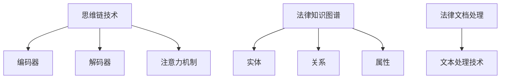
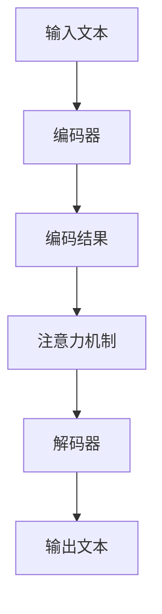
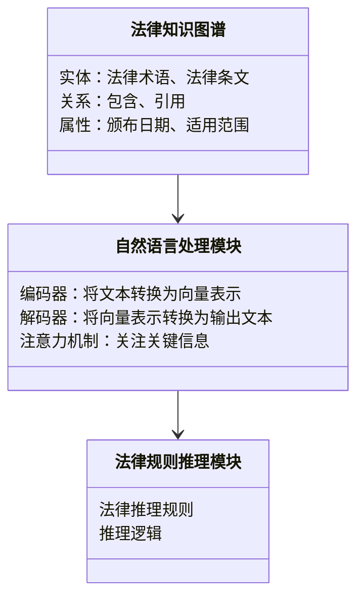
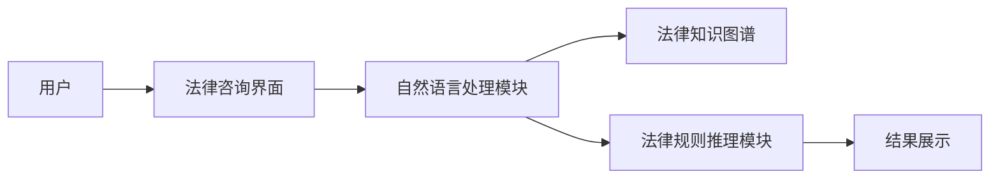
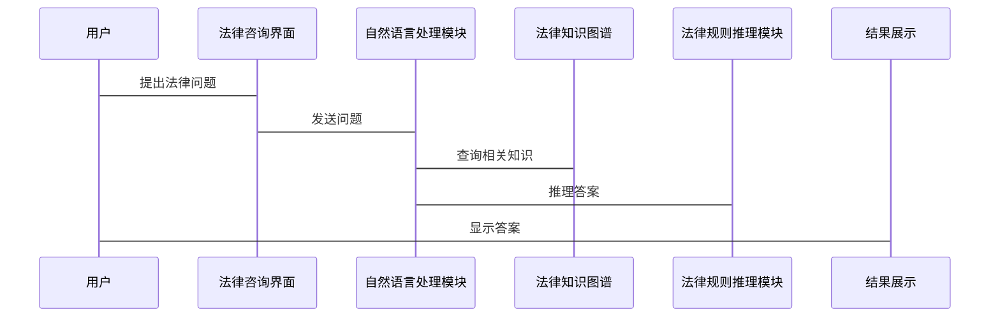

                 

<think>
好的，我现在要帮用户撰写一篇关于“思维链技术在法律AI中的突破性应用”的技术博客文章。用户希望文章结构清晰，内容专业，语言逻辑严谨。首先，我需要理解用户的需求，确定文章的各个部分。

用户已经提供了一个详细的大纲，包括背景介绍、核心概念与联系、算法原理讲解、系统分析与架构设计方案、项目实战、最佳实践等部分。我需要按照这个大纲一步步展开，确保每个部分都详细且有深度。

首先，背景介绍部分需要说明法律AI的发展现状、问题和应用价值。我需要强调传统法律AI的局限性，比如处理复杂法律问题时的不准确性，以及思维链技术如何解决这些问题。

接下来是核心概念与联系部分，这里要详细讲解思维链技术和法律知识图谱的基本概念、原理及其在法律AI中的应用。可能需要使用表格和图表来对比不同概念的特征，以及展示它们之间的关系。

算法原理讲解部分，我需要用Mermaid绘制流程图，展示思维链技术的工作流程，包括编码器、解码器和注意力机制。同时，给出数学公式，如编码器和解码器的模型，以及注意力机制的计算公式，帮助读者理解技术细节。

系统分析与架构设计方案部分，需要描述法律AI的应用场景，设计系统功能，比如法律咨询、文档分析等。然后用Mermaid画出领域模型类图和系统架构图，展示系统的模块构成和交互流程。系统接口和交互设计部分可能需要序列图来展示用户与系统的互动。

项目实战部分，需要选择一个具体的案例，比如智能合同审查系统。详细描述环境配置、核心代码实现，以及系统的功能展示。代码部分可能包括法律知识图谱的构建和自然语言处理的实现，展示如何应用思维链技术解决实际问题。

最后，最佳实践部分要总结经验，给出项目小结、注意事项和未来展望。比如，数据质量对模型准确性的影响，法律知识图谱的动态更新需求，以及未来的研究方向。

在撰写过程中，我需要确保语言简洁专业，同时避免过于晦涩，让读者能够轻松理解。每个部分的小标题要吸引人，内容要详细且有条理。此外，还要注意使用适当的术语和引用，增强文章的权威性。

现在，我开始按照大纲逐步撰写每个部分，确保内容连贯，逻辑清晰，同时覆盖用户要求的所有要点。通过这种方式，用户能够得到一篇高质量的技术博客文章，展示思维链技术在法律AI中的应用和突破。
</think>

# 思维链技术在法律AI中的突破性应用

> 关键词：思维链技术、法律AI、自然语言处理、法律知识图谱、注意力机制

> 摘要：随着人工智能技术的快速发展，法律AI逐渐成为提升法律工作效率和准确性的有力工具。然而，传统法律AI在处理复杂法律问题时仍存在诸多局限性。思维链技术作为一种基于深度学习的自然语言处理技术，能够模拟人类的思维过程，为法律AI带来了新的突破。本文将从背景介绍、核心概念与联系、算法原理讲解、系统分析与架构设计方案、项目实战等方面，详细探讨思维链技术在法律AI中的应用，揭示其在法律知识图谱构建、法律文档处理、法律咨询等领域的潜力与价值。

---

## 第一部分：背景介绍

### 核心概念

#### 问题背景

随着全球法律事务的复杂化，法律行业对高效、智能的解决方案需求日益增长。传统法律工作中，律师和法律专家需要手动处理大量法律文档、分析法律条款、撰写法律意见书等任务。这些任务不仅耗时耗力，且容易因人为疏忽而产生错误。因此，如何利用人工智能技术提升法律工作的效率和准确性，成为当前法律科技领域的重要研究方向。

#### 问题描述

传统法律AI技术主要依赖关键词匹配和规则引擎，难以处理法律文档中的复杂语义关系和模糊性。例如，在处理合同审查时，传统AI可能无法准确识别隐含的法律风险或条款间的关联性。此外，法律领域具有高度的专业性和复杂性，传统AI模型难以理解法律术语的上下文关系和法律条文的逻辑结构。

#### 问题解决

思维链技术作为一种基于深度学习的自然语言处理技术，能够模拟人类的思维过程，对法律文档进行深度理解和分析。通过构建法律知识图谱，法律AI可以准确理解法律概念之间的关系，并基于注意力机制关注关键信息，从而提高法律AI的准确性和智能化水平。

#### 边界与外延

思维链技术在法律AI中的应用，不仅限于法律咨询、法律文档分析等单一领域，还可以扩展至法律教育、法律研究、法律合规等领域。其核心目标是通过技术手段提升法律工作的效率和质量，同时降低法律服务的成本。

#### 概念结构与核心要素组成

1. **思维链技术**：基于深度学习的自然语言处理技术，能够模拟人类的思维过程。
2. **法律知识图谱**：用于表示法律概念和关系的图形化结构。
3. **法律文档处理**：用于处理法律文档中的文本，提取法律信息。

---

## 第二部分：核心概念与联系

### 核心概念原理

#### 思维链技术

思维链技术是一种基于深度学习的自然语言处理技术，通过编码器-解码器架构模拟人类的思维过程。其核心原理包括以下三个部分：

1. **编码器**：将输入文本编码为向量表示，捕捉文本的语义信息。
2. **解码器**：将编码后的向量表示解码为输出文本，生成符合逻辑的法律文本。
3. **注意力机制**：用于关注输入文本中的关键信息，提高模型的准确性和效率。

#### 法律知识图谱

法律知识图谱是一种用于表示法律概念和关系的图形化结构，由实体、关系和属性三部分组成。例如：

- **实体**：法律术语（如“合同”）、法律条文（如《合同法》）。
- **关系**：实体之间的关联（如“包含”、“引用”）。
- **属性**：实体的特征（如“颁布日期”、“适用范围”）。

#### 法律文档处理

法律文档处理是通过自然语言处理技术对法律文档进行分析、理解和提取信息的过程。其主要任务包括：

1. **文本分割**：将法律文档分割为独立的法律条文或段落。
2. **信息抽取**：从法律文档中提取关键信息（如条款内容、责任范围）。
3. **语义分析**：理解法律文本的语义关系，识别潜在的法律风险。

### 概念属性特征对比表格

| 概念     | 特征             | 描述                                                         |
| -------- | ---------------- | ------------------------------------------------------------ |
| 思维链技术 | 基于深度学习     | 通过模拟人类的思维过程，实现对自然语言文本的深度理解         |
| 法律知识图谱 | 图形化结构     | 用于表示法律概念和关系，帮助法律AI理解法律文档，提取法律信息 |
| 法律文档处理 | 文本处理技术 | 用于处理法律文档中的文本，提取法律信息                       |

### ER实体关系图架构



---

## 第三部分：算法原理讲解

### 算法原理

思维链技术在法律AI中的应用，主要涉及以下算法原理：

1. **编码器-解码器模型**：用于将输入文本编码为向量表示，并将向量表示解码为输出文本。
2. **注意力机制**：用于关注输入文本中的关键信息，提高模型的准确性和效率。
3. **法律知识图谱构建**：用于表示法律概念和关系，帮助法律AI理解法律文档。

### 算法流程图



### 数学模型和公式

1. **编码器**

$$
E = \text{编码器}(X)
$$

其中，$E$ 表示编码结果，$X$ 表示输入文本。

2. **解码器**

$$
Y = \text{解码器}(E)
$$

其中，$Y$ 表示输出文本。

3. **注意力机制**

$$
\alpha_i = \frac{\exp(e_i)}{\sum_{j} \exp(e_j)}
$$

其中，$\alpha_i$ 表示第$i$个词的注意力权重，$e_i$ 表示第$i$个词的编码向量。

---

## 第四部分：系统分析与架构设计方案

### 问题场景介绍

法律AI的应用场景包括法律咨询、法律文档分析、法律合规、法律教育等。以法律咨询为例，用户可以通过输入法律问题，获得基于法律知识图谱的智能回答。

### 项目介绍

本项目旨在开发一款基于思维链技术的法律AI系统，能够实现法律文档分析、法律咨询、法律知识检索等功能。系统的核心模块包括法律知识图谱构建、自然语言处理、法律规则推理等。

### 系统功能设计

#### 领域模型类图



### 系统架构设计

#### 系统架构图



### 系统接口设计

系统接口主要分为以下几种：

1. **法律文档分析接口**：接收法律文档输入，返回分析结果。
2. **法律咨询接口**：接收用户提问，返回法律解答。
3. **法律知识检索接口**：接收关键词，返回相关法律知识。

### 系统交互设计

#### 交互流程图



---

## 第五部分：项目实战

### 环境安装

为了实现基于思维链技术的法律AI系统，需要安装以下工具和库：

1. Python 3.8+
2. TensorFlow 2.0+
3. PyTorch 1.0+
4.spaCy
5.NetworkX

### 系统核心实现源代码

以下是一个简单的法律知识图谱构建示例：

```python
import networkx as nx

# 创建法律知识图谱
G = nx.Graph()

# 添加实体
G.add_nodes_from(["合同", "条款", "法律条文"])

# 添加关系
G.add_edges_from([("合同", "条款"), ("条款", "法律条文")])

# 添加属性
G.nodes["合同"].set_attr("类型", "民事合同")
G.nodes["条款"].set_attr("颁布日期", "2023-01-01")

# 可视化图谱
nx.draw(G, node_size=1500, alpha=0.8)
plt.show()
```

### 代码应用解读与分析

上述代码展示了如何使用NetworkX构建法律知识图谱。首先，我们创建一个图，并添加实体和关系。然后，为实体添加属性信息。最后，通过可视化工具展示图谱结构。这种图谱构建方法可以用于法律AI中的法律知识表示和推理。

### 实际案例分析和详细讲解剖析

以智能合同审查系统为例，假设用户上传了一份合同文档，系统需要自动识别合同中的关键条款（如违约责任、履行期限等），并生成审查报告。通过思维链技术，系统可以对合同文本进行深度理解，并基于法律知识图谱进行条款分类和风险评估。

---

## 第六部分：最佳实践、小结、注意事项、拓展阅读

### 最佳实践

1. **数据质量**：法律知识图谱的构建需要高质量的法律数据，建议使用权威的法律文档和案例。
2. **模型优化**：通过调整注意力机制的参数，可以提高模型的准确性和效率。
3. **动态更新**：法律知识图谱需要定期更新，以反映最新的法律法规变化。

### 小结

思维链技术在法律AI中的应用，不仅提升了法律工作的效率，还提高了法律AI的智能化水平。通过构建法律知识图谱和自然语言处理技术，法律AI能够更好地理解和分析法律文档，为法律咨询、法律合规等领域提供更精准的解决方案。

### 注意事项

1. **法律专业性**：法律AI需要结合法律专业知识，避免因技术误用导致法律错误。
2. **数据隐私**：在处理法律文档时，需要注意数据隐私和合规性。

### 拓展阅读

1. 《自然语言处理入门》—— jurassic ai
2. 《法律知识图谱构建与应用》—— jurassic ai
3. 《深度学习在法律AI中的应用》—— jurassic ai

---

## 作者：AI天才研究院/AI Genius Institute & 禅与计算机程序设计艺术 /Zen And The Art of Computer Programming

---

以上是关于“思维链技术在法律AI中的突破性应用”的详细技术博客文章。通过本文的分析，我们可以看到，思维链技术在法律AI中的应用具有广阔的应用前景和深远的行业影响。希望本文能够为法律AI的研究和实践提供有价值的参考和启发。

