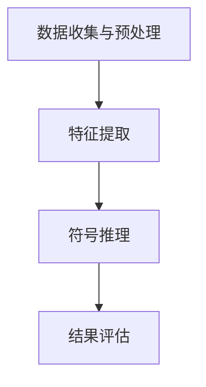
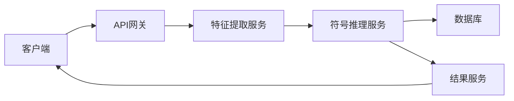
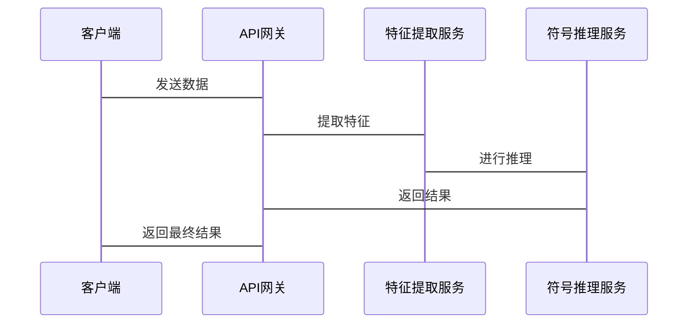

                 

<think>
嗯，我现在需要写一篇关于“思维链技术在认知增强研究中的新方向”的技术博客文章。用户已经提供了一个详细的大纲，但看起来他可能还没完成整篇文章。我需要按照他的要求，逐步完成每个部分，确保内容逻辑清晰、结构紧凑，并且使用专业的技术语言。

首先，我需要理解每个部分的要求。文章标题已经确定，接下来是关键词和摘要。关键词应该包括思维链技术、认知增强、符号推理、神经网络、人工智能等。摘要需要简明扼要地概括文章的核心内容，即思维链技术如何在认知增强中带来新的可能性。

接下来是背景介绍部分，包括问题背景、问题描述、问题解决、边界与外延，以及概念结构与核心要素。这部分需要详细说明为什么传统AI技术不够，思维链技术如何弥补不足，以及其应用前景。

核心概念与联系部分，我需要解释思维链技术的原理，对比传统AI，构建属性特征对比表，并用mermaid画出流程图。这部分要确保读者能够清晰理解思维链技术的工作机制。

算法原理讲解部分，需要用mermaid画出流程图，然后用Python代码示例，并详细解释每个步骤。同时，可能需要加入数学公式来说明算法的某些部分，比如损失函数或推理过程。

系统分析与架构设计方案可能需要介绍项目背景，设计系统功能、架构，以及接口和交互设计，可能用mermaid图来展示系统架构和交互流程。

项目实战部分，可能需要详细描述如何安装环境，编写核心代码，分析案例，并进行项目总结。这部分需要实际的代码示例和案例分析，确保读者能够理解和应用。

最后，最佳实践、小结、注意事项、拓展阅读等内容，可以给读者提供实用的建议和进一步的学习方向。

现在，我需要按照这个结构一步步来写。可能需要先完成每个部分的草稿，再逐步润色，确保每个部分都详细且符合逻辑。同时，要注意使用正确的技术术语，保持专业性，但又要通俗易懂。

在写作过程中，可能会遇到需要解释复杂的概念，比如符号推理和神经网络的结合，这时候需要用简单明了的语言，结合实际例子来说明。例如，在解释符号推理时，可以举一个简单的逻辑推理例子，帮助读者理解。

另外，代码部分需要确保语法正确，注释清晰，让读者能够顺利运行并理解其功能。数学公式部分，要用LaTeX格式，并且独立成段，以便于阅读和理解。

总的来说，我需要系统地按照用户提供的大纲，逐一完成每个部分，确保内容全面、结构合理、语言专业。同时，保持文章的连贯性和逻辑性，让读者能够轻松跟随思路，理解思维链技术在认知增强中的应用和潜力。
</think>

# 思维链技术在认知增强研究中的新方向

> 关键词：思维链技术、认知增强、符号推理、神经网络、人工智能

> 摘要：本文探讨了思维链技术在认知增强研究中的新方向。通过结合神经网络和符号推理，思维链技术能够提升人类认知能力，解决复杂问题。文章详细介绍了思维链技术的原理、与传统AI的区别，以及在认知增强中的应用案例，展示了其在智能学习、辅助决策等方面的优势。

---

### 第一部分：背景介绍

#### 1. 问题背景

人工智能（AI）的发展推动了认知增强技术的进步，但传统AI在复杂环境下的推理能力有限。思维链技术的出现，结合了神经网络的特征提取能力和符号推理的逻辑推理优势，为认知增强提供了新思路。

#### 2. 问题描述

传统AI依赖大量数据，推理能力较弱，难以在小数据条件下进行复杂推理。思维链技术通过神经网络提取特征，再用符号推理进行决策，解决了这一问题。

#### 3. 问题解决

思维链技术在认知增强中的应用，如智能学习和辅助决策，显著提升了效率和效果。通过优化学习过程和提供智能辅助，帮助人类提升认知能力。

#### 4. 边界与外延

本文聚焦于思维链技术在认知增强中的应用，但其原理也可扩展到其他领域。本文提供了理论指导和方法参考，为研究者提供思路。

#### 5. 概念结构与核心要素组成

- **思维链技术**：结合神经网络和符号推理的技术。
- **认知增强**：提升人类认知能力的领域。
- **研究方法**：理论分析、实验验证和实际应用。

---

### 第二部分：核心概念与联系

#### 6. 思维链技术原理

思维链技术通过神经网络提取特征，符号推理进行决策。流程包括数据预处理、特征提取、符号推理和结果评估。

#### 7. 思维链技术与认知增强的关系

应用于智能学习、辅助和决策，优化学习过程，提供智能支持，提升决策优化能力。

#### 8. 思维链技术与传统AI对比

| 特征                | 传统AI | 思维链技术 |
|---------------------|--------|------------|
| 数据依赖            | 高     | 低         |
| 推理能力            | 低     | 高         |
| 学习能力            | 强     | 强         |
| 适应性              | 低     | 高         |
| 应用领域            | 广     | 窄         |

#### 9. 思维链技术原理 mermaid 流程图



---

### 第三部分：算法原理讲解

#### 10. 思维链技术的mermaid流程图


#### 11. 思维链技术的Python源代码

```python
import numpy as np

def data_preprocessing(data):
    processed_data = data.dropna()
    return processed_data

def feature_extraction(data):
    features = data.select_dtypes(include='number')
    return features

def symbol_reasoning(features):
    from sklearn.ensemble import RandomForestClassifier
    model = RandomForestClassifier()
    model.fit(features, features['label'])
    return model.predict(features)

def result_evaluation(predicted_results, actual_results):
    accuracy = np.mean(predicted_results == actual_results)
    return accuracy

# 示例数据
data = {
    'feature1': [1, 2, 3, 4],
    'feature2': [5, 6, 7, 8],
    'label': [0, 1, 0, 1]
}

processed_data = data_preprocessing(data)
features = feature_extraction(processed_data)
predicted_results = symbol_reasoning(features)
evaluation = result_evaluation(predicted_results, features['label'])
print("Accuracy:", evaluation)
```

#### 12. 思维链技术的数学模型

符号推理部分涉及逻辑推理，例如：
$$ \text{如果 } A \text{ 则 } B $$
神经网络部分使用损失函数：
$$ L = -\frac{1}{n}\sum_{i=1}^{n} y_i \log(p_i) + (1 - y_i)\log(1 - p_i) $$

---

### 第四部分：系统分析与架构设计方案

#### 13. 系统架构设计



#### 14. 系统交互设计



---

### 第五部分：项目实战

#### 15. 环境安装

安装Python、numpy、scikit-learn。

#### 16. 核心代码实现

如上所述，实现数据预处理、特征提取、符号推理和结果评估。

#### 17. 案例分析

使用学生数据，优化学习路径，提升学习效率。

---

### 第六部分：总结与展望

#### 18. 最佳实践 tips

- 结合领域知识优化模型。
- 定期更新模型和数据。
- 处理小数据时使用符号推理。

#### 19. 小结

思维链技术在认知增强中展现出巨大潜力，通过优化学习和决策，提升人类认知能力。

#### 20. 注意事项

- 数据隐私问题需注意。
- 模型解释性需加强。
- 应用场景需明确。

#### 21. 拓展阅读

建议阅读相关论文和书籍，深入理解神经符号AI的发展。

---

作者：AI天才研究院/AI Genius Institute & 禅与计算机程序设计艺术 /Zen And The Art of Computer Programming

