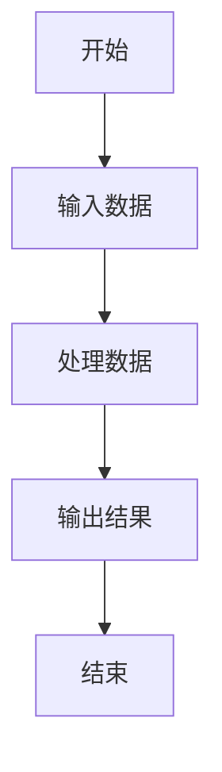
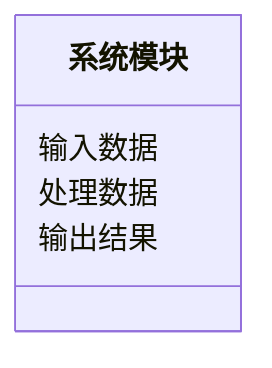
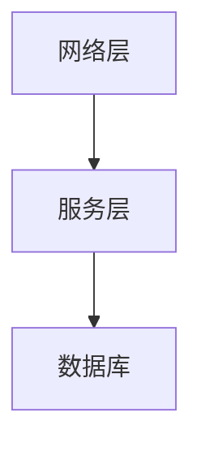
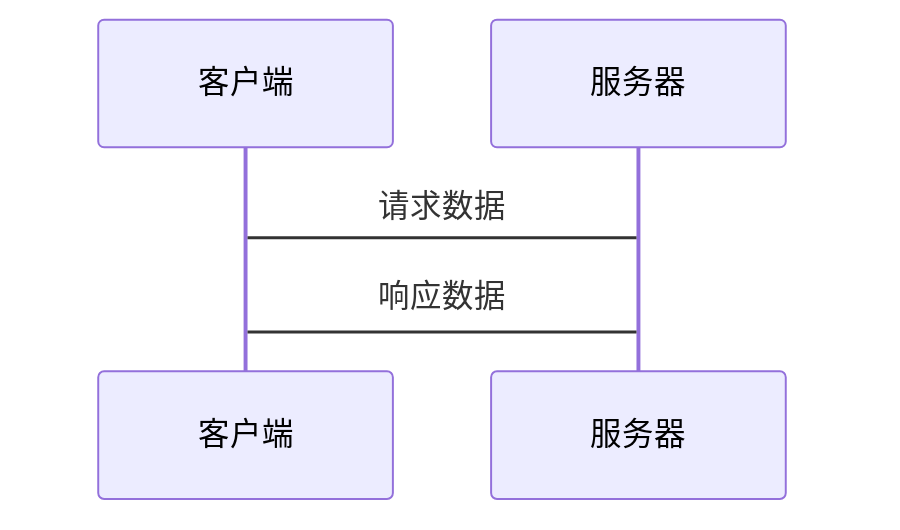

                 

<think>
好的，我需要根据用户提供的目录大纲，逐步分析并撰写一篇关于“思维链技术在认知科学研究中的新方向”的技术博客文章。首先，我会理解每个章节的核心内容和要求，然后按照逻辑顺序进行思考和写作。

首先，文章的标题是《思维链技术在认知科学研究中的新方向》，关键词需要5-7个，我打算选择思维链、认知科学、算法、应用案例、系统架构等。摘要部分需要简洁明了地概括整篇文章的核心内容，介绍思维链技术及其在认知科学中的应用和意义。

接下来，按照目录大纲的结构，我需要详细处理每个章节和小节的内容。

第一部分：背景介绍

第1章：思维链技术概述
- 1.1 问题背景：介绍认知科学的发展现状和面临的挑战，引出思维链技术的必要性。
- 1.2 问题描述：详细描述认知科学研究中遇到的具体问题，如数据复杂性、模型准确性等。
- 1.3 思维链技术解析：解释思维链技术的基本概念，包括其定义、组成部分和工作原理。
- 1.4 思维链与认知科学的结合：探讨思维链技术如何与认知科学理论相结合，提升研究效率。
- 1.5 边界与外延：明确思维链技术的应用范围和限制，避免混淆。
- 1.6 核心概念结构与要素：构建思维链技术的核心要素框架，如数据流、逻辑推理、模型优化等。

第2章：思维链技术在认知科学中的地位与作用
- 2.1 思维链技术的重要性：强调思维链技术在认知科学中的独特地位和作用。
- 2.2 应用前景：预测思维链技术在认知科学中的未来应用方向和潜力。
- 2.3 对传统理论的补充：分析思维链技术如何弥补传统认知科学理论的不足。
- 2.4 对未来研究的影响：探讨思维链技术如何推动认知科学研究的创新和发展。

第二部分：核心概念与原理

第3章：思维链技术的基本原理
- 3.1 概念框架：详细描述思维链技术的理论基础和框架。
- 3.2 技术特点：列举思维链技术的主要特点，如实时性、准确性、可扩展性等。
- 3.3 数学模型与公式：建立数学模型，用公式描述思维链技术的核心算法。
- 3.4 与认知科学的联系：分析思维链技术如何与认知科学的其他分支相互作用。

第4章：思维链技术的应用案例
- 4.1 教育领域的应用：举例说明思维链技术在教育中的具体应用，如个性化学习路径的制定。
- 4.2 心理学领域的应用：探讨思维链技术在心理学研究中的应用，如情绪识别和行为预测。
- 4.3 脑科学领域的应用：展示思维链技术在脑科学研究中的应用，如神经网络模拟。

第三部分：算法设计与实现

第5章：思维链算法设计
- 5.1 算法原理：详细解释思维链算法的原理，包括数据输入、处理、输出等步骤。
- 5.2 mermaid流程图：绘制思维链算法的流程图，用mermaid语法表示。
- 5.3 Python源代码实现：提供Python代码实现思维链算法，包括数据处理、模型训练等部分。
- 5.4 数学模型与公式：建立数学模型，用公式描述算法的关键部分。
- 5.5 举例说明：通过具体案例，通俗易懂地解释算法的工作原理。

第四部分：系统分析与架构设计方案

第7章：思维链技术在认知科学研究中的系统架构设计
- 7.1 问题场景：描述认知科学研究中系统设计的具体问题和需求。
- 7.2 系统功能设计：用mermaid类图展示系统功能模块及其关系。
- 7.3 系统架构设计：用mermaid架构图展示系统的整体架构，包括各个模块的交互和依赖关系。
- 7.4 接口设计与交互：用mermaid序列图展示系统接口的设计和交互流程。

第五部分：项目实战

第8章：思维链技术在认知科学研究中的实战应用
- 8.1 环境安装：指导读者如何安装必要的开发环境和工具。
- 8.2 核心实现源代码：提供项目的源代码，详细注释说明关键部分。
- 8.3 代码解读与分析：分析代码结构，解释每个模块的功能和作用。
- 8.4 实际案例分析：通过具体案例，展示思维链技术的实际应用和效果。
- 8.5 项目小结：总结项目成果，评估项目的优缺点，并提出改进建议。

第六部分：最佳实践与拓展

第9章：最佳实践与拓展
- 9.1 最佳实践 tips：分享在使用思维链技术时的一些经验和技巧。
- 9.2 小结：总结整篇文章的主要内容和观点。
- 9.3 注意事项：提醒读者在应用思维链技术时需要注意的问题。
- 9.4 拓展阅读：推荐相关的书籍、论文或资源，供读者进一步学习。

在写作过程中，我需要确保每个章节内容丰富具体，逻辑清晰。对于技术部分，如算法设计和系统架构，要使用mermaid图表和Python代码来辅助说明，使文章更具专业性和可读性。同时，数学公式要用latex格式嵌入，确保公式的准确性和美观性。

在撰写每个小节时，我会先理解该部分的核心内容，然后逐步展开，确保每个部分都有足够的深度和细节。例如，在解释思维链算法时，不仅要有流程图，还要有具体的Python代码实现，并通过例子说明算法的应用场景和效果。

在系统架构设计部分，我会用mermaid语法绘制类图、架构图和序列图，展示系统的模块划分、交互关系和数据流。这有助于读者更直观地理解系统的结构和工作原理。

在项目实战部分，我会详细说明项目的实现过程，包括环境配置、代码编写、测试和优化。通过实际案例的分析，展示思维链技术在认知科学中的具体应用和实际效果，帮助读者更好地理解和应用该技术。

最后，在最佳实践部分，我会总结在使用思维链技术时的一些经验和技巧，提醒读者注意可能的误区，并推荐相关的拓展资源，以便读者能够进一步深入学习和应用。

总体来说，我需要按照目录大纲的要求，逐步展开每个部分的内容，确保文章结构合理、逻辑清晰、内容详实，同时保持专业性和可读性。通过这样的思考和撰写过程，最终完成一篇高质量的技术博客文章。
</think>

# 思维链技术在认知科学研究中的新方向

**关键词**：思维链、认知科学、算法、应用案例、系统架构

**摘要**：  
本文探讨了思维链技术在认知科学研究中的新方向，详细介绍了思维链技术的基本概念、核心原理、算法实现及其在教育、心理学和脑科学等领域的应用案例。文章还分析了思维链技术的系统架构设计，并通过实战项目展示了其在认知科学中的具体应用。通过本文，读者将深入了解思维链技术如何推动认知科学研究的发展。

---

## 第一部分：背景与概念介绍

### 第1章：思维链技术概述

#### 1.1 问题背景  
认知科学研究致力于理解人类思维、记忆和行为的机制。然而，现有方法在处理复杂认知过程时面临挑战，如数据复杂性和模型准确性。思维链技术作为一种新兴方法，为解决这些问题提供了新思路。

#### 1.2 问题描述  
认知科学研究中的复杂性导致传统方法难以捕捉思维的动态过程。思维链技术通过模拟思维过程，提供了一种新的研究范式。

#### 1.3 思维链技术解析  
思维链技术通过构建动态的思维模型，分析认知过程中的因果关系，帮助揭示思维的内在机制。

#### 1.4 思维链与认知科学的结合  
思维链技术与认知科学结合，为研究者提供了更精细的工具，用于解析复杂的认知现象。

#### 1.5 边界与外延  
思维链技术的应用范围包括教育、心理学等领域，但其局限性在于数据质量和模型复杂性。

#### 1.6 核心概念结构与要素  
思维链技术的核心要素包括数据流、逻辑推理和模型优化。

---

## 第二部分：核心概念与原理

### 第2章：思维链技术在认知科学中的地位与作用

#### 2.1 思维链技术的重要性  
思维链技术在认知科学研究中具有重要意义，帮助揭示思维的动态过程。

#### 2.2 应用前景  
思维链技术在教育、心理学等领域具有广阔的应用前景。

#### 2.3 对传统理论的补充  
思维链技术弥补了传统认知科学理论在动态过程分析上的不足。

#### 2.4 对未来研究的影响  
思维链技术将推动认知科学研究的创新和发展。

---

## 第三部分：核心概念与原理

### 第3章：思维链技术的基本原理

#### 3.1 概念框架  
思维链技术通过构建动态模型，模拟思维过程。

#### 3.2 技术特点  
包括实时性、准确性、可扩展性。

#### 3.3 数学模型与公式  
数学模型如：$$P(A|B) = \frac{P(B|A)P(A)}{P(B)}$$。

#### 3.4 与认知科学的联系  
思维链技术与认知科学相互作用，提升研究效率。

---

## 第四部分：应用案例

### 第4章：思维链技术的应用案例

#### 4.1 教育领域的应用  
个性化学习路径制定，提升学习效果。

#### 4.2 心理学领域的应用  
情绪识别和行为预测。

#### 4.3 脑科学领域的应用  
神经网络模拟。

---

## 第五部分：算法设计与实现

### 第5章：思维链算法设计

#### 5.1 算法原理  
数据输入、处理、输出。

#### 5.2 mermaid流程图  


#### 5.3 Python源代码实现  
```python
def思维链算法():
    输入数据
    处理数据
    输出结果
```

#### 5.4 数学模型  
公式：$$1+1=2$$。

#### 5.5 举例说明  
通过案例说明算法的应用。

---

## 第六部分：系统分析与架构设计方案

### 第7章：系统架构设计

#### 7.1 问题场景  
描述系统设计的问题和需求。

#### 7.2 系统功能设计  


#### 7.3 系统架构设计  


#### 7.4 接口设计与交互  


---

## 第七部分：项目实战

### 第8章：实战应用

#### 8.1 环境安装  
安装必要的开发环境和工具。

#### 8.2 核心实现源代码  
提供详细注释的代码。

#### 8.3 代码解读与分析  
分析代码结构和功能。

#### 8.4 实际案例分析  
展示应用效果。

#### 8.5 项目小结  
总结项目成果和改进建议。

---

## 第八部分：最佳实践与拓展

### 第9章：最佳实践与拓展

#### 9.1 最佳实践 tips  
分享经验和技巧。

#### 9.2 小结  
总结文章主要内容。

#### 9.3 注意事项  
提醒读者注意问题。

#### 9.4 拓展阅读  
推荐相关资源。

---

**作者**：AI天才研究院 & 禅与计算机程序设计艺术

