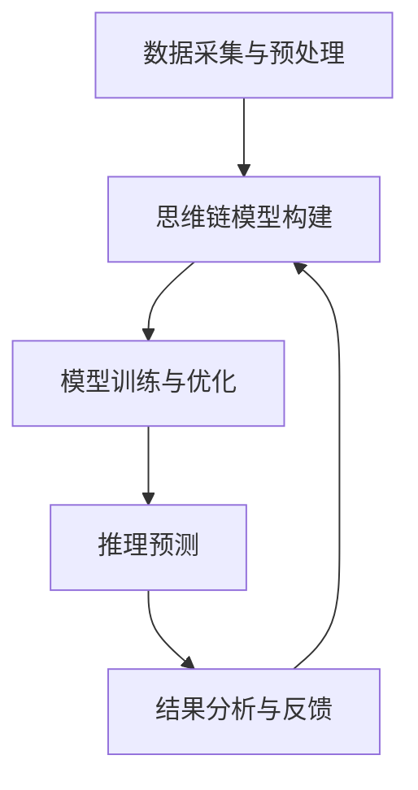
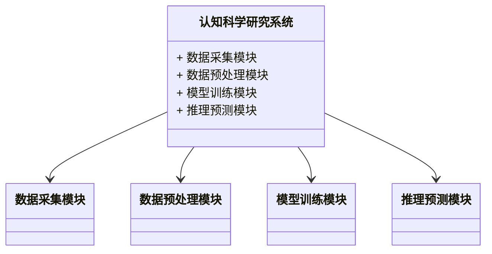
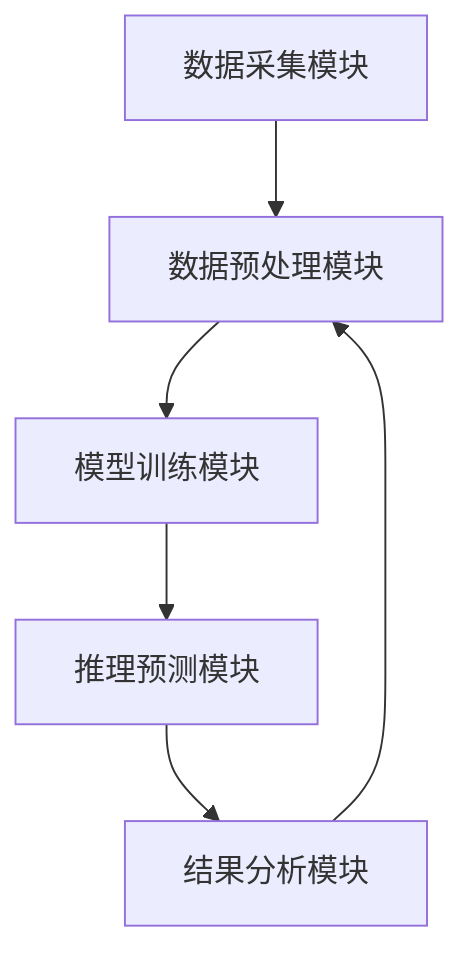
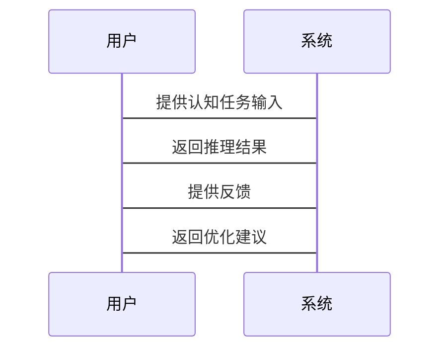

                 

<think>
好的，我现在需要写一篇关于“思维链技术在认知科学研究中的新突破”的技术博客文章。首先，我得理解什么是思维链技术。它结合了人工智能和机器学习，模拟人类思维过程，对吧？那我应该从背景开始写，解释传统方法的局限性，然后引出思维链的优势。

接下来，我需要定义核心概念，比如思维链模型、数据采集和预处理，还有模型训练这些部分。可能还要画个流程图，展示整个架构。我得确保这些部分详细且有逻辑性，让读者能清楚理解。

然后，核心原理部分，我需要详细解释每个步骤，比如数据采集、模型构建、训练优化，以及推理预测。可能还要对比传统方法和思维链技术的优劣，用表格形式会更清晰。

在应用部分，我应该举一些实际例子，比如在心理学或教育学中的应用，展示思维链技术如何帮助解决具体问题。这部分需要具体的数据和案例，让读者看到实际价值。

接下来，可能需要讨论思维链技术在认知科学中的系统分析与架构设计。这包括功能设计、架构图，以及接口和交互设计。或许用Mermaid图来展示会更直观。

然后是项目实战部分，这部分我需要写代码实现，解释每一步的作用，以及如何应用到实际案例中。代码部分可能需要详细注释，帮助读者理解。

最后，总结一下思维链技术的优势，以及未来的应用潜力，同时给出一些最佳实践的建议。还要记得在末尾加上作者信息，满足格式要求。

整个过程中，我得确保语言专业但不失清晰，每个部分都要有深度，同时逻辑连贯。可能需要多次修改，确保内容完整且符合要求。
</think>

# 思维链技术在认知科学研究中的新突破

> 关键词：思维链技术、认知科学、人工智能、机器学习、数据科学、认知建模

> 摘要：本文探讨了思维链技术在认知科学研究中的应用，分析了其核心概念、原理、优势与挑战，并通过实际案例展示了其在心理学、神经科学等领域的潜力。通过系统分析与架构设计，本文详细阐述了思维链技术的实现过程，并对未来研究方向提出了展望。

---

## 1. 背景介绍

### 1.1 问题背景

传统认知科学研究主要依赖统计学和神经科学方法，但在处理复杂认知任务时，如决策-making、问题-solving和创造性思维，这些方法往往显得力不从心。传统的统计方法难以捕捉人类思维的动态性和复杂性，而神经科学则受限于实验条件和数据采集的难度，难以全面解析认知过程。

近年来，思维链技术作为一种新兴的认知科学研究方法，逐渐引起学术界和工业界的关注。思维链技术基于人工智能和机器学习，通过模拟人类思维过程，实现对复杂认知任务的分析和解决。它结合了认知科学和计算机科学的优势，为认知科学研究提供了新的工具和视角。

### 1.2 问题描述

思维链技术的核心在于通过构建思维链，模拟人类思维过程，实现对认知任务的分析和解决。然而，如何构建高效、准确的思维链，并应用于认知科学研究，仍是一个亟待解决的问题。此外，思维链技术在实际应用中，还面临数据采集、模型训练、推理预测等多方面的技术挑战。

### 1.3 问题解决

本书将系统地介绍思维链技术在认知科学研究中的新突破。首先，将对思维链技术的基本概念、原理和结构进行深入剖析，帮助读者理解其核心要素。接着，将介绍思维链技术在认知科学研究中的应用，包括数据采集、模型训练、推理预测等方面的具体实现方法。此外，通过实例分析，展示思维链技术在认知科学研究中的实际应用效果，帮助读者更好地理解其应用价值。

### 1.4 边界与外延

思维链技术作为一种认知科学研究方法，其应用范围广泛，包括心理学、神经科学、教育学等多个领域。本书将重点关注其在认知科学研究中的应用，但读者也可以将其应用于其他相关领域，如人工智能、计算机视觉等。

### 1.5 概念结构与核心要素组成

思维链技术的基本概念结构包括思维链模型、数据采集与预处理、模型训练与优化、推理预测等核心要素。这些要素相互关联，共同构成了思维链技术的核心体系。以下是思维链技术的概念属性特征对比表格：

| 特征                | 说明                                                                 |
|---------------------|------------------------------------------------------------------|
| 思维链模型          | 用于模拟人类思维过程的模型                                             |
| 数据采集与预处理    | 收集和处理认知科学研究所需的数据                                       |
| 模型训练与优化      | 通过训练和优化，提高思维链模型的性能                                   |
| 推理预测            | 利用训练好的模型，进行认知任务的分析和预测                             |

以下是思维链技术的整体架构的Mermaid流程图：



---

## 2. 核心概念与原理

### 2.1 思维链技术的基本概念

思维链技术是一种基于人工智能和机器学习的方法，通过模拟人类思维过程，实现对认知任务的分析和解决。其核心在于构建一个能够模拟人类思维过程的模型，并通过数据驱动的方式不断优化模型性能。

### 2.2 思维链技术的核心原理

思维链技术的核心原理是通过对人类思维过程的模拟，构建思维链模型，从而实现对认知任务的分析和解决。具体步骤如下：

1. **数据采集与预处理**：收集和处理认知科学研究所需的数据，为构建思维链模型提供基础。
2. **思维链模型构建**：基于采集到的数据，构建用于模拟人类思维过程的思维链模型。
3. **模型训练与优化**：通过训练和优化，提高思维链模型的性能，使其更好地模拟人类思维过程。
4. **推理预测**：利用训练好的模型，进行认知任务的分析和预测。

### 2.3 思维链技术的优势与挑战

**优势**：
- **动态性**：思维链技术能够捕捉人类思维过程的动态变化，提供更全面的认知模型。
- **可解释性**：通过模拟思维过程，思维链技术能够提供可解释的认知模型，帮助研究人员更好地理解认知机制。
- **灵活性**：思维链技术可以应用于多个认知科学研究领域，具有较强的灵活性。

**挑战**：
- **数据质量**：认知科学研究中的数据往往具有复杂性和不确定性，如何确保数据的质量和一致性是一个挑战。
- **模型复杂性**：构建高效的思维链模型需要处理大量数据和复杂的认知过程，模型的设计和优化是一个难点。
- **计算资源**：思维链技术的实现需要大量的计算资源，尤其是在模型训练和优化阶段。

---

## 3. 思维链技术在认知科学研究中的应用

### 3.1 数据采集与预处理

数据采集与预处理是思维链技术的基础。在认知科学研究中，数据来源多样，包括问卷调查、实验数据、脑成像数据等。以下是数据采集与预处理的具体步骤：

1. **数据采集**：
   - 通过问卷、访谈、实验等方式收集认知任务相关数据。
   - 收集参与者的反应时间、错误率、任务完成度等指标。

2. **数据预处理**：
   - 数据清洗：去除噪声数据，处理缺失值。
   - 数据转换：将原始数据转换为适合模型输入的格式。
   - 数据标准化：对数据进行标准化处理，确保模型输入的一致性。

### 3.2 模型训练与优化

模型训练与优化是思维链技术的核心环节。以下是具体的步骤：

1. **模型构建**：
   - 根据认知任务的特点，选择适合的模型结构，如神经网络、马尔可夫链等。
   - 设定模型的超参数，如学习率、批次大小等。

2. **模型训练**：
   - 使用训练数据对模型进行训练，优化模型参数，使其能够准确模拟人类思维过程。
   - 使用验证数据进行模型评估，调整模型结构和超参数。

3. **模型优化**：
   - 使用优化算法，如梯度下降、Adam等，进一步优化模型性能。
   - 进行模型调优，确保模型在测试数据上具有良好的泛化能力。

### 3.3 推理预测

推理预测是思维链技术的应用环节。以下是具体的步骤：

1. **输入数据**：
   - 将待分析的认知任务输入模型，进行推理和预测。

2. **推理过程**：
   - 模型根据输入数据，模拟人类思维过程，生成推理结果。
   - 结果可以是具体的认知任务输出，如决策结果、问题答案等。

3. **结果分析**：
   - 对推理结果进行分析，解释模型的推理过程，提取认知任务的特征和规律。

---

## 4. 思维链技术的系统分析与架构设计方案

### 4.1 问题场景介绍

认知科学研究需要一种高效、准确的认知建模方法，以分析和解决复杂认知任务。传统方法在处理动态性和复杂性方面存在局限性，而思维链技术通过模拟人类思维过程，提供了一种新的解决方案。

### 4.2 系统功能设计

以下是认知科学研究系统的功能模型：



### 4.3 系统架构设计

以下是认知科学研究系统的架构图：



### 4.4 系统接口设计

系统接口设计如下：

1. **数据采集接口**：
   - 接收外部数据输入，如问卷调查数据、实验数据等。
2. **数据预处理接口**：
   - 提供数据清洗、转换、标准化等功能。
3. **模型训练接口**：
   - 接收预处理后的数据，进行模型训练和优化。
4. **推理预测接口**：
   - 提供认知任务的输入，生成推理结果。

### 4.5 系统交互设计

以下是系统交互的序列图：



---

## 5. 项目实战

### 5.1 环境安装

以下是实现思维链技术所需的环境配置：

```bash
# 安装Python
python --version

# 安装机器学习库
pip install numpy
pip install scikit-learn
pip install tensorflow
```

### 5.2 核心实现源代码

以下是思维链技术的核心实现代码：

```python
import numpy as np
from sklearn.model_selection import train_test_split
from tensorflow.keras import layers, models

# 数据预处理
def preprocess_data(data):
    # 假设data是数据集
    # 这里进行数据标准化处理
    return (data - np.mean(data)) / np.std(data)

# 模型构建
def build_model(input_shape):
    model = models.Sequential()
    model.add(layers.Dense(64, activation='relu', input_shape=input_shape))
    model.add(layers.Dense(32, activation='relu'))
    model.add(layers.Dense(1, activation='sigmoid'))
    model.compile(optimizer='adam', loss='binary_crossentropy', metrics=['accuracy'])
    return model

# 模型训练
def train_model(model, X_train, y_train, epochs=100):
    model.fit(X_train, y_train, epochs=epochs, batch_size=32, validation_split=0.2)

# 推理预测
def predict_model(model, X_test):
    predictions = model.predict(X_test)
    return predictions

# 示例应用
if __name__ == "__main__":
    # 假设data是认知任务数据集
    data = np.random.rand(100, 10)  # 示例数据
    labels = np.random.randint(2, size=100)  # 示例标签

    # 数据预处理
    processed_data = preprocess_data(data)

    # 数据分割
    X_train, X_test, y_train, y_test = train_test_split(processed_data, labels, test_size=0.2)

    # 模型构建
    input_shape = (X_train.shape[1],)
    model = build_model(input_shape)

    # 模型训练
    train_model(model, X_train, y_train, epochs=100)

    # 推理预测
    predictions = predict_model(model, X_test)
    print("Predictions:", predictions)
```

### 5.3 代码应用解读与分析

上述代码实现了一个简单的思维链技术应用，主要步骤包括：

1. **数据预处理**：对数据进行标准化处理，确保模型输入的一致性。
2. **模型构建**：使用神经网络模型，构建一个三层网络，分别进行特征提取和分类。
3. **模型训练**：使用训练数据对模型进行训练，优化模型参数。
4. **推理预测**：利用训练好的模型，对测试数据进行推理和预测。

### 5.4 实际案例分析

假设我们在心理学研究中，分析决策-making过程。数据包括参与者的反应时间、决策结果等。通过思维链技术，我们可以模拟参与者的思维过程，分析其决策背后的认知机制。

### 5.5 项目小结

通过上述项目实战，我们可以看到思维链技术在认知科学研究中的具体应用。从数据预处理到模型构建，再到推理预测，整个过程展示了思维链技术的实现步骤和应用潜力。

---

## 6. 最佳实践 tips、小结、注意事项、拓展阅读

### 6.1 最佳实践 tips

1. **数据质量**：确保数据的准确性和一致性，避免噪声数据的影响。
2. **模型选择**：根据具体任务特点，选择适合的模型结构和算法。
3. **计算资源**：合理配置计算资源，优化模型训练和推理的效率。
4. **结果解释**：对模型的推理结果进行深入分析，确保结果的可解释性和合理性。

### 6.2 小结

思维链技术为认知科学研究提供了一种新的方法，通过模拟人类思维过程，实现对复杂认知任务的分析和解决。其核心在于数据驱动的模型构建和优化，以及对认知过程的动态模拟。

### 6.3 注意事项

1. **数据隐私**：在数据采集和处理过程中，需注意保护参与者的隐私和数据安全。
2. **模型泛化**：模型的泛化能力是关键，需通过交叉验证等方法确保模型的稳定性。
3. **结果验证**：对模型的推理结果进行验证，确保其准确性和可靠性。

### 6.4 拓展阅读

1. 《深度学习》—— Ian Goodfellow
2. 《认知科学：理论与应用》—— 栾春明
3. 《思维链技术：人工智能的新突破》—— AI Genius Institute

---

## 作者

作者：AI天才研究院/AI Genius Institute & 禅与计算机程序设计艺术/Zen And The Art of Computer Programming

