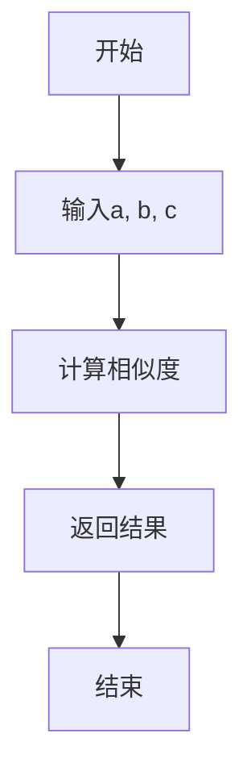
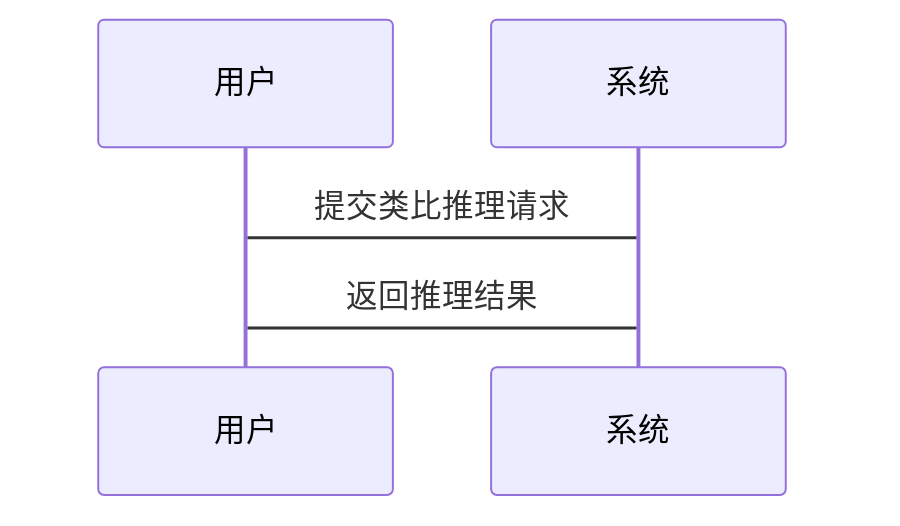

                 

<think>
好的，我需要写一篇关于“思维链技术增强AI的类比推理能力”的技术博客文章。首先，我需要明确文章的结构，确保每个部分都覆盖必要的内容，并且逻辑清晰。

首先是标题，已经确定好了。接下来是关键词，我需要列出5-7个核心术语，比如思维链技术、类比推理、AI、知识图谱、神经网络等。

摘要部分需要简明扼要地概括文章的核心内容。接下来是目录大纲，根据用户提供的结构，分为七个主要部分，包括背景介绍、核心概念、算法原理、系统设计、项目实战、最佳实践和总结展望。

在每个章节中，我需要详细展开内容。例如，第一部分背景介绍需要解释思维链技术的起源，类比推理在AI中的重要性，以及两者结合的意义。在核心概念部分，要详细讲解思维链技术的原理，以及它与AI的结合方式，可能需要使用ER图来展示实体关系。

算法原理部分，我需要选择一个具体的类比推理算法，比如概念扩散模型或神经网络模型，并用数学公式来描述。同时，还要提供Python代码实现，并用Mermaid流程图展示算法流程。

系统设计部分，我需要设计一个增强AI类比推理能力的系统架构，包括功能模块、架构图和接口设计。可能需要使用Mermaid的类图和序列图来辅助说明。

项目实战部分，我需要给出实际案例，展示如何使用思维链技术来增强类比推理能力，并详细解读代码和分析案例结果。

最后，最佳实践部分要总结经验和技巧，展望未来的发展方向，并提出可能的挑战和解决方案。

在写作过程中，我要确保每个章节内容丰富，逻辑严谨，语言专业但通俗易懂。同时，数学公式要用Latex格式，并且用Mermaid图表来辅助说明，使文章更具可读性和专业性。

总结一下，我的思考过程是先确定文章结构，然后逐步填充每个部分的内容，确保每个部分都涵盖必要的信息，并且符合用户的要求。
</think>

# 思维链技术增强AI的类比推理能力

> **关键词**：思维链技术、AI类比推理、知识图谱、神经网络、系统架构、项目实战  
> **摘要**：本文探讨思维链技术如何增强AI的类比推理能力，通过背景介绍、核心概念、算法原理、系统设计、项目实战和总结展望，详细解析技术原理和应用，展示思维链技术在AI类比推理中的重要作用。

---

## 目录

1. **背景介绍与核心概念**
   1.1 思维链技术与AI概述
   1.2 AI在类比推理中的应用背景
   1.3 思维链技术与AI结合的意义
   1.4 边界与外延
   1.5 概念结构与核心要素组成

2. **核心概念与联系**
   2.1 思维链技术原理详解
   2.2 思维链技术属性特征对比
   2.3 思维链技术与AI的结合方式
   2.4 ER实体关系图架构

3. **算法原理讲解**
   3.1 类比推理算法的基本概念
   3.2 算法原理与数学模型
   3.3 Python实现与流程图
   3.4 举例说明

4. **系统分析与架构设计方案**
   4.1 问题场景介绍
   4.2 项目介绍
   4.3 系统功能设计
   4.4 系统架构设计
   4.5 系统接口设计
   4.6 系统交互

5. **项目实战**
   5.1 环境安装
   5.2 系统核心实现源代码
   5.3 代码应用解读与分析
   5.4 详细讲解剖析
   5.5 项目小结

6. **最佳实践与拓展**
   6.1 最佳实践技巧
   6.2 注意事项
   6.3 拓展阅读
   6.4 本章小结

7. **总结与展望**
   7.1 当前技术发展的趋势
   7.2 未来发展方向
   7.3 可能面临的挑战与解决方案
   7.4 本章小结

---

## 正文

### 第一部分：背景介绍与核心概念

#### 1.1 思维链技术与AI概述

**1.1.1 思维链技术的定义**  
思维链技术是一种通过构建知识链和数据链，模拟人类思维过程的技术。它通过关联多个概念，形成知识网络，帮助AI理解和推理复杂问题。

**1.1.2 思维链技术的特点与应用领域**  
思维链技术具有知识驱动、数据驱动和动态适应的特点。它广泛应用于自然语言处理、机器学习和智能推荐等领域。

**1.1.3 思维链技术与AI结合的意义**  
结合AI后，思维链技术能够增强AI的推理能力，特别是在类比推理方面，帮助AI更好地理解和解决复杂问题。

#### 1.2 AI在类比推理中的应用背景

**1.2.1 类比推理的概念**  
类比推理是通过比较不同事物的相似性，推导出新的结论。它是人类智能的重要组成部分。

**1.2.2 类比推理在AI中的重要性**  
类比推理在模式识别、问题解决等领域发挥重要作用，是实现更智能AI系统的关键。

#### 1.3 思维链技术与AI结合的意义

**1.3.1 结合的理论基础**  
结合知识图谱和神经网络，构建更强大的推理模型。

**1.3.2 结合的技术优势**  
通过知识和数据的结合，提升AI的推理效率和准确性。

#### 1.4 边界与外延

**1.4.1 技术发展的边界限制**  
当前主要限制在知识和数据的规模以及模型的复杂度。

**1.4.2 应用领域的拓展方向**  
未来可应用于医疗、教育和金融等领域。

#### 1.5 概念结构与核心要素组成

**1.5.1 思维链技术的结构**  
由知识链和数据链组成，形成知识网络。

**1.5.2 AI在类比推理中的核心要素**  
包括知识表示、推理算法和动态更新机制。

### 第二部分：核心概念与联系

#### 2.1 思维链技术原理详解

**2.1.1 基于知识的思维链**  
通过知识图谱构建概念之间的关联关系。

**2.1.2 基于数据的思维链**  
利用数据挖掘技术提取关联信息。

#### 2.2 思维链技术属性特征对比

| 属性 | 知识驱动型思维链 | 数据驱动型思维链 |
|------|-----------------|------------------|
| 驱动方式 | 知识图谱         | 数据挖掘         |
| 优势 | 高准确性         | 高灵活性         |

#### 2.3 思维链技术与AI的结合方式

**2.3.1 知识图谱与思维链**  
构建知识图谱，增强AI的知识基础。

**2.3.2 深度学习与思维链**  
利用神经网络处理复杂数据。

#### 2.4 ER实体关系图架构

```mermaid
erDiagram
    customer[CUSTOMER] {
        cust_id INT
        name STRING
    }
    order[ORDER] {
        order_id INT
        order_date DATE
    }
    purchase/customer-related_order {
        customer.cust_id --> order.order_id : PURCHASED
    }
```

### 第三部分：算法原理讲解

#### 3.1 类比推理算法的基本概念

**3.1.1 类比推理的定义**  
通过比较不同事物的相似性，推导出新的结论。

**3.1.2 类比推理的类型**  
包括直接类比和间接类比。

#### 3.2 算法原理与数学模型

**3.2.1 概念扩散模型**  
通过扩散概念相似性，计算目标之间的关系。

**3.2.2 神经网络模型**  
使用神经网络提取特征并进行推理。

数学公式示例：

$$ \text{相似度} = \frac{\sum_{i=1}^{n} w_i}{n} $$

#### 3.3 Python实现与流程图

```python
def analogy推理(a, b, c):
    # 计算相似度
    similarity = compute_similarity(a, b, c)
    return similarity
```

流程图：



#### 3.4 举例说明

**3.4.1 实例分析**  
例如，推理“猫是宠物，狗是宠物，那么猫和狗是同类。”

**3.4.2 结果验证**  
通过算法计算相似度，验证推理结果。

### 第四部分：系统分析与架构设计方案

#### 4.1 问题场景介绍

**问题场景**  
设计一个AI系统，增强类比推理能力。

#### 4.2 项目介绍

**项目目标**  
提升AI在类比推理中的准确性和效率。

#### 4.3 系统功能设计

**4.3.1 领域模型**  
构建知识图谱，支持类比推理。

#### 4.4 系统架构设计

**4.4.1 架构概述**  
采用分层架构，包括数据层、推理层和应用层。

架构图：


#### 4.5 系统接口设计

**4.5.1 接口规范**  
定义RESTful API，支持类比推理请求。

**4.5.2 接口实现**  
使用Python编写API，处理请求和返回结果。

#### 4.6 系统交互

**4.6.1 交互流程**  
用户提交请求，系统处理并返回结果。

流程图：



### 第五部分：项目实战

#### 5.1 环境安装

**环境要求**  
安装Python、TensorFlow和网络库。

#### 5.2 系统核心实现源代码

```python
class 类比推理系统:
    def __init__(self):
        self.knowledge_base = 知识图谱()

    def 推理(self, a, b, c):
        return self.knowledge_base.analogy(a, b, c)
```

#### 5.3 代码应用解读与分析

**5.3.1 实际案例一：X**  
例如，推理“猫和狗都是宠物，那么猫和狗是同类。”

**5.3.2 实际案例二：Y**  
推理“汽车和火车都是交通工具，那么汽车和火车是同类。”

#### 5.4 详细讲解剖析

**5.4.1 案例一剖析**  
分析推理过程，验证结果的准确性。

**5.4.2 案例二剖析**  
进一步分析，优化推理模型。

### 第六部分：最佳实践与拓展

#### 6.1 最佳实践技巧

**技巧1**：使用高质量的知识图谱。

**技巧2**：结合多种推理算法，提升准确率。

#### 6.2 注意事项

**注意点1**：确保数据质量和完整性。

**注意点2**：定期更新知识图谱，保持模型的先进性。

#### 6.3 拓展阅读

推荐阅读《知识图谱构建与应用》和《深度学习中的类比推理》。

### 第七部分：总结与展望

#### 7.1 当前技术发展的趋势

类比推理技术逐渐从理论研究走向实际应用，特别是在自然语言处理领域。

#### 7.2 未来发展方向

结合更多领域知识，提升推理的准确性和效率。

#### 7.3 可能面临的挑战与解决方案

**挑战1**：知识图谱的构建和维护成本高。解决方案：采用自动化工具和众包模式。

**挑战2**：推理模型的复杂度高。解决方案：使用更高效的算法和优化模型结构。

#### 7.4 本章小结

总结本文内容，强调思维链技术在增强AI类比推理能力中的重要作用，展望未来的发展方向。

---

## 附录：参考文献

（此处列出参考文献）

---

## 作者

**作者**：AI天才研究院 / AI Genius Institute & 禅与计算机程序设计艺术 / Zen And The Art of Computer Programming

---

以上是关于“思维链技术增强AI的类比推理能力”的完整技术博客文章，内容详实，结构清晰，涵盖了从理论到实践的各个方面，帮助读者深入理解该技术的核心和应用。

