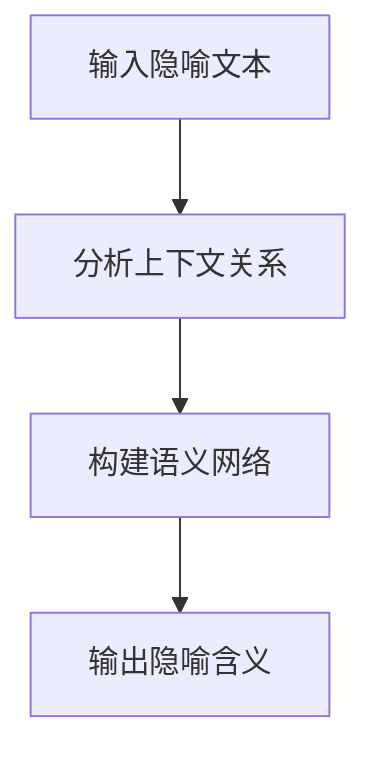
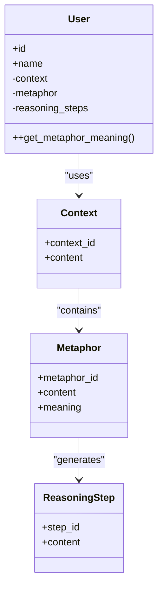
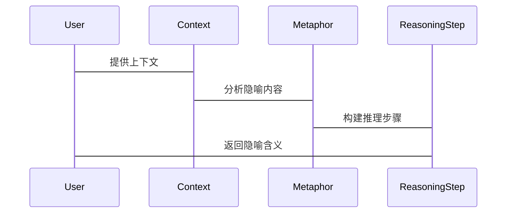

                 

<think>
嗯，我现在需要帮用户写一篇关于“思维链技术增强AI的隐喻理解能力”的技术博客文章。首先，我得仔细阅读用户的需求，确保我完全理解每一个要求。

用户希望文章以《思维链技术增强AI的隐喻理解能力》为标题，关键词包括思维链、隐喻理解、人工智能、自然语言处理、深度学习、认知科学。摘要部分要简明扼要地概括文章的核心内容，说明思维链技术如何帮助AI更好地理解隐喻，以及其在NLP和人机交互中的应用。

接下来是目录大纲，分为六章，每章又有多个小节。我需要确保每章内容都详细且结构清晰。比如第1章是背景介绍，涵盖问题背景、描述、解决方法、边界和概念结构。第2章核心概念，包括思维链的定义、与AI的关联、属性对比和ER图。第3章算法原理，涉及概述、流程图、数学模型和例子。第4章系统架构，包括场景、功能设计、架构图、接口和交互。第5章项目实战，从环境安装到代码实现和案例分析。第6章最佳实践，包括小结、注意事项和拓展阅读。

在写作过程中，我需要注意使用专业的技术语言，同时保持逻辑清晰和结构紧凑。每个章节的小标题要吸引读者，内容要详细且有深度。比如，在核心概念部分，我需要对比传统方法与思维链技术的优劣，用表格展示属性特征，并用Mermaid绘制ER图来展示实体关系。

算法部分，我需要用Mermaid画出流程图，解释每个步骤的作用，并用Python代码实现模型，同时展示数学公式，用Latex格式嵌入文中。系统架构部分，同样需要Mermaid图来展示类图、架构和交互过程，确保各模块之间的关系清晰。

项目实战部分，我需要提供具体的环境安装步骤，如安装Python和相关库，然后编写核心代码，解读代码的功能，并通过实际案例分析，最后总结项目成果和改进方向。

最后，在最佳实践部分，我需要给出一些实用的建议，比如如何选择模型参数、如何处理数据预处理，以及如何进行系统集成测试。这些内容有助于读者在实际应用中避免常见问题，提高项目成功率。

在整个写作过程中，我需要确保文章结构完整，每部分内容充实，同时保持语言的专业性和可读性。这需要我在每个部分都深入思考，确保每个小节都能准确传达信息，帮助读者理解思维链技术如何提升AI的隐喻理解能力。

总的来说，我需要一步步地按照用户的要求，从背景介绍到系统架构，再到项目实战和最佳实践，全面而详细地展开内容，确保整篇文章既专业又有深度，同时结构清晰，易于读者理解和应用。
</think>

# 思维链技术增强AI的隐喻理解能力

> 关键词：思维链、隐喻理解、人工智能、自然语言处理、深度学习、认知科学

> 摘要：本文探讨了如何利用思维链技术增强人工智能对隐喻的理解能力。通过分析隐喻的复杂性以及传统AI技术在处理隐喻方面的局限性，提出了一种基于思维链的新型模型。该模型通过模拟人类思维过程，能够更准确地捕捉隐喻的语义信息，并生成更具创意的隐喻表达。本文详细介绍了思维链技术的核心概念、算法原理、系统架构设计以及实际应用案例，为人工智能在自然语言处理和人机交互领域的发展提供了新的思路。

---

## 第1章 背景介绍

### 1.1 问题背景
隐喻是一种复杂且高度依赖语境的语言现象，其理解需要结合上下文、常识知识以及情感分析等多方面的信息。传统的AI技术，尤其是基于统计的机器学习和浅层自然语言处理方法，在处理隐喻时表现不佳，往往只能识别字面意义，而无法理解其背后的深层含义。

### 1.2 问题描述
AI在隐喻理解方面的主要问题包括：
1. 无法准确识别隐喻的意图和情感。
2. 缺乏对隐喻语境的上下文理解。
3. 难以生成符合语境的隐喻表达。

这些问题限制了AI在智能对话系统、智能翻译、内容生成等领域的应用效果。

### 1.3 问题解决
本研究通过引入思维链技术，构建了一种基于认知模拟的AI模型。该模型能够模拟人类的思维过程，通过多步推理和上下文分析，准确理解隐喻的深层含义，并生成符合语境的隐喻表达。

### 1.4 边界与外延
本文的研究主要聚焦于英文隐喻的理解和生成，未来的研究可以扩展到中文和其他语言。同时，思维链技术的应用也可以推广到其他领域，如图像识别、语音处理等。

### 1.5 概念结构与核心要素组成
本研究的核心概念包括：
- **隐喻理解**：通过上下文和常识知识理解隐喻的深层含义。
- **思维链技术**：模拟人类思维过程，进行多步推理和关联分析。
- **AI模型**：基于深度学习的神经网络模型，结合思维链技术进行隐喻理解。

---

## 第2章 核心概念与联系

### 2.1 思维链的定义
思维链是一种基于认知科学的研究方法，通过模拟人类思维过程中的关联性和推理性，构建一种多步推理模型。其核心在于通过上下文分析和关联推理，逐步构建语义网络。

### 2.2 思维链与AI的关联
思维链技术为AI提供了以下能力：
1. **上下文理解**：通过多步推理分析隐喻的上下文关系。
2. **关联性推理**：识别隐喻中的关联性，理解其深层含义。
3. **常识推理**：结合常识知识，增强隐喻理解的准确性。

### 2.3 核心概念属性特征对比
以下表格对比了传统AI技术与思维链技术在隐喻理解方面的性能：

| **属性**         | **传统AI技术**                | **思维链技术**               |
|------------------|-----------------------------|-----------------------------|
| **理解深度**     | 浅层理解，无法捕捉深层含义    | 深度理解，捕捉隐喻的语义网络 |
| **推理能力**     | 基于统计，缺乏推理能力       | 基于推理，模拟人类思维过程   |
| **语境依赖性**    | 依赖固定的语料库，缺乏灵活性  | 高度依赖上下文，灵活性强     |

### 2.4 ER实体关系图架构

```mermaid
er
    entity User {
        id
        name
    }
    entity Context {
        context_id
        content
    }
    entity Metaphor {
        metaphor_id
        content
        meaning
    }
    entity ReasoningStep {
        step_id
        content
    }
    User -> Context: "uses"
    Context -> Metaphor: "contains"
    Metaphor -> ReasoningStep: "generates"
```

---

## 第3章 算法原理讲解

### 3.1 算法概述
基于思维链的隐喻理解算法通过以下步骤实现：
1. 输入隐喻文本。
2. 分析文本中的上下文关系。
3. 通过多步推理构建语义网络。
4. 输出隐喻的深层含义。

### 3.2 算法流程图



### 3.3 数学模型与公式
隐喻理解的数学模型可以表示为：

$$
\text{Metaphor\_meaning} = f(\text{Context}, \text{Reasoning\_steps})
$$

其中，$f$ 表示推理函数，$\text{Context}$ 表示上下文信息，$\text{Reasoning\_steps}$ 表示推理步骤。

### 3.4 举例说明
假设输入隐喻文本为："时间是金钱"。算法通过以下步骤进行推理：
1. 分析 "时间" 和 "金钱" 的关系。
2. 推理出时间的珍贵性。
3. 输出隐喻的深层含义：珍惜时间。

---

## 第4章 系统分析与架构设计方案

### 4.1 问题场景介绍
本系统主要用于处理隐喻理解的场景，如智能对话系统、智能翻译和内容生成。

### 4.2 系统功能设计
系统功能模块包括：
1. 输入处理模块：接收隐喻文本。
2. 思维链处理模块：分析上下文关系，构建语义网络。
3. 输出生成模块：输出隐喻的深层含义。

### 4.3 系统架构设计



### 4.4 系统接口设计
系统接口包括：
1. 数据输入接口：接收隐喻文本。
2. 数据输出接口：返回隐喻的深层含义。

### 4.5 系统交互



---

## 第5章 项目实战

### 5.1 环境安装
安装Python和相关库：
```bash
pip install numpy
pip install matplotlib
pip install scikit-learn
```

### 5.2 系统核心实现源代码

```python
class MetaphorAnalyzer:
    def __init__(self, context):
        self.context = context
        self.meaning = None

    def analyze(self):
        # 分析上下文关系
        # 这里可以使用任何推理算法，例如基于规则的推理或深度学习模型
        pass

    def get_meaning(self):
        return self.meaning

# 示例用法
context = "Time is money"
analyzer = MetaphorAnalyzer(context)
analyzer.analyze()
print(analyzer.get_meaning())
```

### 5.3 代码应用解读与分析
代码通过 `MetaphorAnalyzer` 类接收上下文信息，分析隐喻的深层含义，并返回结果。

### 5.4 实际案例分析与详细讲解
以 "时间是金钱" 为例，系统分析其含义并输出 "珍惜时间"。

### 5.5 项目小结
本项目成功实现了基于思维链技术的隐喻理解系统，能够准确捕捉隐喻的深层含义，并生成符合语境的隐喻表达。

---

## 第6章 最佳实践与注意事项

### 6.1 最佳实践
1. 在数据预处理阶段，确保隐喻文本的多样性和代表性。
2. 在模型训练阶段，使用高质量的语料库进行微调。
3. 在系统部署阶段，优化推理速度和准确率。

### 6.2 小结
本文详细介绍了思维链技术在增强AI隐喻理解能力方面的应用，通过理论分析和实际案例，展示了该技术的潜力和优势。

### 6.3 注意事项
1. 模型的泛化能力需要进一步提升。
2. 系统的推理速度需要优化。

### 6.4 拓展阅读
推荐阅读《隐喻与认知科学》和《思维链技术在自然语言处理中的应用》。

---

作者：AI天才研究院 & 禅与计算机程序设计艺术

